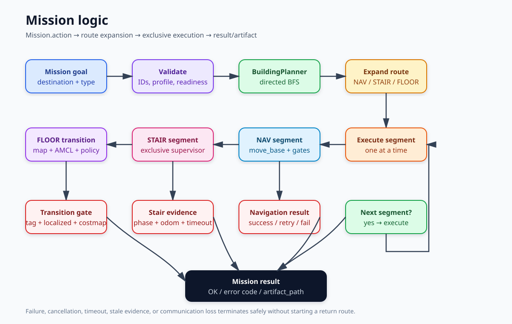
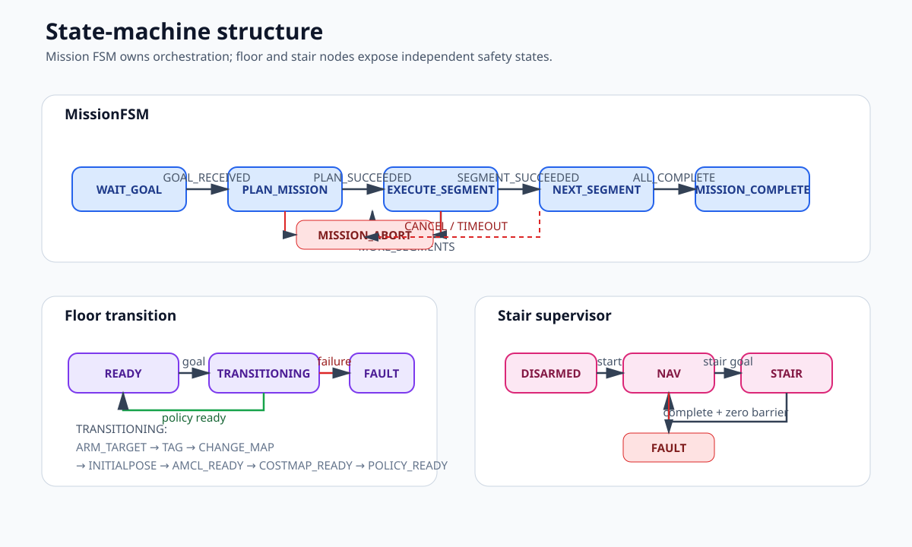

# TRON1 Multi-floor Mission System

> 2026-09-23 최신 수정·실주행 결과: [현재 개발 상태](docs/development-status-20260923.md). 아래 기존 설명과 시점별 관측 기록은 해당 당시 범위로 해석하세요.


이 workspace는 TRON1의 평면 주행, 층 전환, 계단 주행과 스캔을 하나의
`Mission.action`으로 운영합니다. 운영 진입점은 루트의 `./run.sh` 하나이며 로컬
ROS graph는 `mission_manager/launch/system.launch` 하나가 소유합니다.

## 런타임 구조

프로젝트가 설치하는 운영 node는 정확히 세 개입니다.

| node | 소유권 | action/state |
|---|---|---|
| `mission_manager` | 경로 계획, segment orchestration, scan artifact | `/mission` |
| `multifloor_manager` | map 교체, AMCL 재초기화, tag 기반 층 확정 | `/multifloor/floor_transition`, `/multifloor/floor_state` |
| `stair_supervisor` | `/navigation/cmd_vel` 또는 계단 명령의 단일 robot transport | `/stair_traversal`, `/stair_supervisor/state` |

`system.launch`는 이 세 node와 표준 `map_server`/AMCL/`move_base`,
`pointcloud_to_laserscan`, `apriltag_ros`, RViz만 구성합니다. UI node, 별도
`cmd_vel_bridge`, mux, safety node, localization manager, sensor fusion과 FAST-LIO
navigation 입력은 없습니다. 관리형 `wf_navigation.rviz`는 map, scan, AMCL pose,
global/local plan, costmap, TF와 `2D Pose Estimate`를 제공합니다. 기본 자동 측위와
수동 위치 지정은 [시작 측위 안내](docs/startup-localization-ko.md)를 따릅니다.
직접 이동하는 `SetGoal`은 수동 viewer에서만 제공하며, 관리형 이동 요청은 `/mission`을 사용합니다.

## 로직도와 상태머신

### 전체 미션 로직

목표는 `Mission.action` 하나로 들어오며, `BuildingPlanner`가 directed graph를 BFS로
계획합니다. 계단 edge는 `STAIR` segment와 `FLOOR_TRANSITION` segment로 확장되고,
각 segment는 순서대로 실행됩니다. `inspect`와 `record_route`만 scan artifact를
생성하며, 실패·취소·timeout·stale evidence가 발생하면 안전하게 종료하고 복귀 경로를
시작하지 않습니다.



### 상태머신 구조

상위 `MissionFSM`은 `WAIT_GOAL → PLAN_MISSION → EXECUTE_SEGMENT → NEXT_SEGMENT`를
관리합니다. 층 전환과 계단 주행은 각각 별도의 safety state를 가지며, 하위 action이
성공한 경우에만 상위 mission이 다음 segment로 진행합니다.



상태 전이 조건과 evidence의 상세 계약은
[전이 정책과 상태머신 개발·운영 가이드](docs/transition-policy-state-machine.md)에
정리되어 있습니다.

## 최초 설치와 build

노트북은 Ubuntu 20.04와 ROS Noetic을 사용합니다.

```bash
sudo apt update
sudo apt install ros-noetic-desktop-full ros-noetic-navigation \
  ros-noetic-pointcloud-to-laserscan ros-noetic-apriltag-ros \
  python3-websocket python3-yaml python3-numpy python3-scipy openssh-client
catkin_make
source devel/setup.bash
```

mini PC(`MINI_PC_USER@MINI_PC_HOST`)에는 Noetic workspace와
`sensor_integration/wf_mapping.launch`가 있어야 하며 SSH key 로그인이 가능해야
합니다. 노트북과 mini PC 모두 `timedatectl show -p NTPSynchronized --value`가
`yes`여야 합니다.

## deployment profile provisioning

`config.env`에는 host/port/ACCID 외에 다음 실제 sensor topic과 운영 ID를
provision합니다.

```bash
ROS_MASTER_HOST=192.168.1.26
MINI_PC_ROS_IP=192.168.1.56
D435F_SERIAL=244622071832
POINTCLOUD_TOPIC=/livox/lidar
CAMERA_IMAGE_TOPIC=/camera1/color/image_raw
CAMERA_INFO_TOPIC=/camera1/color/camera_info
TAG_DETECTIONS_TOPIC=/tag_detections
INITIAL_FLOOR=3F
HOME_LOCATION_ID=home_3f
INITIAL_LOCATION_ID=home_3f
INSPECT_PROFILE_ID=roof_scan_profile
SCAN_OUTPUT_BASE=/var/lib/tron1/scans
```

운영 YAML은 안전을 위해 처음에는 `configured: false`입니다. 현장 측정 후 다음
파일을 모두 `schema_version: 1`, `configured: true`로 완성해야 합니다.

- `mission_manager/config/{locations,building_graph,scan_profiles}.yaml`
- `multifloor_manager/config/{floors,stairs,apriltags,transitions}.yaml`
- `stair_supervisor/config/{stair_profiles,robot}.yaml`

각 `floors.yaml`의 `map_yaml`은 package 내부 `config/maps/*.yaml`을 가리키고 map
YAML의 `image`는 같은 디렉터리의 `.pgm` 파일명만 사용합니다. 절대 경로로 저장된
map은 다음 명령으로 정규화합니다.

```bash
python3 validate_bundle.py --normalize-map
```

`apriltags.yaml`의 모든 `{id, size_m}`를 apriltag_ros 형식으로 생성한
`multifloor_manager/config/apriltag_ros_tags.yaml`의 `standalone_tags`와 정확히
일치시켜야 합니다. map, tag detector 파일, stair profile 또는 scan profile이
하나라도 빠지면 production preflight가 실패합니다. 테스트 fixture는
`test/fixtures/building_valid`에 있으며 production으로 암묵 승격되지 않습니다.

## preflight와 hardware gates

로봇이나 원격 process를 시작하지 않는 local contract 검사:

```bash
./run.sh --check
```

이 명령은 세 package/node, schema, map/tag/action/launch, 금지 node, 단일 `/scan`
선언, managed RViz와 known-good fixture를 검사하고 필요한 ROS package를 확인합니다.

production YAML까지 완성한 뒤 mini PC/clock/SSH/robot route를 읽기 전용 확인합니다.

```bash
./run.sh --preflight
timedatectl show -p NTPSynchronized --value
ssh "${MINI_PC_USER}@${MINI_PC_HOST}" timedatectl show -p NTPSynchronized --value
ssh "${MINI_PC_USER}@${MINI_PC_HOST}" "ping -c 1 -W 2 '${ROBOT_HOST}'"
```

`--preflight`와 실제 시작은 production profile을 **SSH tunnel 또는 robot 연결보다
먼저** 검사합니다. incomplete/disabled profile은 robot motion 전에 종료됩니다.

## 층 전환 policy contract

전이조건과 `multifloor_manager` 상태머신을 수정·개발·검증하는 상세 절차는
[전이 정책과 상태머신 개발·운영 가이드](docs/transition-policy-state-machine.md)를
참조합니다.

`multifloor_manager/config/transitions.yaml`은 현재 현장 튜닝 전까지
`configured: false`로 유지합니다. 테스트 fixture에서 사용하는 유일한 policy ID는
`floor_transition_ready`이며, 다음 세 조건은 모두 안전 조건이므로 항상 `enabled: 1`,
`required: 1`이어야 합니다.

```yaml
conditions:
  - name: T_FLOOR_CONFIRMED
    enabled: 1
    required: 1
  - name: T_LOCALIZED
    enabled: 1
    required: 1
  - name: T_COSTMAP_READY
    enabled: 1
    required: 1
optional_count: 0
freshness_sec: 10.0
dwell_sec: 0.2
timeout_sec: 8.0
```

현재 지원하는 non-safety condition은 없습니다. `T_FLOOR_CONFIRMED`는 tag vote가
통과한 epoch 이벤트이고, `T_LOCALIZED`와 `T_COSTMAP_READY`는 final gate에서 매번
다시 확인하는 live level입니다. policy timeout은 transition arm 시점이 아니라
고정된 map/localization/costmap barrier를 모두 통과한 `POLICY_READY` 시점부터
monotonic clock으로 계산합니다. stale, future-dated, false, 누락 또는 이전 epoch의
evidence는 성공으로 처리되지 않습니다.

새 condition을 추가하려면 먼저 safety/non-safety를 분류해야 합니다. safety condition은
고정 required로만 registry와 순수 Boolean producer, 테스트를 함께 추가해야 하며,
진짜 non-safety condition만 `required: 0`과 quorum 대상이 될 수 있습니다. 아래 예시는
문서용 placeholder일 뿐이며 현재 YAML의 `conditions`에 복사하면 validation에서
거부됩니다.

```yaml
# FUTURE NON-SAFETY EXAMPLE ONLY; keep commented until a pure producer, registry entry, and tests exist.
# Must be safe when false; never place commands, URLs, IPs, or payloads here.
# After support exists, add this entry under a configured policy's conditions list:
#   - name: T_ARRIVAL_ANNOUNCEMENT_DONE
#     enabled: 1
#     required: 0
# Raise optional_count only if this operational evidence should delay READY.
```

`optional_count`는 해당 operational evidence가 실제로 READY를 지연해야 할 때만
증가시킵니다. YAML에는 command, URL, IP, socket payload 또는 retry 동작을 넣지
않습니다. 향후 자동문처럼 외부 동작이 필요한 경우에는 `OPEN_DOOR` 같은 typed action과
별도의 `T_DOOR_OPEN_CONFIRMED` safety condition 경계를 설계해야 합니다.

## 운영 시작과 readiness contract

Mini PC의 기존 `astra-web.service`/`declan_ws` stack을 끄고 현재 TRON1 stack으로
전환하거나, 재부팅 후 전체 시작·연결 확인·HOME에서 3F 계단 진입점 이동·종료·복구를
수행하려면 [Mini PC ROS stack 전환 및 TRON1 전체 운용 가이드](docs/mini-pc-stack-switching-ko.md)를
따릅니다. 두 stack은 동시에 실행하지 않습니다.

```bash
./run.sh
```

wrapper는 workstation에서 ROS master를 시작하고 mini PC sensor launch를 재사용 또는
시작한 뒤 robot WebSocket SSH tunnel을 만듭니다. ROS master와 mini PC는 서로 접근 가능한
`192.168.1.x` LAN 주소를 advertise해야 새 action goal publisher도 양방향으로 연결됩니다.
mini PC의 SSH key 로그인과 TRON 본체의 `${ROBOT_HOST}:${ROBOT_WS_PORT}` WebSocket service는
사전에 준비되어 있어야 하며 wrapper가 본체 service를 시작하지는 않습니다. startup과
action readiness probe는 goal을 전송하지 않으므로 로봇을 움직이지 않습니다.
로컬 application graph는 다음 명령 하나로 시작합니다.

```bash
roslaunch mission_manager system.launch ...
```

`[READY]`가 출력되기 전에 다음 gate를 모두 통과해야 합니다.

1. `/mission`, `/multifloor/floor_transition`, `/stair_traversal` action server
2. `FloorState.state == READY(2)`와 `SupervisorState.state == NAV(1)`
3. 새 `/scan`, `/tron/wheel_odom_raw`, `/tf`, configured tag topic message
4. `/map`, global/local costmap
5. `rostopic info /scan`의 publisher 정확히 하나

직접 확인할 때는 다음 명령을 사용합니다.

```bash
rostopic info /scan
rostopic hz /scan /tron/wheel_odom_raw /tf /tag_detections
rostopic echo -n 1 /multifloor/floor_state
rostopic echo -n 1 /stair_supervisor/state
```

## Mission.action CLI와 UI contract

목적지 ID와 `mission_type`(`navigate`, `inspect`, `record_route`)은 provisioned profile에
존재해야 합니다. CLI에서 inspection 후 새 경로로 home에 복귀시키는 예:

```bash
rostopic pub -1 /mission/goal mission_manager/MissionActionGoal \
  "{goal_id: {stamp: now, id: readme-cli-$(date +%s%N)}, \
    goal: {destination_id: roof_scan, mission_type: inspect, return_after_task: true}}"
rostopic echo /mission/feedback
rostopic echo -n 1 /mission/result
```

옥상 둘레를 주행하는 동안 RGB와 3D LiDAR를 하나의 bag으로 기록하는 예:

```bash
rostopic pub -1 /mission/goal mission_manager/MissionActionGoal \
  "{goal_id: {stamp: now, id: roof-loop-$(date +%s%N)}, \
    goal: {destination_id: roof_loop_se, mission_type: record_route, return_after_task: true}}"
```

`record_route`는 현재 confirmed location에서 목적지까지의 directed graph와
`return_after_task`가 요청한 mission-origin 복귀 경로를 먼저 계획합니다. 첫 navigation
segment 전에 rosbag을 시작하고 마지막 segment 뒤에 한 번만 finalize합니다.

취소는 같은 action goal ID에 actionlib cancel을 보내야 합니다. 운영 UI도 별도
ROS node를 만들지 않고 `actionlib.SimpleActionClient('/mission', MissionAction)`로
goal/feedback/result/cancel을 연결합니다. 위치 지정은 `/initialpose`로 Floor Manager에
요청하며 AMCL 입력은 관리자가 소유합니다. `/move_base_simple/goal`, child action 또는
robot WebSocket으로 이동을 우회하지 않습니다.

## scan artifact

`inspect` mission은 목적지 도착 후, `record_route` mission은 전체 directed route 주행 중
선택된 `scan_profiles.yaml`의 topic을 rosbag으로 기록합니다.
성공 result의 `artifact_path`가 완성된 bag을 가리킵니다. 기본 운영 root는
`SCAN_OUTPUT_BASE`; 기록 중 임시 `.active` 파일은 성공적으로 finalize된 뒤에만
최종 artifact가 됩니다. 설정 topic 누락, 조기 종료, 빈 bag 또는 free-space gate
실패는 `SCAN_FAILED`이며 return route를 시작하지 않습니다.

## Mission result code

| code | 이름 | operator 조치 |
|---:|---|---|
| 0 | `OK` | artifact/result 확인 |
| 1 | `BUSY` | 현재 mission 완료 또는 취소 대기 |
| 2 | `INVALID_GOAL` | destination/type/profile 확인 |
| 3 | `CAPABILITY_DISABLED` | production profile과 stair enable 확인 |
| 4 | `NAVIGATION_FAILED` | map/AMCL/plan/costmap 확인 후 재시도 |
| 5 | `STAIR_FAILED` | robot을 안전 위치에서 점검 |
| 6 | `LOCALIZATION_FAILED` | map/tag/TF/AMCL freshness 점검 |
| 7 | `SCAN_FAILED` | topic과 storage/artifact 점검 |
| 8 | `COMMUNICATION_LOST` | SSH tunnel/WebSocket/mini PC 점검 |
| 9 | `MISSION_ABORT` | diagnostics와 child state 확인 후 수동 복구 |

## 종료와 문제 해결

실행 terminal에서 `Ctrl+C`를 누르면 top-level launch와 SSH tunnel이 종료됩니다.
mini PC sensor stack은 다음 실행에서 재사용합니다.

- preflight가 YAML에서 중단: `python3 validate_bundle.py --validate-production-config`
- `/scan` publisher가 0 또는 2개 이상: remote sensor launch와 표준 converter 중
  정확히 하나만 `/scan`을 publish하도록 deployment를 수정
- stale input: 두 PC NTP와 sensor header timestamp 확인
- tag 없음: camera remap, `TAG_DETECTIONS_TOPIC`, detector tag artifact 확인
- action 없음: `roslaunch --nodes mission_manager system.launch ...`와 package build 확인
- AprilTag assertion, ROS master/action 연결, 계단 진입 NAV oscillation과 후진 제약:
  [인지·네트워크·평지 주행 장애 RCA와 복구 가이드](docs/navigation-perception-network-incident-rca-ko.md)
- RViz Fixed Frame에 `map`이 없거나 AMCL `/tf` connection이 누락됨:
  [ROS Noetic AMCL/RViz late publisher 연결 문제](docs/ros-noetic-amcl-rviz-late-publisher-troubleshooting.md)

검증 fixture와 전체 software test는 robot 없이 실행할 수 있습니다.

```bash
python3 validate_bundle.py --site-config-root test/fixtures/building_valid
python3 -m unittest discover -s test -v
catkin_make
catkin_make run_tests
catkin_test_results --verbose build/test_results
```

물리 조종기로 수동 주행하며 Livox 원본, ODOM, scan, IMU, TF, camera와 joystick을
한 bag에 기록하는 절차는 [5층-옥상 수동 주행 기록](docs/manual-mission-capture-ko.md)을
따릅니다. SDK listener의 실제 callback이 준비된 뒤 operator는
`./run.sh --record-manual`만 실행합니다.

맵 생성과 저장 후 수동 navigation 확인에는 manual RViz 화면을 사용합니다. Mapping
중에는 표시 기능만 사용하고, 저장한 맵으로 AMCL과 `move_base`를 시작한 뒤
`2D Pose Estimate`와 `2D Nav Goal`을 사용합니다.

```bash
rviz -d src/multifloor_manager/rviz/wf_navigation_manual.rviz
```

이 화면은 `/map`, `/scan`, AMCL pose/particles, global/local plan, costmap, TF,
그리고 D435F `/camera1/color/image_raw`를 표시합니다. 수동 mapping/navigation
commissioning에서만 직접 goal 도구를 사용하며, managed 운용의 이동 요청은
`/mission`을 사용합니다.

FAST-LIO 없이 같은 BAG의 raw 3D LiDAR, raw IMU 벡터, wheel odometry 경로와 카메라를
비교하려면 다음 replay 전용 화면을 사용합니다. 세 번째 인자는 BAG 시작 이후 건너뛸
시간(초)이며 생략하면 처음부터 재생합니다.

```bash
./replay_raw_sensors_rviz.sh manual_captures/manual-5F-rooftop_route_1788918551828137154.bag 1 0
```

회색 cloud는 frame당 최대 12,000점을 sampling한 뒤 `/tron/wheel_odom_raw`로 만든
`odom → base_Link` TF와 BAG의 `base_Link → mid360_link` 정적 calibration만
적용하며 scan matching이나 IMU integration을 하지 않습니다. IMU 화살표는
`base_Link` 주변의 표시 전용 축에 원시 `livox_frame` 성분을 각각 1.2배와 20배로
표현합니다. 실제 IMU 값·source frame·표시 배율과 recorded odometry 좌표는 3D
장면과 겹치지 않는 고정 2D status panel에 표시합니다. 따라서 FAST-LIO 결과와 같은
정확도의 map이 아니라, 각 raw sensor와 wheel-odometry drift를 확인하는 비교
화면입니다.

## 계단 상태머신 rosbag replay

기록된 `/tron/wheel_odom_raw` 값을 실제 `RosStairSupervisorNode`와 production stair
profile에 넣고, 현재 gate를 `rqt_image_view`에서 확인하려면 다음 명령을 사용합니다.
이 도구는 별도 loopback ROS master와 in-memory WebSocket transport만 사용하므로 실제
TRON에는 명령을 보내지 않습니다.

```bash
./replay_stair_state_machine.sh \
  stair_captures/stair_3F_to_4F_UP_CLEAN_REPEAT_20260821_160211.bag \
  stair_3f_4f_up \
  1
```

화면에는 다음 일곱 phase가 표시됩니다.

```text
VERIFY_ENTRY → ALIGN → FORWARD_SEGMENT_1 → LANDING
             → TURN_TO_NEXT_FLIGHT → FORWARD_SEGMENT_2 → EXIT_CONFIRM
```

각 node는 `WAIT`, `ACTIVE`, `DONE`, `FAULT`로 표시되며 하단에는 실제
`progress`, `threshold`, sensor rejection reason이 출력됩니다. replay publisher는
pose와 quaternion 값을 변경하지 않고 header timestamp만 현재 시각으로 바꿔 production
freshness 검사를 통과시킵니다. 기록 간격은 그대로 유지하고 세 번째 인자 `RATE`로 재생
속도만 조절합니다.

현재 계단 capture가 production threshold와 일치하지 않으면 성공으로 꾸미지 않고 해당
gate에서 `FAULT` 또는 `INCOMPLETE`로 종료합니다. 최종 화면과 machine-readable 결과는
각 실행의 `logs/stair-state-replay-*/final-state.png`와 `result.json`에 저장됩니다.
GUI 없이 빠르게 확인할 때는 다음과 같이 실행합니다.

```bash
SHOW_UI=0 ./replay_stair_state_machine.sh BAG PROFILE 20
```
