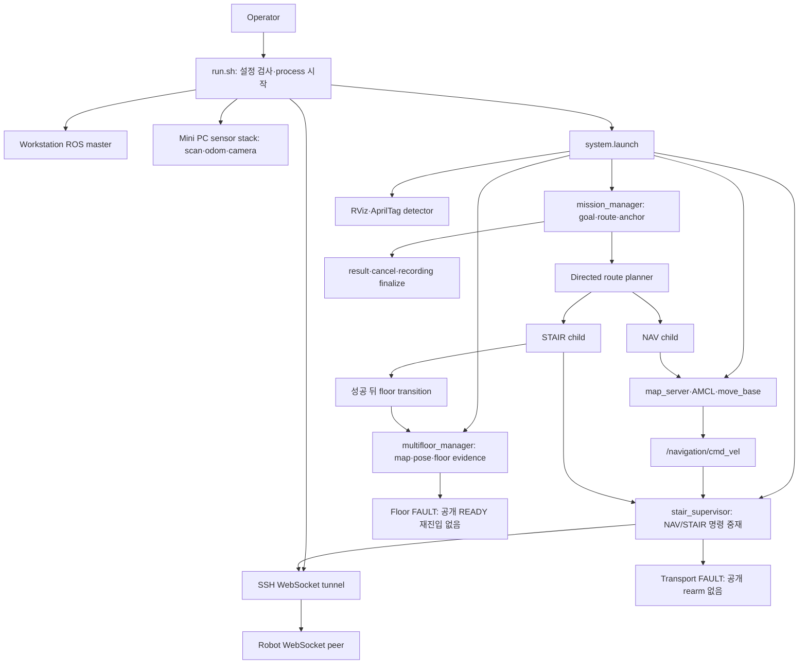

# TRON1 독립 시스템 감사 최종 보고서

**AUDIT_COMPLETE · 기준 snapshot: 2026-09-18T05:57:27.131751+00:00 (UTC)**

대상: `/home/m3tron/Desktop/TRON1_Control/TRON1_RViz_Navigation`의 현재 uncommitted worktree. 기준 HEAD `4d77a223ef6d0c898ebe9a44cc8a60a21904f2f0` (main). 감사일: 2026-09-18. 대상 코드를 수정하거나 로봇을 움직이지 않았다. 이 보고서와 연결된 원장·부록이 하나의 감사 결과다.

## 1. Executive verdict

| 축 | 판정 | 적용 범위와 이유 |
|---|---|---|
| **Safety** | **BLOCKED** | 무인 다층·계단 운용 승인 기준. 계단참 정지 판정과 취소 시 소유권 반환에 코드 반례가 있고(C-04), 준비 중 취소 뒤 새 child 전송(C-03), floor 소유권 검증 공백(C-10)이 남아 있다. 실제 사고가 발생했다는 판정은 아니다. |
| **Operational mobility** | **BLOCKED** | 요청된 전체 임무 집합 기준. 깨끗한 단일 녹화 임무의 완료 순환(C-07), 결과 없는 child의 영구 BUSY(C-01), transport/floor 장애 후 공개 복구 경로 부재(B-02/C-02), camera 전역 준비 조건(B-01)이 정상 운용을 차단한다. 개별 평지 NAV까지 모두 실행 불가능하다는 뜻은 아니다. |

**핵심은 제약의 개수가 아니라 제약의 위치와 종료 조건이다.** 전역 시작 검사는 무관한 기능을 묶는 반면, 실제 계단참 정지·취소·지도 변경의 명령 소유권 증명은 충분하지 않다. 기존 세 application node와 실행기 안에서 대부분을 수정할 수 있다. 물리 외곽과 계단 임계값을 실측 없이 줄이거나, FAULT를 무조건 자동 해제하는 조치는 권고하지 않는다.

감사 범위는 조정 완료했다. **5,523 = READ 761 + METADATA_ONLY 1,013 + EXCLUDED 3,749 + UNREAD 0**. 모든 inventory 항목을 분류했다는 뜻이며 metadata-only/excluded의 전체 내용을 읽었다는 뜻은 아니다. 주요 제약 67개, root-cause finding 21개, 요청 E2E 15개를 다룬다. 선택 시험은 **88 실행 / 85 통과 / 3 실패**다. 상세 완료 상태는 [완료조건 원장](/home/m3tron/.codex/.chatgpt-projects/g-p-6aa37f17097c81919ca6c59ce41e856c/audit-tron1-20260918/completion-check.json)을 따른다. 감사 완료는 실장비 commissioning 합격과 구별한다.

증거 등급은 **OBSERVED**(코드·설정·실행한 순수 시험·명시한 read-only 관찰), **INFERRED**(직접 근거들을 연결한 조건부 결과), **UNVERIFIED**(실장비·외부 조건 미확인)다. 정적 코드가 허용하는 경로와 현장에서 발생한 사건을 구분한다. S/M은 발생 확률이 아니라 영향 등급이다. S4는 충돌·추락·소유권 상실 가능성, S3는 fault 중 위험 명령, S2는 제한 조건의 안전 여유 부족, S1은 낮은 간접 영향, S0은 확인된 안전 영향 없음이다. M4는 해당 핵심 임무 불가능, M3는 복구 고착·전체 재시작 요구, M2는 특정 경로·기능 차단, M1은 낮은 간접 영향, M0은 확인된 주행 영향 없음이다.

## 2. Architecture and ownership

OBSERVED: 구현된 주 흐름은 아래와 같다. 현재 실행 중인 전체 graph와 펌웨어의 독점 제어 정책은 UNVERIFIED다.

[소유권·topic·capability 전체 표](/home/m3tron/.codex/.chatgpt-projects/g-p-6aa37f17097c81919ca6c59ce41e856c/audit-tron1-20260918/architecture-final.md)에는 요청한 15개 resource의 시작·종료 주체, health, 자동복구, 영향 범위와 11개 topic 묶음의 freshness가 있다. [10개 장애 및 실제 수동 복구 표](/home/m3tron/.codex/.chatgpt-projects/g-p-6aa37f17097c81919ca6c59ce41e856c/audit-tron1-20260918/failure-recovery-final.md)는 wf_mapping/LiDAR/odom/camera/master/tunnel/stair FAULT/move_base/RViz/Mini PC reboot를 시작 중과 운용 중으로 나눠 추적한다. 지원되지 않는 reset service나 개별 driver 재시작 명령을 만들어 제시하지 않았다.

중요한 소유권 경계:

- **OBSERVED:** wrapper는 readiness 뒤 system roslaunch PID를 기다린다. 일반 child는 required/respawn 설정이 없으므로 하나의 node 사망이 전체 roslaunch 종료를 뜻하지 않는다. AprilTag detector의 명시적 respawn은 예외다. [run.sh:382](/home/m3tron/Desktop/TRON1_Control/TRON1_RViz_Navigation/run.sh:382), [/opt/ros/noetic/lib/python3/dist-packages/roslaunch/core.py:432](/opt/ros/noetic/lib/python3/dist-packages/roslaunch/core.py:432).
- **OBSERVED upstream / INFERRED 영향:** master는 discovery·parameter·새 연결에 관여하지만 기존 TCPROS socket의 즉시 단절을 보장하지 않는다. master 단독 장애와 wrapper가 모든 child를 종료하는 경로를 구별한다. [/opt/ros/noetic/lib/python3/dist-packages/rospy/impl/tcpros_base.py:666](/opt/ros/noetic/lib/python3/dist-packages/rospy/impl/tcpros_base.py:666).
- **OBSERVED:** supervisor는 NAV/STAIR state와 epoch 안에서 명령을 중재한다. STAND는 응답 성공을 확인하고 WALK/STAIR는 후속 상태도 확인한다. zero 송신과 mode 응답은 실물 정지 증명이 아니다. [src/stair_supervisor/src/stair_supervisor/robot_transport.py:199](/home/m3tron/Desktop/TRON1_Control/TRON1_RViz_Navigation/src/stair_supervisor/src/stair_supervisor/robot_transport.py:199).
- **OBSERVED runtime:** 02:52:52/02:53:32 UTC read-only SSH에서 Mini PC `astra-web.service`는 active/enabled였다. 그때 조회에서 ROS 관련 process는 보이지 않았다. **UNVERIFIED:** 실제 command 충돌, 현재 전체 graph. 조회 명령과 결과: [remote-sensor-observation.txt](/home/m3tron/.codex/.chatgpt-projects/g-p-6aa37f17097c81919ca6c59ce41e856c/audit-tron1-20260918/remote-sensor-observation.txt), [phase-C-continuation.md](/home/m3tron/.codex/.chatgpt-projects/g-p-6aa37f17097c81919ca6c59ce41e856c/audit-tron1-20260918/phase-C-continuation.md).

Capability 최소 dependency는 FLAT_NAV의 map·localization·scan·odom/TF·planner·command transport, STAIR의 검증한 profile·entry·정지/진행·소유권 전환, FLOOR_TRANSITION의 target identity·map/pose·costmap·소유권이다. camera/tag는 사용하는 localization/층전이에, 저장공간과 recorder는 RECORD_ROUTE/INSPECT에 한정해야 한다. RVIZ_ONLY에는 robot transport가 필요하지 않다. 새 subsystem 없이 기존 검사 함수의 적용 범위를 좁히는 방향이다.

## 3. Safety and liveness invariants

| Invariant | 축 | 보장 여부 | 근거·위반 경로 |
|---|---|---|---|
| 위험한 상태에서는 움직이지 않는다 | Safety | **보장되지 않음** | OBSERVED C-04 정지/취소 반례, C-03 취소 뒤 전송. 실제 motion 결과 UNVERIFIED. |
| 정상 상태에서는 목적지까지 이동하고 결과를 받는다 | Liveness | **전체 집합에서 위반** | C-07 정상 녹화 완료 순환, C-09 복귀 graph 반례; C-01 무결과 child는 INFERRED 고착. |
| 한 subsystem failure가 무관한 기능을 막지 않는다 | Liveness | **위반** | B-01 camera 부재의 전체 시작 차단·sensor 묶음 재시작. 운용 중 camera loss가 즉시 NAV를 막는다고는 하지 않음. |
| 일시 장애는 영구 FAULT가 되지 않는다 | Liveness | **budget 초과 경로에서 위반** | B-02 terminal transport fault, C-02 floor fault. budget 내부 transient 회복은 구현돼 있음. |
| 모든 blocking state에 관찰 가능한 이유와 복구 방법이 있다 | 양쪽 | **부분 충족** | fault detail은 있으나 READY/rearm 경로와 child 결과 deadline 부재. B-02/C-01/C-02. |
| 물리 footprint 외 margin은 측정 근거를 가진다 | 양쪽 | **UNVERIFIED** | K26–K30/K39–K43; body·여유·제동 실측과 current profile 연결 미확인. |
| cancel 수락 뒤 이전 준비 작업이 새 child를 만들지 않는다 | Safety | **위반** | C-03 actual source body+fake-peer 결정적 interleaving. |
| 지도 전이는 현재 command owner가 허용한 epoch에서만 일어난다 | Safety | **보장되지 않음** | C-10 action field 미전달/미검증. 직접 floor action 경로. |
| 물리 이동 성공과 논리 anchor가 일치한다 | 양쪽 | **보장되지 않음** | C-06 recorder 실패 뒤 anchor 반환 누락, C-11 독립 startup 입력. |
| 관측/replay가 운용 명령에 섞이지 않는다 | Safety | **일반 viewer에서 보장되지 않음** | E-04 master 재사용/all-topic replay. 다른 격리 replay 도구의 보호는 인정. |

### 상태머신에서 반증한 과장

OBSERVED: mission은 매 goal에 새 FSM을 만들고 정상 terminal 뒤 active handle을 해제한다. RESET 미호출만으로 모든 다음 goal이 막히는 구조가 아니다. NAV 재시도는 최대 2회이며, 일반 RETRY 경로가 있다는 이유만으로 production 무한 재시도를 확정하지 않았다. disabled stair edge는 제외되지만 평면 NAV edge는 남는다. 일반 NAV는 recorder 저장공간 검사 때문에 차단되지 않는다. [src/mission_manager/src/mission_manager/mission_orchestrator.py:69](/home/m3tron/Desktop/TRON1_Control/TRON1_RViz_Navigation/src/mission_manager/src/mission_manager/mission_orchestrator.py:69), [src/mission_manager/src/mission_manager/mission_action_server.py:134](/home/m3tron/Desktop/TRON1_Control/TRON1_RViz_Navigation/src/mission_manager/src/mission_manager/mission_action_server.py:134), [src/mission_manager/src/mission_manager/navigation_executor.py:187](/home/m3tron/Desktop/TRON1_Control/TRON1_RViz_Navigation/src/mission_manager/src/mission_manager/navigation_executor.py:187), [src/mission_manager/src/mission_manager/route_planner.py:223](/home/m3tron/Desktop/TRON1_Control/TRON1_RViz_Navigation/src/mission_manager/src/mission_manager/route_planner.py:223).

### 계단 phase가 실제로 증명하는 것

아래는 OBSERVED 코드 조건이다. 실제 지지면·미끄럼·추락 여유는 UNVERIFIED이며 phase 이름으로 입증하지 않는다. 근거: [src/stair_supervisor/src/stair_supervisor/stair_evidence.py:135](/home/m3tron/Desktop/TRON1_Control/TRON1_RViz_Navigation/src/stair_supervisor/src/stair_supervisor/stair_evidence.py:135), [src/mission_manager/src/mission_manager/stair_entry_gate.py:115](/home/m3tron/Desktop/TRON1_Control/TRON1_RViz_Navigation/src/mission_manager/src/mission_manager/stair_entry_gate.py:115), K11–K15/K54–K55.

| Phase | 실제 조건 | 안전·주행 한계와 최소 방향 |
|---|---|---|
| VERIFY_ENTRY | 새 odom과 per-sample stationary | mission의 절대 entry pose gate는 별도 존재. 수용 step보다 느슨한 stationary 기준 수정 필요. |
| ALIGN | 새 odom 표본 | phase 자체가 새 절대 alignment를 증명하지 않음. 앞선 entry 검증과 혼동 금지. |
| FORWARD_SEGMENT_1 | odom 투영거리+0.50m tolerance | wheel slip/누적오차와 실물 landing을 구별할 독립 관측 미확인. |
| LANDING | 작은 연속 step의 5초 dwell | 5초 2.02m 이동도 완료하는 순수 반례. 누적 이동·속도·실제 지지면으로 기존 gate 보강. |
| TURN_TO_NEXT_FLIGHT | 누적 yaw와 tolerance | 실제 회전 여유나 landing 지지면은 증명하지 못함. 기존 TURN 입력 보강 우선. |
| FORWARD_SEGMENT_2 | 두 번째 odom 투영거리 | 첫 flight와 같은 한계. 방향별 UP/DOWN 검증을 서로 대신할 수 없음. |
| EXIT_CONFIRM | odom stationary dwell | 실물 출구·안정 지지 확인과 동일하지 않음. 검증된 정지 뒤 owner 반환 필요. |

0.12초 sample gap, 0.20초 freshness, **traversal 전체 300초** deadline은 코드 설정이다. 300초를 phase별 timeout으로 해석하지 않는다. 과거 bag의 기록 간격은 callback 간격·물리 상태와 동일하지 않으므로 단독 근거로 임계를 늘리지 않는다. cancel은 즉시 zero 필요성과 검증된 NAV 소유권 반환을 분리해야 하며 새 phase/node가 반드시 필요한 근거는 없다.

### 시작 위치·localization

**OBSERVED:** 3F는 기본값이지 구조적 필수 조건이 아니다. map YAML, initial_floor, AMCL pose, mission location은 독립 입력이다. known location 이름만 바꿔도 pose가 자동으로 맞춰지는 계약은 없다. floor map fingerprint의 startup READY가 실제 pose/anchor 일치까지 증명하지 않으며 빈 route는 localization 검증 없이 성공할 수 있다(C-11).

| 시작 요청 | 현재 평가 | 기존 구조 안의 최소 운영 표면 제안 |
|---|---|---|
| 3F HOME | 입력과 실제 위치가 일치할 때만 조건부 | map/floor/pose/anchor를 한 구성에서 선택·검증 |
| 등록 4F 또는 5F location | 가능하지만 map/pose/anchor 자동 연동 없음 | `--start-at LOCATION_ID`에서 등록 위치의 네 값을 원자적으로 도출 |
| 임의 floor+pose | pose는 알려도 graph anchor는 자동 증명 안 됨 | `--start-floor FLOOR --start-pose X Y YAW`; 주행 가능한 첫 연결이 확인될 때 anchor commit |
| floor만 지정 | 지도 선택/전체 공간 localization orchestration 미완 | `--start-floor FLOOR --auto-localize`; bounded 수렴 확인 뒤 유효 연결 선택 |
| AprilTag로 floor 확인 | tag 정책은 있지만 항상 보이는 조건은 아님 | 태그 기반 획득·층 확인 때만 사용. 일반 복도 NAV 상시 gate로 확대하지 않음 |

위 CLI는 **현재 구현된 옵션이 아니라 제안**이다. nearest anchor도 현재 자동 기능이 아니며 거리만으로 벽 반대편·연결 불가 anchor를 선택하면 안 된다. global localization 서비스는 upstream에 존재하고 particle 분포를 재설정하지만 응답 true가 수렴 성공은 아니다. nomotion은 강제 갱신 flag를 세운다. 새 pose 생산·scan 일관성·여러 관측·대칭 복도 구별을 bounded acquisition으로 연결하고, 실패는 해당 획득만 재시도하게 한다. 작은 covariance만으로 정답 pose를 확정하지 않는다. [공식 AMCL source](/home/m3tron/.codex/.chatgpt-projects/g-p-6aa37f17097c81919ca6c59ce41e856c/audit-tron1-20260918/upstream/amcl__src__amcl_node.cpp)의 1089(global), 1106(nomotion), 1205/1366(update/publication) 및 [URL·hash 원장](/home/m3tron/.codex/.chatgpt-projects/g-p-6aa37f17097c81919ca6c59ce41e856c/audit-tron1-20260918/upstream/manifest.json)을 대조했다. 서비스를 실행하지 않았다.

## 4. Overconstraint findings

각 항목의 OBSERVED 문장이 trigger와 구현 근거이고, INFERRED 문장이 정상 시나리오의 차단 영향을 설명한다. 관련 증상은 같은 ID에 묶었다.
### B-01 · 요청 capability와 무관한 준비 조건이 전체 시작을 막는다

**Safety S1 / Mobility M3**

제약·경계: 전역 camera/tag/action/site bundle readiness와 sensor 묶음 재시작. 보호하려는 hazard: 실제 사용하는 센서·서버 부재 상태에서 명령 시작.

**OBSERVED · trigger/근거:** run.sh는 camera/info/tag와 모든 action을 준비 조건으로 요구하며 camera 한 개 부재도 wf_mapping 전체 restart branch로 간다. site loader는 모든 층·scan/stair 구성도 검사한다.

**INFERRED · 영향/과잉 범위:** 정상 LiDAR·odom·map을 가진 FLAT_NAV가 camera 또는 무관한 층 설정 때문에 시작하지 못한다.

**UNVERIFIED · 적용 한계:** 현재 camera 장애율·재시작 중 실제 기체 영향. tag 빈 array는 startup을 통과할 수 있어 미검출 자체가 항상 차단은 아니다.

근거: [run.sh:70](/home/m3tron/Desktop/TRON1_Control/TRON1_RViz_Navigation/run.sh:70), [run.sh:225](/home/m3tron/Desktop/TRON1_Control/TRON1_RViz_Navigation/run.sh:225), [run.sh:348](/home/m3tron/Desktop/TRON1_Control/TRON1_RViz_Navigation/run.sh:348), [src/mission_manager/src/mission_manager/site_config.py:200](/home/m3tron/Desktop/TRON1_Control/TRON1_RViz_Navigation/src/mission_manager/src/mission_manager/site_config.py:200).

**최소 수정:** 기존 startup 검사에 요청 capability와 해당 route의 의존성 집합을 적용한다. camera/tag는 관련 전이·획득에만 요구한다. **복구:** 센서 프로세스가 제공하는 최소 restart 경계를 확인해 camera 복구가 정상 LiDAR/odom을 끊지 않게 한다. **필요 시험:** camera 없음/빈 tag array/무관한 층 결함에서도 유효한 flat route; camera restart 중 scan/odom 연속성.

### B-02 · 통신 budget 초과 뒤 정상 통신이 돌아와도 FAULT가 풀리지 않는다

**Safety S1 / Mobility M3**

제약·경계: transport FAULT latch, timer 정지, tunnel reconnect 없음. 보호하려는 hazard: 불확실한 세션으로 명령 재전송.

**OBSERVED · trigger/근거:** outage budget 내부의 짧은 send 오류는 허용하지만 초과 후 transport/supervisor가 faulted 상태를 유지한다. 자동 reconnect/reset 인터페이스가 없다.

**INFERRED · 영향/과잉 범위:** 일시적 tunnel 상실이 node/session 재생성을 요구해 정상 주행을 장기간 막는다.

**UNVERIFIED · 적용 한계:** 실제 disconnect 시 펌웨어 watchdog, reconnect 시 zero/모드 안정성.

근거: [src/stair_supervisor/src/stair_supervisor/robot_transport.py:81](/home/m3tron/Desktop/TRON1_Control/TRON1_RViz_Navigation/src/stair_supervisor/src/stair_supervisor/robot_transport.py:81), [src/stair_supervisor/src/stair_supervisor/robot_transport.py:185](/home/m3tron/Desktop/TRON1_Control/TRON1_RViz_Navigation/src/stair_supervisor/src/stair_supervisor/robot_transport.py:185), [src/stair_supervisor/src/stair_supervisor/ros_node.py:145](/home/m3tron/Desktop/TRON1_Control/TRON1_RViz_Navigation/src/stair_supervisor/src/stair_supervisor/ros_node.py:145), [run.sh:382](/home/m3tron/Desktop/TRON1_Control/TRON1_RViz_Navigation/run.sh:382).

**최소 수정:** 기존 owner 안에서 횟수·시간이 제한된 새 세션 연결을 지원한다. 이전 명령/epoch를 폐기하고 zero 및 실제 mode 확인 뒤에만 재허용한다. **복구:** 전체 system 재시작 대신 해당 transport/session만 복구한다. 불명확한 계단 자세는 자동 NAV 복귀시키지 않는다. **필요 시험:** budget 내/초과 장애, 늦은 mode 응답, stale 명령 재전송 없음, reconnect 실패 후 관측 가능한 원인.

### B-04 · move_base 시작이 불완전 TF 검사와 RViz helper에 묶인다

**Safety S1 / Mobility M2**

제약·경계: TF 무한 대기와 동기 XMLRPC helper. 보호하려는 hazard: 위치 변환이 없는 planner 시작.

**OBSERVED · trigger/근거:** wrapper는 map frame 문자열을 찾고 /rviz_navigation helper를 동기로 호출한다. launch RViz 이름은 /rviz이며 helper RPC 명시 timeout은 없다. 일부 SSH 작업도 연결 뒤 remote command 전체 실행 deadline이 없다.

**INFERRED · 영향/과잉 범위:** reachable하지만 응답 없는 helper는 planner 시작을 묶을 수 있다. historical unknown-node 오류는 실제로 비치명적이었다.

**UNVERIFIED · 적용 한계:** 현재 endpoint hang 재현과 실제 TF 시작 지연.

근거: [src/multifloor_manager/scripts/wait_for_tf_exec.sh:17](/home/m3tron/Desktop/TRON1_Control/TRON1_RViz_Navigation/src/multifloor_manager/scripts/wait_for_tf_exec.sh:17), [src/multifloor_manager/scripts/rviz_tf_reconnect.py:25](/home/m3tron/Desktop/TRON1_Control/TRON1_RViz_Navigation/src/multifloor_manager/scripts/rviz_tf_reconnect.py:25), [src/mission_manager/launch/system.launch:81](/home/m3tron/Desktop/TRON1_Control/TRON1_RViz_Navigation/src/mission_manager/launch/system.launch:81), [run.sh:127](/home/m3tron/Desktop/TRON1_Control/TRON1_RViz_Navigation/run.sh:127), [run.sh:131](/home/m3tron/Desktop/TRON1_Control/TRON1_RViz_Navigation/run.sh:131).

**최소 수정:** 실제 map→base_Link chain과 age를 제한된 시간 안에 확인하고 visualization 보조 작업을 planner 시작 조건에서 분리한다. **복구:** RViz만 재시작할 수 있게 하며 TF 부재에는 정확한 frame/age 이유를 출력한다. **필요 시험:** RViz 없음/종료/hanging RPC, map 문자열은 있지만 base chain 없음, TF 회복 후 planner 시작.

### C-01 · child가 terminal을 보내지 않으면 부모 mission이 계속 BUSY다

**Safety S2 / Mobility M3**

제약·경계: deadline 없는 child wait, segment 시작에만 health 검사. 보호하려는 hazard: 동시에 여러 mission이 command ownership을 갖는 상황.

**OBSERVED · trigger/근거:** NAV/stair/floor wait_for_result에 timeout이 없고 installed actionlib의 기본 0은 무한 대기다. active handle이 있는 동안 다음 goal은 BUSY다.

**INFERRED · 영향/과잉 범위:** child 서버 또는 cancel ACK 상실 시 정지·종료 확인 없이 부모가 끝나지 않을 수 있다.

**UNVERIFIED · 적용 한계:** 현재 ROS 서버 단절 interleaving의 실제 발생 빈도.

근거: [src/mission_manager/src/mission_manager/navigation_executor.py:290](/home/m3tron/Desktop/TRON1_Control/TRON1_RViz_Navigation/src/mission_manager/src/mission_manager/navigation_executor.py:290), [src/mission_manager/src/mission_manager/ros_segments.py:175](/home/m3tron/Desktop/TRON1_Control/TRON1_RViz_Navigation/src/mission_manager/src/mission_manager/ros_segments.py:175), [src/mission_manager/src/mission_manager/ros_segments.py:202](/home/m3tron/Desktop/TRON1_Control/TRON1_RViz_Navigation/src/mission_manager/src/mission_manager/ros_segments.py:202), [src/mission_manager/src/mission_manager/mission_action_server.py:82](/home/m3tron/Desktop/TRON1_Control/TRON1_RViz_Navigation/src/mission_manager/src/mission_manager/mission_action_server.py:82), [/opt/ros/noetic/lib/python3/dist-packages/actionlib/simple_action_client.py:120](/opt/ros/noetic/lib/python3/dist-packages/actionlib/simple_action_client.py:120).

**최소 수정:** 기존 executor의 monotonic deadline·health poll·bounded cancel acknowledgement를 연결한다. **복구:** timeout만으로 owner를 버리지 말고 이전 child 정지/격리 후 다음 goal을 허용한다. 정상 terminal 뒤 handle 해제는 이미 존재한다. **필요 시험:** terminal 없는 fake child, server 없음, cancel ACK 상실, 복구 후 새 goal.

### C-02 · floor 전이 실패가 floor identity와 재시도 경로를 함께 잃는다

**Safety S2 / Mobility M3**

제약·경계: READY-only admission, 실패 시 빈 floor FAULT. 보호하려는 hazard: 불확실한 지도/층으로 NAV.

**OBSERVED · trigger/근거:** 실패 후 evidence를 지우며 빈 floor_id로 FAULT를 발행한다. 새 전이는 READY를 요구하고 map callback은 UNKNOWN 초기화에서만 READY로 바꾼다. service timeout 뒤 worker가 나중에 완료하는 순수 반례도 확인했다.

**INFERRED · 영향/과잉 범위:** 외부 change_map이 FAULT 뒤 완료될 수 있고 센서가 회복돼도 현재 공개 action으로 재시도하지 못한다.

**UNVERIFIED · 적용 한계:** 실 service 지연 중 실제 map 변경 시각.

근거: [src/multifloor_manager/src/multifloor_manager/ros_node.py:115](/home/m3tron/Desktop/TRON1_Control/TRON1_RViz_Navigation/src/multifloor_manager/src/multifloor_manager/ros_node.py:115), [src/multifloor_manager/src/multifloor_manager/ros_node.py:199](/home/m3tron/Desktop/TRON1_Control/TRON1_RViz_Navigation/src/multifloor_manager/src/multifloor_manager/ros_node.py:199), [src/multifloor_manager/src/multifloor_manager/ros_runtime.py:221](/home/m3tron/Desktop/TRON1_Control/TRON1_RViz_Navigation/src/multifloor_manager/src/multifloor_manager/ros_runtime.py:221), [src/multifloor_manager/src/multifloor_manager/ros_services.py:33](/home/m3tron/Desktop/TRON1_Control/TRON1_RViz_Navigation/src/multifloor_manager/src/multifloor_manager/ros_services.py:33), [logic-probe-resume2.json](/home/m3tron/.codex/.chatgpt-projects/g-p-6aa37f17097c81919ca6c59ce41e856c/audit-tron1-20260918/logic-probe-resume2.json).

**최소 수정:** 실패 단계·마지막 확정 identity와 외부 작업 상태를 보존한다. 기존 transaction에서 실제 map을 재관측해 일관된 identity만 재승인한다. **복구:** map 변경 전/후 실패를 나눈 제한적 retry. 단순 FAULT 해제로 NAV를 열지 않는다. **필요 시험:** tag timeout, map 변경 후 localization timeout, late service completion, 취소 후 재관측·새 goal.

### C-05 · 같은 전이에서 확정한 floor 사실이 후속 작업 시간 때문에 만료된다

**Safety S1 / Mobility M2**

제약·경계: T_FLOOR_CONFIRMED의 10초 freshness. 보호하려는 hazard: 오래되거나 다른 floor 증거의 재사용.

**OBSERVED · trigger/근거:** floor 확인 timestamp는 한 번 기록되고 최종 gate에서는 localized/costmap만 갱신한다. 순수 probe에서 11초 뒤 다른 조건이 fresh여도 floor만 stale로 실패했다.

**INFERRED · 영향/과잉 범위:** 정상 map load/localization 시간이 길면 성공 가능한 전이가 실패하고 C-02의 복구 불가 FAULT로 이어진다.

**UNVERIFIED · 적용 한계:** 현장 발생 빈도.

근거: [src/multifloor_manager/src/multifloor_manager/ros_node.py:220](/home/m3tron/Desktop/TRON1_Control/TRON1_RViz_Navigation/src/multifloor_manager/src/multifloor_manager/ros_node.py:220), [src/multifloor_manager/src/multifloor_manager/ros_node.py:145](/home/m3tron/Desktop/TRON1_Control/TRON1_RViz_Navigation/src/multifloor_manager/src/multifloor_manager/ros_node.py:145), [src/multifloor_manager/src/multifloor_manager/transitions.py:214](/home/m3tron/Desktop/TRON1_Control/TRON1_RViz_Navigation/src/multifloor_manager/src/multifloor_manager/transitions.py:214), [src/multifloor_manager/config/transitions.yaml:20](/home/m3tron/Desktop/TRON1_Control/TRON1_RViz_Navigation/src/multifloor_manager/config/transitions.yaml:20), [pure-C-probe.json](/home/m3tron/.codex/.chatgpt-projects/g-p-6aa37f17097c81919ca6c59ce41e856c/audit-tron1-20260918/pure-C-probe.json).

**최소 수정:** 같은 epoch의 확정 사실과 연속 센서 신선도를 구분한다. 반대 층 관측/epoch 교체 때 사실을 무효화한다. **복구:** 후속 작업 지연이 floor 재확정과 전체 재시작으로 번지지 않게 한다. **필요 시험:** 9초/11초 지연, 반대 floor evidence, epoch 교체, 오랜 실제 전이.

### C-07 · 녹화 검증이 아직 발행할 수 없는 자기 mission 결과를 기다린다

**Safety S1 / Mobility M4**

제약·경계: 필수 /mission/result topic count. 보호하려는 hazard: 누락된 기록을 성공으로 보고.

**OBSERVED · trigger/근거:** production scan profile은 /mission/result를 필수로 요구한다. recorder finalize/검증 뒤 orchestrator가 반환하고 그 뒤에 부모 terminal을 발행한다. result publisher는 non-latched다.

**INFERRED · 영향/과잉 범위:** 다른 mission 결과가 없는 정상 단일 RECORD_ROUTE/같은 profile 녹화는 자체 결과로 필수 count를 만족시킬 수 없다. unrelated reject 결과가 우연히 count를 채워도 identity 검증이 아니다.

**UNVERIFIED · 적용 한계:** 실장비 clean mission 실행; /tron/imu 필수 경로의 실제 publisher 유무.

근거: [src/mission_manager/config/scan_profiles.yaml:15](/home/m3tron/Desktop/TRON1_Control/TRON1_RViz_Navigation/src/mission_manager/config/scan_profiles.yaml:15), [src/mission_manager/src/mission_manager/scan_recorder.py:211](/home/m3tron/Desktop/TRON1_Control/TRON1_RViz_Navigation/src/mission_manager/src/mission_manager/scan_recorder.py:211), [src/mission_manager/src/mission_manager/record_route_runner.py:218](/home/m3tron/Desktop/TRON1_Control/TRON1_RViz_Navigation/src/mission_manager/src/mission_manager/record_route_runner.py:218), [src/mission_manager/src/mission_manager/mission_action_server.py:123](/home/m3tron/Desktop/TRON1_Control/TRON1_RViz_Navigation/src/mission_manager/src/mission_manager/mission_action_server.py:123), [/opt/ros/noetic/lib/python3/dist-packages/actionlib/action_server.py:141](/opt/ros/noetic/lib/python3/dist-packages/actionlib/action_server.py:141), [/opt/ros/noetic/lib/python3/dist-packages/rospy/topics.py:812](/opt/ros/noetic/lib/python3/dist-packages/rospy/topics.py:812).

**최소 수정:** 자기 terminal을 진행 중 녹화의 mandatory sensor 집합에서 제거하고 final result/manifest에 mission_id로 결합한다. IMU topic도 실제 계약과 일치시킨다. **복구:** 녹화 실패를 이동 성공/confirmed anchor와 분리하여 결과를 반환한다. **필요 시험:** unrelated result가 없는 clean finalize와 unrelated result 주입을 구별; production profile 그대로 테스트.

### C-08 · 정지한 stair 진입에서 요구하는 새 AMCL 표본을 스스로 생산시키지 않는다

**Safety S1 / Mobility M3**

제약·경계: handoff 후 새 pose3개/2초 제한. 보호하려는 hazard: 이전 위치·방향으로 계단 진입.

**OBSERVED · trigger/근거:** entry fence 뒤 복수 AMCL pose를 요구하지만 이 준비 경로에는 nomotion 요청이 없다. 공식 AMCL의 TF 재발행은 pose 새 표본 발행과 같은 계약이 아니다.

**INFERRED · 영향/과잉 범위:** 정상적으로 정지한 로봇이 pose3개를 얻지 못해 entry timeout될 수 있다.

**UNVERIFIED · 적용 한계:** 설치 binary/실제 정지 AMCL의 발행과 jitter, 발생 빈도.

근거: [src/mission_manager/src/mission_manager/ros_state.py:191](/home/m3tron/Desktop/TRON1_Control/TRON1_RViz_Navigation/src/mission_manager/src/mission_manager/ros_state.py:191), [src/mission_manager/src/mission_manager/stair_entry_gate.py:115](/home/m3tron/Desktop/TRON1_Control/TRON1_RViz_Navigation/src/mission_manager/src/mission_manager/stair_entry_gate.py:115), [src/mission_manager/src/mission_manager/ros_runtime.py:77](/home/m3tron/Desktop/TRON1_Control/TRON1_RViz_Navigation/src/mission_manager/src/mission_manager/ros_runtime.py:77), [upstream/amcl__src__amcl_node.cpp:1106](/home/m3tron/.codex/.chatgpt-projects/g-p-6aa37f17097c81919ca6c59ce41e856c/audit-tron1-20260918/upstream/amcl__src__amcl_node.cpp:1106), [upstream/amcl__src__amcl_node.cpp:1205](/home/m3tron/.codex/.chatgpt-projects/g-p-6aa37f17097c81919ca6c59ce41e856c/audit-tron1-20260918/upstream/amcl__src__amcl_node.cpp:1205), [upstream/amcl__src__amcl_node.cpp:1366](/home/m3tron/.codex/.chatgpt-projects/g-p-6aa37f17097c81919ca6c59ce41e856c/audit-tron1-20260918/upstream/amcl__src__amcl_node.cpp:1366).

**최소 수정:** 기존 entry 경로에서 bounded nomotion/pose acquisition을 연결한다. floor/위치/방향 검증은 유지한다. **복구:** 새 표본 획득 실패 원인과 재시도를 보이되 transport 전체 FAULT와 분리한다. **필요 시험:** 정지 AMCL 계약 peer, 충분한 fresh pose, wrong floor, covariance 불량, timeout 후 재시도.

### C-09 · production graph의 복귀 NAV 연결이 빠져 있다

**Safety S1 / Mobility M2**

제약·경계: directed route 존재 조건. 보호하려는 hazard: 물리적으로 검증하지 않은 경로의 임의 추정.

**OBSERVED · trigger/근거:** production planner에서 stair_5f_to_rf→home_3f 및 stair_4f_to_5f→home_3f가 no directed route였다. fixture에는 reverse NAV 연결이 존재한다.

**INFERRED · 영향/과잉 범위:** outbound 성공 가능한 위치에서도 return_after_task가 계획되지 않는다.

**UNVERIFIED · 적용 한계:** 역방향 통로의 물리적 안전·통행 가능성.

근거: [src/mission_manager/config/building_graph.yaml:16](/home/m3tron/Desktop/TRON1_Control/TRON1_RViz_Navigation/src/mission_manager/config/building_graph.yaml:16), [src/mission_manager/src/mission_manager/route_planner.py:193](/home/m3tron/Desktop/TRON1_Control/TRON1_RViz_Navigation/src/mission_manager/src/mission_manager/route_planner.py:193), [pure-C-probe.json](/home/m3tron/.codex/.chatgpt-projects/g-p-6aa37f17097c81919ca6c59ce41e856c/audit-tron1-20260918/pure-C-probe.json).

**최소 수정:** 현장에서 확인한 복귀 edge만 기존 graph에 추가하고 outward/return을 시작 전에 둘 다 계획한다. **복구:** 실패를 출발 전에 설명하고 이미 도달한 anchor는 보존한다. **필요 시험:** production graph 모든 지원 출발지/복귀 조합; 역방향 edge를 무조건 생성하지 않는 음성 시험.

## 5. Safety and correctness findings

### B-03 · 종료 순서가 shutdown zero 전에 통신 경로를 제거할 수 있다

**Safety S3 / Mobility M1**

제약·경계: cleanup master→tunnel→system signal 순서. 보호하려는 hazard: 종료 중 마지막 nonzero 명령 잔류.

**OBSERVED · trigger/근거:** cleanup은 master와 tunnel에 먼저 종료 신호를 보내고 system을 종료한다. transport close는 연결된 session으로 zero를 보내려 한다.

**INFERRED · 영향/과잉 범위:** supervisor의 stop 시도가 tunnel 제거와 경합해 전송되지 않을 수 있다.

**UNVERIFIED · 적용 한계:** 실제 기체 지속 motion과 펌웨어 watchdog 효과.

근거: [run.sh:198](/home/m3tron/Desktop/TRON1_Control/TRON1_RViz_Navigation/run.sh:198), [src/stair_supervisor/src/stair_supervisor/robot_transport.py:261](/home/m3tron/Desktop/TRON1_Control/TRON1_RViz_Navigation/src/stair_supervisor/src/stair_supervisor/robot_transport.py:261).

**최소 수정:** system/supervisor의 bounded stop 시도·종료를 먼저 기다린 뒤 tunnel/master를 정리한다. **복구:** 무한 shutdown 대기 없이 결과와 미확인 zero 전달을 분리 기록한다. **필요 시험:** fake transport signal order, stop timeout, 이미 끊어진 tunnel에서 종료.

### C-03 · 준비 대기 중 취소한 뒤 새 child goal이 전송된다

**Safety S3 / Mobility M2**

제약·경계: cancel predicate와 dispatch ownership의 분리. 보호하려는 hazard: 취소된 mission의 후속 이동.

**OBSERVED · trigger/근거:** 실제 RosSegmentExecutor class body를 fake peer로 실행한 순수 반례에서 entry/server wait 중 parent cancel 후 새 stair/floor goal이 전송됐고 predicate 호출은0회였다.

**INFERRED · 영향/과잉 범위:** 실제 ROS에서도 같은 선후관계면 취소 후 새 움직임 요청이 발생할 수 있다.

**UNVERIFIED · 적용 한계:** 실 ROS/기체 interleaving과 motion.

근거: [src/mission_manager/src/mission_manager/ros_segments.py:101](/home/m3tron/Desktop/TRON1_Control/TRON1_RViz_Navigation/src/mission_manager/src/mission_manager/ros_segments.py:101), [src/mission_manager/src/mission_manager/ros_segments.py:147](/home/m3tron/Desktop/TRON1_Control/TRON1_RViz_Navigation/src/mission_manager/src/mission_manager/ros_segments.py:147), [src/mission_manager/src/mission_manager/ros_segments.py:193](/home/m3tron/Desktop/TRON1_Control/TRON1_RViz_Navigation/src/mission_manager/src/mission_manager/ros_segments.py:193), [src/mission_manager/src/mission_manager/navigation_executor.py:181](/home/m3tron/Desktop/TRON1_Control/TRON1_RViz_Navigation/src/mission_manager/src/mission_manager/navigation_executor.py:181), [logic-probe-resume2.json](/home/m3tron/.codex/.chatgpt-projects/g-p-6aa37f17097c81919ca6c59ce41e856c/audit-tron1-20260918/logic-probe-resume2.json).

**최소 수정:** 준비 대기·전송 직전에 같은 context cancellation/epoch를 확인하고 send/cancel을 같은 owner 경계에서 직렬화한다. **복구:** 취소가 terminal로 끝난 뒤 old callback/goal을 폐기하고 새 mission을 허용한다. **필요 시험:** entry 대기/server 대기/NAV 진입의 결정적 cancel interleaving; 취소 뒤 새 goal.

### C-04 · 계단참·정지 확인보다 phase 이름과 odom 증분을 신뢰한다

**Safety S4 / Mobility M2**

제약·경계: LANDING/EXIT dwell 및 checkpoint cancel. 보호하려는 hazard: 계단참 도달 전 회전·불안정 상태 mode 해제.

**OBSERVED · trigger/근거:** 수용 odom step상한0.1m보다 stationary tolerance0.5m가 크다. 5초간2.02m 누적 이동해도 LANDING 완료 반례가 나온다. LANDING report incomplete 또는 faulted여도 cancel이 먼저 처리돼 stair mode 해제/NAV 복귀한 반례도 있다. flight 명령은 고정 linear와 yaw=0이며 odom evidence는 완료/fault 판정에 쓰인다. 이 경로에는 계단 상대 횡오차·heading의 능동 보정이 없고 WebSocket y 명령도 0이다.

**INFERRED · 영향/과잉 범위:** wheel slip/drift나 불완전 landing 상태에서 turn 또는 NAV 재허용 가능성이 있다.

**UNVERIFIED · 적용 한계:** 실물 추락/충돌 발생, 층·UP/DOWN별 profile 실측 승인. 현재 enabled YAML을 과거 blocked 자료로 정당화할 수 없다. 외부 펌웨어의 자세 제어와 실제 lateral drift는 미검증이다.

근거: [src/stair_supervisor/src/stair_supervisor/stair_evidence.py:110](/home/m3tron/Desktop/TRON1_Control/TRON1_RViz_Navigation/src/stair_supervisor/src/stair_supervisor/stair_evidence.py:110), [src/stair_supervisor/src/stair_supervisor/stair_evidence.py:184](/home/m3tron/Desktop/TRON1_Control/TRON1_RViz_Navigation/src/stair_supervisor/src/stair_supervisor/stair_evidence.py:184), [src/stair_supervisor/src/stair_supervisor/stair_evidence.py:211](/home/m3tron/Desktop/TRON1_Control/TRON1_RViz_Navigation/src/stair_supervisor/src/stair_supervisor/stair_evidence.py:211), [src/stair_supervisor/src/stair_supervisor/supervisor.py:171](/home/m3tron/Desktop/TRON1_Control/TRON1_RViz_Navigation/src/stair_supervisor/src/stair_supervisor/supervisor.py:171), [src/stair_supervisor/src/stair_supervisor/supervisor.py:218](/home/m3tron/Desktop/TRON1_Control/TRON1_RViz_Navigation/src/stair_supervisor/src/stair_supervisor/supervisor.py:218), [src/stair_supervisor/config/stair_profiles.yaml:16](/home/m3tron/Desktop/TRON1_Control/TRON1_RViz_Navigation/src/stair_supervisor/config/stair_profiles.yaml:16), [pure-C-probe.json](/home/m3tron/.codex/.chatgpt-projects/g-p-6aa37f17097c81919ca6c59ce41e856c/audit-tron1-20260918/pure-C-probe.json), [selected-tests-resume2.json](/home/m3tron/.codex/.chatgpt-projects/g-p-6aa37f17097c81919ca6c59ce41e856c/audit-tron1-20260918/selected-tests-resume2.json), [src/stair_supervisor/src/stair_supervisor/supervisor.py:191](/home/m3tron/Desktop/TRON1_Control/TRON1_RViz_Navigation/src/stair_supervisor/src/stair_supervisor/supervisor.py:191), [src/stair_supervisor/src/stair_supervisor/robot_conversion.py:25](/home/m3tron/Desktop/TRON1_Control/TRON1_RViz_Navigation/src/stair_supervisor/src/stair_supervisor/robot_conversion.py:25).

**최소 수정:** 기존 LANDING/TURN gate에서 누적 이동·실제 정지·독립 지지/landing 관측을 분리한다. report fault 우선순위를 정리하고 phase 이름만으로 mode/owner를 해제하지 않는다. **복구:** 위험 정지는 지연시키지 않되 mode 해제와 NAV 복귀는 실제 자세·정지 증거를 요구한다. **필요 시험:** 누적 미세 이동, wheel slip, incomplete/faulted checkpoint+cancel, 층별·방향별 독립 commissioning.

### C-06 · 이동 성공 직후 recorder 오류가 confirmed anchor 반환을 끊는다

**Safety S1 / Mobility M2**

제약·경계: NEXT_SEGMENT에서 허용되지 않는 SEGMENT_FAILED event. 보호하려는 hazard: 실제 도달 위치와 다음 계획의 출발점 불일치.

**OBSERVED · trigger/근거:** 순수 probe에서 NAV 성공 직후 recorder.assert_active 오류가 NEXT_SEGMENT+SEGMENT_FAILED 예외를 만들고 RecordRouteOutcome을 반환하지 않았다.

**INFERRED · 영향/과잉 범위:** 부모 anchor가 실제 성공 segment를 반영하지 못해 다음 route의 시작점이 틀릴 수 있다.

**UNVERIFIED · 적용 한계:** 실기체 다음 goal 영향.

근거: [src/mission_manager/src/mission_manager/record_route_runner.py:169](/home/m3tron/Desktop/TRON1_Control/TRON1_RViz_Navigation/src/mission_manager/src/mission_manager/record_route_runner.py:169), [src/mission_manager/src/mission_manager/fsm.py:65](/home/m3tron/Desktop/TRON1_Control/TRON1_RViz_Navigation/src/mission_manager/src/mission_manager/fsm.py:65), [src/mission_manager/src/mission_manager/mission_orchestrator.py:67](/home/m3tron/Desktop/TRON1_Control/TRON1_RViz_Navigation/src/mission_manager/src/mission_manager/mission_orchestrator.py:67), [pure-C-probe.json](/home/m3tron/.codex/.chatgpt-projects/g-p-6aa37f17097c81919ca6c59ce41e856c/audit-tron1-20260918/pure-C-probe.json).

**최소 수정:** 기존 FSM에서 해당 실패를 정의된 event로 처리하고 성공한 anchor를 오류 outcome에도 반환한다. **복구:** recording 실패와 movement 성공을 동시에 표현하며 다음 goal의 source를 보존한다. **필요 시험:** NAV 성공 직후 recorder 종료, artifact 실패 후 anchor/다음 route 검사.

### C-10 · floor action의 ownership epoch가 선언만 있고 검증되지 않는다

**Safety S3 / Mobility M2**

제약·경계: 공개 floor action admission. 보호하려는 hazard: NAV 중 map 교체/다른 owner의 floor 전이.

**OBSERVED · trigger/근거:** action 필드 stair_ownership_epoch는 client에서 채우지 않고 server에서도 읽지 않는다. READY/target 검사는 있으나 supervisor owner·NAV 정지를 확인하지 않고 change_map을 먼저 호출한다.

**INFERRED · 영향/과잉 범위:** 직접 child action을 호출하는 접근 가능한 ROS peer가 정상 mission 순서를 우회할 수 있다.

**UNVERIFIED · 적용 한계:** 실제 외부 peer·침입·동시 map 전이 관찰은 없음.

근거: [src/multifloor_manager/action/FloorTransition.action:3](/home/m3tron/Desktop/TRON1_Control/TRON1_RViz_Navigation/src/multifloor_manager/action/FloorTransition.action:3), [src/mission_manager/src/mission_manager/ros_segments.py:199](/home/m3tron/Desktop/TRON1_Control/TRON1_RViz_Navigation/src/mission_manager/src/mission_manager/ros_segments.py:199), [src/multifloor_manager/src/multifloor_manager/ros_node.py:189](/home/m3tron/Desktop/TRON1_Control/TRON1_RViz_Navigation/src/multifloor_manager/src/multifloor_manager/ros_node.py:189), [src/multifloor_manager/src/multifloor_manager/ros_node.py:225](/home/m3tron/Desktop/TRON1_Control/TRON1_RViz_Navigation/src/multifloor_manager/src/multifloor_manager/ros_node.py:225).

**최소 수정:** 기존 action boundary에서 현재 owner의 handoff/epoch와 정지를 검증하고 전이 동안 NAV를 재허용하지 않는다. **복구:** stale/reused epoch는 해당 action만 거부하고 정상 handoff는 재시도 가능하게 한다. **필요 시험:** NAV 활성 direct floor goal, stale epoch, 정상 stair→floor handoff.

### C-11 · 시작 map·floor·pose·logical anchor가 독립적으로 달라질 수 있다

**Safety S2 / Mobility M2**

제약·경계: 초기 map identity와 임의 initial location 신뢰. 보호하려는 hazard: 잘못된 층·출발점으로 route 실행.

**OBSERVED · trigger/근거:** run.sh는 floor/location/pose를 각각 전달하고 map_yaml은 전달하지 않아 system 기본3F map이 남는다. 초기 anchor는 즉시 신뢰되며 동일 anchor 빈 route는 pose 확인 없이 성공한다.

**INFERRED · 영향/과잉 범위:** floor만5F로 바꾸면 READY 실패, 동일 층 arbitrary pose에서는 잘못된 route 시작 또는 무이동 성공 가능성이 있다.

**UNVERIFIED · 적용 한계:** 실제 오위치 주행 및 symmetric corridor global localization 수렴.

근거: [run.sh:249](/home/m3tron/Desktop/TRON1_Control/TRON1_RViz_Navigation/run.sh:249), [src/mission_manager/launch/system.launch:6](/home/m3tron/Desktop/TRON1_Control/TRON1_RViz_Navigation/src/mission_manager/launch/system.launch:6), [src/multifloor_manager/src/multifloor_manager/ros_callbacks.py:36](/home/m3tron/Desktop/TRON1_Control/TRON1_RViz_Navigation/src/multifloor_manager/src/multifloor_manager/ros_callbacks.py:36), [src/mission_manager/src/mission_manager/mission_orchestrator.py:43](/home/m3tron/Desktop/TRON1_Control/TRON1_RViz_Navigation/src/mission_manager/src/mission_manager/mission_orchestrator.py:43), [src/mission_manager/src/mission_manager/mission_orchestrator.py:85](/home/m3tron/Desktop/TRON1_Control/TRON1_RViz_Navigation/src/mission_manager/src/mission_manager/mission_orchestrator.py:85).

**최소 수정:** 기존 설정 로더에서 location→floor→map→pose를 한 번에 결정한다. 임의 pose는 localization 확인 뒤 접근 가능한 graph anchor에 연결한다. **복구:** registered start와 arbitrary start를 기존 wrapper 옵션으로 구분한다. nearest 거리만으로 올바른 복도를 승인하지 않는다. **필요 시험:** 4F/5F registered start, floor-only, pose-anchor mismatch, 빈 route, symmetric map ambiguity.

### D-01 · costmap current가 최신 scan 수신을 보장하지 않는다

**Safety S2 / Mobility M1**

제약·경계: expected_update_rate 기본0. 보호하려는 hazard: 센서 상실 중 오래된 장애물 정보로 주행.

**OBSERVED · trigger/근거:** repository는 expected_update_rate를 생략한다. 공식 observation_buffer는0이면 항상current이며 persistence0도 최신 한 관측 보존이다. mission/supervisor의 일반 NAV health는 scan age를 직접 검사하지 않는다.

**INFERRED · 영향/과잉 범위:** TF가 계속 유효한 scan-only 장애에서는 current gate가 독립 scan freshness를 보장하지 않는다.

**UNVERIFIED · 적용 한계:** 실 blind driving·정확한 중지시간. AMCL/TF age로 간접 정지할 수도 있다.

근거: [src/multifloor_manager/config/nav/local_costmap_params.yaml:14](/home/m3tron/Desktop/TRON1_Control/TRON1_RViz_Navigation/src/multifloor_manager/config/nav/local_costmap_params.yaml:14), [upstream/costmap_2d__plugins__obstacle_layer.cpp:96](/home/m3tron/.codex/.chatgpt-projects/g-p-6aa37f17097c81919ca6c59ce41e856c/audit-tron1-20260918/upstream/costmap_2d__plugins__obstacle_layer.cpp:96), [upstream/costmap_2d__src__observation_buffer.cpp:231](/home/m3tron/.codex/.chatgpt-projects/g-p-6aa37f17097c81919ca6c59ce41e856c/audit-tron1-20260918/upstream/costmap_2d__src__observation_buffer.cpp:231), [upstream/move_base__src__move_base.cpp:829](/home/m3tron/.codex/.chatgpt-projects/g-p-6aa37f17097c81919ca6c59ce41e856c/audit-tron1-20260918/upstream/move_base__src__move_base.cpp:829), [src/mission_manager/src/mission_manager/ros_state.py:151](/home/m3tron/Desktop/TRON1_Control/TRON1_RViz_Navigation/src/mission_manager/src/mission_manager/ros_state.py:151).

**최소 수정:** 기존 observation buffer에 측정된 scan gap budget을 적용한다. 짧은 gap을 전체 FAULT로 만들지 않는다. **복구:** fresh sample이 돌아오면 current가 자동회복되는 범위를 검증한다. **필요 시험:** TF 정상인 scan-only 상실/회복, 긴 outage, 정상 jitter 분포.

### E-01 · 수동 녹화의 무동작 설명과 원격 SDK listener 자동 시작 시도가 다르다

**Safety S2 / Mobility M2**

제약·경계: 기본 SENSOR_JOY_RECEIVER_AUTOSTART=1. 보호하려는 hazard: 예상하지 못한 robot SDK 초기화와 command ownership 간섭.

**OBSERVED · trigger/근거:** 문서는 robot software를 시작하지 않는다고 설명하지만 wrapper는 listener가 없으면 SSH 시작을 시도한다. bridge는 Robot.init을 호출한다. 원격 root의 HOME 문자열은 single quote 안에서 확장되지 않으며 시작 실패 뒤에도 started PID를 출력할 수 있다.

**INFERRED · 영향/과잉 범위:** 운영자는 관측-only로 오인하거나 false success 때문에 기록 준비를 잘못 판단할 수 있다.

**UNVERIFIED · 적용 한계:** 실제 listener 시작과 SDK의 기체 ownership 효과. 이 감사에서 실행하지 않음.

근거: [docs/manual-mission-capture-ko.md:4](/home/m3tron/Desktop/TRON1_Control/TRON1_RViz_Navigation/docs/manual-mission-capture-ko.md:4), [run.sh:14](/home/m3tron/Desktop/TRON1_Control/TRON1_RViz_Navigation/run.sh:14), [run.sh:47](/home/m3tron/Desktop/TRON1_Control/TRON1_RViz_Navigation/run.sh:47), [run.sh:50](/home/m3tron/Desktop/TRON1_Control/TRON1_RViz_Navigation/run.sh:50), [config.env:30](/home/m3tron/Desktop/TRON1_Control/TRON1_RViz_Navigation/config.env:30), [sensor_joy_bridge.py:64](/home/m3tron/Desktop/TRON1_Control/TRON1_RViz_Navigation/sensor_joy_bridge.py:64).

**최소 수정:** 기존 flag로 원격 시작을 명시적 선택에 한정하고 문서와 일치시킨다. remote path quoting과 실패 전파·callback health 확인을 수정한다. **복구:** listener 재사용과 새 생성을 구분하고 실제 준비 여부를 보고한다. **필요 시험:** 기본capture원격시작0, opt-in정확히1개,HOME확장/실패전파,SDKownership확인.

### E-02 · 현재 설정·문서·시험·배포 산출물의 계약이 어긋나 있다

**Safety S2 / Mobility M2**

제약·경계: 오래된 expectation 및 scope 없는 완료 표시. 보호하려는 hazard: 잘못된 운영 명령·잘못된 합격 판단.

**OBSERVED · trigger/근거:** 현재 configured/enabled=true와 disabled 문서, 존재하지 않는 roof_scan 예시, 삭제된 scan launch·과거 속도·옛 action 필드의 테스트 3실패가 확인됐다. 실패 bag에는 음수 cmd 74개가 있으나 RCA는 없다고 서술한다. 과거 다른 저장소·blocked 기록의 COMPLETE는 현재 장비의 합격을 뜻하지 않는다. source→install 선별78개는 39동일/30상이/9없음이며 profile과 generated StairTraversal 계약도 다르다. 기본 run.sh는 devel을 source하고 devel loader는 현재 source를 가리킨다. 명시적 직접 launch override에서는 fixture 설정과 real transport가 섞일 수 있다.

**INFERRED · 영향/과잉 범위:** 과거 assertion에 맞추려 로컬 scan publisher를 복원하거나, 잘못된 후진 기록 해석으로 임계를 조정하면 실제 운용 구조를 악화시킬 수 있다.

**UNVERIFIED · 적용 한계:** 현재 기체에 로드된 binary/parameter 및 profile commissioning 승인. 정상 run.sh가 옛 install을 실행한다는 뜻이 아니다.

근거: [README.md:233](/home/m3tron/Desktop/TRON1_Control/TRON1_RViz_Navigation/README.md:233), [docs/navigation-perception-network-incident-rca-ko.md:449](/home/m3tron/Desktop/TRON1_Control/TRON1_RViz_Navigation/docs/navigation-perception-network-incident-rca-ko.md:449), [docs/transition-policy-state-machine.md:23](/home/m3tron/Desktop/TRON1_Control/TRON1_RViz_Navigation/docs/transition-policy-state-machine.md:23), [test/test_system_operator_contract.py:50](/home/m3tron/Desktop/TRON1_Control/TRON1_RViz_Navigation/test/test_system_operator_contract.py:50), [selected-contracts-resume4.json](/home/m3tron/.codex/.chatgpt-projects/g-p-6aa37f17097c81919ca6c59ce41e856c/audit-tron1-20260918/selected-contracts-resume4.json), [bag-nav-attempts.json](/home/m3tron/.codex/.chatgpt-projects/g-p-6aa37f17097c81919ca6c59ce41e856c/audit-tron1-20260918/bag-nav-attempts.json), [.omo/start-work/ledger.jsonl:117](/home/m3tron/Desktop/TRON1_Control/TRON1_RViz_Navigation/.omo/start-work/ledger.jsonl:117), [src/mission_manager/launch/system.launch:53](/home/m3tron/Desktop/TRON1_Control/TRON1_RViz_Navigation/src/mission_manager/launch/system.launch:53), [src/mission_manager/src/mission_manager/ros_runtime.py:41](/home/m3tron/Desktop/TRON1_Control/TRON1_RViz_Navigation/src/mission_manager/src/mission_manager/ros_runtime.py:41), [src/stair_supervisor/src/stair_supervisor/ros_entrypoint.py:95](/home/m3tron/Desktop/TRON1_Control/TRON1_RViz_Navigation/src/stair_supervisor/src/stair_supervisor/ros_entrypoint.py:95), [phase-E-security-final.md](/home/m3tron/.codex/.chatgpt-projects/g-p-6aa37f17097c81919ca6c59ce41e856c/audit-tron1-20260918/phase-E-security-final.md).

**최소 수정:** 현재 owner·ID·API를 기준으로 문서와 테스트를 동기화한다. 완료를 software/fixture/blocked/hardware 범위별로 표시하고 source/devel/install provenance를 기록한다. **복구:** 운영 mode별 명령과 복구 절차를 구분해 실제 적용값을 보이게 한다. **필요 시험:** 문서 ID/옵션 계약, production loader, 원본 bag 음수 count, source/install 차이와 실제 실행 origin 확인.

### E-03 · 합성시험의 성공이 물리 주행·계단 증거로 확대될 수 있다

**Safety S2 / Mobility M2**

제약·경계: phase·동일 profile을 따라가는 fake sensor와 fixture 차이. 보호하려는 hazard: 잘못된 안전·주행 승인.

**OBSERVED · trigger/근거:** fake move_base는 collision 검사 없이 성공하고 synthetic odom은 supervisor phase와 같은 profile 목표를 따라간다. fixture에는 production recorder/result 순환조건과 return edge 누락이 없다.

**INFERRED · 영향/과잉 범위:** plumbing 시험이 통과해도 C-04 정지 증명, C-07 녹화 완료, C-08 정지 AMCL, C-09 return 문제를 놓친다.

**UNVERIFIED · 적용 한계:** 실제 통로 통과·독립 UP/DOWN 성공률. 과거 STAND/WALK 접촉 기록은 있지만 해당 검증과 다르다.

근거: [src/mission_manager/test/synthetic_hardware_peers.py:158](/home/m3tron/Desktop/TRON1_Control/TRON1_RViz_Navigation/src/mission_manager/test/synthetic_hardware_peers.py:158), [src/mission_manager/test/synthetic_hardware_peers.py:195](/home/m3tron/Desktop/TRON1_Control/TRON1_RViz_Navigation/src/mission_manager/test/synthetic_hardware_peers.py:195), [src/mission_manager/test/synthetic_hardware_peers.py:251](/home/m3tron/Desktop/TRON1_Control/TRON1_RViz_Navigation/src/mission_manager/test/synthetic_hardware_peers.py:251), [test/fixtures/building_valid/scan_profiles.yaml:1](/home/m3tron/Desktop/TRON1_Control/TRON1_RViz_Navigation/test/fixtures/building_valid/scan_profiles.yaml:1), [test/test_command_provenance_contract.py:23](/home/m3tron/Desktop/TRON1_Control/TRON1_RViz_Navigation/test/test_command_provenance_contract.py:23), [src/mission_manager/test/synthetic_hardware_peers.py:165](/home/m3tron/Desktop/TRON1_Control/TRON1_RViz_Navigation/src/mission_manager/test/synthetic_hardware_peers.py:165).

**최소 수정:** 기존 synthetic 시험은 plumbing 검증용으로 유지한다. phase 출력을 보지 않는 고정 sensor trace와 production 계약을 추가하고 독립 물리 oracle을 둔다. **복구:** 실패·blocked 표본도 분모에 남기고 합격 범위를 좁게 표시한다. **필요 시험:** productioncleanrecorder,stationaryAMCL,고정trace누적drift,실제directedreturn,장애후회복.

### E-04 · 일반 bag viewer가 운용 master에 명령·clock·TF를 재주입할 수 있다

**Safety S4 / Mobility M3**

제약·경계: 기존 localhost:11311 master 재사용과 전체 topic replay. 보호하려는 hazard: 과거 goal/속도의 재주입에 따른 기체 움직임 또는 관측 오염.

**OBSERVED · trigger/근거:** replay_bag_rviz.sh는 기존 master를 재사용하고 use_sim_time을 변경해 전체 bag을 재생한다. 인자로 받을 수 있는 stair bag에 goal4개/cmd801개가 있다. 마지막 exec는 EXIT trap을 대체한다.

**INFERRED · 영향/과잉 범위:** 같은 운용 master에서 command가 들어 있는 bag을 재생하면 명령·시간·TF가 섞일 수 있고 정리도 보장되지 않는다.

**UNVERIFIED · 적용 한계:** 실제 replay와 기체 움직임은 실행하지 않았다. 기본 manual bag에 command가 없다는 사실은 다른 입력의 안전을 보장하지 않는다.

근거: [replay_bag_rviz.sh:28](/home/m3tron/Desktop/TRON1_Control/TRON1_RViz_Navigation/replay_bag_rviz.sh:28), [replay_bag_rviz.sh:43](/home/m3tron/Desktop/TRON1_Control/TRON1_RViz_Navigation/replay_bag_rviz.sh:43), [replay_bag_rviz.sh:61](/home/m3tron/Desktop/TRON1_Control/TRON1_RViz_Navigation/replay_bag_rviz.sh:61), [docs/ROSBAG-RECORD:162](/home/m3tron/Desktop/TRON1_Control/TRON1_RViz_Navigation/docs/ROSBAG-RECORD:162), [bag-selected-observations.json](/home/m3tron/.codex/.chatgpt-projects/g-p-6aa37f17097c81919ca6c59ce41e856c/audit-tron1-20260918/bag-selected-observations.json).

**최소 수정:** 전용 master 소유를 확인하고 기존 master 재사용을 거부한다. 관측 topic 허용 목록과 exec 없는 owned-child 정리를 기존 wrapper에 적용한다. **복구:** 실운용 NAV에 새 gate를 추가하지 않고 replay 경계에서만 격리한다. **필요 시험:** 운용 master 존재 시 상태 변경 없이 거부, command topic 차단, 종료 후 감사 도구가 생성한 process/parameter 정리.

### E-05 · ROS graph와 호스트 접근 신뢰가 명령 인증 경계다

**Safety S4 / Mobility M3**

제약·경계: 내부 state/epoch/token 및 LAN/호스트 접근 경계. 보호하려는 hazard: 비승인 주체의 command/goal/cancel/evidence 주입.

**OBSERVED · trigger/근거:** repository subscriber는 publisher identity를 검사하지 않는다. 설치 ROS master/TCPROS의 callerid·MD5 검사는 형태·메시지 계약 검사다. stair token은 일회용 절차 승인이고 WebSocket ACCID/GUID는 인증의 증거가 아니다. tunnel은 127.0.0.1에 bind하지만 같은 호스트의 process를 구분하지 않는다.

**INFERRED · 영향/과잉 범위:** 신뢰되지 않은 주체가 graph의 필요한 endpoint에 접근할 수 있으면 명령·전이·관측 주입과 서비스 방해가 가능한 경계다. C-10의 handoff 공백과 별개로 참가자 신뢰가 필요하다.

**UNVERIFIED · 적용 한계:** 실제 ACL/firewall/인터넷 노출·악용·동시 robot client 허용 여부 및 기체 움직임은 관찰하지 않았다.

근거: [run.sh:164](/home/m3tron/Desktop/TRON1_Control/TRON1_RViz_Navigation/run.sh:164), [run.sh:236](/home/m3tron/Desktop/TRON1_Control/TRON1_RViz_Navigation/run.sh:236), [src/stair_supervisor/src/stair_supervisor/ros_node.py:91](/home/m3tron/Desktop/TRON1_Control/TRON1_RViz_Navigation/src/stair_supervisor/src/stair_supervisor/ros_node.py:91), [src/stair_supervisor/src/stair_supervisor/robot_client.py:61](/home/m3tron/Desktop/TRON1_Control/TRON1_RViz_Navigation/src/stair_supervisor/src/stair_supervisor/robot_client.py:61), [src/mission_manager/src/mission_manager/stair_admission.py:64](/home/m3tron/Desktop/TRON1_Control/TRON1_RViz_Navigation/src/mission_manager/src/mission_manager/stair_admission.py:64), [/opt/ros/noetic/lib/python3/dist-packages/rosmaster/master_api.py:735](/opt/ros/noetic/lib/python3/dist-packages/rosmaster/master_api.py:735), [/opt/ros/noetic/lib/python3/dist-packages/rospy/impl/tcpros_pubsub.py:318](/opt/ros/noetic/lib/python3/dist-packages/rospy/impl/tcpros_pubsub.py:318), [phase-E-security-final.md](/home/m3tron/.codex/.chatgpt-projects/g-p-6aa37f17097c81919ca6c59ce41e856c/audit-tron1-20260918/phase-E-security-final.md).

**최소 수정:** 승인된 운영 host와 계정이 ROS node traffic·robot endpoint에 접근하는 경계를 설정·검증한다. master port 하나만 차단하고 전체 격리로 주장하지 않는다. replay는 별도 graph에서 수행한다. **복구:** 기존 두 host와 관측 도구의 정상 traffic을 허용해 가용성을 보존한다. 비용은 ACL·계정 권한 관리이며 새 mission/sensor gate를 추가하지 않는다. **필요 시험:** 승인·비승인 host의 endpoint 접근 경계와 정상 sensor/action traffic을 별도 승인된 환경에서 검증; 기존 owner/epoch 검사도 유지.

## 6. Constraint ledger

**67개 전수 원장:** [hazard·범위·오탐·복구·판정 표](/home/m3tron/.codex/.chatgpt-projects/g-p-6aa37f17097c81919ca6c59ce41e856c/audit-tron1-20260918/constraint-ledger-final.md), [원문 위치·줄·hash·S/M 상세](/home/m3tron/.codex/.chatgpt-projects/g-p-6aa37f17097c81919ca6c59ce41e856c/audit-tron1-20260918/constraint-ledger-final.json).

| 판정 | 개수 | 의미 |
|---|---:|---|
| KEEP | 0 | 구체 hazard·현실성·최소 범위·더 좁은 대안의 불충분·오탐 복구를 모두 입증한 항목 없음 |
| NARROW | 15 | 기능·route·owner별로 검사 범위를 제한 |
| TUNE | 24 | 공급 계약·판정 논리·측정된 budget에 맞게 교정 |
| MAKE_RECOVERABLE | 7 | 기존 owner 안에 관측과 재진입 경로 제공 |
| REMOVE | 0 | 전체 제거를 정당화한 항목 없음 |
| UNVERIFIED | 21 | 실측·외부 계약 미확인. 제거·안전 승인으로 해석하지 않음 |

최소 제약 증명이 부족한 항목은 UNVERIFIED로 남긴다. 보호 공백(D-01/C-10/E-04/E-05)을 존재하는 gate로 세지 않았다. K42/K43은 upstream의 허용·fallback 정책이라고 표시했다. KEEP0은 모든 보호를 없애라는 결론이 아니다.

### Navigation 수치와 실제 적용 범위

다음 설정·공식 알고리즘은 OBSERVED, 계산된 운용 영향은 INFERRED, 물리 치수·live parameter·실제 plan 성공은 UNVERIFIED다. 상세 계산과 공식 source 위치: [navigation-geometry-model.json](/home/m3tron/.codex/.chatgpt-projects/g-p-6aa37f17097c81919ca6c59ce41e856c/audit-tron1-20260918/navigation-geometry-model.json), [phase-D.md](/home/m3tron/.codex/.chatgpt-projects/g-p-6aa37f17097c81919ca6c59ce41e856c/audit-tron1-20260918/phase-D.md), K26–K33/K39–K43/K66–K67.

| 항목 | 설정·계산 | 물리 경계와 여유의 구분 |
|---|---|---|
| radius/footprint | radius 0.28m, 공식 16각형 모델 | PHYSICAL_COLLISION_BOUNDARY **후보**. 실제 몸체·부착물 측정 전 과대/과소 단정 불가 |
| padding | 축 부호별 0.02m; 내접 0.2940m, 외접 0.3083m | OPTIONAL_MARGIN. 반지름 0.30m 원과 동일하지 않음 |
| 이상적 평행벽 전폭 | 자세에 따라 약 0.588–0.617m | grid planner가 보장하는 최소 통로 폭이 아님. 벽 cell·pose 오차·실측 여유 추가 검증 |
| inflation | 0.33m / scaling4.0; 5cm grid에서 ceil 7cell, 축 0.35m | 바깥 soft cost는 COMFORT_MARGIN. 0.25m cost253, 0.30m cost246, 0.35m cost201. 겹침만으로 금지 통로라고 판정 불가 |
| global | static+inflation, 0.05m, 1Hz | live 장애물은 이 global layer에 없음. Navfn의 비용 적격성과 local footprint 검사는 별개 |
| local | obstacle+inflation, odom rolling4×4m, 0.05m, update5Hz/publish2Hz | 장애물1.3m, clearing1.4m. 실제 센서 coverage·제동거리와 비교해야 함 |
| planner | Navfn / TrajectoryPlannerROS; nonholonomic, 일반 min_x0 | min_x0/recovery=false가 별도 backup escape(-0.1)의 제거를 뜻하지 않음. 실제 branch 작동 UNVERIFIED |
| 속도/가속도 | wrapper 경로 x0.30m/s, yaw0.80rad/s, min-in-place0.25rad/s, ax0.4, aθ2.0 | launch가 YAML을 덮어씀. historical bag0.50과 현재 설정을 구별 |
| 시간·sampling | sim_time1.2s, granularity0.05m, 12×24 후보; controller5Hz | 최고속 직선 예측0.36m, cycle 이동0.06m. 이상적 제동거리0.1125m는 지연·slip 없는 모형일 뿐 |
| goal/실패 | xy0.25m, yaw0.2rad, xy latch; planner patience5s, oscillation10s/0.2m, recovery off | 일반 도착과 stair 진입을 구별. 평지의 제한된 recovery만 검토하고 계단 인근 회전 일괄 활성화 금지 |
| unknown | upstream static track_unknown/ Navfn allow_unknown 정책 | 실물 지지면·관측 영역과 map unknown을 구분. 일괄 금지/허용 권고 근거 없음 |

**UNJUSTIFIED_MARGIN으로 확정한 물리 여유는 없다.** 측정 근거가 없다는 사실만으로 여유가 불필요하다고 증명할 수는 없다. goal이 soft inflation에 있다는 이유만으로 plan 실패라고 단정할 수도 없다. 현재 통로 지도와 측정된 외곽으로 global plan, local tracking, 최종 pose를 함께 검증해야 한다. 이 감사에서는 격리된 실제 planner 실행이나 통로 주행을 하지 않았다.

## 7. E2E scenario matrix

이 표는 요청한 15개 경로의 **감사 판정**이며 실장비 E2E 실행표가 아니다. CONDITIONAL은 명시한 조건에서 코드 경로가 열려 있음, BLOCKED는 필요한 안전·복구·완료 계약의 결함, UNVERIFIED는 외부 조건 때문에 성공을 확정할 수 없음을 뜻한다. 성공 확률의 숫자는 근거가 없어 제시하지 않는다. 개별 증거 등급·S/M·source는 [15개 구조화 판정](/home/m3tron/.codex/.chatgpt-projects/g-p-6aa37f17097c81919ca6c59ce41e856c/audit-tron1-20260918/scenario-status.json)에 있다.

**15개 판정 완료: BLOCKED 7 / CONDITIONAL 6 / UNVERIFIED 2.** 모든 physical execution은 NOT_EXECUTED다. 아래 최소 조건은 설계상 필요 조건이며 KEEP의 현장 최소성 증명이 아니다. S/M은 관련 위험의 영향이며 새 finding으로 중복 집계하지 않는다. **복구 열은 현재 지원 경로가 아니라 필요한 변경 방향도 포함한다.** 공개 복구 API가 없다고 표시한 항목은 현장 실행 명령으로 사용하면 안 된다. 현재 가능한 수동 절차와 제안의 정확한 구분은 failure-recovery-final.md에 있다.

| 시나리오 · 판정 · S/M | 최소 필요 조건 | 현재 gate | 불필요하거나 좁힐 gate | 성공 가능성 | false-stop 지점 | 현재 한계·필요한 복구 변경 |
|---|---|---|---|---|---|---|
| 1 · 3F HOME→계단 entry · **CONDITIONAL** · S2/M3 | 일치하는 map/pose/anchor, scan/odom/TF, planner, 단일 transport | 전체 startup, floor/owner/goal, costmap | 평지에 camera/tag·타 층 bundle 요구 | 해당 NAV edge 존재; 물리 성공 미검증 | 무관 센서/설정, TF 대기, 무응답 child | 정상 terminal 재시도 가능; hung child/FAULT 복구 보강 필요 |
| 2 · 좁은 통로 flat · **UNVERIFIED** · S2/M2 | 1번+실측 외곽/여유, global/local 경로 모두 유효 | radius/padding/inflation/grid, sampling, recovery off | 전역 camera; 물리 margin 과잉은 미입증 | 실제 planner·통로 실행 없음. inflation 겹침만으로 차단 판정 불가 | local collision/sampling, patience/oscillation | 실측 기반 기존 설정 조정·제한된 평지 recovery |
| 3 · 3F→4F · **BLOCKED** · S4/M3 | 검증된 entry/UP profile, 실제 landing·정지, 4F tag/map/localization | admission, 새 AMCL3개, stair phases, gap, floor gate | 표본 공급 없는 정지 대기, 확정 floor10초 만료 | 코드 경로 있음; C-04 때문에 안전 운용 승인 불가 | entry timeout, odom gap, floor stale/FAULT | 기존 LANDING/cancel 수정·독립 관측·floor 재진입 |
| 4 · 4F landing→다음 entry · **CONDITIONAL** · S2/M3 | 확인된 4F pose/anchor, NAV owner, 평지 필수 입력 | 이전 floor 성공, NAV health/generation | 과거 전이 일시 실패의 영구 FAULT, 전역 camera | outbound edge 있음; HOME return은 별도 차단 | floor FAULT, terminal 소실, return graph 누락 | floor 재관측; 검증된 reverse NAV 연결만 추가 |
| 5 · 4F→5F · **BLOCKED** · S4/M3 | 독립 4F5F profile/landing 검증, 5F tag/map/pose | 3번과 같은 tracker/admission/전이 | C-08 정지 표본 대기, C-05 floor 만료 | 경로는 있음; C-04 안전 승인 불가. 공유 profile 실물 적합성 미검증 | gap/entry/floor timeout | 층별 실측, 기존 gate 교정과 좁은 복구 |
| 6 · 5F 직접 시작→RF · **BLOCKED** · S4/M3 | 5F map/floor/pose/anchor 원자적 일치, RF stair 조건 | wrapper의 3F map 기본값, 독립 floor/location/pose | 일관된 시작 정보를 중복 수동 입력 | floor/location만 변경하면 차단; 수동 정합 launch도 stair 안전 결함 남음 | floor UNKNOWN, 잘못된 anchor, C-04/C-08 | known location 기반 원자적 구성과 현재 pose 확인 |
| 7 · 임의4F pose→localization→NAV · **BLOCKED** · S2/M2 | 4F 지도, 독립 수렴 확인, 실제 도달 가능한 anchor | 고정 pose/location, named graph; 자동 획득 없음 | 무관 capability 전역 검사, anchor를 위치 증명으로 대체 | 요청한 자동 workflow 미구현; 외부에서 정합 확인한 known-location NAV와 구별 | map 불일치, 잘못된 anchor/빈 route 성공 | 기존 시작 경로에 bounded 획득·연결 확인 추가 |
| 8 · cancel→새 goal · **CONDITIONAL** · S4/M3 | 이전 child 정지/terminal, 현재 floor/pose/anchor, 새 identity | active BUSY, child cancel/result wait | terminal 무한대기와 floor 영구 FAULT | 정상 terminal 뒤 가능; 모든 취소 시점의 안전은 불충족 | prepare race, ACK 소실, 불완전 LANDING | cancel/dispatch 원자화·bounded 확인·재관측 |
| 9 · 일시 scan gap · **UNVERIFIED** · S2/M3 | 관측 유효기한, 유효 TF/pose, fresh scan 회복 | startup scan; 운용 costmap default current; 전이 scan age | scan-only 과잉 gate보다 보호 공백; 전이 영구 FAULT 과잉 | 안전한 pause/resume 계약 미입증; TF 간접 정지와 구별 | TF 만료 또는 floor timeout 후 고착 | 측정된 source-age budget·fresh 회복, floor 재진입 |
| 10 · 일시 odom gap · **CONDITIONAL** · S4/M3 | 단조/fresh odom, pose·owner 연속성 | STAIR gap0.12초/freshness0.20초·latch | 자료 회복 후 같은 session 영구 차단 | 허용 gap 안은 조건부; STAIR FAULT 후 같은 session 회복 BLOCKED | jitter/gap 1회 후 FAULT | 실제 정지/landing·odom 재기준·fresh admission 재승인 |
| 11 · tunnel 단절 후 복구 · **BLOCKED** · S3/M3 | old command 폐기, 새 session/owner/정지 확인 | budget 초과 FAULT, NEW-only start, timer 종료 | 새 정상 session까지 재진입 불가 | terminal FAULT 후 동일 owner 복구 없음; budget 내 transient는 별도 | 네트워크 회복 후에도 FAULT | 기존 transport의 bounded session 재생성·명시 rearm |
| 12 · stair FAULT 후 복구 · **BLOCKED** · S4/M3 | 원인 해소, 실제 자세/정지, fresh sensor/owner | FAULT/close, reset API 없음 | recoverable fault도 영구 폐쇄; 반대로 unsafe checkpoint 반환은 보호 부족 | 공개 recovery 경로 없음 | 순간 gap/comm fault 뒤 자료 정상화에도 차단 | 마지막 확정 상태 보존·원인별 재관측; 자동 NAV 반환 금지 |
| 13 · camera unavailable flat · **BLOCKED** · S1/M3 | map/pose/scan/odom/TF·planner·transport | camera image/info·tag stream 전역 시작 조건 | 평지와 무관한 camera, 정상 sensor까지 묶음 restart | cold start 차단. 운용 중 camera-only loss의 즉시 stop과 다름 | camera 부재가 전체 시작 차단 | capability별 gate·실제 camera owner만 복구 |
| 14 · 보이는 AprilTag 없음 flat · **CONDITIONAL** · S1/M3 | 평지 필수 입력; 현 구현에서는 fresh tag stream | header/stream 확인; 배열 비어있음은 허용 | detector stream 자체의 전역 요구 | fresh 빈 배열이면 가능; detector/stream 부재는 차단 | 미검출 자체보다 stream 사망/지연 | 빈 배열은 태그 획득 불필요; detector/카메라 복구 구분 |
| 15 · RViz 꺼짐 autonomous NAV · **CONDITIONAL** · S1/M2 | GUI와 독립된 정상 제어 component | RViz optional, readiness 아님; startup helper 동기 호출 | planner 시작의 helper 무제한 대기 | ready 뒤 RViz 종료 허용. 즉시 helper 오류도 nonfatal | 응답 없는 helper가 시작을 묶는 조건 | GUI만 복구; helper bounded/분리, 전체 재시작 불필요 |

주장별 OBSERVED/INFERRED/UNVERIFIED, 정확한 코드 위치 및 finding 연결은 [시나리오 원장](/home/m3tron/.codex/.chatgpt-projects/g-p-6aa37f17097c81919ca6c59ce41e856c/audit-tron1-20260918/scenario-status.json)에 보존했다. 1–7 및 8–15의 상세 검토 문서는 각각 scenario-final-1-7.md, scenario-final-8-15.md다.

## 8. Test and evidence coverage

[유형별 시험·회복 coverage 표](/home/m3tron/.codex/.chatgpt-projects/g-p-6aa37f17097c81919ca6c59ce41e856c/audit-tron1-20260918/phase-E-test-coverage-final.md)는 unit/contract/configuration/launch/integration/ROS graph/replay/hardware/manual-only를 구분한다. 선택 실행 원장:

| 실행 묶음 | 실행 | 통과 | 실패 |
|---|---:|---:|---:|
| [순수 unit 초기](selected-unit-results.json) | 10 | 10 | 0 |
| [초기 contract](selected-contract-results.json) | 6 | 5 | 1 |
| [추가 pure unit](resume2-unit-results.json) | 60 | 60 | 0 |
| [추가 contract](selected-contracts-resume4.json) | 12 | 10 | 2 |
| **합계** | **88** | **85** | **3** |

실패는 삭제된 scan launch, 과거 max_vel_x0.50, admission_token/ENTRY_REJECTED가 빠진 옛 action 계약을 기대한 assertion이다. 현재 코드를 이 expectation에 맞춰 되돌릴 근거가 아니다. 로더는 **적어도 2회 중단, 각 실행 0개**이며 88에 포함하지 않는다. 0 execution을 로드 실패 없음이라고 해석하지 않았다. 순수 반례 probe도 시험 합계와 별도다.

| 증거 종류 | 이번에 입증된 범위 | 입증하지 못한 것 |
|---|---|---|
| source·config·contract | 호출순서, graph 방향, action 필드, gate와 복구 경로, 선택 assertion | 실제 로봇·외부 센서·운용 중 import/param origin |
| actual source+fake peer probe | cancel interleaving, 이동 중 stationary 완료, floor fact 만료, recorder FSM 반례 | 실제 action timing 빈도, 물리 충돌/추락·계단참 지지 |
| bag·CSV·log·이미지 | 21 bag metadata와 선택 payload, 기록 메시지/시간, CSV50618행, logs 전체 분석, 원본 이미지64개 개별 열람 | 명령 기록=실제 이동이라는 인과, recorder clock=callback clock, 영상 overlay=독립 측정 |
| synthetic ROS tests | 테스트 source가 action/wire/state 계약을 검증함 | phase-fed sensor가 독립 물리 oracle가 된다는 주장; 이번 ROS integration 실행은 0 |
| 제한된 runtime 관찰 | 명시 시각의 SSH service/process/source 조회 | 현재 graph 전체, firewall/ACL, firmware watchdog, remote owner exclusivity |

기존 cancel→new goal 시험, disabled-stair의 평지 허용 unit, budget 내부 transport 회복 시험은 **존재한다**. 부족한 것은 준비 중 cancel race, 무응답 child, terminal FAULT 후 회복, camera 없는 wrapper부터 정상 NAV 종료, scan/odom 복구 후 같은 임무의 정상 완료, 좁은 통로의 실측 성공까지다. 관련 시험이 전혀 없다고 확대하지 않았다.

과거 다른 저장소의 modular/simulation 승인, blocked run, held-out0 scored 및 PENDING_HARDWARE를 현재 장비의 합격으로 합산하지 않았다. test 정의372개와 선택 실행88개로 coverage 비율을 만들지 않았다. **독립성 검토:** phase feedback으로 synthetic sensor를 만드는 평가에는 shared-hallucination/tautology 위험이 있다. 독립 센서 기록·실측 geometry·별도 결과 관측으로 보강해야 한다. 본 감사의 probe도 논리 반례 증거로만 사용했다(E-03).

## 9. Improvement roadmap

A=즉시 좁힐 주행 방해 제약, B=필요한 안전 수정, C=기존 구조의 복구·관찰 개선, D=장기 재설계다. A–D는 분류이며 실행 순서가 아니다. **실행 우선순위는 10절**을 따른다.

모든 행은 **변경 제안**이다. 이번 감사에서 적용하지 않았다. 효과는 INFERRED이며 수용 조건을 통과해야 확정한다. 기존 node·상태·action 경계 안의 수정을 우선한다.

| 구분·수정 | Safety / Mobility 효과 | 복잡도·영향 파일 | 검증 방법 |
|---|---|---|---|
| A · readiness를 capability/route에 한정(B-01) | S: 필요한 센서 검증 유지 / M: camera·무관 floor 때문에 flat 차단 감소 | 낮음; run.sh, site_config.py, system.launch | camera 없음·빈 tag·disabled stair·무관 floor 결함의 wrapper→flat 완료 |
| A · 녹화 자기 result 필수조건 제거(C-07) | S: command gate 영향 없음 / M: RECORD_ROUTE 완료 순환 해소 | 낮음; scan_profiles.yaml, scan_recorder.py, record_route_runner.py | 다른 mission 결과 없는 clean run과 unrelated result 주입을 분리 |
| A · 확정 floor 사실과 연속 freshness 분리(C-05), entry AMCL 획득 연결(C-08) | S: epoch/위치 검증 유지 / M: 정상 느린 전이·정지 진입 false stop 감소 | 중간; floor ros_node.py/transitions.py, mission ros_state.py/stair_entry_gate.py | 9/11초 전이, 반대 floor, 정지 AMCL 새 표본 공급·timeout |
| A · 측정된 여유·jitter로 기존 budget 조정(K09/K13/K26–K33) | S: 물리 경계 보존 / M: 근거 있는 false-stop 감소 | 낮음~중간; nav YAML, robot/stair profiles | body/부착물·통로·scan/odom/transport 분포·제동 측정. 임의 radius 축소 금지 |
| B · LANDING/EXIT 정지 및 cancel owner 반환 교정(C-04) | S: 잠재 추락/불안정 반환 감소 / M: 설명 가능한 재관측 | 중간; stair_evidence.py, supervisor.py, stair_profiles.yaml | 느린 누적 이동·slip·미완료/faulted landing cancel, 독립 정지/지지 관측 |
| B · cancel/dispatch와 floor ownership를 한 epoch에서 검증(C-03/C-10) | S: 취소 뒤 새 명령·비소유 map 변경 차단 / M: 정상 cancel 뒤 재수락 | 중간; ros_segments.py, navigation_executor.py, floor ros_node.py | prepare/server-wait/send 경합, stale/wrong epoch 직접 floor 요청 |
| B · 종료 순서와 replay/명령 신뢰 경계(B-03/E-04/E-05) | S: stop 전달·command 오염 위험 감소 / M: 무관 기능 gate 추가 없음 | 낮음~중간; run.sh, replay_bag_rviz.sh, 배포 host ACL | isolated graph·topic 허용 목록, terminal zero 전달 경로, 승인 host의 정상 traffic |
| B · startup map/floor/pose/anchor 원자화(C-11) | S: 잘못된 지도·논리 출발점 감소 / M: 4F/5F 시작 단순화 | 중간; run.sh, system.launch, ros_runtime.py, mission_orchestrator.py | known location·arbitrary pose·잘못된 map·대칭 복도·빈 route 검증 |
| C · child deadline과 좁은 fault 복구(C-01/B-02/C-02) | S: old goal/session 폐기 확인 / M: 영구 BUSY/전체 재시작 감소 | 중간; 기존 executor, robot_transport.py, floor ros_services.py/ros_runtime.py | terminal/ACK 없음, late map side effect, reconnect 뒤 stale command 없음, 회복 후 정상 mission 완료 |
| C · recorder 실패에도 이동 anchor 보존(C-06) | S: 다음 출발점 정합 / M: artifact 실패가 성공 이동을 지우지 않음 | 낮음; record_route_runner.py, mission_orchestrator.py | NAV 성공 직후 recorder 종료와 다음 goal 출발점 |
| C · 관찰 도구·배포·시험 계약 정합(E-01/E-02/E-03) | S: 예상 밖 SDK 시작·fixture 혼합 감소 / M: 잘못된 운영 지시·stale test 차단 감소 | 낮음~중간; run.sh/manual docs/test expectations/config roots | 순수 recording 진입, remote 시작 보고, devel/install provenance, production wire 계약 |
| D · 장기 재설계 | 현 단계에서 별도 node/state/framework 필요성 **입증 안 됨** | 먼저 기존 LANDING/TURN 입력·owner 복구를 보강 | 기존 구조가 독립 지지면 관측 또는 fault 격리를 담을 수 없다는 실증 뒤에만 재검토 |

보안 조치는 command host/계정/endpoint와 replay graph 경계를 좁히는 비용이 중심이다. 새 mission sensor gate를 추가하거나 master port 하나만 막아 모든 ROS endpoint가 격리됐다고 간주하지 않는다. quoting/PID reuse/FD/공유 tmp/경로/secret/fixture 세부 조사와 반증은 [phase-E-security-final.md](/home/m3tron/.codex/.chatgpt-projects/g-p-6aa37f17097c81919ca6c59ce41e856c/audit-tron1-20260918/phase-E-security-final.md)에 있다. 실제 노출·침해는 UNVERIFIED다.

## 10. Top five actions

아래 순서는 실제 위험 감소, 정상 임무 회복, 구조의 단순성, 복구 가능성, 변경 비용을 함께 고려한 정성 우선순위다. 임의 점수 합계를 실측 수치로 제시하지 않는다.

1. **계단참 정지와 취소 시 owner 반환을 바로잡는다(C-04).** S4 영향이며 순수 반례가 있다. 기존 LANDING/TURN/EXIT gate에서 수정 가능하다.
2. **명령 소유권 경계를 닫는다(C-03/C-10/B-03/E-04).** 취소 뒤 새 전송, 비소유 map 변경, 종료 중 통신 선제 제거, live graph replay를 각 기존 경계에서 막는다. E-05의 승인 host 접근 경계도 함께 확인한다.
3. **녹화 완료 순환과 anchor 손실을 고친다(C-07/C-06).** 작은 변경으로 정상 RECORD_ROUTE 완료와 다음 임무 출발점의 정합을 회복할 수 있다.
4. **평지 readiness에서 무관한 camera/tag/다른 층 의존성을 걷어낸다(B-01).** 실제 필요한 localization·scan·odom·transport 조건은 유지한다.
5. **기존 owner에 deadline과 검증된 재진입을 제공한다(C-01/B-02/C-02).** 원인만 지우는 reset 대신 old command·late service·현재 pose/epoch를 대조해 해당 component만 복구한다.

## 11. Audit coverage 및 종료 기록

| 항목 | 최종 범위 |
|---|---|
| Inventory | 5523; 최초5509 + 감사 중 생성된14. 현재5520 filesystem files + directory symlink1 + tracked deleted2 |
| READ | 761; [전체 명단](read-files.txt) |
| UNREAD | **0**; [잔여 목록](unread-files.txt) |
| METADATA_ONLY | 1013: 삭제2, 외부 .codegraph1, PGM header5, session 관리976, bag21, historical inventory7, MP4영상1 |
| EXCLUDED | 3749: build/devel/install 생성물 및 cache; [경로 명단](excluded-files.txt) |
| 개별 이유·baseline | [coverage.json](/home/m3tron/.codex/.chatgpt-projects/g-p-6aa37f17097c81919ca6c59ce41e856c/audit-tron1-20260918/coverage.json); hash 획득·목록화만으로 READ 처리하지 않음 |
| 대형 자료 | 반복 log는 lossless index/template/parameter를 전체 대조. bag bulk binary는 전체 READ 아님. MP4는280/280 decode·metadata이며 모든 frame 시각 검토 아님 |
| Phase 기록 | [phase-log.md](/home/m3tron/.codex/.chatgpt-projects/g-p-6aa37f17097c81919ca6c59ce41e856c/audit-tron1-20260918/phase-log.md); A inventory→B ownership→C FSM→D constraints→E security/tests/docs→F15시나리오 |
| 안전한 실행 | 파일/목록/hash/Git 조회, YAML/XML/AST 및 순수 로직 분석, 선택70 unit+18 contract, read-only bag/영상 분석, 과거 단계의 제한 SSH status/source 조회 |
| 명령 상세 | [명령·실행·artifact 원장](audit-commands-final.md) 및 개별 test/probe 결과 |
| 실행하지 않은 동작 | 옵션 없는 run.sh, goal/cmd_vel/initialpose/robot WebSocket, 상태 변경 service/dynamic_reconfigure/map/params, remote process·systemd 시작/종료, ROS replay 및 실장비 주행 |
| 실물·외부 불확실성 | firmware watchdog/정지거리, 계단 지지·slip·UP/DOWN commissioning, 실제 geometry, 센서 jitter, 전체 live graph/ACL, 외부 owner 및 sensor 복구, 설치 binary와 보존 upstream source 동등성 |

METADATA_ONLY의 내용 미검증은 숨기지 않았다. PGM은 요청 범위의 header만, bag은 metadata와 선택 메시지, 영상은 decode/metadata로 범위를 제한했다. 외부 .codegraph 및 Mini PC 외부 workspace 전체는 repository 감사의 의미 열람 범위가 아니다. selected install parity 점검이 generated3749개 전체 열람을 뜻하지 않는다.

**Artifact 정리:** 이 외부 디렉터리의 보고서·원장·baseline·upstream source·검증 script·실행 결과는 보존할 감사 산출물이다. 이전 시험의 임시 root3개는 삭제 receipt와 현재 부재를 확인했다. 이번 최종 정리 과정의 임시 cache/background runtime process는 없다. 기존 사용자 로그/cache/process는 삭제·종료하지 않았다. 비밀번호는 사용·저장하지 않았다. [종료 재대조](/home/m3tron/.codex/.chatgpt-projects/g-p-6aa37f17097c81919ca6c59ce41e856c/audit-tron1-20260918/final-integrity-check.json), [정리 원장](/home/m3tron/.codex/.chatgpt-projects/g-p-6aa37f17097c81919ca6c59ce41e856c/audit-tron1-20260918/artifact-cleanup-final.json).

**감사 전후 Git:** HEAD와 staged diff는 baseline과 같다. **porcelain status와 plain worktree diff는 다르다.** 기존 세션 관리 metadata 한 파일의 updatedAt 두 필드와 mtime/hash가 바뀌었고, 감사 중 별도 연구 Markdown11개와 세션 JSON3개가 추가됐다. 새14개는 inventory에 추가해 재검토했다. 갱신 주체는 UNVERIFIED이며 감사자가 만든 파일이 아니고 되돌리지 않았다. 초기1735개와 추가14개의 hash를 재대조했으며 그 외 source/config 변경은 확인되지 않았다. 최초55 tracked 변경 기록·241 untracked 기록을 baseline으로 보존했고, 추가14개로 untracked는255개다. 정확한 마지막 관찰 시각과 차이는 [final-integrity-check.json](final-integrity-check.json) 및 [final-concurrent-additions.json](/home/m3tron/.codex/.chatgpt-projects/g-p-6aa37f17097c81919ca6c59ce41e856c/audit-tron1-20260918/final-concurrent-additions.json)을 따른다.

최종 판정의 기준은 이 보고서와 final 원장이다. 이름에 partial/resume가 있는 문서는 각 시점의 역사 기록이며 당시 AUDIT_INCOMPLETE/PENDING/이전 개수를 최종 상태로 인용하지 않는다. AMCL nomotion 근거는 최종1106행으로 교정했고 과거 중간 문서의1023행 참조를 최종 근거로 사용하지 않았다.
