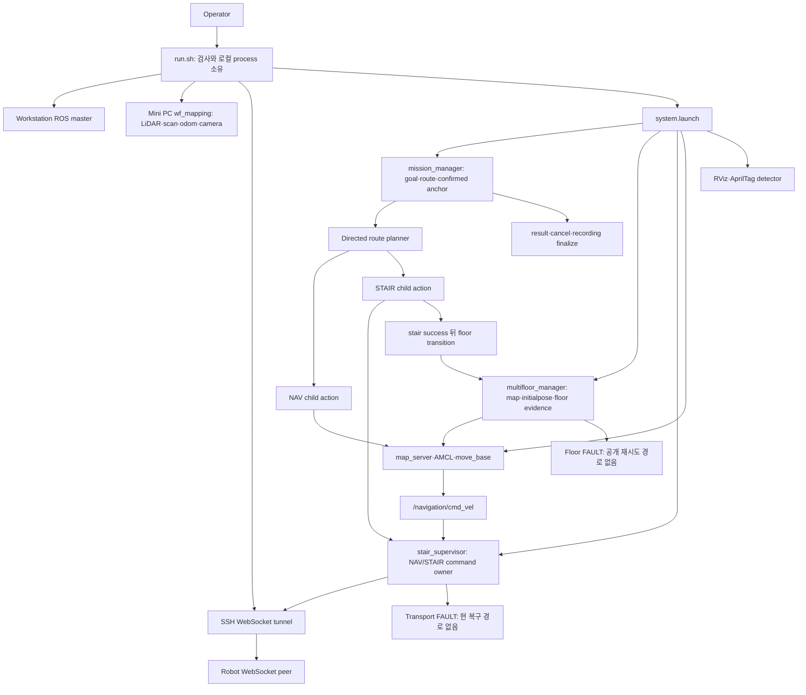

# Architecture, ownership, capability 범위

기준 root: `/home/m3tron/Desktop/TRON1_Control/TRON1_RViz_Navigation`. 아래 위치는 이 root 상대경로이며 클릭 가능한 원문 위치는 최종 보고서에 연결한다. 구현 선언은 OBSERVED, 현재 실행 graph 전체는 UNVERIFIED다. Mini PC의 외부 sensor stack은 repository-owned inventory에 포함하지 않는다. 이전 read-only SSH의 service/process 관찰은 특정 시점에 한정된다.

## Process/resource 소유권

복구 열은 코드가 제공하는 현 경로와 제안을 구분한다. 아래 시작/종료 명령은 이번 감사에서 실행하지 않았다. 코드에 좁은 복구 명령이 없으면 없다고 표시하며 임의의 kill/restart 절차를 만들어 내지 않는다.

| Resource | 시작 / 종료 주체 | health·실패 감지 | 자동복구·수동복구·영향 범위 | 근거 |
|---|---|---|---|---|
| ROS master | run.sh roscore / run.sh trap | startup PID와ROS조회 | 사후 자동재시작 없음. 현 운영 wrapper 재실행은 전체범위. master 장애는 discovery/parameter/새 연결에 영향을 주며 기존 TCPROS 통신의 즉시 중단을 보장하지 않음 | run.sh:198–220,382 |
| Mini PC wf_mapping | run.sh의SSH/tmux / 원격restart branch | reuse시각topic5초내1message | camera1개실패도전체sensor재시작. 로컬Ctrl+C에는잔류. 좁은복구명령은repo미제공 | run.sh:224–225 |
| /scan | 외부wf_mapping의converter | startup freshness+publisher정확히1개 | 실제외부publisher감시/재시작은미검증 | system.launch:30;run.sh:354–368 |
| /tron/wheel_odom_raw | 외부odombridge | startup메시지,stairgap검사 | flat중지지연은TF/AMCL연계조건부;bridge단독복구repo미제공 | run.sh:225;stair_evidence.py:96–156 |
| AprilTag detector/relay | system.launch/apriltag.launch / roslaunch | 중복검사+tag메시지 | detector3초respawn,relay는미설정. camera실패가globalstartup차단 | apriltag.launch:21;run.sh:228–234,360 |
| map_server | navigation.launch / roslaunch | map관측+identity | respawn없음. 기존지도교체는multifloor서비스경로. 복구는기존state재관측설계필요 | navigation.launch:13;ros_callbacks.py:36–59 |
| AMCL | navigation.launch / roslaunch | pose/TF와전이evidence | respawn없음. nomotion은전이경로에존재,stair진입획득에는없음 | navigation.launch:18;multifloor ros_node.py:261–281 |
| move_base | TF wrapper 후 roslaunch / roslaunch | 시작TF,action연결,costmap | respawn없음. childresult무한대기시부모BUSY. 같은executor내bounded재시도필요 | navigation.launch:47;navigation_executor.py:290 |
| /navigation/cmd_vel | move_base / node수명 | supervisor0.25초수신신선도 | fresh입력은NAV내자동재개;solepublisher/인증경계는별도 | navigation.launch:49;supervisor.py:95–112 |
| Robot WebSocket | stair_supervisor가session,run.sh가tunnel / 각owner | sendoutagebudget·mode응답 | budget내일시오류허용,초과FAULT후reconnect없음. 현node재생성범위;펌웨어zero보장미검증 | robot_transport.py:81–98,185–189;run.sh:237–243 |
| mission_manager | system.launch / roslaunch | action접속,floor/supervisor상태 | 정상terminal후다음goal가능. child대기에는deadline없음 | mission_action_server.py:82,134–154 |
| multifloor_manager | system.launch / roslaunch | map/tag/AMCL/scan/odom/costmap | 실패후FAULT;공개READY복귀없음. 전체missionsegment에영향 | ros_node.py:115–121,199–208 |
| stair_supervisor | system.launch / roslaunch | stateheartbeat,mode/transport | FAULT시timer정지;reset/reconnect공개API없음 | stair ros_node.py:145–151 |
| RViz | system.launch(rviz 옵션) / roslaunch | readiness필수아님 | 종료자체로NAV중단안함. 단시작wrapper의helper잘못된node이름/RPC대기는B-04 | system.launch:81;wait_for_tf_exec.sh:20–25 |
| astra-web.service | 외부MiniPCuser service / 외부serviceowner | 이전read-onlysystemctl조회 | active/enabled관찰. 실제제어동시소유는미확인;run.sh조정계약없음 | phase-C-continuation.md runtime관찰;docs/mini-pc-stack-switching-ko.md |

구현된 명령 중재 범위는 supervisor 내부 NAV/STAIR state와 epoch다. 공개ROSpeer나외부Astra/SDK의실제기체명령까지상호배타임을입증하지못했다(C-10/security). action의stair_ownership_epoch선언만으로서버검증이생기지않는다.

일반 launch child는 required/respawn이 기본 false다. 개별 child 사망이 top-level roslaunch 종료를 뜻하지 않으며 wrapper는 system roslaunch PID만 기다린다. AprilTag detector의 명시적 respawn은 예외다. 설치 ROS `roslaunch/core.py:432–434`, `pmon.py:560–625`, `rospy/impl/tcpros_base.py:666–700`을 대조했다. mode 시작은 STAND 응답 성공을 확인하며, WALK/STAIR에만 후속 상태 확인이 있다. zero 송신은 실물 정지 증명이 아니다.

## Topic와freshness

| Topic | 기능·publisher → subscriber | 실제gate/누락 영향 | 무관한기능차단·증거 |
|---|---|---|---|
| /scan | 외부converter → AMCL/localcostmap/floor | startup5초1message;floor0.5초;costmapexpected_update_rate미지정 | startup전체;운용중scan-current공백D-01. run.sh:225,354;readiness.py:35;local_costmap_params.yaml:14 |
| /livox/lidar | 외부LiDAR → converter/recorders | startup 수신;capture필수 | camera와같은센서묶음재시작. 외부driver동작미검증 |
| /livox/imu | 외부LiDAR → 기록/외부stack | production scan profile은다른/tron/imu경로를요구 | 실제topic불일치녹화실패후보. scan_profiles.yaml:9;외부launchreceipt |
| camera image | D435 → relay/detector/capture | startup수신필수 | FLAT_NAV도차단B-01;capture/video관측은실물제어증거아님 |
| camera info | D435 → detector | startup및capturetopic | camera부재와같은전역결합 |
| /tag_detections | detector → floor/capture | startup메시지존재;전이3회/1초window/0.5초age/10초timeout | 빈array도startup통과가능;일반복도tag미검출=항상NAV금지가아님 |
| /tf,/tf_static | AMCL/외부odom/static → TF소비자 | costmap0.5초;AMCL관용0.3초;wrapper는map문자열 | 정확한chain/freshness와문자열등록을구별. stale시NAVfalse-stop가능 |
| /amcl_pose | AMCL → mission/floor | floor/entry3표본,0.5초age,covariancexx/yy≤0.05,yaw≤0.10 | 정지후새표본스스로획득못하면entry실패C-08 |
| global costmap | move_base → floor | targetframe/resolution/size/origin일치+epoch후관측 | floor전이최종gate;동일metadata가실물안전의증거아님 |
| /tron/wheel_odom_raw | 외부bridge → move_base/mission/floor/stair | floor0.5초·0.01m/s/0.02rad/s정지;stairage0.2초·gap0.12초 | 단한gap으로stairFAULT;자동회복없음B-02/C-04. flat의별도odom-freshness보장아님 |
| /navigation/cmd_vel | move_base → supervisor | NAVstate+epoch+finite+0.25초 | stale는zero,새명령으로NAV내회복. transportfault와구별 |
| /multifloor/floor_state,/stair_supervisor/state | 각각owner → mission | receipt2초;floorREADY·supervisor정상 | segment진입전검사;child실행내지속health를대체하지않음 |

freshness값은repository기본설정이며liveparameter측정이아니다. 근거: mission ros_runtime.py:75–87,ros_state.py:151–185; multifloorreadiness.py:35–43,tag_evidence.py:87–92; stairprofile:18–21; run.sh:348–369. 과거bag의header와record gap은수신callback과다르므로임계자동완화에사용하지않는다.

## Capability 최소dependency와현결합

| Capability | 정상작업에필요한최소dependency | 현재불필요하거나과도한결합 | 최소방향 |
|---|---|---|---|
| FLAT_NAV | 유효map/pose·scan·odom/TF·planner·단일commandtransport | camera/tag stream,모든floor/stair/scan설정,RViz설치 | 기존check함수에요청capability범위를전달 |
| STAIR_TRAVERSAL | 검증한방향별profile·entry정렬·정지/지지/진행evidence·commandhandoff | phase이름을지지증명대신사용;flatAMCL표본생산계약미연결 | 기존LANDING/TURN과entry획득보강 |
| FLOOR_TRANSITION | targetidentity/tag정책·mapservice·AMCL/scan/odom/TF·costmap·현재ownerhandoff | 이미확정한floor사실10초만료,복구불가FAULT | 같은epoch의사실과연속신선도를분리 |
| APRILTAG_LOCALIZATION | camera/info/detector·태그좌표/층관계·TF | tag를NAV의항상필수입력으로사용 | 태그기반획득/층전이에한정 |
| RECORD_ROUTE | 이동route/return+선택관측topic·저장공간·recorder | 자신의미래mission/result필수,없는IMUtopic | 결과는sidecarmanifest로연결;센서의무집합정정 |
| INSPECT | 도착지route+해당scanprofile | 동일recorder순환조건,무관capability전역검사 | scan시작시해당dependency만검사 |
| RVIZ_ONLY | 관측할ROSgraph/TF·display | run.sh는전체system을시작하는표면 | 기존RViz단독관측표면명확화;robottransport불필요 |

이는새subsystem제안이아니다. 같은run.sh/기존3node의검사범위·service/action경계를정리하는방향이다.
