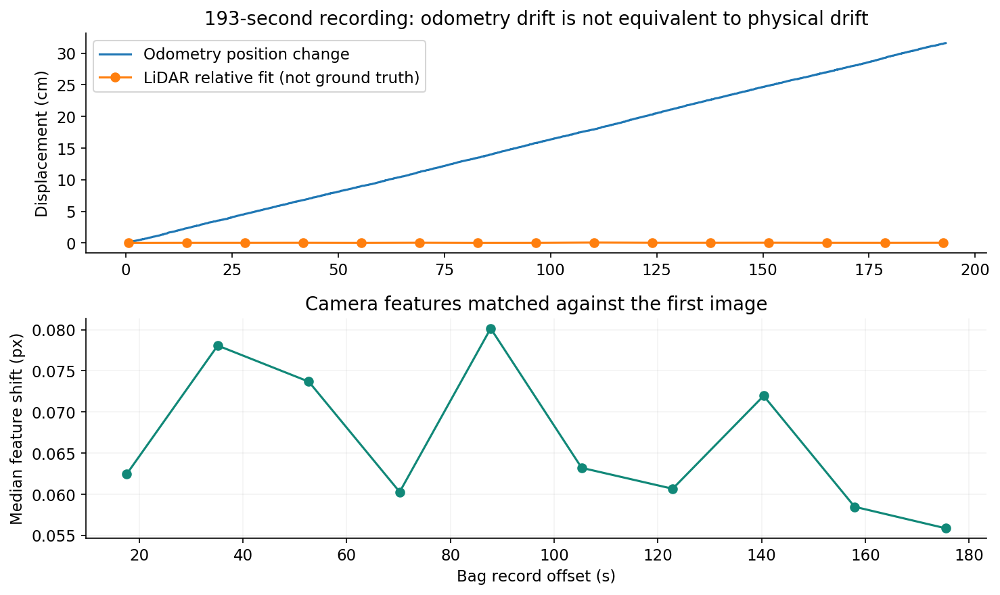
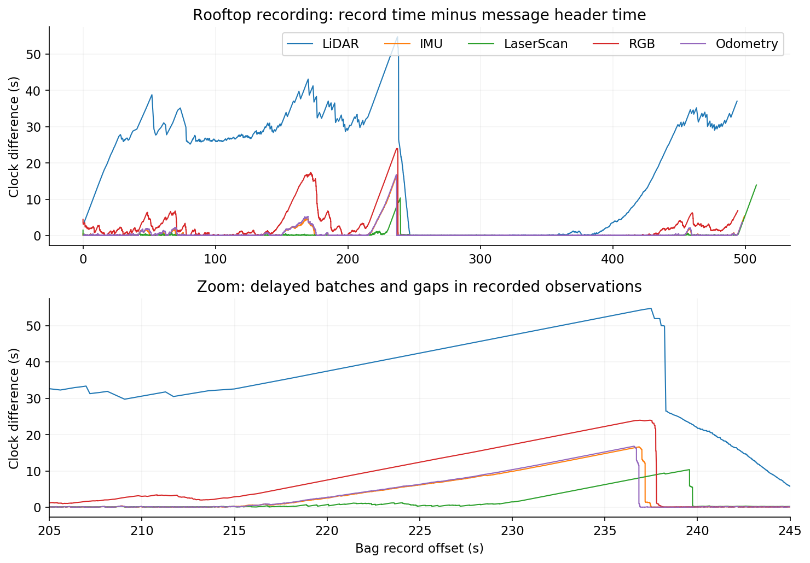
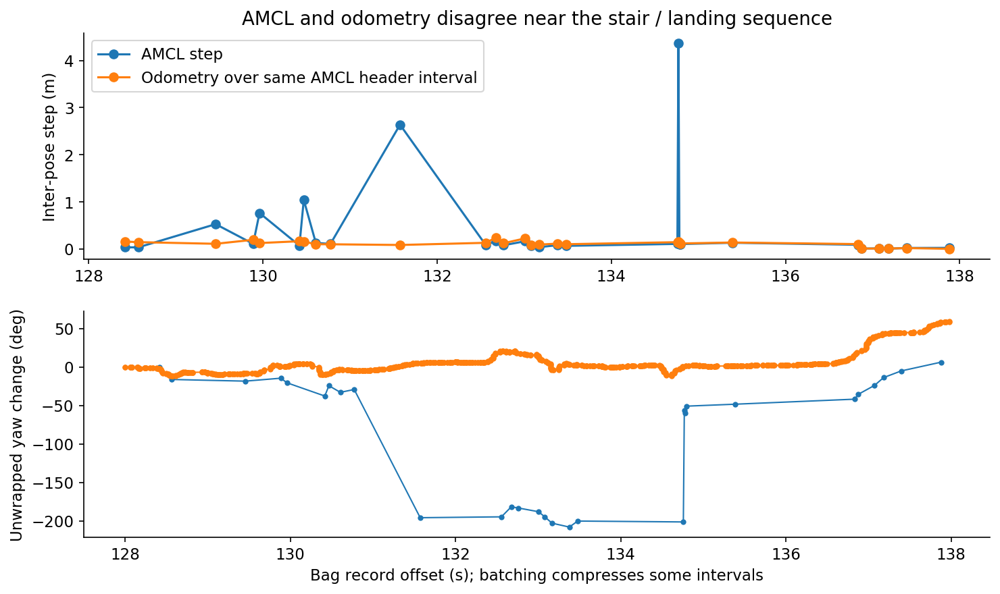
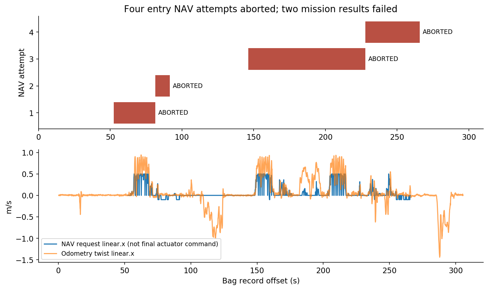

# TRON1 기록 센서 분석

2026-09-18 · 오프라인 원본 분석 · 현재 저장소의 기록 62개

**가장 중요한 결과는 “위치값이 변했다”와 “로봇이 밀렸다”를 구분해야 한다는 것입니다.** 약 193초 기록에서 odometry는 31.6cm 변했지만, LiDAR 형상과 카메라 특징점 변화는 작아 31.6cm의 실제 이동을 뒷받침하지 않았습니다. 이 상태에서 odometry만으로 원위치 복귀를 걸면 불필요한 보정 주행을 만들 수 있습니다. 다른 기록에는 AMCL의 큰 위치·방향 변화, 센서 기록 지연과 관측 공백, 계단 진입 NAV 실패도 직접 남아 있습니다.

이번 결과는 기존 감사의 **센서 기록 후속 분석**입니다. 원래 15개 E2E 시나리오의 코드 감사 판정이나 전체 constraint ledger를 대체하지 않으며, 실장비 E2E를 새로 실행한 결과도 아닙니다. 기존 감사는 [전체 감사 보고서](../audit-tron1-20260918/FINAL-AUDIT.md), 개선안은 [구현 계획](../tron1-web-mission-plan/IMPLEMENTATION-PLAN-DRAFT.md)에 있습니다.

## 분석 범위와 방법

현재 저장소 `/home/m3tron/Desktop/TRON1_Control/TRON1_RViz_Navigation`의 모든 bag·동영상 검색 결과를 대조했습니다. 원본 bag 21개 약 27.39GB, 동영상 1개, 기존 JPEG 36개, capture JSON 4개가 분석 대상입니다. 다른 복제 저장소의 중복 파일은 범위 밖입니다.

**OBSERVED:** bag 메시지 **2,360,693개**를 순차로 읽었고, 21개 모두 인덱스 수와 실제 읽은 수가 일치했습니다. 숫자·상태 메시지를 역직렬화하고 LiDAR **569,099,136포인트**의 XYZ 유한성·payload 길이를 검사했습니다. XYZ의 NaN/Inf는 0개였습니다. 압축 영상은 모든 메시지의 외형과 시간을 읽고, 선택한 RGB **208프레임**을 디코딩·시각 검토했습니다. 압축 이미지 전 프레임의 픽셀 디코딩을 검증했다는 뜻은 아닙니다. MP4는 **280프레임 전체 디코딩**, 12개 시점 시각 검토를 했습니다. 기존 JPEG 36개도 확인했습니다.

대상별 상태와 읽은 범위는 [coverage 원장](coverage.csv), 토픽별 간격·시각 차이·발행 노드는 [bag별 자료](bag-index.html), 재현 가능한 계산은 [분석 방법과 데이터 형식](METHODS.md)에 있습니다. 본문의 `FULL_…`, `UP_…` 파일명은 공통 접두사 `stair_3F_to_4F_`를 생략한 표기입니다. 시각 `+t`는 각 bag의 첫 저장 시각부터 센 초입니다. `header` 시각은 메시지에 쓰인 값이며 실제 하드웨어 측정 시각과 항상 같다고 보장하지 않습니다.

증거 등급: **OBSERVED** 직접 읽은 기록·설치 소스·계산값, **INFERRED** 여러 근거를 연결한 해석, **UNVERIFIED** 외부 기준이나 실장비 확인이 필요한 주장. S/M은 확률이 아닌 영향 등급이며 기존 감사와 같습니다. S4 충돌·추락·소유권 상실 가능성, S3 위험 명령, S2 안전 여유 부족, S1 낮은 간접 영향, S0 확인된 안전 영향 없음. M4 핵심 임무 실패, M3 복구 고착, M2 특정 기능 영향, M1 간접 영향, M0 확인된 주행 영향 없음.

## R1. 위치 유지에는 odometry와 독립된 이동 확인이 필요합니다

**Safety: S3 · Mobility: M2**

**OBSERVED:** `manual-5F-rooftop_route_1788918199558502114.bag.active.invalid`에서 193.04초 동안 odometry 시작·끝 차이는 **0.31597m**입니다. 조이스틱 96,429개 중 96,230개가 전 축·버튼 0이고, 비중립 입력은 +2.542~3.640초에만 있습니다. 조이스틱 전체 header 시각은 0입니다. 이 bag에는 최종 주행 명령 기록이 없으므로 “무명령”을 증명하지는 않습니다.

동일 기록의 시작·끝 근처 LaserScan을 0.7초 구간별 거리 중앙값 형상으로 묶어 대조하면 상대 위치 최적합은 **0.00023m**, 점 대응 잔차 중앙값은 **0.00259m**입니다. 서로 다른 초기값 7개에서 같은 해로 수렴했습니다. 15개 중간 시점도 거의 같은 형상을 보입니다. 카메라 +0초와 +175.492초의 특징점 69개 대응에서 이동 중앙값은 **0.056픽셀**입니다. 이 수치는 로봇 위치를 0.23mm 정확도로 측정했다는 뜻이 아닙니다.

**INFERRED:** 이 구간에서는 약 32cm의 실제 이동보다 **odometry 누적 오차**가 주된 설명입니다. 짧은 별도 기록 `…1788917683773755895.bag`에서도 22.13초 동안 odometry 3.66cm 변화와 거의 고정된 LiDAR·영상의 같은 경향이 나옵니다. odometry와 그것을 복사한 `odom→base_Link` TF는 독립 검증 두 개가 아닙니다.

**2026-09-20 근거 독립성 보완 — OBSERVED:** 현재 [scan 변환 코드](/home/m3tron/Desktop/TRON1_Control/tron1-control-center/sensor_integration/src/mid360s_laserscan.py:194)와 [연결 설정](/home/m3tron/Desktop/TRON1_Control/tron1-control-center/sensor_integration/launch/wf_mapping.launch:30)을 확인하면 `/scan`의 움직임 왜곡 보정에 raw odometry가 사용됩니다. 따라서 위 scan 정합은 raw odometry와 완전히 독립된 검증이 아닙니다. 수치와 별도 RGB 관측은 유지되지만, 실제 변위의 확정에는 raw LiDAR와 외부 실측 대조가 추가로 필요합니다. R1의 원인 해석은 계속 INFERRED이며 실제 밀림은 UNVERIFIED입니다.

**OBSERVED:** `FULL_20260916_210849.bag`에서는 279.55초간 기록된 `request_twist` **11,253개가 모두 x/y/z=0**입니다. 송신 기록 간 최대 간격은 0.0337초입니다. 현재 코드의 이 토픽은 WebSocket send가 반환한 뒤 남깁니다. 그동안 카메라 장면이 변하고 odometry는 0.798m 변했습니다. 그러나 이 기록의 시작·끝 scan 정합은 잔차가 커서 **이동 거리 추정에 사용하지 않았습니다**.

**UNVERIFIED:** 로봇의 실제 밀림 거리, 무게중심·바퀴 미끄러짐·자세 조절 중 어느 원인이었는지, 다른 제어 경로 개입 여부, 수신 측의 실제 명령 수행 여부는 확정할 수 없습니다. “zero 송신”과 “물리적 위치 유지”는 별도 검증 대상입니다.

**개선:** HOLD 목표는 고정해 두되, odometry 변화만으로 보정하지 않습니다. 주변 LiDAR/시각 기준과 시간 연속성이 실제 이탈을 지지할 때 기존 command owner가 제한된 보정을 수행하도록 설계해야 합니다. 미결 조건은 보정을 시작할 이탈 거리, 보정을 끝낼 복귀 거리, 원래 방향도 복구할지입니다. 이 값은 사용자 선택과 독립 실측을 거쳐 정합니다. 최종 명령 송신은 기존 stair supervisor가 맡는 구조를 기준으로 검토합니다.

[수치와 정합 결과](drift-cross-check.json)

## R2. 센서 지연·관측 공백과 물리적 급이동을 혼동하면 안 됩니다

**Safety: S3 · Mobility: M3**

**OBSERVED:** 옥상 기록 `manual-5F-rooftop_route_1788920816079496577.bag.active.invalid`의 전체 508.44초에서 다음이 확인됩니다. 최대 저장 간격과 최대 header 간격은 서로 다른 구간에서 발생할 수 있습니다.

| 토픽 | 최대 저장 간격 | 최대 header 간격 | 저장 시각 − header 최대 |
|---|---:|---:|---:|
| LiDAR CustomMsg | 19.011초 | 23.500초 | 54.790초 |
| IMU | 5.374초 | 10.554초 | 16.624초 |
| LaserScan | 13.323초 | 4.999초 | 13.933초 |
| RGB | 8.821초 | 9.841초 | 23.978초 |
| odometry | 4.543초 | 10.390초 | 16.802초 |

**OBSERVED:** +236.837846→236.837980초에 저장된 두 odometry는 위치가 **1.919m** 차이 납니다. 저장 간격은 **0.000134초**지만 header 간격은 **10.390초**입니다. “0.13ms 동안 1.9m를 이동했다”는 해석은 틀립니다. +236.646527초에 저장된 RGB의 header는 +212.759590초로, 두 시각이 약 23.89초 벌어져 있습니다.

**OBSERVED:** 제공된 `sensor_gap_rgb_214_242.mp4`는 `NO RGB DATA`, 마지막 프레임 나이, outage 표시가 들어간 **분석용 합성 영상**입니다. 비어 있는 구간을 동일 화면으로 채우므로 멈춘 화면을 물리적 정지 증거로 쓸 수 없습니다. 새 센서 관측이 추가되는 독립 카메라 기록도 아닙니다.

**INFERRED:** 이 기록에는 오래된 데이터의 묶음 도착과 기록상 관측 공백이 함께 있습니다. 측정·발행·전송·저장 중 어느 단계에서 메시지가 빠졌는지는 확정하지 않았습니다. **UNVERIFIED:** 원인이 무선망인지, 기록 프로세스·큐의 밀림인지, 시계 문제인지까지 bag만으로 분리하지 못했습니다. 위 시각 차이를 모두 네트워크 지연으로 해석하지 않았습니다.

**OBSERVED:** 별도 `FULL_20260916_231643.bag`는 `/scan`, 동적 `/tf`, odometry가 없고 `scan.no_publish stale_odometry` 경고 79회, odom 접속 timeout 7회가 남습니다. 시작 직후의 LiDAR header 52.76초 점프는 과거 시각 데이터에서 현재 데이터로 넘어가는 경계이므로, 기록 중 52초 연속 LiDAR 단절이라고 세지 않았습니다. `FULL_20260916_234018.bag`에는 odom 원시 시각과 수신 시각이 약 59초 달라 **수신 시각으로 대체한다는 로그**도 있습니다.

**개선:** 기존 bridge·recording 경계에서 원시 시각, 수신 시각, 저장 시각, 시각 대체 여부를 보존해야 합니다. 과거 묶음 자료로 HOLD 이탈·계단 도착을 판정하지 말고, 영향받은 동작의 관측을 다시 확립하는 복구를 설계합니다. 단순히 timeout을 크게 늘리거나 무관한 기능까지 정지시키는 방식으로 해결하지 않습니다.

[정확한 구간과 시각](rooftop-gap-details.json)

## R3. 큰 AMCL 보정은 확인됐지만, 모든 변화가 자동 오인식은 아닙니다

**Safety: S3 · Mobility: M2**

**OBSERVED:** `UP_20260827_103313.bag`의 저장 시각 +134.758131→134.769875초에서 AMCL 위치는 **4.363m** 변합니다. AMCL header 간격 0.30005초에 맞춘 odometry 변화는 **0.15668m**입니다. 이전 AMCL 방향과 odometry 상대 이동으로 예측한 위치와의 불일치는 **4.518m**, 상대 방향 불일치는 **152.56°**입니다. 이는 odometry를 진실로 선언한 수치가 아니라 두 추정의 불일치입니다.

`UP_20260827_102101.bag` +183.263→183.528초에서도 AMCL 3.969m, 대응 odometry 0.159m 변화가 나옵니다. 이 기록들은 계단·엘리베이터 장면을 포함합니다. 기록된 지도와 실제 층의 관계, 기록하지 않은 초기화 개입까지 완전히 확정할 수 없어 “직사각형 사무실의 반대 모서리 오인식”과 동일한 사건이라고 단정하지 않습니다.

**반례 확인:** `UP_20260827_103200.bag`의 약 3.15m 변화 직전에는 +28.766초 `/initialpose` 입력이 실제로 있습니다. 이후 +34.263초에도 다시 입력됩니다. 첫 변화 직후 covariance가 작다는 사실을 자동 오인식의 증거로 사용하지 않았습니다. 다른 bag에 `/initialpose`가 없다는 것도 실제 재초기화가 없었다는 증명은 아닙니다.

**INFERRED:** 현재 층·지도·위치 초기화 사건과 위치 연속성을 함께 관리하지 않으면, HOLD가 재위치추정을 실제 밀림으로 오해하거나 NAV가 틀린 기준에서 출발할 위험이 있습니다. **UNVERIFIED:** 사용자께서 겪은 특정 사무실 오인식의 원인은 이번 데이터만으로 확정되지 않았습니다.

**개선:** 사용자 층 선택 시 지도와 초기 위치의 세대를 함께 바꾸고, 태그의 측량된 위치·방향 또는 사용자 위치 확인 등 별도 기준으로 대칭 후보를 구분합니다. 위치가 불연속적으로 바뀐 구간만 재확인 대상으로 삼고, covariance 하나나 “새 pose 3개”를 정답 증명으로 사용하지 않습니다. 안정적으로 위치가 확인된 일반 NAV에 항상 태그를 요구하는 조건은 추가하지 않습니다.

[AMCL–odometry 비교와 초기화 표시](amcl-odom-disagreement.json)

## R4. IMU의 단위와 자세 유효성 계약이 맞지 않습니다

**Safety: S2 · Mobility: M2**

**OBSERVED:** IMU가 있는 18개 bag, **822,166개 메시지 모두 orientation quaternion이 (0,0,0,0)**이고 orientation covariance 첫 항은 0입니다. 가속도 크기 중앙값은 bag별 약 **0.999~1.004**입니다.

**ROS upstream 계약:** 설치된 [sensor_msgs/Imu.msg](/opt/ros/noetic/share/sensor_msgs/msg/Imu.msg)는 가속도를 m/s²로 정의하고, orientation을 제공하지 않으면 covariance 첫 항을 -1로 표시하도록 명시합니다.

**설치된 드라이버:** [lidar_imu_data_queue.h:40](/home/m3tron/catkin_ws/src/livox_ros_driver2/src/comm/lidar_imu_data_queue.h:40)는 입력 가속도를 g 단위로 명시하며, [lddc.cpp:493](/home/m3tron/catkin_ws/src/livox_ros_driver2/src/lddc.cpp:493)는 이를 그대로 ROS 필드에 복사합니다. 기록값은 이 동작과 일치합니다. 현재 설치 소스가 모든 과거 기록 당시 실행 바이너리와 동일하다는 provenance는 없습니다.

**INFERRED:** 이 값을 그대로 표준 m/s²로 해석하거나 0 quaternion을 유효한 자세로 사용하면 자세·가속도 분석이 잘못됩니다. **UNVERIFIED:** 이것이 현재 NAV 실패의 원인이라는 증거는 없습니다. 현재 stair supervisor는 [ros_node.py:126](/home/m3tron/Desktop/TRON1_Control/TRON1_RViz_Navigation/src/stair_supervisor/src/stair_supervisor/ros_node.py:126)에서 odometry x/y/yaw를 사용합니다. 기록된 모든 odometry가 z·quaternion x/y=0인 평면 출력이므로, 그 메시지만으로 실제 계단 기울기나 몸체 자세를 검증할 수도 없습니다.

**개선:** 원본 값은 보존하고 기존 수신·분석 경계에서 명시적으로 단위를 처리합니다. 실제 소비자가 이미 g→m/s²를 보정하는지도 확인해 이중 변환을 피해야 합니다. 유효하지 않은 orientation은 사용하지 않고, 자세 추정이 필요할 때만 별도의 검증된 경로를 계획합니다. 임의로 새 센서 노드를 추가하지 않았습니다.

[전체 bag 센서 통계](all-bag-statistics.json)

## R5. 최근 FULL 기록은 자율 계단 성공을 입증하지 않습니다

**Safety: S2 · Mobility: M4**

**OBSERVED:** `FULL_20260916_234018.bag`에서 같은 계단 진입 목표 `(10.054808, -6.652934)`로 보낸 move_base 목표 **4개 모두 status=4**, 결과 문구는 oscillation으로 인한 실패입니다. 두 상위 mission도 모두 실패했습니다.

| NAV 시도 | 시작 +초 | 종료 +초 | 결과 |
|---|---:|---:|---|
| 1 | 52.560 | 81.361 | oscillation abort |
| 2 | 81.374 | 91.575 | oscillation abort |
| 3 | 146.174 | 227.774 | oscillation abort |
| 4 | 227.787 | 265.787 | oscillation abort |

같은 기록에서 supervisor는 `navigation owns commands`, floor state는 `3F / map_generation=0`입니다. 계단 모드 전환과 목표 층 도착 성공을 확인하지 못했습니다. RGB에는 실제 장면 변화가 있고 NAV 명령도 있으므로 “전혀 움직이지 않았다”는 뜻은 아닙니다.

**OBSERVED:** 예전 UP·수동 기록에는 계단, 계단참, 다른 공간으로 이어지는 영상이 있습니다. 일부 UP 파일은 엘리베이터 이동 장면도 포함합니다. 파일명으로 이동 경로나 자율성을 판정하지 않았습니다. `UP_20260827_150034.bag`의 태그 401 검출은 3회, 저장 시각 +126.009~126.113초의 짧은 구간입니다. 단독 검출로 도착 후 장시간 위치 유지나 층 전이 성공을 증명할 수 없습니다.

**UNVERIFIED:** 네 차례 oscillation 실패의 단일 근본 원인, 당시의 정확한 controller 설정·최종 송신 명령·수동 개입 조합, 자동문·촬영·이메일·승인 복귀 E2E 성공은 이 자료에 없습니다. bag 이름과 현재 설정만으로 당시 실행 상태를 복원하지 않았습니다.

**개선:** 우선 하나의 평지 출발점→계단 진입 NAV를 재현 가능한 기준 사례로 복구하고, 그다음 계단 supervisor, 층 전이, HOLD, 사진·문·메일·승인 복귀를 단계적으로 붙이는 순서가 맞습니다. NAV 요청, 최종 송신, owner, 실제 이동을 같은 mission ID와 시간축으로 남겨 실패 지점을 분리해야 합니다.

[목표·결과·상태 증거](action-state-evidence.json)

## 개선 계획에 반영할 최소 범위

아래는 **설계 제안**이며 현 코드나 노드를 수정하지 않았습니다. NARROW는 조건의 적용 범위 축소, TUNE은 관측에 맞춘 조정, UNVERIFIED는 근거 미확인입니다. KEEP은 현재 조건의 필요성과 최소 범위가 입증된 경우에만 쓰며, 이번에는 부여하지 않았습니다.

| 대상 | 판정 | 바꿀 범위와 복구 방향 |
|---|---|---|
| odometry 단독 HOLD 이탈 판정 | NARROW | 실제 이탈을 독립 관측이 지지하는 구간만 보정. 관측 회복 시 같은 목표를 재평가하고 새 이동 명령은 기존 owner 규칙으로 인계 |
| 오래된 센서 묶음과 gap | TUNE | 센서·동작별 시간 예산과 시각 provenance. 과거 데이터로 완료 판정하지 않으며 회복 뒤 재관측; 전역 영구 FAULT를 추가하지 않음 |
| 층 선택·AMCL 불연속 | NARROW | 지도·pose 세대가 바뀌는 경계와 불일치 구간에만 위치 확인. 정상 평지 NAV의 상시 태그 요구 없음 |
| IMU 단위·orientation | TUNE | 소비 경계의 명시적 단위 처리와 unavailable 표시. 계단 자세 추정의 실측 검증 전 수치 임계값 확정 안 함 |
| 계단 도착·정지 확인 | UNVERIFIED | 평면 odometry·짧은 태그 검출 외 독립 도착/정지 근거 필요. 실측 완료 전 새 통과 조건 확정 안 함 |
| 카메라·메일·문 기능 실패 | NARROW | 기존 구현 계획에서 이어받은 설계 범위이며 이번 bag에서 해당 실패를 확인한 것은 아님. 해당 촬영·전송·문 통과 단계의 재시도 범위로 한정. 문 개방 확인이 없는 경우 실제 문 통과 단계는 별도 확인 필요 |

다음 검증의 첫 단위는 동일 층의 확인된 출발 pose에서 계단 진입 pose까지의 NAV입니다. 성공 판정에는 action 성공 결과와 독립 관측으로 확인한 실제 도착이 모두 필요하며, NAV 요청·최종 송신·owner·map/floor 세대·센서 시각을 함께 기록해야 합니다. 진입 허용 오차와 반복 횟수는 현재 제어 설정·현장 측정으로 정할 미결 항목입니다. 이후 HOLD와 계단 검증으로 이어지는 구체적인 변경 소유자는 [구현 계획](../tron1-web-mission-plan/IMPLEMENTATION-PLAN-DRAFT.md)을 따릅니다.

**Safety verdict:** 기록만으로 현재의 정확한 전역 위치, 물리적 정지, 계단 도착 후 유지가 보장됐다고 판정할 수 없습니다. 이번에 새로 발생시킨 실장비 위험 동작은 없습니다.

**Mobility verdict:** 최근 기록에서 계단 진입 NAV 실패는 직접 확인됩니다. 불필요한 gate를 줄이는 작업과 함께 시각·odometry 신뢰성·초기 위치 확립을 먼저 해결해야 합니다. 새 UI 기능만 연결하거나 모든 timeout을 늘리는 것으로 요청한 임무가 완성되지는 않습니다.

## 완료와 원본 보존

`.active.invalid` 두 개는 각각 **189,050개 / 463,540개 메시지**를 끝까지 읽었습니다. 두 sidecar는 `complete=false`, `missing_required=[]`이며 “최종 .bag 산출물을 찾지 못함”을 기록합니다. 읽을 수 있다는 사실이 녹화 종료 절차의 성공이나 녹화 중 센서 무누락을 뜻하지는 않습니다. 원본 reindex·repair·rename은 하지 않았습니다.

최종 coverage는 **62 = READ 62 + METADATA_ONLY 0 + EXCLUDED 0 + UNREAD 0**입니다. READ의 이미지 검사 범위는 앞의 방법과 원장에 명시했습니다. [원본 SHA-256](original-sha256.json), [보존·정리 확인](preservation-check.json), [검증 기록](quality-review.json)에서 확인할 수 있습니다. 원본 크기·수정 시각과 Git 상태를 전후 대조했고, 분석용 임시 로그·캐시를 제거했습니다. 남긴 그래프·추출 영상·계산 데이터·재현 스크립트는 이 보고서의 의도된 산출물입니다.

**이번 오프라인 기록 분석 완료. 실장비 자동 운용 승인이나 기존 전체 감사의 재실행 완료를 뜻하지 않습니다.**
