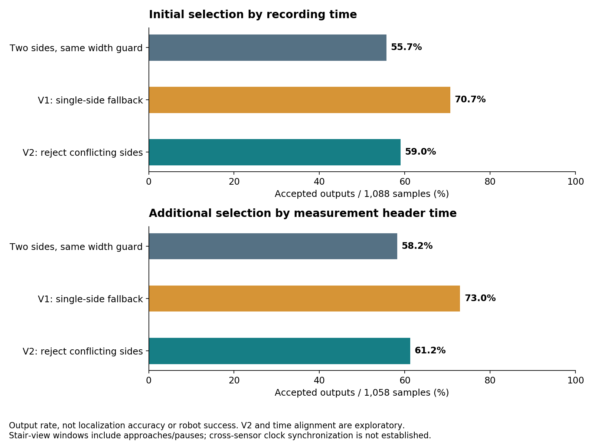
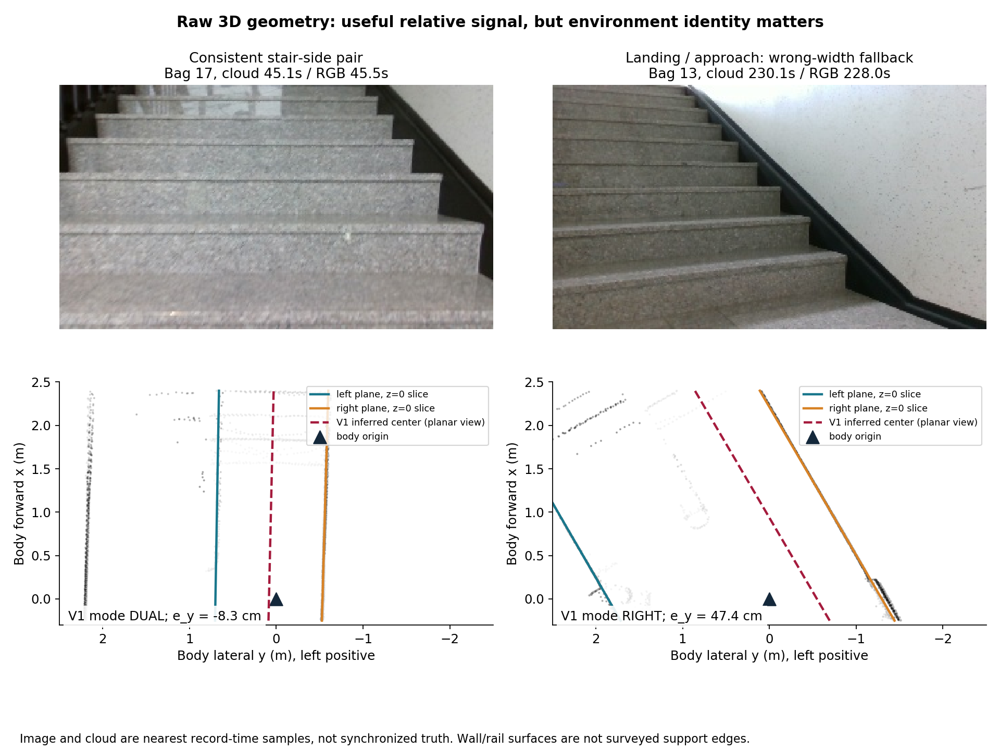
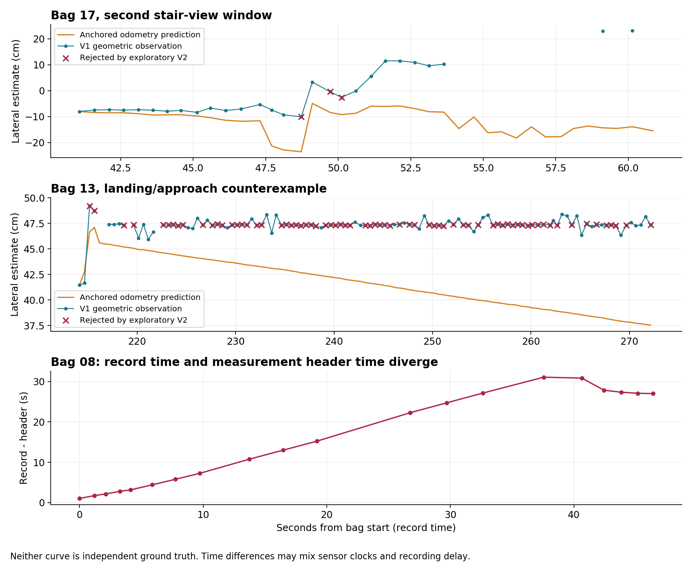
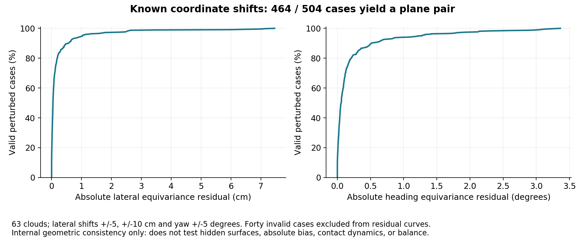

# 계단 상대 측위·중앙 유지: 설계와 기존 bag 실험

2026-09-21 · 기록 기반 분석 완료 · 실장비 중앙 유지·균형 제어는 UNVERIFIED

**기존 LiDAR로 계단 양옆 형상에 대한 좌우 위치·방향을 계산하는 것은 가능했습니다. 그러나 이 신호만으로 계단 전체를 정확히 측위하거나 균형까지 유지할 수 있다는 증거는 없습니다.** 기존 `stair_supervisor` 안에 작은 관측·보정 모듈을 넣는 방향은 유지하되, 먼저 명령을 보내지 않는 관측 모드로 적용하는 것이 이번 결과에 맞습니다.

**분석용 V1/V2 구현과 기존 bag 평가를 완료했습니다. 운용 ROS 코드 통합과 실장비 명령 송신은 실행하지 않았습니다.**

**실제 중앙 이탈이 몇 % 줄어드는지는 기존 bag으로 산출할 수 없습니다.** 확인한 개선은 추정값 산출 범위와 기하 계산의 일관성입니다. **V2의 양면 기준 대비 산출률 증가**는 기록 시각 대응에서 **3.3%p**, header 시각 대응에서 **3.0%p**입니다. 아래 59.0%·61.2%는 측위 정확도·계단 성공률이 아니며, 남은 오인식·시각 문제까지 해결한 비율도 아닙니다.

## 무엇을 직접 분석했나

**OBSERVED:** 기존 bag 21개를 모두 목록과 대조했습니다. 원시 LiDAR가 있는 18개에서 28,983개 패킷, 569,099,136개 포인트를 디코딩했고, 매 5번째 패킷의 점군 5,803개에 같은 공간 추정기를 실행했습니다. 개발용 bag 1개를 제외하고, RGB로 먼저 표시한 계단 장면 19구간의 1,088개 표본을 비교했습니다. 주석 구간 합계는 597.3초입니다.

**최초 비교는 영상의 기록 시각 구간에 저장된 LiDAR를 선택했습니다.** 기록 시각과 header 시각의 차이가 큰 자료도 1,088개 분모에 포함됩니다. 따라서 그 순간 영상과 같은 장면을 측정했다고 보장할 수 없습니다. 추가 진단에서는 RGB 주석 경계를 영상 header 시각으로 보간해 옮기고 LiDAR header로 선택했습니다. 같은 파라미터로 1,058표본이 선택됐습니다. 이 진단도 센서 간 시계 동기화 자체를 입증하지는 않습니다. odom 비교의 시간 필터는 최초 1,088개 산출률 분모에는 적용하지 않았습니다.

이 구간에는 접근·정지·계단을 바라보는 장면이 포함됩니다. 계단에 발이 실제로 올라가 있는 시점을 확정한 라벨이 아닙니다. 영상 주석은 약 5초 간격이며, **자동 계단 단계 판별기를 실행한 결과도 아닙니다.** 오래 정지한 표본들은 독립적인 계단 시험 횟수로 세지 않았습니다.

bag 상태는 **READ 19 + METADATA_ONLY 2 + EXCLUDED 0 + UNREAD 0 = 21**입니다. READ는 이번에 읽은 토픽·표본 범위를 뜻하며 모든 토픽의 모든 메시지를 새로 읽었다는 뜻이 아닙니다. LiDAR·RGB가 없는 yaw 보정 bag 2개는 원본 index와 기존 숫자 자료만 확인했습니다. [범위와 원본 상태](analysis-state.json), [bag별 결과](BAG-RESULTS.md), [재현 방법](METHOD.md)에 정확한 범위를 남겼습니다.

이번 작업은 [기존 감사](../audit-tron1-20260918/FINAL-AUDIT.md)의 후속 센서 실험입니다. 기존 15개 E2E 시나리오·전체 constraint ledger를 대체하거나 실장비 통과로 변경하지 않습니다.

## 수치로 확인한 결과

모든 수치는 **OBSERVED: 오프라인 실행 결과**입니다.

| 비교 항목 | 결과 | 의미와 제한 |
|---|---:|---|
| 양쪽 경계만 사용, 동일 폭 일관성 조건 | 606/1,088 = **55.7%** | 새 관측기의 비교 기준. 기존 로봇의 성공률 아님 |
| V1: 한쪽 경계 + 이전에 관측한 폭 | 769/1,088 = **70.7%** | 계단참·접근 구간의 모순된 추정도 포함 |
| V2: 양쪽 면이 보이면서 모순되면 한쪽 추정 금지 | 642/1,088 = **59.0%** | 기준 대비 **+3.3%p**, V1 대비 127개 추정 억제. 결과 확인 후 만든 탐색 수정안 |
| header 시각으로 다시 연결한 비교 | 양면 616/1,058 = **58.2%** → V2 648/1,058 = **61.2%** | **+3.0%p**. V1은 772/1,058 = 73.0%. 기하 파라미터 변경 없이 시각 선택만 변경 |
| 시간 공백을 채우지 않은 관측 시간 환산 | 300.3 → **317.7초** / 597.3초 | +17.4초. 표본당 최대 0.6초만 인정한 계산이며 제어 가능 시간 아님 |
| 알려진 좌우 이동·회전 주입 | **464/504건 추정 성공**, 40건 실패 | 서로 다른 63개 점군에 각 8가지 변형 |
| 성공한 주입 시험의 변화량 잔차 P95 | 좌우 **1.03cm**, 방향 **1.27°** | 동일 장면 좌표 변환에 대한 일관성. 실제 절대 측위 정확도 아님 |
| 주입 시험의 큰 불연속 | 성공 464건 중 **8건** | 잔차 5cm 또는 3° 초과. 실패 40건과 별도 |
| 기하 계산 시간 | 중앙값 **11.0ms**, P95 **15.6ms** | 현재 분석 PC, 5,803표본. 수신·변환·통신 제외, 로봇 PC 성능 미검증 |



V1의 약 15%p 증가는 그대로 채택할 수 없습니다. V2의 +3.3%p도 올바른 새 관측이 3.3%p 늘었다는 증명이 아닙니다. 127개는 **검출면 사이의 모순 때문에 배제한 출력 수**이지, 독립 정답으로 확인한 오인식 수가 아닙니다. 폭 검사 없는 원시 양면 쌍의 산출률은 69.4%였으며, 동일 조건 비교를 위해 표에서는 초기화·폭 검사를 함께 적용했습니다. [원시 비교](comparison.json), [수정안·강건성 결과](robustness.json).

최초 기록 시각 비교에서 정지 장면이 많은 두 구간은 257표본에서 173→177개, 나머지 831표본은 433→465개입니다. 나머지에도 접근·짧은 정지가 있으므로 순수 이동 중 성능이 아닙니다.

**RF 두 번째 상승은 시각 대응에 특히 민감했습니다.** 기록 시각으로 선택된 3표본에는 유효 양면 쌍이 하나도 없어 초기화할 수 없었고, 이들의 header는 33~41초 전이었습니다. header 대응 후에는 7표본 모두 raw pair가 나왔고, 초기화 이후 V2는 **5/7**을 출력했습니다. 따라서 최초 0/3을 해당 계단에서의 센서 검출 실패로 단정하지 않습니다. 반대로 5/7도 짧고 성긴 자료라 지속 제어 가능성을 증명하지 않습니다. 하강 후보는 두 방식 모두 **17/128**, bag 8 두 번째 장면은 header 대응 시 표본 **0개**였습니다. [시각 대응 전체 결과](time-alignment.json). **5F↔RF 자율 주행을 이 결과로 승인할 수 없습니다.**

## 설계: 기존 소유권을 유지하는 작은 수정

아래는 **INFERRED: 적용 후보 설계**이며, 실장비 동작은 **UNVERIFIED**입니다. 새 ROS 노드·새 명령 송신자·전역 위치추정 체계를 추가하지 않습니다. ROS 경계·기존 supervisor·프로필에 필요한 작은 변경만 둡니다.

### 1. 무엇을 측정할지 명확히 한다

원시 `/livox/lidar`를 기록된 센서→몸체 변환으로 옮기고, 근거리 좌우 면을 RANSAC으로 추정합니다. 이번 구현은 [PCL의 공식 평면 분할 설명](https://pointclouds.org/documentation/tutorials/planar_segmentation.html)과 같은 평면 모델·이상점 배제 원리를 사용한 NumPy 구현입니다. odometry로 보정한 `/scan`을 독립 정답처럼 재사용하지 않았습니다.

산출값은 `좌우 오차 e_y`, `방향 오차 e_ψ`, `검출 경계 간 폭`, `좌/우 면 식별`, `관측 시각`, `신뢰 근거`, `미산출 이유`입니다. 왼쪽 편차와 기준축 대비 반시계 방향을 양수로 정의합니다. 각도는 몸체 XY 평면 투영값입니다.

**이번 알고리즘이 측정한 것은 몸체 원점과 벽·난간 같은 면의 상대관계입니다.** 검출한 약 1.23m 폭을 실제 발·바퀴가 지지되는 계단 폭이라고 확정하지 않았습니다. 배포 전에는 계단별 지지 경계와 검출면 사이 간격, 로봇 외곽·접지 범위를 실측해 중앙 기준을 정해야 합니다. 좌우 면만으로는 계단 진행축의 위치를 결정할 수 없고, 무게중심 위치도 계산하지 않습니다.

### 2. 직선 계단에서만 관측을 조향 보정에 쓴다

기존 `FORWARD_SEGMENT_1/2` 안에서만 중앙 보정 후보를 계산합니다. `NAV`, 계단참 회전, 평지 HOLD에는 같은 보정을 걸지 않습니다. 진입 위치·방향과 계단 ID를 확인한 뒤 해당 flight의 기준을 세우고, 회전 뒤에는 다음 flight 기준을 새로 만듭니다.

이번 V1/V2에서는 먼저 관측된 양면 폭 3개의 중앙값으로 초기화했습니다. 배포 후보에는 여기에 **같은 벽·난간을 계속 추적하고 있는지** 확인하는 시간 연속성을 추가해야 합니다. 한쪽이 잠시 가려져도 계속 관측하려는 것이 목적입니다. 양쪽 면이 모두 보이는데 이전 폭과 모순되면, 이를 한쪽 가림으로 취급해서는 안 됩니다. V2는 그 모순만 제거했으며, 시간 연속성·실제 지지 경계 검사는 아직 구현하지 않았습니다.

관측 누락 때는 odometry/유효한 yaw-rate로 짧게 예측하고 불확실성을 늘리는 설계를 씁니다. 그 예측의 유지 시간은 임의의 긴 timeout이 아니라 관측 공백·오차 성장·실측 여유 폭으로 정합니다. 이번 bag 평가의 약 2Hz 표본화는 오프라인 비용 절감용이므로 그대로 제어 주기로 채택하지 않습니다.

### 3. 보정은 기존 한 송신 경로 안에서만 합성한다

현재 [supervisor.py:206](/home/m3tron/Desktop/TRON1_Control/TRON1_RViz_Navigation/src/stair_supervisor/src/stair_supervisor/supervisor.py:206)의 두 직선 단계는 설정된 선속도와 **각속도 0**을 반환합니다. 여기에 작은 보정만 합성하는 것이 수정 지점입니다. 기존 `RobotTransport`가 계속 최종 명령을 보냅니다.

전진·후진을 구분한 후보식은 다음과 같습니다. `v`는 기준축에 대한 부호 있는 선속도이고, 기준축은 flight 시작 때 고정합니다.

```text
ω = 제한( -sign(v) × k_y × deadband(e_y)
          -k_ψ × deadband(e_ψ) )
```

이 부호는 단순 평면 운동학 `ė_y ≈ v·e_ψ`에서 유도한 후보입니다. 계단 모드의 실제 yaw 응답으로 확인해야 합니다. 정지 상태에서는 좌우 오차 때문에 제자리 회전을 지시하지 않습니다. 방향 정렬은 별도의 확인된 단계에서 수행합니다. 명령 변화율·각속도 제한은 기존 로봇 계약에 맞추되, 펌웨어의 계단 모드 허용값을 확인하기 전 고정하지 않습니다.

이번 **가상 전진 보정**은 `k_y=0.6`, `k_ψ=1.2`, deadband 5cm/2°, 각속도 상한 0.25rad/s를 사용했습니다. 실기 승인값이 아니며, 하강에도 같은 전진식을 적용한 출력은 제어 설계의 검증에 사용하지 않습니다. V1 769출력 중 203개, V2 642출력 중 118개가 상한에 걸렸습니다. 포화 원인이 실제 이탈인지·틀린 면 선택인지·부적합한 phase인지 분리되지 않았으므로 이 명령을 바로 송신하지 않습니다.

### 4. 계단 진행 위치·착지·몸체 균형은 별도로 해결한다

| 필요한 능력 | 최소 변경 설계 | 이번 bag에서 검증한 범위 |
|---|---|---|
| 좌우 위치·방향 | 기존 supervisor 내부의 양면 추정, 단계별 기준, 제한된 보정 | 기하 추정·공백·반례·합성 변형까지 실행 |
| 계단 진행 거리 | 기존 odometry 예측 유지. 진입점 기준에 계단 단면·끝단 관측을 결합하는 작은 evidence 확장 | 결합 알고리즘 미실행. 거리 정확도 개선률 UNVERIFIED |
| 계단참·출구 확인 | 반복되는 단과 넓은 평면 지지 영역의 전환, 몸체/접지 영역이 실제로 평면에 들어갔는지 확인. 단순히 측면 벽이 사라졌다고 도착 처리하지 않음 | 현재 센서 시야에서 구분 가능한지, 자동 인식의 누락/오검출 미검증 |
| 몸체 자세·균형 | 계단 모드의 저수준 균형 제어를 그대로 사용하고, 상위 계층은 허용되는 이동·방향만 요청 | 펌웨어의 자세·접지·토크 제어 계약과 응답 미확인 |
| 도착 후 위치 유지 | 확인된 평지의 고정 목표를 기존 HOLD 설계로 유지. odometry와 주변 형상이 함께 실제 이탈을 지지할 때 보정 | 이번 측면 관측기는 앞뒤 밀림을 검증하지 못함. HOLD 효과 미검증 |

현재 [stair_evidence.py:160](/home/m3tron/Desktop/TRON1_Control/TRON1_RViz_Navigation/src/stair_supervisor/src/stair_supervisor/stair_evidence.py:160)는 odometry 진행·yaw·정지 시간으로 phase를 넘깁니다. 중심 보정만 추가해 이 문제가 해결됐다고 할 수 없습니다. 계단 끝단의 반복 모양은 단 번호를 혼동할 수 있어, 진입 앵커·연속 관측·odometry 예측과 함께 검증해야 합니다. 이 기능은 최소 수정안의 다음 검증 항목이며 이번에 구현 완료한 것으로 표시하지 않습니다.

**OBSERVED, 기존 센서 분석 재확인:** 기록 IMU의 quaternion은 유효 자세가 아니며, 가속도 크기는 약 1g 수치입니다. 설치 드라이버가 g 단위 값을 그대로 메시지에 복사하는 것은 [설치 소스:493](/home/m3tron/catkin_ws/src/livox_ros_driver2/src/lddc.cpp:493)와 일치합니다. 기록 odometry는 평면 출력입니다. [이전 분석 R4](../sensor-recording-analysis-20260918/REPORT.md).

따라서 quaternion을 그대로 사용하지 않고, 필요한 IMU 소비 경계에서 단위·축·시각을 명시해야 합니다. 가속도만 중력으로 해석해 움직이는 계단의 자세를 확정하지 않습니다. 센서의 자세를 얻어도 질량 분포·접지 상태·펌웨어 제어가 없으면 **무게중심 유지**를 입증할 수 없습니다. 새 외부 균형 제어기를 임의로 추가하는 계획은 아닙니다.

## 핵심 반례와 영향

등급은 영향의 크기이며 사고 발생 확률이 아닙니다. S4 충돌·추락 가능성, S3 위험 명령, S2 안전 여유 부족, S1 간접 영향, S0 확인된 영향 없음. M4 핵심 임무 실패, M3 복구 고착, M2 특정 기능 영향, M1 간접 영향, M0 확인된 영향 없음.

| Finding | 증거와 판정 | Safety / Mobility |
|---|---|---|
| G1. 이전 폭 + 한쪽 면이 잘못된 보정 기준이 될 수 있음 | **OBSERVED:** bag 13 +230.14초에서 이전 폭 약 1.29m, 검출된 두 면의 간격 약 2.7m인데 V1은 한쪽 면으로 약 47.4cm 편차 출력. **INFERRED:** 접근/계단참의 면 선택·단계 문맥이 섞임. 실제 편차의 정답은 UNVERIFIED. V2로 이 종류 127출력을 억제했지만 전체 오인식 제거는 미증명 | **S4 / M2** |
| G2. 센서·영상·odom을 같은 순간으로 취급할 수 없는 기록 | **OBSERVED:** bag 8 +42.44초에서 record-header 차이 약 27.87초. 무필터 odom-기하 차이 최대 11.22m는 물리적 오차로 해석 불가. **INFERRED:** 시각 계약 확인 없이 보정하면 과거 장면에 반응할 수 있음 | **S3 / M3** |
| G3. 중앙 관측만으로 계단 전체의 위치·균형을 보장할 수 없음 | **OBSERVED:** RF 두 번째 상승은 시각 대응 후에도 7표본뿐이며 하강 후보 17/128출력; 현재 코드에는 측면 센서 피드백 조향이 없음. **UNVERIFIED:** 실제 지지 경계, 착지, roll/pitch·무게중심, 계단 모드 조향 응답. 설계 기능과 실장비 성공을 분리 | **S4 / M4** |





odom과 기하가 얼마나 다른지도 계산했습니다. V2 출력 중 `|record-header|≤0.5초`인 표본과 짧은 odom 보간 구간만 비교하면 543표본에서 좌우 차이 중앙값 **4.03cm**, P95 **25.81cm**입니다. 이는 **어느 쪽이 옳은지 알려주는 오차 정답이 아닙니다.** odom 기준점 자체가 첫 기하값으로 초기화되며, 단계를 벗어난 장면·면 교체도 차이를 키울 수 있습니다. 0.25/1/2초 기준의 결과도 [민감도 표](robustness.json)에 보존했습니다. 이 필터는 시간 동기화 검증을 대신하지 않습니다.



## 주행을 불필요하게 막지 않는 제약 범위

이번 결과로 최소 범위를 충분히 증명한 KEEP 제약은 없습니다. 아래는 **NARROW / TUNE / UNVERIFIED 설계 후보**입니다. 누락 한 번에 전체 NAV를 FAULT로 고착시키는 조건을 추가하지 않습니다.

| 제약 후보 | 구체적 hazard·근거 | 적용 범위·더 좁은 처리 | false positive 복구 | 판정 / S·M |
|---|---|---|---|---|
| 양면 모순 시 한쪽 보정 억제 | G1처럼 서로 다른 폭/면에 근거한 반대 방향 조향 | 해당 기하 보정만 억제. 같은 flight의 면 재연결 후 재개; 모든 이동을 금지할 근거 없음 | 양면 재관측 또는 검증된 한면 추적 복원 | NARROW · S4/M2 |
| 오래된 관측 사용 제한 | G2처럼 과거 위치로 보정·도착 오판정 | 제어에 쓰는 관측의 시각·중복·순서만 검사. 무관한 이메일·지도 표시를 차단하지 않음 | backlog 폐기 후 최신 표본 재확보, 이유 표시 | TUNE · S3/M3 |
| 중앙 보정의 단계 제한 | 회전·진입 중 측면 모델을 직선 중앙으로 오인 | 두 직선 flight에만 적용. 일시 누락은 불확실성 예측, 신규 단계를 넘길 때는 별도 착지 근거 | 동일 phase 기준 복원. 센서 누락을 곧바로 영구 FAULT로 바꾸지 않음 | NARROW · S4/M2 |
| 물리 지지 여유보다 큰 오차/불확실성 | 계단 밖 접지·충돌 가능성. 실제 임계값은 실측 전 미정 | 차체 폭·각도·지연을 반영한 해당 계단의 여유로 제한. 관측 없다고 무제한 진행하지 않음 | 기체가 지원하는 계단 정지·재개 계약 필요. 0 명령·연결 종료가 안정 정지라는 가정 금지 | UNVERIFIED · S4/M4 |

보정 억제는 곧바로 “계속 전진해도 안전”을 뜻하지 않습니다. 기하 출력이 일시 사라지면 기존 phase·유효한 예측·실측 지지 여유 안에서만 진행할 수 있는지 판단해야 합니다. 이 계약을 확정하기 전에는 새 제어를 관측 모드에 두는 것이 맞습니다. 기존 정상 평지 NAV에는 이 계단 관측 조건을 전파하지 않습니다.

## 실제 수정 순서와 인수 기준

1. **관측 모드부터 통합:** 기존 `ros_node.py`에서 raw LiDAR 입력을 받고 최신 표본 하나만 유지합니다. 순수 `stair_geometry.py` 모듈이 관측을 계산하고 기존 feedback/detail에 phase·폭·편차·시각·미산출 이유를 덧붙입니다. 기존 문자열의 필수 필드는 유지합니다. 현재 action·명령 소유자·전역 TF는 유지합니다. 새 모듈·구독·설정은 추가되므로 의존성 빌드와 기존 테스트는 필요합니다. **이 단계의 합격 조건:** 동일 입력·가상 시계 시험에서 활성/비활성의 최종 명령 프레임과 순서가 동일할 것, 시간 역전·중복·시계 출처 미확인을 진단으로 남길 것, 계산이 송신 루프를 지연시키지 않고 최신 표본만 처리할 것. 기존 송신 deadline 위반 증가가 0건이어야 하며, 계산 허용 시간은 실제 로봇 PC의 처리 주기 측정 뒤 정합니다. 이 기준은 아직 실행하지 않았습니다.
2. **같은 면 추적과 단계 문맥 검증:** 이번 V1/V2 반례를 회귀 자료로 쓰고, 새로 수집한 구간에서 평가합니다. 기존 holdout을 다시 튜닝해 독립 검증 통과로 부르지 않습니다. RF 두 번째 상승·하강·회전 진입을 반드시 포함합니다.
3. **실제 이동 기준 확보:** 실측한 계단 지지 경계와 외부 고정 카메라/측량 기준으로 몸체 위치·방향을 기록합니다. 추정에 쓰는 LiDAR/odom을 정답으로 재사용하지 않습니다. 동일 장면의 합성 이동 시험은 편향·가림 변화·접지 동역학을 대신하지 못합니다.
4. **계단 모드의 명령 응답 확인 후 작은 보정 적용:** 실제 양·음 yaw 명령, 전진·후진, 무명령 정지·재개 동작과 수신 모드를 기록합니다. 현재 계단 장면 bag에는 대응하는 command/feedback 이력이 없어 이 식별을 대신할 수 없습니다. 펌웨어가 조향·안정 정지를 지원하지 않으면 이를 기존 상위 코드만으로 해결했다고 하지 않습니다.
5. **동일 조건의 전후 시험:** 중앙 편차 P95/최대, 실제 지지 경계 최소 여유, 방향 오차, 전체 도착 시간, 불필요한 정지 횟수·누적 시간, 재개 성공률을 함께 비교합니다. 허용 편차와 HOLD 이탈 한계는 실측 여유·사용자 요구로 정하며 이번 5cm 실험 deadband를 몰래 요구사항으로 채택하지 않습니다. 정상 평지 NAV에 새 차단이 생기지 않는 회귀도 포함합니다.

**Safety verdict:** 새 관측 신호는 유용하지만, 현재 실험 제어기를 그대로 실계단에 투입할 근거는 부족합니다. **Mobility verdict:** 노드·명령 구조를 바꾸지 않고 추가할 여지는 있습니다. 다만 59.0%/61.2%의 산출률과 RF 관측 공백으로는 중단 없는 계단 주행을 증명하지 못했습니다. 다음 투자는 전체 구조 재작성보다 **기존 supervisor 내부의 관측 모드, 시각 계약, 계단 모드 응답의 작은 실측**이어야 합니다.

## 검증·원본 보존

V1은 개발 bag 7에서만 조정 후 코드 해시와 파라미터를 고정했습니다. V2는 평가 반례를 본 뒤 만든 탐색 수정이므로 별도 독립 holdout이 없습니다. 동종 계단·같은 센서의 반복 기록이며 다른 건물 일반화도 미검증입니다. 평가 설계의 자기검증 위험을 기록했고, 실제 정확도·주행 개선률에는 독립 실측이 필요하다고 남겼습니다.

원본 bag 21개의 크기·수정 시각이 분석 전후 동일합니다. 이번에는 전체 27GB를 다시 해시하지 않았으며 이전 분석의 해시 기록을 보존했습니다. 운용 저장소 HEAD는 `eb24e08c9220f454080bd672bd8ce3ec0aeb7159`, Git 상태는 전후 모두 clean으로 변화가 없습니다. ROS 재생·발행, 로봇·문·메일 동작은 실행하지 않았습니다. 분석용 명령 출력·표본·그림·스크립트는 재현 산출물로 목록에 남기고, 임시 cache·검토 사본·프로세스는 제거했습니다. [정리 기록](CLEANUP.json), [산출물 목록](ARTIFACTS.json).
