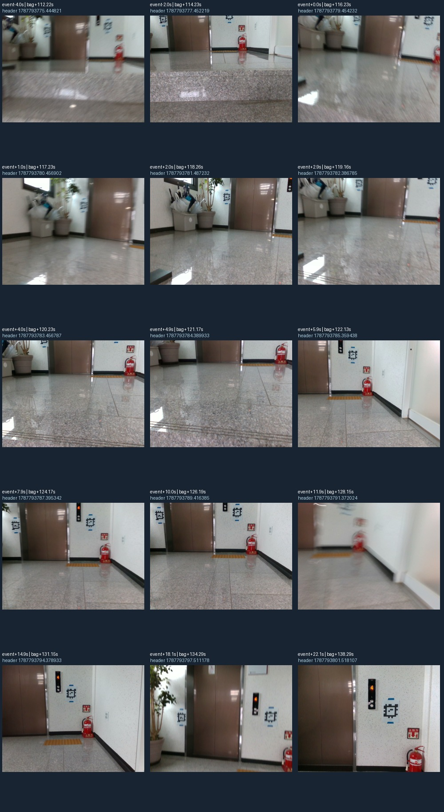
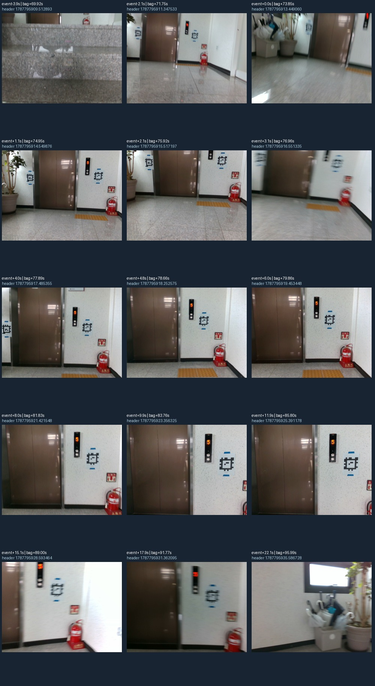

# 계단 LiDAR 추적 기준 버전과 도착 표식 수정

**유지할 추적 방식: `gyro-gicp-installed-20260921-v1`. 도착 표식 수정: 실제 비교 도구에 적용 완료.**

사용자가 RViz에서 `105713`, `102101`의 녹색 경로가 상당히 정확해 보인다고 확인한 방식을 기준 버전으로 보존합니다. 개선한 두 추적 모듈·설정·[실제 의존성 버전](/home/m3tron/.codex/.chatgpt-projects/g-p-6aa37f17097c81919ca6c59ce41e856c/stair-tracking-baseline-20260921/runtime-versions.json)과 SHA-256을 기록했고, 이번 도착 표시 수정은 녹색 위치 추정 계산을 변경하지 않습니다. 사용자 평가는 시각적 정성 확인이며 독립 실측 위치 정답은 아닙니다.

## 보존한 방법

**OBSERVED — 설치 코드에서 확인한 처리 순서**

1. 현재 FAST-LIO YAML의 LiDAR→IMU 장착 회전을 읽고, 역방향 회전으로 IMU 값을 LiDAR 축에 맞춥니다. 기록 당시와 현재 설정이 같다는 점은 사용자 확인입니다.
2. 초기 시각 전후 0.5초 가속도 중앙값으로 위쪽 방향을 정합니다. 우세 평면을 바닥으로 고르던 초기화를 제거했습니다. 이 구간이 물리적으로 정지했다는 보증은 없습니다.
3. 마지막으로 수락한 LiDAR 자세에서 현재 측정 header 시각까지 자이로 회전을 적분해 정합 시작 자세를 예측합니다. 이번 세 기록에서 수락 간격 중앙값은 약 0.2초입니다.
4. 기존 GICP가 새 점군을 최근 15개 수락 scan으로 구성한 지도에 맞추고 최종 자세를 보정합니다. 위치 이동을 가속도 적분으로 계산하지 않습니다.
5. 정합 거절 시 최신 odom을 만들지 않고, pose는 NaN·상태는 PREDICTED/LOST 등으로 기록합니다. 복구 시 경로를 새 구간으로 시작합니다. 초기 상대 pose와 기하 정합은 `geometry_valid`로 구분합니다.

근거: [중력·자이로·정합 코드](/home/m3tron/Desktop/TRON1_Modular_Navigation/tools/offline_lio/registration_core.py:112), [입출력·상태 처리](/home/m3tron/Desktop/TRON1_Modular_Navigation/tools/offline_lio/process_bag.py:165), [동결한 코드 사본](/home/m3tron/.codex/.chatgpt-projects/g-p-6aa37f17097c81919ca6c59ce41e856c/stair-tracking-baseline-20260921/source-snapshot/README.md), [전체 해시와 수치](/home/m3tron/.codex/.chatgpt-projects/g-p-6aa37f17097c81919ca6c59ce41e856c/stair-tracking-baseline-20260921/baseline.json).

## 고정한 설정과 한계

| 항목 | 기준 버전 값 | 적용 범위 |
| --- | --- | --- |
| voxel / 점 대응 거리 / 반복 횟수 | 0.20m / 0.80m / 30회 | 기존 GICP 설정 |
| 최소 fitness | 0.35 | 현재 scan의 정합 수락 |
| 위치·회전 보정 한계 | 0.50m / 0.35rad | 숫자는 이전과 동일, **평가 기준 자세는 자이로 예측으로 변경** |
| 지도 / 입력 샘플링 / 거리 범위 | 15개 scan / 매 2번째 packet / 0.5~20m | 기존 세 spec |
| IMU 표본 공백 / 예측 진단 기간 | 0.03초 / 0.5초 | 예측 지원과 상태 표시, 주행 정지 조건 아님 |
| 적용 보정 | `mapping/extrinsic_R`의 회전 | 고정된 설정값 사용 |

**OBSERVED:** 자이로 영점 추정, 온도 보정, IMU 가속도 이동 적분, 점별 deskew, 센서 간 이동 보정은 이 비교 도구에 구현되지 않았습니다. LiDAR 정합도 반복 구조에서 잘못된 해를 고를 수 있으므로, 내부 수락률만으로 실제 위치 정확도를 판정하지 않습니다. **UNVERIFIED:** 물리적 위치·방향 오차, 장시간 누적 오차, 실주행 중심 유지.

위 숫자는 재현을 위한 기준값입니다. 물리적 안전 constraint의 최소 범위라는 증명은 없어 KEEP 판정을 내리지 않습니다. 정합·공백·초기화 조건의 실주행 타당성은 TUNE/UNVERIFIED이며, 이번 작업에서 주행 차단 gate를 추가하지 않았습니다.

## 같은 원본 프레임으로 비교한 수치

| bag | 확인 범위 | 기하 갱신 수 / 시도 수 | 정합 RMSE 중앙값 | 정합 RMSE P95 | 수정 후 최종 상대 yaw |
| --- | --- | --- | --- | --- | --- |
| 102101 | 사용자 RViz 확인 | 449/499 → **499/499** | 7.85 → **7.90cm** | 13.99 → **11.12cm** | 181.4° |
| 103313 | 수치 회귀만 확인 | 352/466 → **466/466** | 8.37 → **7.79cm** | 35.11 → **11.29cm** | -107.7° |
| 105713 | 사용자 RViz 확인 | 167/339 → **339/339** | 14.91 → **8.08cm** | 33.61 → **11.02cm** | 177.8° |

**OBSERVED:** 총 1,307개 프레임은 초기화 3개와 기하 갱신 시도 1,304개입니다. 정합 거절은 기존 336개에서 0개로 줄었습니다. 모든 비교는 과거·수정 출력의 sensor header 시각 목록이 정확히 같은 구간을 사용합니다. RMSE는 초기화 이후 **전체 시도 프레임**에 기록된 대응점 거리 잔차를 집계했습니다. P95는 그 프레임별 RMSE의 95백분위이며 로봇 위치 오차의 95백분위가 아닙니다. `102101`의 중앙값은 7.85→7.90cm로 소폭 증가했으므로 모든 지표가 좋아졌다고 주장하지 않습니다.

계산 방법과 입력 해시는 [capture_baseline.py](/home/m3tron/.codex/.chatgpt-projects/g-p-6aa37f17097c81919ca6c59ce41e856c/stair-tracking-baseline-20260921/capture_baseline.py), [baseline.json](/home/m3tron/.codex/.chatgpt-projects/g-p-6aa37f17097c81919ca6c59ce41e856c/stair-tracking-baseline-20260921/baseline.json)에 있습니다. 앞선 원본 bag 재처리 검증은 [처리 결과](/home/m3tron/.codex/.chatgpt-projects/g-p-6aa37f17097c81919ca6c59ce41e856c/stair-tracking-fix-20260921/bag-validation.json)에 있습니다. 세 기록은 이미 문제를 확인한 회귀 자료이며 독립 holdout은 아닙니다. 자이로는 추적 입력이므로 그 자이로와의 일치를 독립 정확도 근거로 쓰지 않습니다.

## ‘2~3단 남기고 도착’ 표시의 원인

**OBSERVED — F1, Safety S1 / Mobility M1:** RViz의 파란 `FINAL_ARRIVAL`은 자동 계단 도착 검출 결과가 아닙니다. 비교 spec에 사람이 지정한 카메라 시각을 가장 가까운 수락 LiDAR pose에 연결한 표식입니다. 기존 표시 코드는 첫 진입 사건 이후 미래의 계단참·도착 표식까지 미리 그렸습니다. 화면상 이벤트 이름에 수동 표식이라는 설명이 빠져 있었습니다. [연결 코드](/home/m3tron/Desktop/TRON1_Modular_Navigation/tools/offline_lio/build_comparison_bag.py:73), [표시 코드](/home/m3tron/Desktop/TRON1_Modular_Navigation/tools/offline_lio/comparison_markers.py:71).

사용자가 지적한 두 기록의 원본 영상에서 도착 표식 전후 카메라 메시지 452개를 읽고, 기록당 15개씩 총 30개 시점을 이미지로 확인했습니다. 기존 표식 이후에도 추정 높이는 `102101` 약 19cm, `105713` 약 32cm 더 증가합니다. 이는 조기 표식이라는 해석을 지지하지만 실제 남은 단 수를 측정한 결과는 아닙니다.

**INFERRED:** 원본 영상의 마지막 계단 경계 통과와 이후 추정 높이 안정화를 함께 보고, 더 늦은 상부 평지 참조 프레임을 골랐습니다. **UNVERIFIED:** 카메라에 로봇의 전체 접지 영역이 나오지 않으므로 이 한 프레임만으로 모든 바퀴·발이 계단을 벗어났다고 보증하지 않습니다. 실제 로봇/UI 상태가 조기 전환된 별도 문제인지 사용자 확인 질문을 남겼으며, 이번 수정 범위는 현재 대화에서 재생한 RViz 표식입니다.

## 도착 표식 수정 내용

| bag | 이전 카메라 header 시각 | 새 참조 시각 | 뒤로 옮긴 시간 |
| --- | --- | --- | --- |
| 102101 | 1787793779.454232 | 1787793785.359438 | +5.905초 |
| 105713 | 1787795913.449060 | 1787795917.485355 | +4.036초 |

이 시간 차이는 **각 bag의 영상 annotation 수정량**입니다. 자동 도착 판정에 일괄 지연 시간을 추가한 것이 아닙니다.

1. 두 bag의 도착 참조 영상을 위 시각으로 갱신했습니다. `103313`의 참조 시각은 그대로 유지했습니다.
2. 검증한 세 비교 bag을 새 RViz 창에서 순방향 재생하면, 사건 표식과 영상은 해당 **카메라 header 시각이 지난 뒤** 표시됩니다. 도착 참조 시각 전에는 파란 도착 표식이 나타나지 않습니다.
3. 화면에 `FINAL_ARRIVAL (video annotation)`과 수동 영상 표식이라는 범례를 표시합니다.
4. 카메라 표식 시각이 LiDAR 관측 범위 밖이면 끝 pose에 붙여 도착처럼 보이게 하지 않고, 출력 생성 전에 설정 오류를 알립니다. 이는 비교 파일 입력 검증입니다.





원본과 수정 시각·선정 근거는 [arrival-revision.json](/home/m3tron/.codex/.chatgpt-projects/g-p-6aa37f17097c81919ca6c59ce41e856c/stair-tracking-baseline-20260921/arrival-revision.json), 영상별 header와 추정 pose는 [arrival-frames.json](/home/m3tron/.codex/.chatgpt-projects/g-p-6aa37f17097c81919ca6c59ce41e856c/stair-tracking-baseline-20260921/arrival-frames.json)에 있습니다. 영상의 승강기 숫자는 로봇의 층에 대한 독립 정답으로 사용하지 않았습니다.

## 검증과 재생

**OBSERVED:** 기존 13개 테스트와 표식 시각·관측 범위 회귀 2개, 총 15개 단위 테스트가 통과했습니다. 이는 기존 전체 감사의 15개 E2E 시나리오 재실행을 의미하지 않습니다. [테스트 기록](/home/m3tron/.codex/.chatgpt-projects/g-p-6aa37f17097c81919ca6c59ce41e856c/stair-tracking-baseline-20260921/tests.log).

**OBSERVED:** 새 비교 bag 3개 모두 표식이 지정 시각보다 먼저 등장하지 않고, 도착 영상 header가 새 참조 시각이며, 경로 좌표가 보존한 녹색 추적 CSV와 같음을 확인했습니다. 기준 LiDAR bag·CSV 6개와 추적 모듈 2개는 SHA-256 대조 결과 변경이 없습니다. [검증 결과](/home/m3tron/.codex/.chatgpt-projects/g-p-6aa37f17097c81919ca6c59ce41e856c/stair-tracking-baseline-20260921/annotation-validation.json).

수정 표식이 포함된 새 비교 bag은 [재생 파일 목록](/home/m3tron/.codex/.chatgpt-projects/g-p-6aa37f17097c81919ca6c59ce41e856c/stair-tracking-baseline-20260921/visualization/index.json)에 있습니다. 원본 bag과 이전 비교 결과는 그대로 보존합니다. RViz 재생 도구도 이 새 비교 bag과 기존 녹색 추적 bag을 사용하도록 연결했습니다. 실제 비교 도구 5개 기존 파일을 수정하고 테스트 1개를 추가했습니다. 추적 계산·추적 설정은 그대로입니다.

```bash
python3 "/home/m3tron/.codex/.chatgpt-projects/g-p-6aa37f17097c81919ca6c59ce41e856c/stair-rviz-preview-20260921/show_corrected.py" 102101
python3 "/home/m3tron/.codex/.chatgpt-projects/g-p-6aa37f17097c81919ca6c59ce41e856c/stair-rviz-preview-20260921/show_corrected.py" 105713
```

한 번에 한 창을 실행하고, 창을 닫으면 해당 재생 프로세스와 임시 로그가 정리됩니다. 이번 검증 범위는 새 창의 순방향 재생 자료이며, 같은 창에서 시간을 뒤로 이동하거나 반복 재생할 때 기존 표식이 지워지는지는 검증하지 않았습니다. 녹색 추적을 재계산하려면 동결 코드·동일한 입력 bag·보정 파일·spec의 분석 구간을 사용하되 **새 출력 경로**를 지정합니다. `baseline.json`의 해시 및 원본 크기·mtime을 먼저 대조합니다. 보정 파일도 [동결 사본](/home/m3tron/.codex/.chatgpt-projects/g-p-6aa37f17097c81919ca6c59ce41e856c/stair-tracking-baseline-20260921/calibration/mid360.yaml)을 보관했습니다. 향후 추적 변경은 이 세 기록의 시각 목록, 실패 출력 규약, 정합 수치와 별도의 실제 위치 기준을 함께 비교합니다.

## 남은 범위와 보존 기록

점수는 잠재 영향을 뜻합니다. S1은 간접 안전 영향, M1은 간접 주행 판단 영향이며 실제 사고 발생을 뜻하지 않습니다.

Safety verdict: 수동 표식의 조기 노출·모호한 의미는 이번 비교 도구 수정 대상입니다. 실제 계단 안전·접지 완료는 **UNVERIFIED**입니다.

Mobility verdict: 세 기록의 오프라인 추적 연속성 개선은 **OBSERVED**입니다. 실제 임무의 도착·대기·중심 유지 성공률은 **UNVERIFIED**입니다.

운용 저장소의 Stair Supervisor는 거리 진행과 정지 유지 증거를 사용하는 별도 코드입니다. 이번 비교 파일은 그 상태머신이나 실제 주행 명령을 실행하지 않습니다. 새 ROS 노드나 운용 구조 변경은 없습니다. 실제 도착 판정을 개선할 때는 보존한 측위를 기준으로 마지막 단 통과·로봇 지지 영역이 상부 평지에 들어갔다는 근거를 설계해야 하며, 이번 수동 참조 시각을 제어 조건으로 옮기지 않습니다.

**OBSERVED:** 운용 ROS 저장소는 작업 전후 같은 HEAD와 깨끗한 Git 상태를 유지합니다. 비교 도구는 유효 Git worktree가 없어 파일별 해시로 요청한 6개 변경과 나머지 파일 보존을 확인합니다. 원본 bag 3개는 크기·mtime이 같으며 원본 전체 해시는 이번에 계산하지 않았습니다. 임시 설치 파일·시험 bag·검토 복사본은 제거하고, 재현용 코드·이미지·새 비교 bag·검증 기록은 최종 산출물로 보존합니다. 소스 기준 목록은 33개이고 적용 후 테스트 추가로 34개이며, READ·METADATA_ONLY·EXCLUDED 범위와 합계를 상태 기록에 구분했습니다. 이번 작업에서 ROS 재생이나 로봇 제어 프로세스는 시작하지 않았습니다.

기준 버전 파일별 해시·coverage는 [baseline.json](/home/m3tron/.codex/.chatgpt-projects/g-p-6aa37f17097c81919ca6c59ce41e856c/stair-tracking-baseline-20260921/baseline.json), 적용 차이는 [annotation-fix.patch](/home/m3tron/.codex/.chatgpt-projects/g-p-6aa37f17097c81919ca6c59ce41e856c/stair-tracking-baseline-20260921/annotation-fix.patch), 최종 Git·정리 결과는 [state.json](/home/m3tron/.codex/.chatgpt-projects/g-p-6aa37f17097c81919ca6c59ce41e856c/stair-tracking-baseline-20260921/state.json)에 기록합니다. 전체 저장소 감사를 새로 완료했다는 선언이 아닌 후속 구현·기록 작업입니다.
