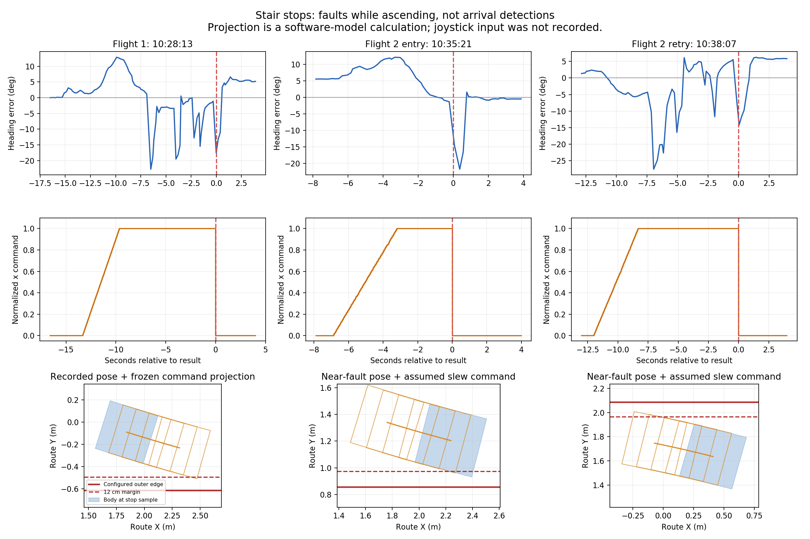

# 3F→4F 계단 주행 정지 원인과 개선안

2026-09-23 · 현재 BAG의 10:27:36–10:39:44 KST 구간(728.24초, 2.95 GB)을 분석했다. 사용자는 첫 상승 끝에서 한 단을 수동으로 오른 뒤 계단참 회전을 했고, 두 번째 상승 초입 정지 후 후진·재시도했으며 마지막에는 2~3단을 수동으로 올랐다고 확인했다. 이는 사용자 관찰이다. 분석에는 기록된 LiDAR 자세·상태, 원시 IMU, 로봇 odom, Supervisor TX·피드백·결과를 사용했다. 원시 점군 전체를 GICP로 다시 처리한 실험은 이번에 수행하지 않았다. 이번 문서는 해당 주행의 사후 분석이며 전체 저장소 감사 완료를 뜻하지 않는다.

**결론: 두 주요 정지는 도착 오판정이나 시간 제한이 아니라 경계 검사에 의한 주행 중단이다. 전진 입력 1.0은 실제로 송신됐다. 여러 센서가 시사하는 급격한 방향 변화(INFERRED)에 비해 조향 보정이 느리고, 정규화 명령을 사용하는 예측 모델·12cm 여유·감속 제한이 결합해 즉시 fault를 만든다. 첫 정지는 기존 각속도 상한 안에서 더 빠르게 조향하면 계산상 피할 수 있지만, 두 번째 주요 정지까지 같은 조정 하나로 해결되지는 않는다.**

OBSERVED는 기록·코드에서 직접 확인한 사실, INFERRED는 재계산·여러 기록의 해석, UNVERIFIED는 외부 실측·실주행 없이는 확정할 수 없는 주장이다. S3는 자세 불안정 위험과 RC 회수가 관련되는 문제, S2는 안전 판단 근거가 부족한 문제다. M3는 자동 구간을 중단시키는 문제, M2는 진단·재현성을 저하하는 문제다. 위험 점수는 실제 추락·충돌이 발생했다는 뜻이 아니다.

## 사용자 설명과 시간 대조

| 시각 KST | 기록된 상황 | 중단 사유 | 사용자 설명과의 대응 |
|---|---|---|---|
| 10:27:57–10:28:13 | VERIFY_ENTRY→ALIGN→FORWARD_SEGMENT_1. 첫 상승 단계 약 13.31초 후 중단 | `no bounded correction within connected support` | 첫 계단 마지막 한 단 전 정지에 대응 |
| 그 이후 | 자동 twist가 0인 동안 궤적이 더 전진하고 방향이 약 0°→180°로 바뀜 | 자동 LANDING/TURN 단계로 진행하지 않음 | 수동 한 단 상승·계단참 회전이라는 설명과 일치 |
| 10:33:59, 10:34:45 | 두 번째 구간 시험 시작 거부 | 진입 영역/높이 검사 | 실제 상승을 시작한 시도와 구분 |
| 10:35:14–10:35:21 | 두 번째 상승 초입. 시험 약 6.91초 후 중단 | `body/clearance exceeds connected support` | 초입에서 정지 후 수동 후진했다는 추가 확인과 일치 |
| 10:37:17 | 재시작 거부 | 진입 영역/높이 검사 | 상승 중 정지가 아님 |
| 10:37:55–10:38:07 | 두 번째 상승 재시도. 시험 약 12.02초 후 중단 | `no bounded correction within connected support` | 마지막 2~3단 전 정지에 대응 |
| 그 이후 | 자동 twist가 0인 동안 높이·전진 궤적이 계속 변함 | 자동 도착 완료 기록 없음 | 수동으로 나머지 구간을 올랐다는 설명과 일치 |

시각·phase·사유·송신값은 OBSERVED다. 사용자 조작과 궤적의 대응은 사용자 진술을 함께 사용한 INFERRED다. 45초 상승 예산을 소진한 정지는 없고, 도착 조건들도 정지 당시 false였다. 통신 장애가 result 사유로 기록된 경우도 없다. [실행별 원자료](runs.json), [BAG 메타데이터](metadata.json).

## F1. 높은 상승 입력과 조향·경계 회복 로직의 결합 문제

**Safety S3 / Mobility M3 · OBSERVED + INFERRED.**

| 항목 | 첫 상승 정지 | 두 번째 초입 정지 | 두 번째 재시도 정지 |
|---|---:|---:|---:|
| 정지 직전 실제 송신 전진 입력 | 1.0 | 1.0 | 1.0 |
| 당시 모델상 몸체와 외곽 경계의 최소 거리 | 24.24cm | 7.60cm | 18.04cm |
| 요구 여유 | 12cm | 12cm | 12cm |
| 현재 몸체 검사 | 통과 | 실패 | 통과 |
| 당시 방향 오차 | −17.51° | −14.61° | −14.19° |
| 직전 약 0.2초 LiDAR 방향 변화 | −16.40° | −13.28° | −7.38° |
| 같은 센서 시각 구간의 IMU 적분 변화 | −10.72° | −4.98° | −14.21° |
| 같은 구간 로봇 odom 자세 변화 | −12.20° | −6.04° | −12.94° |

거리와 방향은 **설정된 경로 좌표와 추정 자세**를 사용한 값으로 실제 벽까지의 독립 실측거리가 아니다. 첫 정지 자세는 기록된 fault의 높이·여유와 수치가 일치한다. 두 번째 초입/재시도 자세는 result 뒤 각각 약 69ms/54ms에 발행된 근접 샘플로 재구성했다. 두 경우 fault 순간의 전체 진단 snapshot은 BAG에 남지 않았다. IMU는 설치 외부회전으로 body frame에 변환하고 초기 전체 자세에서 3D 회전을 누적한 뒤 route frame yaw를 추출했다. gyro z값만 heading으로 적분한 것이 아니다. 비교 구간은 약 0.2초이며 IMU 간격은 최대 약 6ms다. 장기 IMU 무드리프트나 절대 자세 정확도를 증명하지 않는다. 로봇 odom이 내부적으로 어떤 센서를 융합하는지까지 확인하지 않아 완전히 독립된 세 센서의 ground truth로 취급하지 않는다.

**첫 정지의 직접 메커니즘 — OBSERVED/재계산.** 피드백은 내부 각속도 명령 약 0.198을 계산했지만 `max_alpha=0.3` 때문에 0.0349만 허용됐다. 현재 몸체는 여유 검사를 통과했으나, 이 조향으로 전진 명령 0.55를 0.9초간 유지한다고 예측하면 최소 여유가 약 10.57cm이고 샘플 간 보수항 약 1.58cm도 추가된다. 따라서 12cm 기준을 통과하지 못한다.

대안 탐색은 조향을 유지하고 전진값만 75/50/25/0%로 낮춰본다. 그런데 같은 감속 제한이 네 후보를 모두 약 **0.53783**으로 끌어올린다. 해당 순간의 계산상 허용 전진값은 약 0.44 이하였으므로 네 후보 모두 실패한다. 결국 보정 후보 없음으로 fault가 되고 즉시 0 명령으로 전환한다. 정상 보정에서는 큰 감속을 금지하면서 fault에서는 곧바로 0을 보내는 비대칭도 존재한다. 물리적 정지·자세 유지는 이 0 명령만으로 보장되지 않는다.

**첫 정지에 대한 오프라인 비교 — INFERRED.** 같은 자세·12cm 여유·0.9초 예측·전진 입력 1.0을 고정하고 조향을 0.198로 적용하면 검사에 통과한다. 기존 각속도 상한 0.2 이내이다. 이는 현재 제약끼리의 충돌을 보여주는 반사실 비교다. 기존 변화율을 그대로 지키면 해당 주기에 도달할 수 없는 명령이다. 변화율 조정이 조사 대상이라는 근거이며 실제 로봇이 그 회전을 구현한다는 증명은 아니다.

**두 번째 재시도 — INFERRED.** 원래 피드백 조향 약 0.189를 즉시 적용해도 기존 검사에는 통과하지 못한다. 근접 자세의 격자 계산에서는 약 0.210의 양의 조향부터 통과하며 기존 상한은 0.2다. 0.210을 새 운용값으로 선정한 것은 아니다. 반응·위치 지연·좌표 불확실성을 포함하지 않은 정지 순간의 수치 비교다.

**두 번째 초입 — OBSERVED/INFERRED.** 이미 현재 몸체의 모델상 여유가 7.60cm로 12cm 아래다. 미래 조향 후보를 바꿔도 현재 위치 검사를 통과시킬 수 없다. 시작 시 중심선에서 약 14cm 치우쳐 있었고 정지 근접 샘플에서는 약 26.6cm였다. 재시도 시작도 약 21.3cm 치우쳐 있었다. 입장 영역 통과가 중앙 정렬 완료를 뜻하지 않는 현재 단독 구간 경로가 이 문제를 드러냈다.

**기여 요인.** 최소 전진값과 최대값을 함께 0.55로 올린 변경은 이전 속도 피드백과 방향·횡오차에 따른 감속을 덮어쓴다. 조향·예측·회복 모델은 그 상승 입력에 맞게 실주행 검증되지 않았다. 이는 앞선 변경의 부족한 부분이다. 조향 반응을 제대로 맞추는 작업이 필요하다. 또한 코드의 0.55는 WebSocket에서 1.0으로 변환되면서 운동 예측의 속도값으로도 쓰인다. STAIR에서 실제로 0.55m/s가 된다는 검증은 없다. 명령과 실제 운동의 대응을 분리해야 한다.

정지 시 사용된 자세는 약 0.32–0.40초 전 센서 시각이다. 그때까지 도착한 IMU로 방향을 전파해도 첫·마지막 정지의 방향 오차는 대략 −17.2°/−13.5°로 남는다. 따라서 지연 보정만으로 이번 문제를 해결한다고 주장할 수 없다. 초입 사례는 현재 시각 방향 오차 추정이 오히려 약 −25.9°로 커져 지연된 보정의 위험을 보여준다.

근거: [수치 재계산](diagnosis-numeric.json), [민감도 비교](sensitivity.json), [시간 정렬 비교](heading-time-alignment.json), `stair_feedback.py:522,528,600,610,663,681`, `supervisor.py:279–292`. 원본 코드 snapshot은 source/에 보존했다.

## F2. 원인이 아직 확정되지 않은 높이·도착 기준의 불일치

**Safety S2 / Mobility M3 · INFERRED, 실제 원인은 UNVERIFIED.**

마지막 두 번째 정지의 추정 높이는 약 2.473m이고 설정된 끝 높이는 3.230m다. 계산상 약 0.757m가 남지만 사용자 관찰은 2~3단이다. 이후 수동 주행 궤적은 약 3.0m 높이의 구간으로 이어진다. body 위치는 바닥 높이 자체가 아니므로 이 차이를 곧바로 계단 단수 오기나 LiDAR 높이 드리프트로 확정할 수 없다. 기체 자세·높이 변화, 좌표 추정 오차, riser/tread 개수·진입 기준의 차이를 분리해야 한다.

이 높이 불일치는 이번 정지의 직접 사유는 아니다. 그러나 경계 중단을 고쳐도 이후 도착 조건이 맞지 않을 가능성이 있어 함께 검증해야 한다. 사용자가 말한 단수에 맞춰 도착 목표를 당기면 안 된다. 원점, 각 첫 수직면, 계단참 평면, 최종 평면을 같은 기준으로 대조하고, 도착은 실제 다음 평면 위 몸체 지지와 높이·진행량을 함께 확인해야 한다.

## F3. 조이스틱 입력과 최초 fault 진단의 기록 누락

**Safety S2 / Mobility M2 · OBSERVED.**

현재 BAG에는 `/tron/sensor_joy`가 없다. `/stair_supervisor/websocket_tx`에는 `request_twist` 28,806개와 `request_stair_mode` 3개가 있고, 이것은 Supervisor의 송신 기록이다. 조종기 입력값이 아니다. `robot_client.py:166–171`에서 socket send가 성공한 뒤 observer를 호출하므로 TX는 송신 근거지만 로봇의 수신·토크 실행 확인은 아니다. 현재 미니PC에도 SensorJoy 수신기 프로세스를 찾지 못했고 ROS에는 joy 발행자가 없었다. 수신 로그는 9월 9일의 시작 문구뿐이다. 기존 자동 실행 경로는 녹화 토픽에 SensorJoy를 포함하지만 수신기 자동 시작은 `--record-manual` 분기에만 있다. 녹화 명령에 토픽 이름을 넣는 것만으로는 기록이 보장되지 않는다.

따라서 이번 BAG으로 조이스틱 축·버튼·조작 시작 시각을 복원할 수 없다. 사용자의 수동 조작 확인과 자동 0 명령 이후 궤적을 대조하는 수준이 한계다. 또한 10Hz debug가 fault 직후 `RECOVERING/HANDOFF_OVERDUE`로 덮여 두 정지의 최초 자세·후보 명령을 직접 보존하지 못했다. `control_debug.command`의 마지막 비영 명령을 실제 송신 중인 값으로 오해할 수도 있다. 실제 중단 이후 송신은 TX 기록으로 판별했다.

이번 동일 경로의 BAG은 앞서 조사한 입장 거부 BAG과 시작 시각·크기가 달라졌다. 이번 분석은 현재 10:27:36 이후 파일에 한정한다. 재녹화마다 새 디렉터리를 만들어 앞선 증거를 덮어쓰지 않도록 해야 한다.

## 최소 수정 개선 순서

1. **기록과 재현부터 보완한다.** 기존 SensorJoy 수신기를 기존 실행 흐름에서 재사용하고 녹화 시작 전 실제 메시지 수신을 확인한다. 전혀 새 종류의 제어 노드를 추가할 필요가 없다. 수신 시각·센서 시각·RC 축·Supervisor TX를 동시에 기록한다. 최초 fault의 pose, phase, yaw/횡오차, 현재/예측 최소 여유, 가장 가까운 경계, 제한 전/후 명령, 후보별 실패 원인을 한번 저장해 이후 상태에서도 유지한다. 센서 수신 실패는 운행 전체를 영구 차단하는 조건이 아니라 'RC 대조 기록 없음'으로 명확히 표시한다.

2. **기존 `StairFeedback` 안에서 조향·회복을 수정한다.** 계단상의 전진 입력 1.0과 계단참 기존 속도를 기본 의도로 유지한다. 먼저 관측된 실제 yaw 외란과 하드웨어 조향 응답을 사용해 변화율·상한을 정한다. `v` 후보만 줄이는 대신 허용된 `v,w` 조합을 평가하고, 입력 1.0에서 전체 변경율·하드웨어 반응까지 고려해 실제로 도달 가능한 조향 조합만 우선한다. 한 샘플의 soft margin 위반과 실제 몸체의 외곽 이탈/측위 상실을 구분한다. 실측으로 정당화된 위치 불확실성과 실제 외곽 여유를 회복 동작 내내 만족하는 경우에만 같은 phase에서 보정을 이어간다. 현재 10cm 불확실성 예산을 임의로 소모 가능하다고 취급하지 않는다. 자동 재개는 임의로 latch를 해제하는 방식이 아니라 원인별 조건과 최근 관측으로 설계한다. 실제 회복 명령이 없으면 계속 전진한다고 약속할 수 없다. 정상 감속 제한과 fault 0 전환의 역할도 명시적으로 분리한다.

3. **현재 시각의 제어 자세와 명령→운동 모델을 보완한다.** 기존 gyro/GICP 위치 추정은 유지하되, LiDAR 시각의 자세와 최신 IMU로 전파한 제어용 방향을 별도로 다룬다. 측정 시각을 새로 찍어 오래된 위치를 신선한 관측으로 둔갑시키지 않는다. 수백 ms의 위치 이동은 측정 속도·불확실성으로 다루고, 센서 만료시간 0.9초를 고정 속도로 움직이는 예측 모델과 무조건 동일시하지 않는다. STAIR 입력 1.0에서 실제 전진·yaw 응답을 측정해 예측 범위를 만든다. IMU 장기 적분이나 FASTLIO로 전체 측위 구조를 교체할 필요는 없다.

4. **정렬과 도착 좌표를 검증한다.** 두 번째 상승 시작 전 중심선 편차를 줄이는 기존 TURN 경로와 단독 시험 진입 절차를 맞춘다. 계단참 안에 있다는 검사만 통과한 채 14–21cm 치우쳐 곧바로 상승하지 않도록, 하위 제어에서 중앙 접근·방향 정렬을 수행한다. 센서로 관측된 계단 측면/평면과 실측 진입·도착 기준을 비교하고, 절대 route 좌표와 로봇 상대 측정의 일치도를 기록한다. 새 mission/floor 상태나 ROS 노드를 추가하기 전에 기존 controller/worker와 client 범위에서 해결한다.

### 제약 판정 ledger

| 제약 | 차단하려는 위험 / 현재 문제 | 판정 | 복구·검증 방향 |
|---|---|---|---|
| 현재 full-body support 검사 | 외곽 밖으로 몸체가 나가는 위험. 설정 polygon이 실제 지지면인지 아직 미검증 | UNVERIFIED | 실측·점군 경계 대조. 실제 이탈과 soft margin 구분 |
| 2cm+진입 불확실성 10cm | 위치 오차로 경계에 접근하는 위험. 10cm는 실측 오차 분포로 선정되지 않음 | TUNE | 진입 frame 오차·동적 추정 오차를 따로 측정해 여유 산정. 일률 축소 금지 |
| 0.9초 명령 기반 swept footprint | 가까운 미래 외곽 이탈. STAIR 입력→실제 운동 대응 불확실 | TUNE | 실제 속도·지연·제어 가능 영역으로 예측하고 디버그로 공개 |
| 각속도 상한 0.2 / 변화율 0.3 | 급격한 자세 변화. 첫 정지에서는 필요한 보정을 과도하게 제한 | TUNE | 실제 조향 step 응답 후 수치 결정. 정적 격자의 0.210을 바로 배포하지 않음 |
| 보정 실패 시 latch+0 | 위험 명령 중단. 한순간의 soft 위반도 수동 재개가 필요한 fault로 바뀜 | NARROW | 안전하게 회복 가능한 경우와 회수 필요한 경우를 원인별로 구분. 0을 자세 유지로 취급하지 않음 |
| 상승 최소 입력 1.0 | 사용자 설명상 단 상승에 필요한 입력. 기존 속도 감속 효과를 제거 | TUNE | 현장 토크 요구는 존중하되 조향 가능성과 실제 운동 모델을 함께 검증 |
| 기존 높이·도착 조건 | 계단 위 조기 도착 처리 방지. 사용자 관찰과 높이 잔차 불일치 | UNVERIFIED | 평면·몸체 지지·riser/tread 기준을 대조한 후 결정 |

최소 범위와 더 좁은 대안의 불충분성을 입증하지 못한 제약은 KEEP으로 판정하지 않았다. 세 정지 근접 자세에서 여유를 6cm로 줄이는 정적 계산은 통과하지만, 위치 오차가 그 범위보다 작다는 증거가 없어 운용값으로 채택할 근거가 되지 않는다.

## 검증과 판정

오프라인 검증은 현재 BAG의 동일 자세에서 기존·후보 제어기의 명령과 제약을 비교하는 것으로 시작한다. 그것은 **재현과 후보 선별**이다. 수정 후에도 로봇이 같은 자세 경로를 따른다고 가정해 완주율을 계산하면 안 된다. 개발에 사용하지 않은 기존 BAG에서 회귀를 확인하고, 마지막으로 독립 영상/단수·시각 표시와 RC 기록을 포함한 실제 주행으로 검증해야 한다. 수동 구간은 자동 완주로 집계하지 않는다.

- **Mobility verdict:** 첫 상승과 두 번째 상승 모두 자동 완주 미달. 주된 중단은 경계 제약과 회복 제어의 결합이다. 입력 부족·시간 초과·조기 도착 판정이 이번 주요 정지의 직접 원인은 아니다.
- **Safety verdict:** 이번 기록만으로 실제 벽 접촉·지지면 이탈을 입증하지 못했다. 실제 급격한 방향 변화가 있고, 계단 위 0 명령은 자세 유지를 보장하지 않는다. 제약 제거로 해결됐다고 선언할 수 없다.
- **개선 효과의 한계:** 첫 정지 한 장면에서 기존 각속도 상한 내 조향 변경으로 검사 통과를 재현했다. 두 번째 주요 정지는 같은 변경으로 통과하지 않았다. 실주행 성공률 향상 수치는 아직 없다.

운용 코드·설정·노드·주행 명령은 이번 분석에서 변경하지 않았다. BAG은 읽기만 했다. 분석 스크립트·수치·도표·원본 source snapshot은 감사 증빙으로 보존하며 임시 플롯 캐시는 제거했다. Git 상태와 BAG의 변경 여부는 verification.json으로 기록한다.

