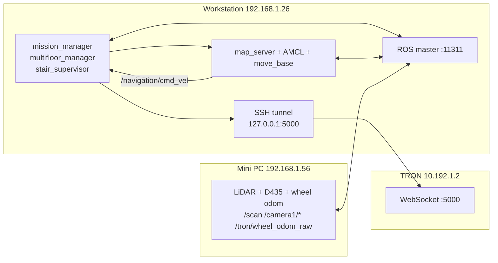
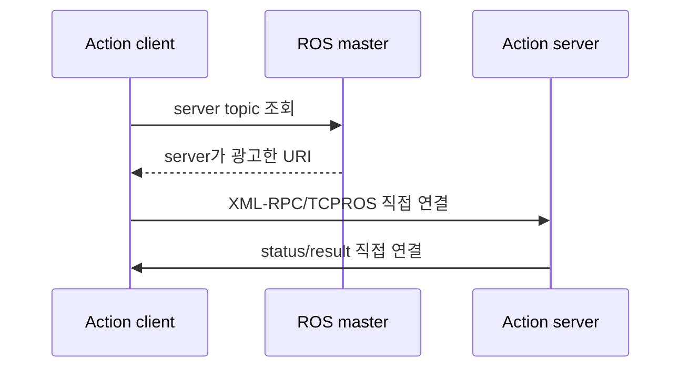
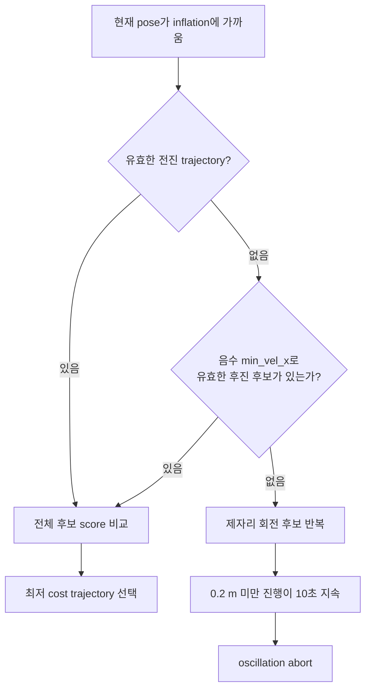

# TRON1 인지·네트워크·평지 주행 장애 RCA와 복구 가이드

## 1. 문서 목적과 범위

이 문서는 TRON1 운영 과정에서 반복 비용이 컸던 세 가지 문제를 한곳에 기록한다.

1. AprilTag detector가 시작 직후 assertion으로 종료된 문제
2. ROS master 위치와 advertise 주소가 맞지 않아 action 연결이 불완전했던 문제
3. 계단 진입점으로 평지 주행할 때 벽 가까이에서 후진하지 못하고 oscillation으로 종료된 문제

이 문서의 목표는 단순한 변경 이력이 아니다. 동일한 증상이 다시 나타났을 때 운영자가 원인 범위를 빠르게 좁히고, 안전한 순서로 복구하고, 다음 BAG에 필요한 증거를 빠뜨리지 않도록 하는 것이다.

이 문서의 repository 기준 경로는 `docs/navigation-perception-network-incident-rca-ko.md`다. 본문의 Markdown 링크는 이 파일이 있는 `docs/` 디렉터리를 기준으로 하고, 근거 파일 색인의 code path는 repository root를 기준으로 한다.

현재 사실은 2026-09-17의 source, 보존 로그, BAG을 기준으로 한다. 직접 보존된 관측과 코드에 적힌 원인 설명, 아직 검증되지 않은 가설을 구분한다.

| 표기 | 의미 |
|---|---|
| 확인 | source, 로그 또는 BAG에서 직접 확인됨 |
| 코드상 설명 | 현재 구현과 주석이 설명하지만 당시 원시 측정값은 보존되지 않음 |
| 가설 | 증상과 일치하지만 추가 기록이나 A/B 검증이 필요함 |

이 문서에 적힌 IP, topic, 속도 값은 사건 당시와 현재 구성을 설명하는 snapshot이다. 운영값의 단일 기준은 `config.env`와 각 package의 production YAML/launch이며, 변경 후에는 그 파일을 먼저 갱신하고 `validate_bundle.py`와 계약 테스트를 실행한다.

명령은 별도 표기가 없으면 repository root에서 실행한다. ROS 명령 전에는 다음 환경이 필요하다.

```bash
source /opt/ros/noetic/setup.bash
source devel/setup.bash
set -a; source config.env; set +a
export ROS_MASTER_URI="http://${ROS_MASTER_HOST}:11311"
```

`rostopic`, `rosnode`, action 연결 검사는 workstation, mini PC, sensor stack이 켜진 상태에서만 수행한다. Hardware가 꺼진 상태에서는 software 검증만 수행하고 runtime 성공으로 기록하지 않는다.

## 2. 현재 시스템 구조

현재 ROS master와 mission/navigation node는 workstation이 소유한다. mini PC는 센서를 publish하고, TRON 본체는 ROS master가 아니라 WebSocket 제어 endpoint다.



전체 mission과 subsystem 관계는 기존 자료를 함께 본다.


## 3. 사건 1: AprilTag detector 시작 후 assertion 종료

### 3.1 증상

2026-09-14 보존 로그에서 `apriltag_ros_continuous_node` process는 실행됐지만 입력 처리 중 다음 assertion으로 종료됐다.

```text
zarray.h:132: zarray_size: Assertion 'za != NULL' failed
```

근거:

- `logs/20260914_102429/system.log`
- 당시 detector 설정은 `transport_hint: compressed`였음

따라서 정확한 표현은 “AprilTag 실행 파일을 로드하지 못했다”가 아니라 “node가 시작된 뒤 동기화된 입력을 만들지 못하고 assertion으로 비정상 종료했다”이다.

### 3.2 원인 범위

현재 launch와 relay 구현은 D435 image와 `camera_info`가 서로 다른 clock의 timestamp를 사용해 동기화 pair가 만들어지지 않았다고 설명한다.

```text
/camera1/color/image_raw ───────────────┐
                                       ├─ timestamp가 맞지 않아 sync pair 없음
/camera1/color/camera_info ─────────────┘
                                                  ↓
                                    apriltag_ros assertion 종료
```

근거:

- `src/multifloor_manager/launch/apriltag.launch`
- `src/multifloor_manager/scripts/camera_info_stamp_relay.py`

다만 당시 image와 `camera_info` stamp 두 값을 직접 비교한 출력은 보존되지 않았다. timestamp 불일치는 현재 코드가 설명하는 원인이며, 과거 실행의 독립적인 원시 측정값은 없다.

### 3.3 적용한 해결

#### 1. image stamp를 기준으로 CameraInfo 재발행

`camera_info_stamp_relay.py`는 최신 `CameraInfo` calibration을 보관한 뒤 image가 들어올 때 다음 두 message를 함께 publish한다.

- image: 원본 message 유지
- camera info: calibration 값은 유지하고 `header.stamp`만 image stamp로 교체

출력 topic:

```text
/apriltag_camera/image_raw
/apriltag_camera/camera_info
```

#### 2. detector 입력을 relay 출력으로 고정

`apriltag.launch`는 detector의 `image_rect`와 `camera_info`를 위 두 relay 출력으로 remap한다. detector가 원래 D435 topic을 직접 구독하지 않도록 경계를 명확히 했다.

#### 3. raw transport와 자동 respawn 사용

현재 detector 설정:

```xml
<param name="tag_family" value="tagStandard41h12"/>
<param name="transport_hint" value="raw"/>
```

process가 비정상 종료하면 3초 후 respawn한다. Respawn은 원인 해결이 아니라 일시적 process fault에 대한 가용성 장치다.

#### 4. tag 원본과 detector artifact 일치 검증

다음 두 파일의 `{id, size}`가 일치해야 startup validation을 통과한다.

```text
src/multifloor_manager/config/apriltags.yaml
src/multifloor_manager/config/apriltag_ros_tags.yaml
```

`validate_bundle.py`가 이 계약을 검사한다.

#### 5. startup readiness에 실제 tag stream 포함

`run.sh`는 `/tag_detections`의 type과 최신 message를 확인한 후에만 `[READY]`를 출력한다. 단순히 node 이름이 존재하는 것만으로 성공 처리하지 않는다.

### 3.4 해결이 유효한 이유

`apriltag_ros`의 image와 camera info synchronizer가 같은 시간의 pair를 받을 수 있게 됐다. detector 앞에서 clock 차이를 흡수하므로 detector 내부를 수정하거나 D435 driver 전체의 timestamp 정책을 바꾸지 않아도 된다.

2026-09-17 로그에서는 다음이 확인됐다.

- detector가 운영 tag 설정을 로드함
- `transport_hint: raw`로 시작함
- tag 300부터 600까지의 config가 로드됨

근거:

- `logs/20260917_001407/system.log`

### 3.5 검증 절차

```bash
rostopic type /tag_detections
rostopic hz /camera1/color/image_raw /camera1/color/camera_info
rostopic hz /apriltag_camera/image_raw /apriltag_camera/camera_info
rostopic hz /tag_detections
rostopic echo -n 1 /apriltag_camera/image_raw/header
rostopic echo -n 1 /apriltag_camera/camera_info/header
```

확인 기준:

1. `/tag_detections` type이 `apriltag_ros/AprilTagDetectionArray`
2. relay image와 camera info의 최신 stamp가 같음
3. tag가 보이지 않는 장면에서도 detection array가 fresh하게 publish됨
4. detector process가 반복 respawn하지 않음
5. `./run.sh`가 AprilTag freshness gate를 통과함

software 검증:

```bash
python3 validate_bundle.py --validate-production-config
python3 -m unittest \
  test.test_launch_contract.LaunchContractTest.test_apriltag_detector_uses_required_camera_topics_and_fixture_tag_config
python3 -m unittest \
  test.test_system_operator_contract.SystemOperatorContractTest.test_operator_wrapper_gates_all_runtime_readiness_signals
python3 -m unittest \
  test.test_run_script_contract.RunScriptContractTest.test_remote_sensor_probe_avoids_pid_expansion_and_requires_camera_frames
catkin_make
```

전체 `test.test_system_operator_contract` 실행은 현재 `system.launch`의 `pointcloud_to_laserscan.launch` include 소유권과 테스트 기대값이 어긋나 별도의 기존 실패를 포함한다. 이 사건의 AprilTag 계약 확인에는 위 선별 테스트를 사용하고, 그 불일치를 AprilTag 회귀로 해석하지 않는다.

### 3.6 남은 위험

- 2026-09-17 로그에는 설정에 없는 tag ID `601` 경고가 반복됐다. Startup assertion과 별개지만 실제 설치 tag와 `apriltag_ros_tags.yaml`을 다시 대조해야 한다.
- 테스트 fixture의 tag 목록은 production inventory가 아니다. `test/fixtures/building_valid`의 값으로 운영 tag 구성을 판단하면 안 된다.
- 보존 로그만으로 해당 실행의 AprilTag readiness gate가 실제 통과했다고 독립 증명할 수 없다. 다음 장애에서는 위 `rostopic` 결과를 함께 보존한다.

## 4. 사건 2: ROS master 위치와 양방향 action 연결

### 4.1 증상과 보존 범위

세션에서는 `/mission` action server topic이 보이는데도 실제 action client 연결이 완성되지 않는 문제가 관측됐다. 그러나 원래 timeout/error 원문과 packet capture는 workspace에 남아 있지 않다.

로그로 확인되는 topology 변화는 다음과 같다.

| 시점 | 기록된 ROS master |
|---|---|
| 2026-08-19 | mini PC `192.168.1.56:11311` |
| 2026-09-14 | TRON 주소 `10.192.1.2:11311` |
| 현재 | workstation `192.168.1.26:11311` |

근거:

- `logs/20260819_125758/navigation.log`
- `logs/20260914_102429/system.log`
- `config.env`

### 4.2 근본 메커니즘

ROS1 master는 node와 topic을 등록하는 directory다. 실제 topic과 action 데이터는 master가 알려준 node URI를 사용해 peer 간 XML-RPC와 TCPROS connection으로 전달한다.



따라서 `rostopic list`나 `/mission/status` 등록만 보여도 실제 양방향 socket이 완성됐다는 뜻은 아니다. node가 상대가 도달할 수 없는 주소를 `ROS_IP` 또는 `ROS_HOSTNAME`으로 광고하면 graph에는 보이지만 action goal, status 또는 result가 연결되지 않을 수 있다.

과거에는 workstation, mini PC, TRON이 `192.168.1.x`와 `10.192.1.x` 대역의 주소를 혼합해 사용했다. 어느 단일 방향의 packet이 최초로 실패했는지는 보존 자료만으로 확정할 수 없지만, 도달 불가능한 advertise URI가 생길 수 있는 topology였던 것은 확인된다.

### 4.3 적용한 해결

#### 1. workstation이 ROS master를 소유

현재 `run.sh`가 application node보다 먼저 다음 master를 시작한다.

```text
http://192.168.1.26:11311
```

#### 2. workstation ROS_IP를 route에서 계산하고 검증

`run.sh`는 mini PC로 향하는 route의 source 주소를 계산한다. 이 주소가 `ROS_MASTER_HOST`와 다르면 시작을 거부한다. `ROS_HOSTNAME`은 제거해 오래된 hostname advertise가 섞이지 않게 한다.

#### 3. mini PC에 master와 ROS_IP를 명시

원격 sensor launch 환경:

```bash
ROS_MASTER_URI=http://192.168.1.26:11311
ROS_IP=192.168.1.56
```

#### 4. TRON은 ROS master에서 제외

TRON `10.192.1.2:5000`은 WebSocket endpoint로만 사용한다. Workstation의 SSH tunnel을 통해 `127.0.0.1:5000`으로 접근한다.

#### 5. topic 존재가 아니라 actionlib 연결을 readiness로 검사

`verify_action_servers.py`는 goal을 보내지 않고 실제 `SimpleActionClient.wait_for_server()`를 수행한다.

검사 대상:

```text
/mission
/multifloor/floor_transition
/stair_traversal
```

이 검사는 robot을 움직이지 않으면서 action server의 status를 수신하고 goal/cancel publisher와 result/feedback subscriber가 같은 server에 연결됐는지 확인한다.

### 4.4 해결이 유효한 이유

Workstation과 mini PC가 서로 도달 가능한 `192.168.1.x` LAN 주소를 광고하고 같은 workstation master를 사용한다. TRON 전용 대역은 ROS graph에서 제거하고 WebSocket tunnel 경계 뒤로 제한했다.

2026-09-17 보존 로그에서 workstation roscore가 `192.168.1.26:11311`로 실행되고 local system launch도 같은 master를 사용한 것이 확인된다.

근거:

- `logs/20260917_001407/ros_master.log`
- `logs/20260917_001407/system.log`
- `test/test_run_script_contract.py`

### 4.5 검증 절차

Workstation:

```bash
printf '%s\n' "$ROS_MASTER_URI" "$ROS_IP"
rosnode list
python3 verify_action_servers.py
rosnode info /mission_manager
```

Mini PC:

```bash
ssh m3localtron@192.168.1.56
```

위 SSH shell에 접속한 뒤 실행한다.

```bash
printf '%s\n' "$ROS_MASTER_URI" "$ROS_IP"
rosnode list
rostopic info /scan
```

확인 기준:

1. 양쪽 `ROS_MASTER_URI`가 `http://192.168.1.26:11311`
2. workstation `ROS_IP=192.168.1.26`
3. mini PC `ROS_IP=192.168.1.56`
4. sensor publisher와 workstation subscriber 사이 TCPROS connection 존재
5. 세 action client가 모두 server에 연결됨
6. `/scan` publisher가 정확히 하나

`rostopic info`는 등록 목록 확인에 사용하고, 실제 transport는 `rosnode info`의 `Connections`에서 확인한다.

### 4.6 남은 위험

- `verify_action_servers.py`는 goal을 보내지 않으므로 실제 주행 성공을 보장하지 않는다.
- RViz가 늦게 시작하면 AMCL `/tf`, `/initialpose`, `/move_base_simple/goal`의 late publisher 연결이 누락될 수 있다. 자세한 절차는 [ROS Noetic AMCL/RViz late publisher 연결 문제](ros-noetic-amcl-rviz-late-publisher-troubleshooting.md)를 따른다.
- 최신 보존 로그 중 일부에는 RViz가 아직 등록되지 않아 one-shot reconnect가 skip된 기록이 있다. Managed mission과 별개지만 manual RViz commissioning 전에는 connection을 다시 확인해야 한다.

## 5. 사건 3: 계단 진입점 NAV oscillation과 후진 불가

### 5.1 사용자 증상

세션에서 사용한 shell helper `mission_goal stair_3f_up_entry` 실행 시 로봇이 계단 진입점 약 2.5 m 전에서 벽에 가까워지고, 좌우 회전과 전진을 반복한 뒤 다음 오류로 종료됐다. 이 helper는 repository가 제공하는 명령이 아니므로 재현할 때는 아래의 raw action goal을 사용한다.

```text
Aborting because the robot appears to be oscillating over and over.
```

분석 자료:

```text
stair_captures/stair_3F_to_4F_FULL_20260916_234018.bag
logs/20260916_233206/system.log
~/.ros/log/64a68d96-b1db-11f1-9fc5-599613c4a513/rosout.log
```

### 5.2 BAG에서 확인된 사실

고정 mission target:

```text
x   = 10.054808
y   = -6.652934
yaw = 1.395796 rad
```

Mission 입력 재현:

> **실차 이동 주의:** 아래 두 명령은 로봇을 실제로 움직인다. 계단 가장자리 접근을 차단하고, 주행 구역에서 사람과 장애물을 치우고, 현장 감시자가 비상 정지 수단을 확보한 manual commissioning에서만 한 번씩 실행한다. `[READY]`, `SupervisorState=NAV`, 후방 sensor coverage를 먼저 확인한다.

```bash
rostopic pub -1 /mission/goal mission_manager/MissionActionGoal \
  "{goal_id: {stamp: now, id: nav-rca-$(date +%s%N)}, \
    goal: {destination_id: stair_3f_up_entry, mission_type: navigate, return_after_task: false}}"
```

동일 pose의 simple-goal 입력 재현은 manual commissioning에서만 수행한다. Managed RViz에는 `SetGoal` tool이 없다.

```bash
rostopic pub -1 /move_base_simple/goal geometry_msgs/PoseStamped \
  "{header: {stamp: now, frame_id: map}, pose: {position: {x: 10.054808, y: -6.652934, z: 0.0}, orientation: {x: 0.0, y: 0.0, z: 0.642608567, w: 0.766194642}}}"
```

최근 실패 attempt:

| 관측 | 값 |
|---|---:|
| 시작 | 23:42:45.204 KST |
| 가장 가까운 거리 | 2.7381 m |
| closest approach 이후 map-frame path | 16.5269 m |
| 같은 구간 wheel-odom path | 16.5386 m |
| 같은 구간 순변위 | 약 0.36 m |
| 각속도 방향 반전 | 25회 |
| abort | 23:44:06.805 KST |
| 동일 goal 재전송 | abort 후 12.31 ms |

Scan, wheel odometry, TF, move_base feedback은 abort 순간까지 fresh했다. Sensor dropout은 이 실행의 직접 trigger로 보이지 않는다.

다만 map pose와 wheel odometry는 완전히 독립적인 물리 궤적이 아니다. 두 path가 비슷하다는 사실만으로 odometry 정확도를 증명할 수는 없다.

### 5.3 mission goal과 RViz 2D Nav Goal의 관계

두 입력은 goal을 넣는 표면만 다르다.

```text
/mission
  -> NavigationExecutor
  -> /move_base action goal

/move_base_simple/goal
  -> move_base simple goal subscriber

이후 공통:
  NavfnROS
  -> TrajectoryPlannerROS
  -> /navigation/cmd_vel
  -> stair_supervisor
  -> robot WebSocket
```

따라서 mission 전용 local planner가 따로 있는 것이 아니다. RViz 성공률이 더 높다는 결론도 아직 입증되지 않았다. Matching RViz trial이 기록되지 않았고, mouse로 선택한 위치와 yaw는 mission의 고정 pose와 다를 수 있다.

### 5.4 NAV는 scan-only가 아니다

현재 데이터 흐름:

| 입력 | 역할 |
|---|---|
| `/scan` | AMCL 관측, local costmap obstacle marking/clearing |
| `/tron/wheel_odom_raw` | move_base velocity/odometry, `odom → base_Link` |
| `/tf` | `map → odom → base_Link` pose chain |
| `/map` | global costmap static layer |

Local costmap은 `odom` frame에서 동작하고 `/scan`으로 장애물을 갱신한다. TrajectoryPlanner는 scan만 직접 따라가는 것이 아니라 costmap, global path, robot pose와 velocity를 함께 평가한다.

### 5.5 현재 후진이 불가능한 이유

현재 planner 설정:

```yaml
TrajectoryPlannerROS:
  min_vel_x: 0.0
  max_vel_x: 0.30
  holonomic_robot: false
```

`min_vel_x: 0.0`이므로 일반 rollout에서 음수 `x` velocity를 후보로 만들지 않는다. 실패 BAG에서도 `/navigation/cmd_vel.linear.x`는 음수가 없었다.

현재 move_base 설정:

```text
recovery_behavior_enabled: false
oscillation_timeout: 10.0
oscillation_distance: 0.2
```

`escape_vel: -0.1`은 일반 rollout 후진과 같은 의미가 아니다. Noetic `TrajectoryPlanner::findBestPath()`는 유효한 sampled trajectory를 하나도 찾지 못했을 때 별도의 내부 fallback으로 `escape_vel`을 시도한다. 이는 move_base의 recovery behavior plugin과 별개이므로 `recovery_behavior_enabled: false`만으로 꺼지지 않는다.

실패 BAG에 음수 `/navigation/cmd_vel.linear.x`가 없었다는 것은 이 내부 fallback이 해당 실행에서 command로 선택되지 않았다는 뜻이다. 비음수 회전·전진 후보가 계속 유효했는지 등 선택되지 않은 이유는 local plan/costmap 기록이 없어 확정할 수 없다. 따라서 확인된 제약은 “일반 scored rollout에 후진 후보가 없다”이며, “모든 후진 경로가 완전히 비활성화됐다”는 표현은 부정확하다.

### 5.6 inflation 가까이에서 후진을 선택할 수 있는가

`min_vel_x`를 음수로 설정하면 TrajectoryPlanner가 후진 trajectory도 후보에 포함할 수 있다. 전진 후보가 collision 또는 높은 cost로 탈락하고 후진 후보가 유효하며 총 score가 더 낮으면 후진을 선택할 수 있다.

그러나 다음을 의미하지는 않는다.

- inflation 가까이에 가면 반드시 후진함
- 후진이 항상 전진보다 높은 우선순위를 가짐
- 이미 lethal 또는 inscribed 영역에 들어갔을 때 반드시 탈출함
- 후방 sensor coverage가 없어도 안전함

TrajectoryPlanner는 별도 “벽 근접 후진 상태”가 아니라 sampled trajectory의 path distance, goal distance, obstacle cost를 비교한다. 후진은 가능한 후보가 될 뿐 보장된 recovery가 아니다.



### 5.7 필요한 변경 규모

#### 선택 A: 일반 planner에 저속 후진 후보 추가

변경 규모는 작다. 핵심은 configuration과 검증이다.

예시 실험값:

```yaml
min_vel_x: -0.05  # 또는 제한적으로 -0.10
```

필요 작업:

1. `base_local_planner_params.yaml` 변경
2. launch/runtime parameter 계약 테스트 추가
3. 후방 `/scan` coverage와 footprint 확인
4. 낮은 속도에서 obstacle 없는 구간 실차 검증
5. 벽 근접 상황에서 plan/costmap/BAG 기록

장점은 구조 변경이 거의 없다는 것이다. 단점은 후진 선택이 planner score에 달려 있어 탈출을 보장하지 않는다는 것이다.

#### 선택 B: 조건부 backup recovery 추가

“진전 없음 + 후방 clearance 확보” 조건에서만 정해진 거리만큼 후진하려면 구조 변경이 중간 정도 필요하다.

권장 안전 조건:

1. active move_base goal과 command ownership 확인
2. robot 정지 확인
3. rear sector obstacle clearance 확인
4. 제한 속도와 최대 거리 설정
5. timeout 또는 stale scan 즉시 zero command
6. backup 완료 후 costmap clear와 replan

별도 ROS command node를 추가하면 `stair_supervisor`의 단일 command ownership 계약을 깨뜨릴 수 있다. 구현한다면 move_base recovery plugin 또는 기존 `/navigation/cmd_vel` ownership 안에서 동작하는 방식으로 설계해야 한다.

#### 선택 C: 접근 경로와 costmap 재커미셔닝

현재 BAG에는 global/local plan과 costmap이 없어 벽에 붙은 최초 원인을 확정할 수 없다. 다음 실행에서는 [6.3의 전체 기록 명령](#63-nav-장애를-다시-기록할-때)을 사용한다.

기록 후 다음을 구분한다.

- stair entry pose 또는 yaw가 실제 접근 방향과 맞지 않음
- global path가 벽 쪽으로 붙음
- inflation 또는 footprint가 통로를 과도하게 축소함
- obstacle cost weight가 clearance보다 path 추종을 지나치게 우선함
- scan/map/TF 정렬 오차로 가상의 벽이 생성됨

### 5.8 권장 해결 순서

| 단계 | 변경 | 목적 | 위험 |
|---|---|---|---|
| 1 | plan/costmap topic을 BAG에 추가 | 최초 원인 관측 | 낮음 |
| 2 | mission pose와 동일한 RViz goal A/B | goal surface 차이 제거 | 중간, 실제 이동 |
| 3 | `min_vel_x=-0.05` 저속 시험 | 후진 후보 효과 확인 | 중간, 후진 이동 |
| 4 | entry pose/path/inflation scoring 조정 | 벽 접근 자체 감소 | 중간 |
| 5 | guarded backup recovery | 결정적 탈출 동작 | 높음, 구조 변경 |

후진 parameter부터 바로 production에 적용하면 안 된다. 후방 obstacle coverage와 정지 동작을 먼저 검증한다.

## 6. 공통 운영 체크리스트

### 6.1 시작 전

```bash
./run.sh --preflight
timedatectl show -p NTPSynchronized --value
ssh m3localtron@192.168.1.56 timedatectl show -p NTPSynchronized --value
```

확인:

- Workstation과 mini PC clock 동기화
- `ROS_MASTER_HOST=192.168.1.26`
- `MINI_PC_ROS_IP=192.168.1.56`
- camera image와 camera info가 모두 fresh
- `/scan` publisher 하나

### 6.2 `[READY]` 후

```bash
python3 verify_action_servers.py
rostopic hz /scan /tron/wheel_odom_raw /tf /tag_detections
rostopic echo -n 1 /multifloor/floor_state
rostopic echo -n 1 /stair_supervisor/state
```

### 6.3 NAV 장애를 다시 기록할 때

기록 전 디렉터리를 만들고 같은 실행의 parameter를 먼저 보존한다. 이어서 아래 명령으로 navigation 입력, action lifecycle, planner 출력과 costmap을 한 BAG에 기록한다. 기록 종료는 `Ctrl+C`다.

```bash
mkdir -p stair_captures
rosparam get /move_base > "stair_captures/move_base_$(date +%Y%m%d_%H%M%S).yaml"
rosbag record --lz4 -O "stair_captures/nav_rca_$(date +%Y%m%d_%H%M%S)" \
  /mission/goal /mission/status /mission/feedback /mission/result \
  /move_base/goal /move_base/status /move_base/feedback /move_base/result \
  /move_base_simple/goal /move_base/current_goal /move_base/recovery_status \
  /move_base/NavfnROS/plan \
  /move_base/TrajectoryPlannerROS/global_plan \
  /move_base/TrajectoryPlannerROS/local_plan \
  /move_base/global_costmap/costmap \
  /move_base/global_costmap/costmap_updates \
  /move_base/local_costmap/costmap \
  /move_base/local_costmap/costmap_updates \
  /navigation/cmd_vel /scan /tron/wheel_odom_raw \
  /tf /tf_static /map /amcl_pose /particlecloud \
  /diagnostics /rosout /rosout_agg
```

### 6.4 실패 후 판단 순서

1. Action result와 정확한 child goal pose 확인
2. Sensor/TF freshness 확인
3. Global plan이 목표까지 존재하는지 확인
4. Local plan과 local costmap에서 벽 근접 시점을 확인
5. `/navigation/cmd_vel`의 선속도 부호와 각속도 반전을 확인
6. Odom path, AMCL/map pose, raw LiDAR 또는 영상을 비교
7. 동일 pose의 mission/RViz first-attempt A/B로 goal surface 영향을 분리

## 7. 근거 파일 색인

| 영역 | 주요 근거 |
|---|---|
| AprilTag assertion | `logs/20260914_102429/system.log` |
| AprilTag stamp relay | `src/multifloor_manager/scripts/camera_info_stamp_relay.py` |
| AprilTag remap | `src/multifloor_manager/launch/apriltag.launch` |
| ROS master 주소 | `config.env`, `run.sh` |
| Action 연결 probe | `verify_action_servers.py` |
| ROS1 late connection | `docs/ros-noetic-amcl-rviz-late-publisher-troubleshooting.md` |
| NAV 설정 | `src/multifloor_manager/launch/navigation.launch` |
| TrajectoryPlanner 설정 | `src/multifloor_manager/config/nav/base_local_planner_params.yaml` |
| Local costmap | `src/multifloor_manager/config/nav/local_costmap_params.yaml` |
| 실패 BAG | `stair_captures/stair_3F_to_4F_FULL_20260916_234018.bag` |
| Oscillation 로그 | `~/.ros/log/64a68d96-b1db-11f1-9fc5-599613c4a513/rosout.log` |
| ROS1 peer 연결 구현 | [roscpp `topic_manager.cpp`](https://github.com/ros/ros_comm/blob/noetic-devel/clients/roscpp/src/libros/topic_manager.cpp) |
| action server 연결 판정 | [actionlib `action_client.py`](https://github.com/ros/actionlib/blob/noetic-devel/actionlib/src/actionlib/action_client.py) |
| TrajectoryPlanner sampling/fallback | [navigation `trajectory_planner.cpp`](https://github.com/ros-planning/navigation/blob/noetic-devel/base_local_planner/src/trajectory_planner.cpp) |

## 8. 현재 결론

- AprilTag 장애는 detector 실행 자체보다 image/camera-info synchronization 경계의 문제였으며 relay와 readiness gate로 방어했다.
- ROS master는 graph 목록만 보이는 상태가 아니라 실제 양방향 action connection을 만들 수 있는 workstation LAN topology로 이동했다.
- NAV 실패에서는 동일한 move_base가 일반 rollout에 후진 후보가 없는 상태로 oscillation에 빠졌다. 내부 `escape_vel` fallback도 실제 command로 나타나지 않았다. 제한된 후진 선택지는 확인된 탈출 제약이지만 벽에 과도하게 접근한 최초 원인은 아직 plan/costmap 증거가 없어 확정되지 않았다.
- 다음 변경은 후진 parameter 적용보다 관측 topic 보강과 동일 pose A/B 검증이 먼저다.
