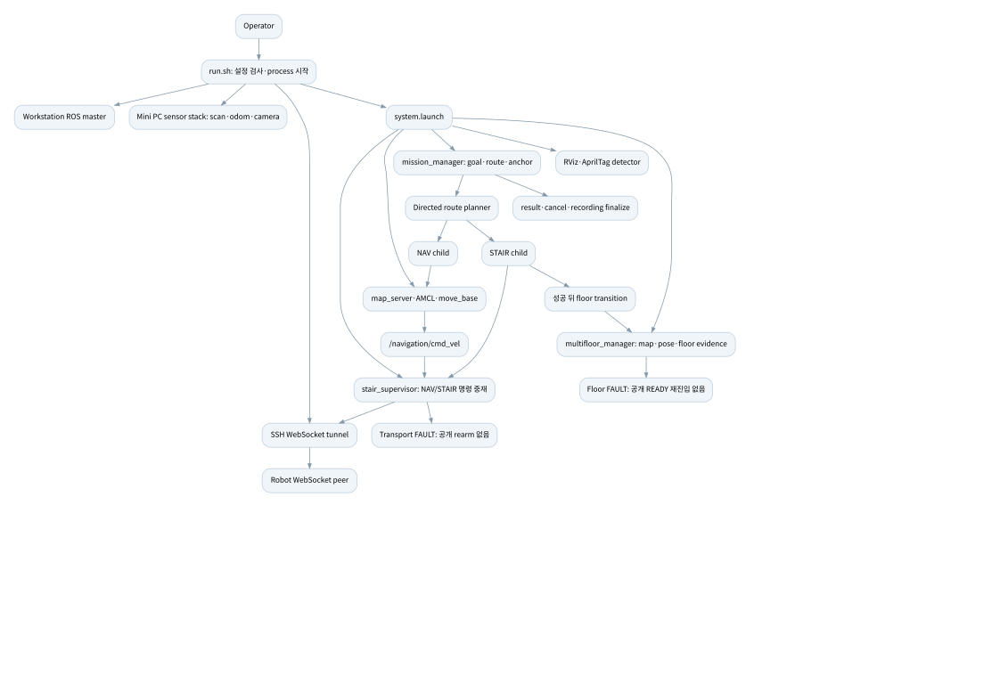
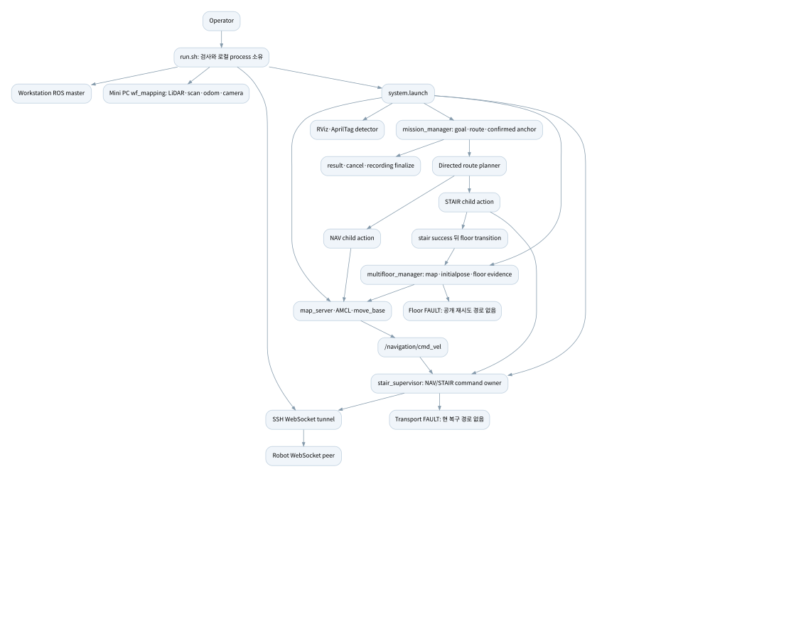

# TRON1 · 최종 시스템 감사

> 보관일: 2026-09-22. 원본 HTML을 당시 내용 그대로 옮긴 기록입니다. 현재 적용 상태는 [최신 적용 안내](../../APPLICATION_GUIDE.md)를 확인합니다.

원본: [audit-tron1-20260918/FINAL-AUDIT.html](/home/m3tron/.codex/.chatgpt-projects/g-p-6aa37f17097c81919ca6c59ce41e856c/audit-tron1-20260918/FINAL-AUDIT.html) · SHA-256: `b5a1cf4a87d2c643f5a902bb20097c589fa79de5536a389afe8804e0f5c26a7b`

---

TRON1 INDEPENDENT SYSTEM AUDIT[보고서 처음](#report-start)인쇄 · PDF Report contents READ-ONLY AUDIT / 2026.09.18

## 감사 완료 · 운용 승인은 BLOCKED

Safety와 Operational mobility를 별도로 평가했습니다. 실장비 운용 승인 또는 코드 수정 완료를 뜻하지 않습니다.

조정한 항목**5,523**미열람**0**핵심 결함**21**주요 제약**67**E2E 판정**15 / 15**선택 시험**85 통과 · 3 실패** 

# TRON1 독립 시스템 감사 최종 보고서

**AUDIT\_COMPLETE · 기준 snapshot: 2026-09-18T05:57:27.131751+00:00 (UTC)**

대상: `/home/m3tron/Desktop/TRON1_Control/TRON1_RViz_Navigation`의 현재 uncommitted worktree. 기준 HEAD `4d77a223ef6d0c898ebe9a44cc8a60a21904f2f0` (main). 감사일: 2026-09-18. 대상 코드를 수정하거나 로봇을 움직이지 않았다. 이 보고서와 연결된 원장·부록이 하나의 감사 결과다.

## 1\. Executive verdict

| 축                        | 판정          | 적용 범위와 이유                                                                                                                                                                                 |
| ------------------------ | ----------- | ----------------------------------------------------------------------------------------------------------------------------------------------------------------------------------------- |
| **Safety**               | **BLOCKED** | 무인 다층·계단 운용 승인 기준. 계단참 정지 판정과 취소 시 소유권 반환에 코드 반례가 있고(C-04), 준비 중 취소 뒤 새 child 전송(C-03), floor 소유권 검증 공백(C-10)이 남아 있다. 실제 사고가 발생했다는 판정은 아니다.                                               |
| **Operational mobility** | **BLOCKED** | 요청된 전체 임무 집합 기준. 깨끗한 단일 녹화 임무의 완료 순환(C-07), 결과 없는 child의 영구 BUSY(C-01), transport/floor 장애 후 공개 복구 경로 부재(B-02/C-02), camera 전역 준비 조건(B-01)이 정상 운용을 차단한다. 개별 평지 NAV까지 모두 실행 불가능하다는 뜻은 아니다. |

**핵심은 제약의 개수가 아니라 제약의 위치와 종료 조건이다.** 전역 시작 검사는 무관한 기능을 묶는 반면, 실제 계단참 정지·취소·지도 변경의 명령 소유권 증명은 충분하지 않다. 기존 세 application node와 실행기 안에서 대부분을 수정할 수 있다. 물리 외곽과 계단 임계값을 실측 없이 줄이거나, FAULT를 무조건 자동 해제하는 조치는 권고하지 않는다.

감사 범위는 조정 완료했다. **5,523 = READ 761 + METADATA\_ONLY 1,013 + EXCLUDED 3,749 + UNREAD 0**. 모든 inventory 항목을 분류했다는 뜻이며 metadata-only/excluded의 전체 내용을 읽었다는 뜻은 아니다. 주요 제약 67개, root-cause finding 21개, 요청 E2E 15개를 다룬다. 선택 시험은 **88 실행 / 85 통과 / 3 실패**다. 상세 완료 상태는 [완료조건 원장](/home/m3tron/.codex/.chatgpt-projects/g-p-6aa37f17097c81919ca6c59ce41e856c/audit-tron1-20260918/completion-check.json "/home/m3tron/.codex/.chatgpt-projects/g-p-6aa37f17097c81919ca6c59ce41e856c/audit-tron1-20260918/completion-check.json")을 따른다. 감사 완료는 실장비 commissioning 합격과 구별한다.

증거 등급은 **OBSERVED**(코드·설정·실행한 순수 시험·명시한 read-only 관찰), **INFERRED**(직접 근거들을 연결한 조건부 결과), **UNVERIFIED**(실장비·외부 조건 미확인)다. 정적 코드가 허용하는 경로와 현장에서 발생한 사건을 구분한다. S/M은 발생 확률이 아니라 영향 등급이다. S4는 충돌·추락·소유권 상실 가능성, S3는 fault 중 위험 명령, S2는 제한 조건의 안전 여유 부족, S1은 낮은 간접 영향, S0은 확인된 안전 영향 없음이다. M4는 해당 핵심 임무 불가능, M3는 복구 고착·전체 재시작 요구, M2는 특정 경로·기능 차단, M1은 낮은 간접 영향, M0은 확인된 주행 영향 없음이다.

## 2\. Architecture and ownership

OBSERVED: 구현된 주 흐름은 아래와 같다. 현재 실행 중인 전체 graph와 펌웨어의 독점 제어 정책은 UNVERIFIED다.

도표의 텍스트: Operator run.sh: 설정 검사·process 시작 Workstation ROS master Mini PC sensor stack: scan·odom·camera SSH WebSocket tunnel system.launch Robot WebSocket peer mission\_manager: goal·route·anchor multifloor\_manager: map·pose·floor evidence stair\_supervisor: NAV/STAIR 명령 중재 map\_server·AMCL·move\_base RViz·AprilTag detector Directed route planner result·cancel·recording finalize Floor FAULT: 공개 READY 재진입 없음 Transport FAULT: 공개 rearm 없음 /navigation/cmd\_vel NAV child STAIR child 성공 뒤 floor transition

원본 Mermaid 보기

    flowchart TD
      O["Operator"] --> R["run.sh: 설정 검사·process 시작"]
      R --> M["Workstation ROS master"]
      R --> X["Mini PC sensor stack: scan·odom·camera"]
      R --> T["SSH WebSocket tunnel"]
      R --> L["system.launch"]
      L --> MM["mission_manager: goal·route·anchor"]
      L --> FM["multifloor_manager: map·pose·floor evidence"]
      L --> S["stair_supervisor: NAV/STAIR 명령 중재"]
      L --> N["map_server·AMCL·move_base"]
      L --> V["RViz·AprilTag detector"]
      MM --> P["Directed route planner"]
      P --> NA["NAV child"]
      P --> ST["STAIR child"]
      NA --> N --> C["/navigation/cmd_vel"] --> S
      ST --> S --> T --> B["Robot WebSocket peer"]
      ST --> FT["성공 뒤 floor transition"] --> FM
      MM --> Z["result·cancel·recording finalize"]
      S --> F["Transport FAULT: 공개 rearm 없음"]
      FM --> F2["Floor FAULT: 공개 READY 재진입 없음"]

[소유권·topic·capability 전체 표](#appendix-1)에는 요청한 15개 resource의 시작·종료 주체, health, 자동복구, 영향 범위와 11개 topic 묶음의 freshness가 있다. [10개 장애 및 실제 수동 복구 표](#appendix-3)는 wf\_mapping/LiDAR/odom/camera/master/tunnel/stair FAULT/move\_base/RViz/Mini PC reboot를 시작 중과 운용 중으로 나눠 추적한다. 지원되지 않는 reset service나 개별 driver 재시작 명령을 만들어 제시하지 않았다.

중요한 소유권 경계:

  - **OBSERVED:** wrapper는 readiness 뒤 system roslaunch PID를 기다린다. 일반 child는 required/respawn 설정이 없으므로 하나의 node 사망이 전체 roslaunch 종료를 뜻하지 않는다. AprilTag detector의 명시적 respawn은 예외다. [run.sh:382](/home/m3tron/Desktop/TRON1_Control/TRON1_RViz_Navigation/run.sh "/home/m3tron/Desktop/TRON1_Control/TRON1_RViz_Navigation/run.sh:382"), [/opt/ros/noetic/lib/python3/dist-packages/roslaunch/core.py:432](/opt/ros/noetic/lib/python3/dist-packages/roslaunch/core.py "/opt/ros/noetic/lib/python3/dist-packages/roslaunch/core.py:432").
  - **OBSERVED upstream / INFERRED 영향:** master는 discovery·parameter·새 연결에 관여하지만 기존 TCPROS socket의 즉시 단절을 보장하지 않는다. master 단독 장애와 wrapper가 모든 child를 종료하는 경로를 구별한다. [/opt/ros/noetic/lib/python3/dist-packages/rospy/impl/tcpros\_base.py:666](/opt/ros/noetic/lib/python3/dist-packages/rospy/impl/tcpros_base.py "/opt/ros/noetic/lib/python3/dist-packages/rospy/impl/tcpros_base.py:666").
  - **OBSERVED:** supervisor는 NAV/STAIR state와 epoch 안에서 명령을 중재한다. STAND는 응답 성공을 확인하고 WALK/STAIR는 후속 상태도 확인한다. zero 송신과 mode 응답은 실물 정지 증명이 아니다. [src/stair\_supervisor/src/stair\_supervisor/robot\_transport.py:199](/home/m3tron/Desktop/TRON1_Control/TRON1_RViz_Navigation/src/stair_supervisor/src/stair_supervisor/robot_transport.py "/home/m3tron/Desktop/TRON1_Control/TRON1_RViz_Navigation/src/stair_supervisor/src/stair_supervisor/robot_transport.py:199").
  - **OBSERVED runtime:** 02:52:52/02:53:32 UTC read-only SSH에서 Mini PC `astra-web.service`는 active/enabled였다. 그때 조회에서 ROS 관련 process는 보이지 않았다. **UNVERIFIED:** 실제 command 충돌, 현재 전체 graph. 조회 명령과 결과: [remote-sensor-observation.txt](/home/m3tron/.codex/.chatgpt-projects/g-p-6aa37f17097c81919ca6c59ce41e856c/audit-tron1-20260918/remote-sensor-observation.txt "/home/m3tron/.codex/.chatgpt-projects/g-p-6aa37f17097c81919ca6c59ce41e856c/audit-tron1-20260918/remote-sensor-observation.txt"), [phase-C-continuation.md](/home/m3tron/.codex/.chatgpt-projects/g-p-6aa37f17097c81919ca6c59ce41e856c/audit-tron1-20260918/phase-C-continuation.md "/home/m3tron/.codex/.chatgpt-projects/g-p-6aa37f17097c81919ca6c59ce41e856c/audit-tron1-20260918/phase-C-continuation.md").

Capability 최소 dependency는 FLAT\_NAV의 map·localization·scan·odom/TF·planner·command transport, STAIR의 검증한 profile·entry·정지/진행·소유권 전환, FLOOR\_TRANSITION의 target identity·map/pose·costmap·소유권이다. camera/tag는 사용하는 localization/층전이에, 저장공간과 recorder는 RECORD\_ROUTE/INSPECT에 한정해야 한다. RVIZ\_ONLY에는 robot transport가 필요하지 않다. 새 subsystem 없이 기존 검사 함수의 적용 범위를 좁히는 방향이다.

## 3\. Safety and liveness invariants

| Invariant                                  | 축        | 보장 여부                   | 근거·위반 경로                                                                         |
| ------------------------------------------ | -------- | ----------------------- | -------------------------------------------------------------------------------- |
| 위험한 상태에서는 움직이지 않는다                         | Safety   | **보장되지 않음**             | OBSERVED C-04 정지/취소 반례, C-03 취소 뒤 전송. 실제 motion 결과 UNVERIFIED.                   |
| 정상 상태에서는 목적지까지 이동하고 결과를 받는다                | Liveness | **전체 집합에서 위반**          | C-07 정상 녹화 완료 순환, C-09 복귀 graph 반례; C-01 무결과 child는 INFERRED 고착.                 |
| 한 subsystem failure가 무관한 기능을 막지 않는다        | Liveness | **위반**                  | B-01 camera 부재의 전체 시작 차단·sensor 묶음 재시작. 운용 중 camera loss가 즉시 NAV를 막는다고는 하지 않음.   |
| 일시 장애는 영구 FAULT가 되지 않는다                    | Liveness | **budget 초과 경로에서 위반**   | B-02 terminal transport fault, C-02 floor fault. budget 내부 transient 회복은 구현돼 있음. |
| 모든 blocking state에 관찰 가능한 이유와 복구 방법이 있다    | 양쪽       | **부분 충족**               | fault detail은 있으나 READY/rearm 경로와 child 결과 deadline 부재. B-02/C-01/C-02.          |
| 물리 footprint 외 margin은 측정 근거를 가진다          | 양쪽       | **UNVERIFIED**          | K26–K30/K39–K43; body·여유·제동 실측과 current profile 연결 미확인.                          |
| cancel 수락 뒤 이전 준비 작업이 새 child를 만들지 않는다     | Safety   | **위반**                  | C-03 actual source body+fake-peer 결정적 interleaving.                              |
| 지도 전이는 현재 command owner가 허용한 epoch에서만 일어난다 | Safety   | **보장되지 않음**             | C-10 action field 미전달/미검증. 직접 floor action 경로.                                   |
| 물리 이동 성공과 논리 anchor가 일치한다                  | 양쪽       | **보장되지 않음**             | C-06 recorder 실패 뒤 anchor 반환 누락, C-11 독립 startup 입력.                             |
| 관측/replay가 운용 명령에 섞이지 않는다                  | Safety   | **일반 viewer에서 보장되지 않음** | E-04 master 재사용/all-topic replay. 다른 격리 replay 도구의 보호는 인정.                       |

### 상태머신에서 반증한 과장

OBSERVED: mission은 매 goal에 새 FSM을 만들고 정상 terminal 뒤 active handle을 해제한다. RESET 미호출만으로 모든 다음 goal이 막히는 구조가 아니다. NAV 재시도는 최대 2회이며, 일반 RETRY 경로가 있다는 이유만으로 production 무한 재시도를 확정하지 않았다. disabled stair edge는 제외되지만 평면 NAV edge는 남는다. 일반 NAV는 recorder 저장공간 검사 때문에 차단되지 않는다. [src/mission\_manager/src/mission\_manager/mission\_orchestrator.py:69](/home/m3tron/Desktop/TRON1_Control/TRON1_RViz_Navigation/src/mission_manager/src/mission_manager/mission_orchestrator.py "/home/m3tron/Desktop/TRON1_Control/TRON1_RViz_Navigation/src/mission_manager/src/mission_manager/mission_orchestrator.py:69"), [src/mission\_manager/src/mission\_manager/mission\_action\_server.py:134](/home/m3tron/Desktop/TRON1_Control/TRON1_RViz_Navigation/src/mission_manager/src/mission_manager/mission_action_server.py "/home/m3tron/Desktop/TRON1_Control/TRON1_RViz_Navigation/src/mission_manager/src/mission_manager/mission_action_server.py:134"), [src/mission\_manager/src/mission\_manager/navigation\_executor.py:187](/home/m3tron/Desktop/TRON1_Control/TRON1_RViz_Navigation/src/mission_manager/src/mission_manager/navigation_executor.py "/home/m3tron/Desktop/TRON1_Control/TRON1_RViz_Navigation/src/mission_manager/src/mission_manager/navigation_executor.py:187"), [src/mission\_manager/src/mission\_manager/route\_planner.py:223](/home/m3tron/Desktop/TRON1_Control/TRON1_RViz_Navigation/src/mission_manager/src/mission_manager/route_planner.py "/home/m3tron/Desktop/TRON1_Control/TRON1_RViz_Navigation/src/mission_manager/src/mission_manager/route_planner.py:223").

### 계단 phase가 실제로 증명하는 것

아래는 OBSERVED 코드 조건이다. 실제 지지면·미끄럼·추락 여유는 UNVERIFIED이며 phase 이름으로 입증하지 않는다. 근거: [src/stair\_supervisor/src/stair\_supervisor/stair\_evidence.py:135](/home/m3tron/Desktop/TRON1_Control/TRON1_RViz_Navigation/src/stair_supervisor/src/stair_supervisor/stair_evidence.py "/home/m3tron/Desktop/TRON1_Control/TRON1_RViz_Navigation/src/stair_supervisor/src/stair_supervisor/stair_evidence.py:135"), [src/mission\_manager/src/mission\_manager/stair\_entry\_gate.py:115](/home/m3tron/Desktop/TRON1_Control/TRON1_RViz_Navigation/src/mission_manager/src/mission_manager/stair_entry_gate.py "/home/m3tron/Desktop/TRON1_Control/TRON1_RViz_Navigation/src/mission_manager/src/mission_manager/stair_entry_gate.py:115"), K11–K15/K54–K55.

| Phase                  | 실제 조건                         | 안전·주행 한계와 최소 방향                                                        |
| ---------------------- | ----------------------------- | ---------------------------------------------------------------------- |
| VERIFY\_ENTRY          | 새 odom과 per-sample stationary | mission의 절대 entry pose gate는 별도 존재. 수용 step보다 느슨한 stationary 기준 수정 필요. |
| ALIGN                  | 새 odom 표본                     | phase 자체가 새 절대 alignment를 증명하지 않음. 앞선 entry 검증과 혼동 금지.                 |
| FORWARD\_SEGMENT\_1    | odom 투영거리+0.50m tolerance     | wheel slip/누적오차와 실물 landing을 구별할 독립 관측 미확인.                            |
| LANDING                | 작은 연속 step의 5초 dwell          | 5초 2.02m 이동도 완료하는 순수 반례. 누적 이동·속도·실제 지지면으로 기존 gate 보강.                 |
| TURN\_TO\_NEXT\_FLIGHT | 누적 yaw와 tolerance             | 실제 회전 여유나 landing 지지면은 증명하지 못함. 기존 TURN 입력 보강 우선.                      |
| FORWARD\_SEGMENT\_2    | 두 번째 odom 투영거리                | 첫 flight와 같은 한계. 방향별 UP/DOWN 검증을 서로 대신할 수 없음.                          |
| EXIT\_CONFIRM          | odom stationary dwell         | 실물 출구·안정 지지 확인과 동일하지 않음. 검증된 정지 뒤 owner 반환 필요.                         |

0.12초 sample gap, 0.20초 freshness, **traversal 전체 300초** deadline은 코드 설정이다. 300초를 phase별 timeout으로 해석하지 않는다. 과거 bag의 기록 간격은 callback 간격·물리 상태와 동일하지 않으므로 단독 근거로 임계를 늘리지 않는다. cancel은 즉시 zero 필요성과 검증된 NAV 소유권 반환을 분리해야 하며 새 phase/node가 반드시 필요한 근거는 없다.

### 시작 위치·localization

**OBSERVED:** 3F는 기본값이지 구조적 필수 조건이 아니다. map YAML, initial\_floor, AMCL pose, mission location은 독립 입력이다. known location 이름만 바꿔도 pose가 자동으로 맞춰지는 계약은 없다. floor map fingerprint의 startup READY가 실제 pose/anchor 일치까지 증명하지 않으며 빈 route는 localization 검증 없이 성공할 수 있다(C-11).

| 시작 요청                | 현재 평가                                     | 기존 구조 안의 최소 운영 표면 제안                                                         |
| -------------------- | ----------------------------------------- | ---------------------------------------------------------------------------- |
| 3F HOME              | 입력과 실제 위치가 일치할 때만 조건부                     | map/floor/pose/anchor를 한 구성에서 선택·검증                                          |
| 등록 4F 또는 5F location | 가능하지만 map/pose/anchor 자동 연동 없음            | `--start-at LOCATION_ID`에서 등록 위치의 네 값을 원자적으로 도출                              |
| 임의 floor+pose        | pose는 알려도 graph anchor는 자동 증명 안 됨         | `--start-floor FLOOR --start-pose X Y YAW`; 주행 가능한 첫 연결이 확인될 때 anchor commit |
| floor만 지정            | 지도 선택/전체 공간 localization orchestration 미완 | `--start-floor FLOOR --auto-localize`; bounded 수렴 확인 뒤 유효 연결 선택              |
| AprilTag로 floor 확인   | tag 정책은 있지만 항상 보이는 조건은 아님                 | 태그 기반 획득·층 확인 때만 사용. 일반 복도 NAV 상시 gate로 확대하지 않음                              |

위 CLI는 **현재 구현된 옵션이 아니라 제안**이다. nearest anchor도 현재 자동 기능이 아니며 거리만으로 벽 반대편·연결 불가 anchor를 선택하면 안 된다. global localization 서비스는 upstream에 존재하고 particle 분포를 재설정하지만 응답 true가 수렴 성공은 아니다. nomotion은 강제 갱신 flag를 세운다. 새 pose 생산·scan 일관성·여러 관측·대칭 복도 구별을 bounded acquisition으로 연결하고, 실패는 해당 획득만 재시도하게 한다. 작은 covariance만으로 정답 pose를 확정하지 않는다. [공식 AMCL source](/home/m3tron/.codex/.chatgpt-projects/g-p-6aa37f17097c81919ca6c59ce41e856c/audit-tron1-20260918/upstream/amcl__src__amcl_node.cpp "/home/m3tron/.codex/.chatgpt-projects/g-p-6aa37f17097c81919ca6c59ce41e856c/audit-tron1-20260918/upstream/amcl__src__amcl_node.cpp")의 1089(global), 1106(nomotion), 1205/1366(update/publication) 및 [URL·hash 원장](/home/m3tron/.codex/.chatgpt-projects/g-p-6aa37f17097c81919ca6c59ce41e856c/audit-tron1-20260918/upstream/manifest.json "/home/m3tron/.codex/.chatgpt-projects/g-p-6aa37f17097c81919ca6c59ce41e856c/audit-tron1-20260918/upstream/manifest.json")을 대조했다. 서비스를 실행하지 않았다.

## 4\. Overconstraint findings

각 항목의 OBSERVED 문장이 trigger와 구현 근거이고, INFERRED 문장이 정상 시나리오의 차단 영향을 설명한다. 관련 증상은 같은 ID에 묶었다.

### B-01 · 요청 capability와 무관한 준비 조건이 전체 시작을 막는다

**Safety S1 / Mobility M3**

제약·경계: 전역 camera/tag/action/site bundle readiness와 sensor 묶음 재시작. 보호하려는 hazard: 실제 사용하는 센서·서버 부재 상태에서 명령 시작.

**OBSERVED · trigger/근거:** run.sh는 camera/info/tag와 모든 action을 준비 조건으로 요구하며 camera 한 개 부재도 wf\_mapping 전체 restart branch로 간다. site loader는 모든 층·scan/stair 구성도 검사한다.

**INFERRED · 영향/과잉 범위:** 정상 LiDAR·odom·map을 가진 FLAT\_NAV가 camera 또는 무관한 층 설정 때문에 시작하지 못한다.

**UNVERIFIED · 적용 한계:** 현재 camera 장애율·재시작 중 실제 기체 영향. tag 빈 array는 startup을 통과할 수 있어 미검출 자체가 항상 차단은 아니다.

근거: [run.sh:70](/home/m3tron/Desktop/TRON1_Control/TRON1_RViz_Navigation/run.sh "/home/m3tron/Desktop/TRON1_Control/TRON1_RViz_Navigation/run.sh:70"), [run.sh:225](/home/m3tron/Desktop/TRON1_Control/TRON1_RViz_Navigation/run.sh "/home/m3tron/Desktop/TRON1_Control/TRON1_RViz_Navigation/run.sh:225"), [run.sh:348](/home/m3tron/Desktop/TRON1_Control/TRON1_RViz_Navigation/run.sh "/home/m3tron/Desktop/TRON1_Control/TRON1_RViz_Navigation/run.sh:348"), [src/mission\_manager/src/mission\_manager/site\_config.py:200](/home/m3tron/Desktop/TRON1_Control/TRON1_RViz_Navigation/src/mission_manager/src/mission_manager/site_config.py "/home/m3tron/Desktop/TRON1_Control/TRON1_RViz_Navigation/src/mission_manager/src/mission_manager/site_config.py:200").

**최소 수정:** 기존 startup 검사에 요청 capability와 해당 route의 의존성 집합을 적용한다. camera/tag는 관련 전이·획득에만 요구한다. **복구:** 센서 프로세스가 제공하는 최소 restart 경계를 확인해 camera 복구가 정상 LiDAR/odom을 끊지 않게 한다. **필요 시험:** camera 없음/빈 tag array/무관한 층 결함에서도 유효한 flat route; camera restart 중 scan/odom 연속성.

### B-02 · 통신 budget 초과 뒤 정상 통신이 돌아와도 FAULT가 풀리지 않는다

**Safety S1 / Mobility M3**

제약·경계: transport FAULT latch, timer 정지, tunnel reconnect 없음. 보호하려는 hazard: 불확실한 세션으로 명령 재전송.

**OBSERVED · trigger/근거:** outage budget 내부의 짧은 send 오류는 허용하지만 초과 후 transport/supervisor가 faulted 상태를 유지한다. 자동 reconnect/reset 인터페이스가 없다.

**INFERRED · 영향/과잉 범위:** 일시적 tunnel 상실이 node/session 재생성을 요구해 정상 주행을 장기간 막는다.

**UNVERIFIED · 적용 한계:** 실제 disconnect 시 펌웨어 watchdog, reconnect 시 zero/모드 안정성.

근거: [src/stair\_supervisor/src/stair\_supervisor/robot\_transport.py:81](/home/m3tron/Desktop/TRON1_Control/TRON1_RViz_Navigation/src/stair_supervisor/src/stair_supervisor/robot_transport.py "/home/m3tron/Desktop/TRON1_Control/TRON1_RViz_Navigation/src/stair_supervisor/src/stair_supervisor/robot_transport.py:81"), [src/stair\_supervisor/src/stair\_supervisor/robot\_transport.py:185](/home/m3tron/Desktop/TRON1_Control/TRON1_RViz_Navigation/src/stair_supervisor/src/stair_supervisor/robot_transport.py "/home/m3tron/Desktop/TRON1_Control/TRON1_RViz_Navigation/src/stair_supervisor/src/stair_supervisor/robot_transport.py:185"), [src/stair\_supervisor/src/stair\_supervisor/ros\_node.py:145](/home/m3tron/Desktop/TRON1_Control/TRON1_RViz_Navigation/src/stair_supervisor/src/stair_supervisor/ros_node.py "/home/m3tron/Desktop/TRON1_Control/TRON1_RViz_Navigation/src/stair_supervisor/src/stair_supervisor/ros_node.py:145"), [run.sh:382](/home/m3tron/Desktop/TRON1_Control/TRON1_RViz_Navigation/run.sh "/home/m3tron/Desktop/TRON1_Control/TRON1_RViz_Navigation/run.sh:382").

**최소 수정:** 기존 owner 안에서 횟수·시간이 제한된 새 세션 연결을 지원한다. 이전 명령/epoch를 폐기하고 zero 및 실제 mode 확인 뒤에만 재허용한다. **복구:** 전체 system 재시작 대신 해당 transport/session만 복구한다. 불명확한 계단 자세는 자동 NAV 복귀시키지 않는다. **필요 시험:** budget 내/초과 장애, 늦은 mode 응답, stale 명령 재전송 없음, reconnect 실패 후 관측 가능한 원인.

### B-04 · move\_base 시작이 불완전 TF 검사와 RViz helper에 묶인다

**Safety S1 / Mobility M2**

제약·경계: TF 무한 대기와 동기 XMLRPC helper. 보호하려는 hazard: 위치 변환이 없는 planner 시작.

**OBSERVED · trigger/근거:** wrapper는 map frame 문자열을 찾고 /rviz\_navigation helper를 동기로 호출한다. launch RViz 이름은 /rviz이며 helper RPC 명시 timeout은 없다. 일부 SSH 작업도 연결 뒤 remote command 전체 실행 deadline이 없다.

**INFERRED · 영향/과잉 범위:** reachable하지만 응답 없는 helper는 planner 시작을 묶을 수 있다. historical unknown-node 오류는 실제로 비치명적이었다.

**UNVERIFIED · 적용 한계:** 현재 endpoint hang 재현과 실제 TF 시작 지연.

근거: [src/multifloor\_manager/scripts/wait\_for\_tf\_exec.sh:17](/home/m3tron/Desktop/TRON1_Control/TRON1_RViz_Navigation/src/multifloor_manager/scripts/wait_for_tf_exec.sh "/home/m3tron/Desktop/TRON1_Control/TRON1_RViz_Navigation/src/multifloor_manager/scripts/wait_for_tf_exec.sh:17"), [src/multifloor\_manager/scripts/rviz\_tf\_reconnect.py:25](/home/m3tron/Desktop/TRON1_Control/TRON1_RViz_Navigation/src/multifloor_manager/scripts/rviz_tf_reconnect.py "/home/m3tron/Desktop/TRON1_Control/TRON1_RViz_Navigation/src/multifloor_manager/scripts/rviz_tf_reconnect.py:25"), [src/mission\_manager/launch/system.launch:81](/home/m3tron/Desktop/TRON1_Control/TRON1_RViz_Navigation/src/mission_manager/launch/system.launch "/home/m3tron/Desktop/TRON1_Control/TRON1_RViz_Navigation/src/mission_manager/launch/system.launch:81"), [run.sh:127](/home/m3tron/Desktop/TRON1_Control/TRON1_RViz_Navigation/run.sh "/home/m3tron/Desktop/TRON1_Control/TRON1_RViz_Navigation/run.sh:127"), [run.sh:131](/home/m3tron/Desktop/TRON1_Control/TRON1_RViz_Navigation/run.sh "/home/m3tron/Desktop/TRON1_Control/TRON1_RViz_Navigation/run.sh:131").

**최소 수정:** 실제 map→base\_Link chain과 age를 제한된 시간 안에 확인하고 visualization 보조 작업을 planner 시작 조건에서 분리한다. **복구:** RViz만 재시작할 수 있게 하며 TF 부재에는 정확한 frame/age 이유를 출력한다. **필요 시험:** RViz 없음/종료/hanging RPC, map 문자열은 있지만 base chain 없음, TF 회복 후 planner 시작.

### C-01 · child가 terminal을 보내지 않으면 부모 mission이 계속 BUSY다

**Safety S2 / Mobility M3**

제약·경계: deadline 없는 child wait, segment 시작에만 health 검사. 보호하려는 hazard: 동시에 여러 mission이 command ownership을 갖는 상황.

**OBSERVED · trigger/근거:** NAV/stair/floor wait\_for\_result에 timeout이 없고 installed actionlib의 기본 0은 무한 대기다. active handle이 있는 동안 다음 goal은 BUSY다.

**INFERRED · 영향/과잉 범위:** child 서버 또는 cancel ACK 상실 시 정지·종료 확인 없이 부모가 끝나지 않을 수 있다.

**UNVERIFIED · 적용 한계:** 현재 ROS 서버 단절 interleaving의 실제 발생 빈도.

근거: [src/mission\_manager/src/mission\_manager/navigation\_executor.py:290](/home/m3tron/Desktop/TRON1_Control/TRON1_RViz_Navigation/src/mission_manager/src/mission_manager/navigation_executor.py "/home/m3tron/Desktop/TRON1_Control/TRON1_RViz_Navigation/src/mission_manager/src/mission_manager/navigation_executor.py:290"), [src/mission\_manager/src/mission\_manager/ros\_segments.py:175](/home/m3tron/Desktop/TRON1_Control/TRON1_RViz_Navigation/src/mission_manager/src/mission_manager/ros_segments.py "/home/m3tron/Desktop/TRON1_Control/TRON1_RViz_Navigation/src/mission_manager/src/mission_manager/ros_segments.py:175"), [src/mission\_manager/src/mission\_manager/ros\_segments.py:202](/home/m3tron/Desktop/TRON1_Control/TRON1_RViz_Navigation/src/mission_manager/src/mission_manager/ros_segments.py "/home/m3tron/Desktop/TRON1_Control/TRON1_RViz_Navigation/src/mission_manager/src/mission_manager/ros_segments.py:202"), [src/mission\_manager/src/mission\_manager/mission\_action\_server.py:82](/home/m3tron/Desktop/TRON1_Control/TRON1_RViz_Navigation/src/mission_manager/src/mission_manager/mission_action_server.py "/home/m3tron/Desktop/TRON1_Control/TRON1_RViz_Navigation/src/mission_manager/src/mission_manager/mission_action_server.py:82"), [/opt/ros/noetic/lib/python3/dist-packages/actionlib/simple\_action\_client.py:120](/opt/ros/noetic/lib/python3/dist-packages/actionlib/simple_action_client.py "/opt/ros/noetic/lib/python3/dist-packages/actionlib/simple_action_client.py:120").

**최소 수정:** 기존 executor의 monotonic deadline·health poll·bounded cancel acknowledgement를 연결한다. **복구:** timeout만으로 owner를 버리지 말고 이전 child 정지/격리 후 다음 goal을 허용한다. 정상 terminal 뒤 handle 해제는 이미 존재한다. **필요 시험:** terminal 없는 fake child, server 없음, cancel ACK 상실, 복구 후 새 goal.

### C-02 · floor 전이 실패가 floor identity와 재시도 경로를 함께 잃는다

**Safety S2 / Mobility M3**

제약·경계: READY-only admission, 실패 시 빈 floor FAULT. 보호하려는 hazard: 불확실한 지도/층으로 NAV.

**OBSERVED · trigger/근거:** 실패 후 evidence를 지우며 빈 floor\_id로 FAULT를 발행한다. 새 전이는 READY를 요구하고 map callback은 UNKNOWN 초기화에서만 READY로 바꾼다. service timeout 뒤 worker가 나중에 완료하는 순수 반례도 확인했다.

**INFERRED · 영향/과잉 범위:** 외부 change\_map이 FAULT 뒤 완료될 수 있고 센서가 회복돼도 현재 공개 action으로 재시도하지 못한다.

**UNVERIFIED · 적용 한계:** 실 service 지연 중 실제 map 변경 시각.

근거: [src/multifloor\_manager/src/multifloor\_manager/ros\_node.py:115](/home/m3tron/Desktop/TRON1_Control/TRON1_RViz_Navigation/src/multifloor_manager/src/multifloor_manager/ros_node.py "/home/m3tron/Desktop/TRON1_Control/TRON1_RViz_Navigation/src/multifloor_manager/src/multifloor_manager/ros_node.py:115"), [src/multifloor\_manager/src/multifloor\_manager/ros\_node.py:199](/home/m3tron/Desktop/TRON1_Control/TRON1_RViz_Navigation/src/multifloor_manager/src/multifloor_manager/ros_node.py "/home/m3tron/Desktop/TRON1_Control/TRON1_RViz_Navigation/src/multifloor_manager/src/multifloor_manager/ros_node.py:199"), [src/multifloor\_manager/src/multifloor\_manager/ros\_runtime.py:221](/home/m3tron/Desktop/TRON1_Control/TRON1_RViz_Navigation/src/multifloor_manager/src/multifloor_manager/ros_runtime.py "/home/m3tron/Desktop/TRON1_Control/TRON1_RViz_Navigation/src/multifloor_manager/src/multifloor_manager/ros_runtime.py:221"), [src/multifloor\_manager/src/multifloor\_manager/ros\_services.py:33](/home/m3tron/Desktop/TRON1_Control/TRON1_RViz_Navigation/src/multifloor_manager/src/multifloor_manager/ros_services.py "/home/m3tron/Desktop/TRON1_Control/TRON1_RViz_Navigation/src/multifloor_manager/src/multifloor_manager/ros_services.py:33"), [logic-probe-resume2.json](/home/m3tron/.codex/.chatgpt-projects/g-p-6aa37f17097c81919ca6c59ce41e856c/audit-tron1-20260918/logic-probe-resume2.json "/home/m3tron/.codex/.chatgpt-projects/g-p-6aa37f17097c81919ca6c59ce41e856c/audit-tron1-20260918/logic-probe-resume2.json").

**최소 수정:** 실패 단계·마지막 확정 identity와 외부 작업 상태를 보존한다. 기존 transaction에서 실제 map을 재관측해 일관된 identity만 재승인한다. **복구:** map 변경 전/후 실패를 나눈 제한적 retry. 단순 FAULT 해제로 NAV를 열지 않는다. **필요 시험:** tag timeout, map 변경 후 localization timeout, late service completion, 취소 후 재관측·새 goal.

### C-05 · 같은 전이에서 확정한 floor 사실이 후속 작업 시간 때문에 만료된다

**Safety S1 / Mobility M2**

제약·경계: T\_FLOOR\_CONFIRMED의 10초 freshness. 보호하려는 hazard: 오래되거나 다른 floor 증거의 재사용.

**OBSERVED · trigger/근거:** floor 확인 timestamp는 한 번 기록되고 최종 gate에서는 localized/costmap만 갱신한다. 순수 probe에서 11초 뒤 다른 조건이 fresh여도 floor만 stale로 실패했다.

**INFERRED · 영향/과잉 범위:** 정상 map load/localization 시간이 길면 성공 가능한 전이가 실패하고 C-02의 복구 불가 FAULT로 이어진다.

**UNVERIFIED · 적용 한계:** 현장 발생 빈도.

근거: [src/multifloor\_manager/src/multifloor\_manager/ros\_node.py:220](/home/m3tron/Desktop/TRON1_Control/TRON1_RViz_Navigation/src/multifloor_manager/src/multifloor_manager/ros_node.py "/home/m3tron/Desktop/TRON1_Control/TRON1_RViz_Navigation/src/multifloor_manager/src/multifloor_manager/ros_node.py:220"), [src/multifloor\_manager/src/multifloor\_manager/ros\_node.py:145](/home/m3tron/Desktop/TRON1_Control/TRON1_RViz_Navigation/src/multifloor_manager/src/multifloor_manager/ros_node.py "/home/m3tron/Desktop/TRON1_Control/TRON1_RViz_Navigation/src/multifloor_manager/src/multifloor_manager/ros_node.py:145"), [src/multifloor\_manager/src/multifloor\_manager/transitions.py:214](/home/m3tron/Desktop/TRON1_Control/TRON1_RViz_Navigation/src/multifloor_manager/src/multifloor_manager/transitions.py "/home/m3tron/Desktop/TRON1_Control/TRON1_RViz_Navigation/src/multifloor_manager/src/multifloor_manager/transitions.py:214"), [src/multifloor\_manager/config/transitions.yaml:20](/home/m3tron/Desktop/TRON1_Control/TRON1_RViz_Navigation/src/multifloor_manager/config/transitions.yaml "/home/m3tron/Desktop/TRON1_Control/TRON1_RViz_Navigation/src/multifloor_manager/config/transitions.yaml:20"), [pure-C-probe.json](/home/m3tron/.codex/.chatgpt-projects/g-p-6aa37f17097c81919ca6c59ce41e856c/audit-tron1-20260918/pure-C-probe.json "/home/m3tron/.codex/.chatgpt-projects/g-p-6aa37f17097c81919ca6c59ce41e856c/audit-tron1-20260918/pure-C-probe.json").

**최소 수정:** 같은 epoch의 확정 사실과 연속 센서 신선도를 구분한다. 반대 층 관측/epoch 교체 때 사실을 무효화한다. **복구:** 후속 작업 지연이 floor 재확정과 전체 재시작으로 번지지 않게 한다. **필요 시험:** 9초/11초 지연, 반대 floor evidence, epoch 교체, 오랜 실제 전이.

### C-07 · 녹화 검증이 아직 발행할 수 없는 자기 mission 결과를 기다린다

**Safety S1 / Mobility M4**

제약·경계: 필수 /mission/result topic count. 보호하려는 hazard: 누락된 기록을 성공으로 보고.

**OBSERVED · trigger/근거:** production scan profile은 /mission/result를 필수로 요구한다. recorder finalize/검증 뒤 orchestrator가 반환하고 그 뒤에 부모 terminal을 발행한다. result publisher는 non-latched다.

**INFERRED · 영향/과잉 범위:** 다른 mission 결과가 없는 정상 단일 RECORD\_ROUTE/같은 profile 녹화는 자체 결과로 필수 count를 만족시킬 수 없다. unrelated reject 결과가 우연히 count를 채워도 identity 검증이 아니다.

**UNVERIFIED · 적용 한계:** 실장비 clean mission 실행; /tron/imu 필수 경로의 실제 publisher 유무.

근거: [src/mission\_manager/config/scan\_profiles.yaml:15](/home/m3tron/Desktop/TRON1_Control/TRON1_RViz_Navigation/src/mission_manager/config/scan_profiles.yaml "/home/m3tron/Desktop/TRON1_Control/TRON1_RViz_Navigation/src/mission_manager/config/scan_profiles.yaml:15"), [src/mission\_manager/src/mission\_manager/scan\_recorder.py:211](/home/m3tron/Desktop/TRON1_Control/TRON1_RViz_Navigation/src/mission_manager/src/mission_manager/scan_recorder.py "/home/m3tron/Desktop/TRON1_Control/TRON1_RViz_Navigation/src/mission_manager/src/mission_manager/scan_recorder.py:211"), [src/mission\_manager/src/mission\_manager/record\_route\_runner.py:218](/home/m3tron/Desktop/TRON1_Control/TRON1_RViz_Navigation/src/mission_manager/src/mission_manager/record_route_runner.py "/home/m3tron/Desktop/TRON1_Control/TRON1_RViz_Navigation/src/mission_manager/src/mission_manager/record_route_runner.py:218"), [src/mission\_manager/src/mission\_manager/mission\_action\_server.py:123](/home/m3tron/Desktop/TRON1_Control/TRON1_RViz_Navigation/src/mission_manager/src/mission_manager/mission_action_server.py "/home/m3tron/Desktop/TRON1_Control/TRON1_RViz_Navigation/src/mission_manager/src/mission_manager/mission_action_server.py:123"), [/opt/ros/noetic/lib/python3/dist-packages/actionlib/action\_server.py:141](/opt/ros/noetic/lib/python3/dist-packages/actionlib/action_server.py "/opt/ros/noetic/lib/python3/dist-packages/actionlib/action_server.py:141"), [/opt/ros/noetic/lib/python3/dist-packages/rospy/topics.py:812](/opt/ros/noetic/lib/python3/dist-packages/rospy/topics.py "/opt/ros/noetic/lib/python3/dist-packages/rospy/topics.py:812").

**최소 수정:** 자기 terminal을 진행 중 녹화의 mandatory sensor 집합에서 제거하고 final result/manifest에 mission\_id로 결합한다. IMU topic도 실제 계약과 일치시킨다. **복구:** 녹화 실패를 이동 성공/confirmed anchor와 분리하여 결과를 반환한다. **필요 시험:** unrelated result가 없는 clean finalize와 unrelated result 주입을 구별; production profile 그대로 테스트.

### C-08 · 정지한 stair 진입에서 요구하는 새 AMCL 표본을 스스로 생산시키지 않는다

**Safety S1 / Mobility M3**

제약·경계: handoff 후 새 pose3개/2초 제한. 보호하려는 hazard: 이전 위치·방향으로 계단 진입.

**OBSERVED · trigger/근거:** entry fence 뒤 복수 AMCL pose를 요구하지만 이 준비 경로에는 nomotion 요청이 없다. 공식 AMCL의 TF 재발행은 pose 새 표본 발행과 같은 계약이 아니다.

**INFERRED · 영향/과잉 범위:** 정상적으로 정지한 로봇이 pose3개를 얻지 못해 entry timeout될 수 있다.

**UNVERIFIED · 적용 한계:** 설치 binary/실제 정지 AMCL의 발행과 jitter, 발생 빈도.

근거: [src/mission\_manager/src/mission\_manager/ros\_state.py:191](/home/m3tron/Desktop/TRON1_Control/TRON1_RViz_Navigation/src/mission_manager/src/mission_manager/ros_state.py "/home/m3tron/Desktop/TRON1_Control/TRON1_RViz_Navigation/src/mission_manager/src/mission_manager/ros_state.py:191"), [src/mission\_manager/src/mission\_manager/stair\_entry\_gate.py:115](/home/m3tron/Desktop/TRON1_Control/TRON1_RViz_Navigation/src/mission_manager/src/mission_manager/stair_entry_gate.py "/home/m3tron/Desktop/TRON1_Control/TRON1_RViz_Navigation/src/mission_manager/src/mission_manager/stair_entry_gate.py:115"), [src/mission\_manager/src/mission\_manager/ros\_runtime.py:77](/home/m3tron/Desktop/TRON1_Control/TRON1_RViz_Navigation/src/mission_manager/src/mission_manager/ros_runtime.py "/home/m3tron/Desktop/TRON1_Control/TRON1_RViz_Navigation/src/mission_manager/src/mission_manager/ros_runtime.py:77"), [upstream/amcl**src**amcl\_node.cpp:1106](/home/m3tron/.codex/.chatgpt-projects/g-p-6aa37f17097c81919ca6c59ce41e856c/audit-tron1-20260918/upstream/amcl__src__amcl_node.cpp "/home/m3tron/.codex/.chatgpt-projects/g-p-6aa37f17097c81919ca6c59ce41e856c/audit-tron1-20260918/upstream/amcl__src__amcl_node.cpp:1106"), [upstream/amcl**src**amcl\_node.cpp:1205](/home/m3tron/.codex/.chatgpt-projects/g-p-6aa37f17097c81919ca6c59ce41e856c/audit-tron1-20260918/upstream/amcl__src__amcl_node.cpp "/home/m3tron/.codex/.chatgpt-projects/g-p-6aa37f17097c81919ca6c59ce41e856c/audit-tron1-20260918/upstream/amcl__src__amcl_node.cpp:1205"), [upstream/amcl**src**amcl\_node.cpp:1366](/home/m3tron/.codex/.chatgpt-projects/g-p-6aa37f17097c81919ca6c59ce41e856c/audit-tron1-20260918/upstream/amcl__src__amcl_node.cpp "/home/m3tron/.codex/.chatgpt-projects/g-p-6aa37f17097c81919ca6c59ce41e856c/audit-tron1-20260918/upstream/amcl__src__amcl_node.cpp:1366").

**최소 수정:** 기존 entry 경로에서 bounded nomotion/pose acquisition을 연결한다. floor/위치/방향 검증은 유지한다. **복구:** 새 표본 획득 실패 원인과 재시도를 보이되 transport 전체 FAULT와 분리한다. **필요 시험:** 정지 AMCL 계약 peer, 충분한 fresh pose, wrong floor, covariance 불량, timeout 후 재시도.

### C-09 · production graph의 복귀 NAV 연결이 빠져 있다

**Safety S1 / Mobility M2**

제약·경계: directed route 존재 조건. 보호하려는 hazard: 물리적으로 검증하지 않은 경로의 임의 추정.

**OBSERVED · trigger/근거:** production planner에서 stair\_5f\_to\_rf→home\_3f 및 stair\_4f\_to\_5f→home\_3f가 no directed route였다. fixture에는 reverse NAV 연결이 존재한다.

**INFERRED · 영향/과잉 범위:** outbound 성공 가능한 위치에서도 return\_after\_task가 계획되지 않는다.

**UNVERIFIED · 적용 한계:** 역방향 통로의 물리적 안전·통행 가능성.

근거: [src/mission\_manager/config/building\_graph.yaml:16](/home/m3tron/Desktop/TRON1_Control/TRON1_RViz_Navigation/src/mission_manager/config/building_graph.yaml "/home/m3tron/Desktop/TRON1_Control/TRON1_RViz_Navigation/src/mission_manager/config/building_graph.yaml:16"), [src/mission\_manager/src/mission\_manager/route\_planner.py:193](/home/m3tron/Desktop/TRON1_Control/TRON1_RViz_Navigation/src/mission_manager/src/mission_manager/route_planner.py "/home/m3tron/Desktop/TRON1_Control/TRON1_RViz_Navigation/src/mission_manager/src/mission_manager/route_planner.py:193"), [pure-C-probe.json](/home/m3tron/.codex/.chatgpt-projects/g-p-6aa37f17097c81919ca6c59ce41e856c/audit-tron1-20260918/pure-C-probe.json "/home/m3tron/.codex/.chatgpt-projects/g-p-6aa37f17097c81919ca6c59ce41e856c/audit-tron1-20260918/pure-C-probe.json").

**최소 수정:** 현장에서 확인한 복귀 edge만 기존 graph에 추가하고 outward/return을 시작 전에 둘 다 계획한다. **복구:** 실패를 출발 전에 설명하고 이미 도달한 anchor는 보존한다. **필요 시험:** production graph 모든 지원 출발지/복귀 조합; 역방향 edge를 무조건 생성하지 않는 음성 시험.

## 5\. Safety and correctness findings

### B-03 · 종료 순서가 shutdown zero 전에 통신 경로를 제거할 수 있다

**Safety S3 / Mobility M1**

제약·경계: cleanup master→tunnel→system signal 순서. 보호하려는 hazard: 종료 중 마지막 nonzero 명령 잔류.

**OBSERVED · trigger/근거:** cleanup은 master와 tunnel에 먼저 종료 신호를 보내고 system을 종료한다. transport close는 연결된 session으로 zero를 보내려 한다.

**INFERRED · 영향/과잉 범위:** supervisor의 stop 시도가 tunnel 제거와 경합해 전송되지 않을 수 있다.

**UNVERIFIED · 적용 한계:** 실제 기체 지속 motion과 펌웨어 watchdog 효과.

근거: [run.sh:198](/home/m3tron/Desktop/TRON1_Control/TRON1_RViz_Navigation/run.sh "/home/m3tron/Desktop/TRON1_Control/TRON1_RViz_Navigation/run.sh:198"), [src/stair\_supervisor/src/stair\_supervisor/robot\_transport.py:261](/home/m3tron/Desktop/TRON1_Control/TRON1_RViz_Navigation/src/stair_supervisor/src/stair_supervisor/robot_transport.py "/home/m3tron/Desktop/TRON1_Control/TRON1_RViz_Navigation/src/stair_supervisor/src/stair_supervisor/robot_transport.py:261").

**최소 수정:** system/supervisor의 bounded stop 시도·종료를 먼저 기다린 뒤 tunnel/master를 정리한다. **복구:** 무한 shutdown 대기 없이 결과와 미확인 zero 전달을 분리 기록한다. **필요 시험:** fake transport signal order, stop timeout, 이미 끊어진 tunnel에서 종료.

### C-03 · 준비 대기 중 취소한 뒤 새 child goal이 전송된다

**Safety S3 / Mobility M2**

제약·경계: cancel predicate와 dispatch ownership의 분리. 보호하려는 hazard: 취소된 mission의 후속 이동.

**OBSERVED · trigger/근거:** 실제 RosSegmentExecutor class body를 fake peer로 실행한 순수 반례에서 entry/server wait 중 parent cancel 후 새 stair/floor goal이 전송됐고 predicate 호출은0회였다.

**INFERRED · 영향/과잉 범위:** 실제 ROS에서도 같은 선후관계면 취소 후 새 움직임 요청이 발생할 수 있다.

**UNVERIFIED · 적용 한계:** 실 ROS/기체 interleaving과 motion.

근거: [src/mission\_manager/src/mission\_manager/ros\_segments.py:101](/home/m3tron/Desktop/TRON1_Control/TRON1_RViz_Navigation/src/mission_manager/src/mission_manager/ros_segments.py "/home/m3tron/Desktop/TRON1_Control/TRON1_RViz_Navigation/src/mission_manager/src/mission_manager/ros_segments.py:101"), [src/mission\_manager/src/mission\_manager/ros\_segments.py:147](/home/m3tron/Desktop/TRON1_Control/TRON1_RViz_Navigation/src/mission_manager/src/mission_manager/ros_segments.py "/home/m3tron/Desktop/TRON1_Control/TRON1_RViz_Navigation/src/mission_manager/src/mission_manager/ros_segments.py:147"), [src/mission\_manager/src/mission\_manager/ros\_segments.py:193](/home/m3tron/Desktop/TRON1_Control/TRON1_RViz_Navigation/src/mission_manager/src/mission_manager/ros_segments.py "/home/m3tron/Desktop/TRON1_Control/TRON1_RViz_Navigation/src/mission_manager/src/mission_manager/ros_segments.py:193"), [src/mission\_manager/src/mission\_manager/navigation\_executor.py:181](/home/m3tron/Desktop/TRON1_Control/TRON1_RViz_Navigation/src/mission_manager/src/mission_manager/navigation_executor.py "/home/m3tron/Desktop/TRON1_Control/TRON1_RViz_Navigation/src/mission_manager/src/mission_manager/navigation_executor.py:181"), [logic-probe-resume2.json](/home/m3tron/.codex/.chatgpt-projects/g-p-6aa37f17097c81919ca6c59ce41e856c/audit-tron1-20260918/logic-probe-resume2.json "/home/m3tron/.codex/.chatgpt-projects/g-p-6aa37f17097c81919ca6c59ce41e856c/audit-tron1-20260918/logic-probe-resume2.json").

**최소 수정:** 준비 대기·전송 직전에 같은 context cancellation/epoch를 확인하고 send/cancel을 같은 owner 경계에서 직렬화한다. **복구:** 취소가 terminal로 끝난 뒤 old callback/goal을 폐기하고 새 mission을 허용한다. **필요 시험:** entry 대기/server 대기/NAV 진입의 결정적 cancel interleaving; 취소 뒤 새 goal.

### C-04 · 계단참·정지 확인보다 phase 이름과 odom 증분을 신뢰한다

**Safety S4 / Mobility M2**

제약·경계: LANDING/EXIT dwell 및 checkpoint cancel. 보호하려는 hazard: 계단참 도달 전 회전·불안정 상태 mode 해제.

**OBSERVED · trigger/근거:** 수용 odom step상한0.1m보다 stationary tolerance0.5m가 크다. 5초간2.02m 누적 이동해도 LANDING 완료 반례가 나온다. LANDING report incomplete 또는 faulted여도 cancel이 먼저 처리돼 stair mode 해제/NAV 복귀한 반례도 있다. flight 명령은 고정 linear와 yaw=0이며 odom evidence는 완료/fault 판정에 쓰인다. 이 경로에는 계단 상대 횡오차·heading의 능동 보정이 없고 WebSocket y 명령도 0이다.

**INFERRED · 영향/과잉 범위:** wheel slip/drift나 불완전 landing 상태에서 turn 또는 NAV 재허용 가능성이 있다.

**UNVERIFIED · 적용 한계:** 실물 추락/충돌 발생, 층·UP/DOWN별 profile 실측 승인. 현재 enabled YAML을 과거 blocked 자료로 정당화할 수 없다. 외부 펌웨어의 자세 제어와 실제 lateral drift는 미검증이다.

근거: [src/stair\_supervisor/src/stair\_supervisor/stair\_evidence.py:110](/home/m3tron/Desktop/TRON1_Control/TRON1_RViz_Navigation/src/stair_supervisor/src/stair_supervisor/stair_evidence.py "/home/m3tron/Desktop/TRON1_Control/TRON1_RViz_Navigation/src/stair_supervisor/src/stair_supervisor/stair_evidence.py:110"), [src/stair\_supervisor/src/stair\_supervisor/stair\_evidence.py:184](/home/m3tron/Desktop/TRON1_Control/TRON1_RViz_Navigation/src/stair_supervisor/src/stair_supervisor/stair_evidence.py "/home/m3tron/Desktop/TRON1_Control/TRON1_RViz_Navigation/src/stair_supervisor/src/stair_supervisor/stair_evidence.py:184"), [src/stair\_supervisor/src/stair\_supervisor/stair\_evidence.py:211](/home/m3tron/Desktop/TRON1_Control/TRON1_RViz_Navigation/src/stair_supervisor/src/stair_supervisor/stair_evidence.py "/home/m3tron/Desktop/TRON1_Control/TRON1_RViz_Navigation/src/stair_supervisor/src/stair_supervisor/stair_evidence.py:211"), [src/stair\_supervisor/src/stair\_supervisor/supervisor.py:171](/home/m3tron/Desktop/TRON1_Control/TRON1_RViz_Navigation/src/stair_supervisor/src/stair_supervisor/supervisor.py "/home/m3tron/Desktop/TRON1_Control/TRON1_RViz_Navigation/src/stair_supervisor/src/stair_supervisor/supervisor.py:171"), [src/stair\_supervisor/src/stair\_supervisor/supervisor.py:218](/home/m3tron/Desktop/TRON1_Control/TRON1_RViz_Navigation/src/stair_supervisor/src/stair_supervisor/supervisor.py "/home/m3tron/Desktop/TRON1_Control/TRON1_RViz_Navigation/src/stair_supervisor/src/stair_supervisor/supervisor.py:218"), [src/stair\_supervisor/config/stair\_profiles.yaml:16](/home/m3tron/Desktop/TRON1_Control/TRON1_RViz_Navigation/src/stair_supervisor/config/stair_profiles.yaml "/home/m3tron/Desktop/TRON1_Control/TRON1_RViz_Navigation/src/stair_supervisor/config/stair_profiles.yaml:16"), [pure-C-probe.json](/home/m3tron/.codex/.chatgpt-projects/g-p-6aa37f17097c81919ca6c59ce41e856c/audit-tron1-20260918/pure-C-probe.json "/home/m3tron/.codex/.chatgpt-projects/g-p-6aa37f17097c81919ca6c59ce41e856c/audit-tron1-20260918/pure-C-probe.json"), [selected-tests-resume2.json](/home/m3tron/.codex/.chatgpt-projects/g-p-6aa37f17097c81919ca6c59ce41e856c/audit-tron1-20260918/selected-tests-resume2.json "/home/m3tron/.codex/.chatgpt-projects/g-p-6aa37f17097c81919ca6c59ce41e856c/audit-tron1-20260918/selected-tests-resume2.json"), [src/stair\_supervisor/src/stair\_supervisor/supervisor.py:191](/home/m3tron/Desktop/TRON1_Control/TRON1_RViz_Navigation/src/stair_supervisor/src/stair_supervisor/supervisor.py "/home/m3tron/Desktop/TRON1_Control/TRON1_RViz_Navigation/src/stair_supervisor/src/stair_supervisor/supervisor.py:191"), [src/stair\_supervisor/src/stair\_supervisor/robot\_conversion.py:25](/home/m3tron/Desktop/TRON1_Control/TRON1_RViz_Navigation/src/stair_supervisor/src/stair_supervisor/robot_conversion.py "/home/m3tron/Desktop/TRON1_Control/TRON1_RViz_Navigation/src/stair_supervisor/src/stair_supervisor/robot_conversion.py:25").

**최소 수정:** 기존 LANDING/TURN gate에서 누적 이동·실제 정지·독립 지지/landing 관측을 분리한다. report fault 우선순위를 정리하고 phase 이름만으로 mode/owner를 해제하지 않는다. **복구:** 위험 정지는 지연시키지 않되 mode 해제와 NAV 복귀는 실제 자세·정지 증거를 요구한다. **필요 시험:** 누적 미세 이동, wheel slip, incomplete/faulted checkpoint+cancel, 층별·방향별 독립 commissioning.

### C-06 · 이동 성공 직후 recorder 오류가 confirmed anchor 반환을 끊는다

**Safety S1 / Mobility M2**

제약·경계: NEXT\_SEGMENT에서 허용되지 않는 SEGMENT\_FAILED event. 보호하려는 hazard: 실제 도달 위치와 다음 계획의 출발점 불일치.

**OBSERVED · trigger/근거:** 순수 probe에서 NAV 성공 직후 recorder.assert\_active 오류가 NEXT\_SEGMENT+SEGMENT\_FAILED 예외를 만들고 RecordRouteOutcome을 반환하지 않았다.

**INFERRED · 영향/과잉 범위:** 부모 anchor가 실제 성공 segment를 반영하지 못해 다음 route의 시작점이 틀릴 수 있다.

**UNVERIFIED · 적용 한계:** 실기체 다음 goal 영향.

근거: [src/mission\_manager/src/mission\_manager/record\_route\_runner.py:169](/home/m3tron/Desktop/TRON1_Control/TRON1_RViz_Navigation/src/mission_manager/src/mission_manager/record_route_runner.py "/home/m3tron/Desktop/TRON1_Control/TRON1_RViz_Navigation/src/mission_manager/src/mission_manager/record_route_runner.py:169"), [src/mission\_manager/src/mission\_manager/fsm.py:65](/home/m3tron/Desktop/TRON1_Control/TRON1_RViz_Navigation/src/mission_manager/src/mission_manager/fsm.py "/home/m3tron/Desktop/TRON1_Control/TRON1_RViz_Navigation/src/mission_manager/src/mission_manager/fsm.py:65"), [src/mission\_manager/src/mission\_manager/mission\_orchestrator.py:67](/home/m3tron/Desktop/TRON1_Control/TRON1_RViz_Navigation/src/mission_manager/src/mission_manager/mission_orchestrator.py "/home/m3tron/Desktop/TRON1_Control/TRON1_RViz_Navigation/src/mission_manager/src/mission_manager/mission_orchestrator.py:67"), [pure-C-probe.json](/home/m3tron/.codex/.chatgpt-projects/g-p-6aa37f17097c81919ca6c59ce41e856c/audit-tron1-20260918/pure-C-probe.json "/home/m3tron/.codex/.chatgpt-projects/g-p-6aa37f17097c81919ca6c59ce41e856c/audit-tron1-20260918/pure-C-probe.json").

**최소 수정:** 기존 FSM에서 해당 실패를 정의된 event로 처리하고 성공한 anchor를 오류 outcome에도 반환한다. **복구:** recording 실패와 movement 성공을 동시에 표현하며 다음 goal의 source를 보존한다. **필요 시험:** NAV 성공 직후 recorder 종료, artifact 실패 후 anchor/다음 route 검사.

### C-10 · floor action의 ownership epoch가 선언만 있고 검증되지 않는다

**Safety S3 / Mobility M2**

제약·경계: 공개 floor action admission. 보호하려는 hazard: NAV 중 map 교체/다른 owner의 floor 전이.

**OBSERVED · trigger/근거:** action 필드 stair\_ownership\_epoch는 client에서 채우지 않고 server에서도 읽지 않는다. READY/target 검사는 있으나 supervisor owner·NAV 정지를 확인하지 않고 change\_map을 먼저 호출한다.

**INFERRED · 영향/과잉 범위:** 직접 child action을 호출하는 접근 가능한 ROS peer가 정상 mission 순서를 우회할 수 있다.

**UNVERIFIED · 적용 한계:** 실제 외부 peer·침입·동시 map 전이 관찰은 없음.

근거: [src/multifloor\_manager/action/FloorTransition.action:3](/home/m3tron/Desktop/TRON1_Control/TRON1_RViz_Navigation/src/multifloor_manager/action/FloorTransition.action "/home/m3tron/Desktop/TRON1_Control/TRON1_RViz_Navigation/src/multifloor_manager/action/FloorTransition.action:3"), [src/mission\_manager/src/mission\_manager/ros\_segments.py:199](/home/m3tron/Desktop/TRON1_Control/TRON1_RViz_Navigation/src/mission_manager/src/mission_manager/ros_segments.py "/home/m3tron/Desktop/TRON1_Control/TRON1_RViz_Navigation/src/mission_manager/src/mission_manager/ros_segments.py:199"), [src/multifloor\_manager/src/multifloor\_manager/ros\_node.py:189](/home/m3tron/Desktop/TRON1_Control/TRON1_RViz_Navigation/src/multifloor_manager/src/multifloor_manager/ros_node.py "/home/m3tron/Desktop/TRON1_Control/TRON1_RViz_Navigation/src/multifloor_manager/src/multifloor_manager/ros_node.py:189"), [src/multifloor\_manager/src/multifloor\_manager/ros\_node.py:225](/home/m3tron/Desktop/TRON1_Control/TRON1_RViz_Navigation/src/multifloor_manager/src/multifloor_manager/ros_node.py "/home/m3tron/Desktop/TRON1_Control/TRON1_RViz_Navigation/src/multifloor_manager/src/multifloor_manager/ros_node.py:225").

**최소 수정:** 기존 action boundary에서 현재 owner의 handoff/epoch와 정지를 검증하고 전이 동안 NAV를 재허용하지 않는다. **복구:** stale/reused epoch는 해당 action만 거부하고 정상 handoff는 재시도 가능하게 한다. **필요 시험:** NAV 활성 direct floor goal, stale epoch, 정상 stair→floor handoff.

### C-11 · 시작 map·floor·pose·logical anchor가 독립적으로 달라질 수 있다

**Safety S2 / Mobility M2**

제약·경계: 초기 map identity와 임의 initial location 신뢰. 보호하려는 hazard: 잘못된 층·출발점으로 route 실행.

**OBSERVED · trigger/근거:** run.sh는 floor/location/pose를 각각 전달하고 map\_yaml은 전달하지 않아 system 기본3F map이 남는다. 초기 anchor는 즉시 신뢰되며 동일 anchor 빈 route는 pose 확인 없이 성공한다.

**INFERRED · 영향/과잉 범위:** floor만5F로 바꾸면 READY 실패, 동일 층 arbitrary pose에서는 잘못된 route 시작 또는 무이동 성공 가능성이 있다.

**UNVERIFIED · 적용 한계:** 실제 오위치 주행 및 symmetric corridor global localization 수렴.

근거: [run.sh:249](/home/m3tron/Desktop/TRON1_Control/TRON1_RViz_Navigation/run.sh "/home/m3tron/Desktop/TRON1_Control/TRON1_RViz_Navigation/run.sh:249"), [src/mission\_manager/launch/system.launch:6](/home/m3tron/Desktop/TRON1_Control/TRON1_RViz_Navigation/src/mission_manager/launch/system.launch "/home/m3tron/Desktop/TRON1_Control/TRON1_RViz_Navigation/src/mission_manager/launch/system.launch:6"), [src/multifloor\_manager/src/multifloor\_manager/ros\_callbacks.py:36](/home/m3tron/Desktop/TRON1_Control/TRON1_RViz_Navigation/src/multifloor_manager/src/multifloor_manager/ros_callbacks.py "/home/m3tron/Desktop/TRON1_Control/TRON1_RViz_Navigation/src/multifloor_manager/src/multifloor_manager/ros_callbacks.py:36"), [src/mission\_manager/src/mission\_manager/mission\_orchestrator.py:43](/home/m3tron/Desktop/TRON1_Control/TRON1_RViz_Navigation/src/mission_manager/src/mission_manager/mission_orchestrator.py "/home/m3tron/Desktop/TRON1_Control/TRON1_RViz_Navigation/src/mission_manager/src/mission_manager/mission_orchestrator.py:43"), [src/mission\_manager/src/mission\_manager/mission\_orchestrator.py:85](/home/m3tron/Desktop/TRON1_Control/TRON1_RViz_Navigation/src/mission_manager/src/mission_manager/mission_orchestrator.py "/home/m3tron/Desktop/TRON1_Control/TRON1_RViz_Navigation/src/mission_manager/src/mission_manager/mission_orchestrator.py:85").

**최소 수정:** 기존 설정 로더에서 location→floor→map→pose를 한 번에 결정한다. 임의 pose는 localization 확인 뒤 접근 가능한 graph anchor에 연결한다. **복구:** registered start와 arbitrary start를 기존 wrapper 옵션으로 구분한다. nearest 거리만으로 올바른 복도를 승인하지 않는다. **필요 시험:** 4F/5F registered start, floor-only, pose-anchor mismatch, 빈 route, symmetric map ambiguity.

### D-01 · costmap current가 최신 scan 수신을 보장하지 않는다

**Safety S2 / Mobility M1**

제약·경계: expected\_update\_rate 기본0. 보호하려는 hazard: 센서 상실 중 오래된 장애물 정보로 주행.

**OBSERVED · trigger/근거:** repository는 expected\_update\_rate를 생략한다. 공식 observation\_buffer는0이면 항상current이며 persistence0도 최신 한 관측 보존이다. mission/supervisor의 일반 NAV health는 scan age를 직접 검사하지 않는다.

**INFERRED · 영향/과잉 범위:** TF가 계속 유효한 scan-only 장애에서는 current gate가 독립 scan freshness를 보장하지 않는다.

**UNVERIFIED · 적용 한계:** 실 blind driving·정확한 중지시간. AMCL/TF age로 간접 정지할 수도 있다.

근거: [src/multifloor\_manager/config/nav/local\_costmap\_params.yaml:14](/home/m3tron/Desktop/TRON1_Control/TRON1_RViz_Navigation/src/multifloor_manager/config/nav/local_costmap_params.yaml "/home/m3tron/Desktop/TRON1_Control/TRON1_RViz_Navigation/src/multifloor_manager/config/nav/local_costmap_params.yaml:14"), [upstream/costmap\_2d**plugins**obstacle\_layer.cpp:96](/home/m3tron/.codex/.chatgpt-projects/g-p-6aa37f17097c81919ca6c59ce41e856c/audit-tron1-20260918/upstream/costmap_2d__plugins__obstacle_layer.cpp "/home/m3tron/.codex/.chatgpt-projects/g-p-6aa37f17097c81919ca6c59ce41e856c/audit-tron1-20260918/upstream/costmap_2d__plugins__obstacle_layer.cpp:96"), [upstream/costmap\_2d**src**observation\_buffer.cpp:231](/home/m3tron/.codex/.chatgpt-projects/g-p-6aa37f17097c81919ca6c59ce41e856c/audit-tron1-20260918/upstream/costmap_2d__src__observation_buffer.cpp "/home/m3tron/.codex/.chatgpt-projects/g-p-6aa37f17097c81919ca6c59ce41e856c/audit-tron1-20260918/upstream/costmap_2d__src__observation_buffer.cpp:231"), [upstream/move\_base**src**move\_base.cpp:829](/home/m3tron/.codex/.chatgpt-projects/g-p-6aa37f17097c81919ca6c59ce41e856c/audit-tron1-20260918/upstream/move_base__src__move_base.cpp "/home/m3tron/.codex/.chatgpt-projects/g-p-6aa37f17097c81919ca6c59ce41e856c/audit-tron1-20260918/upstream/move_base__src__move_base.cpp:829"), [src/mission\_manager/src/mission\_manager/ros\_state.py:151](/home/m3tron/Desktop/TRON1_Control/TRON1_RViz_Navigation/src/mission_manager/src/mission_manager/ros_state.py "/home/m3tron/Desktop/TRON1_Control/TRON1_RViz_Navigation/src/mission_manager/src/mission_manager/ros_state.py:151").

**최소 수정:** 기존 observation buffer에 측정된 scan gap budget을 적용한다. 짧은 gap을 전체 FAULT로 만들지 않는다. **복구:** fresh sample이 돌아오면 current가 자동회복되는 범위를 검증한다. **필요 시험:** TF 정상인 scan-only 상실/회복, 긴 outage, 정상 jitter 분포.

### E-01 · 수동 녹화의 무동작 설명과 원격 SDK listener 자동 시작 시도가 다르다

**Safety S2 / Mobility M2**

제약·경계: 기본 SENSOR\_JOY\_RECEIVER\_AUTOSTART=1. 보호하려는 hazard: 예상하지 못한 robot SDK 초기화와 command ownership 간섭.

**OBSERVED · trigger/근거:** 문서는 robot software를 시작하지 않는다고 설명하지만 wrapper는 listener가 없으면 SSH 시작을 시도한다. bridge는 Robot.init을 호출한다. 원격 root의 HOME 문자열은 single quote 안에서 확장되지 않으며 시작 실패 뒤에도 started PID를 출력할 수 있다.

**INFERRED · 영향/과잉 범위:** 운영자는 관측-only로 오인하거나 false success 때문에 기록 준비를 잘못 판단할 수 있다.

**UNVERIFIED · 적용 한계:** 실제 listener 시작과 SDK의 기체 ownership 효과. 이 감사에서 실행하지 않음.

근거: [docs/manual-mission-capture-ko.md:4](/home/m3tron/Desktop/TRON1_Control/TRON1_RViz_Navigation/docs/manual-mission-capture-ko.md "/home/m3tron/Desktop/TRON1_Control/TRON1_RViz_Navigation/docs/manual-mission-capture-ko.md:4"), [run.sh:14](/home/m3tron/Desktop/TRON1_Control/TRON1_RViz_Navigation/run.sh "/home/m3tron/Desktop/TRON1_Control/TRON1_RViz_Navigation/run.sh:14"), [run.sh:47](/home/m3tron/Desktop/TRON1_Control/TRON1_RViz_Navigation/run.sh "/home/m3tron/Desktop/TRON1_Control/TRON1_RViz_Navigation/run.sh:47"), [run.sh:50](/home/m3tron/Desktop/TRON1_Control/TRON1_RViz_Navigation/run.sh "/home/m3tron/Desktop/TRON1_Control/TRON1_RViz_Navigation/run.sh:50"), [config.env:30](/home/m3tron/Desktop/TRON1_Control/TRON1_RViz_Navigation/config.env "/home/m3tron/Desktop/TRON1_Control/TRON1_RViz_Navigation/config.env:30"), [sensor\_joy\_bridge.py:64](/home/m3tron/Desktop/TRON1_Control/TRON1_RViz_Navigation/sensor_joy_bridge.py "/home/m3tron/Desktop/TRON1_Control/TRON1_RViz_Navigation/sensor_joy_bridge.py:64").

**최소 수정:** 기존 flag로 원격 시작을 명시적 선택에 한정하고 문서와 일치시킨다. remote path quoting과 실패 전파·callback health 확인을 수정한다. **복구:** listener 재사용과 새 생성을 구분하고 실제 준비 여부를 보고한다. **필요 시험:** 기본capture원격시작0, opt-in정확히1개,HOME확장/실패전파,SDKownership확인.

### E-02 · 현재 설정·문서·시험·배포 산출물의 계약이 어긋나 있다

**Safety S2 / Mobility M2**

제약·경계: 오래된 expectation 및 scope 없는 완료 표시. 보호하려는 hazard: 잘못된 운영 명령·잘못된 합격 판단.

**OBSERVED · trigger/근거:** 현재 configured/enabled=true와 disabled 문서, 존재하지 않는 roof\_scan 예시, 삭제된 scan launch·과거 속도·옛 action 필드의 테스트 3실패가 확인됐다. 실패 bag에는 음수 cmd 74개가 있으나 RCA는 없다고 서술한다. 과거 다른 저장소·blocked 기록의 COMPLETE는 현재 장비의 합격을 뜻하지 않는다. source→install 선별78개는 39동일/30상이/9없음이며 profile과 generated StairTraversal 계약도 다르다. 기본 run.sh는 devel을 source하고 devel loader는 현재 source를 가리킨다. 명시적 직접 launch override에서는 fixture 설정과 real transport가 섞일 수 있다.

**INFERRED · 영향/과잉 범위:** 과거 assertion에 맞추려 로컬 scan publisher를 복원하거나, 잘못된 후진 기록 해석으로 임계를 조정하면 실제 운용 구조를 악화시킬 수 있다.

**UNVERIFIED · 적용 한계:** 현재 기체에 로드된 binary/parameter 및 profile commissioning 승인. 정상 run.sh가 옛 install을 실행한다는 뜻이 아니다.

근거: [README.md:233](/home/m3tron/Desktop/TRON1_Control/TRON1_RViz_Navigation/README.md "/home/m3tron/Desktop/TRON1_Control/TRON1_RViz_Navigation/README.md:233"), [docs/navigation-perception-network-incident-rca-ko.md:449](/home/m3tron/Desktop/TRON1_Control/TRON1_RViz_Navigation/docs/navigation-perception-network-incident-rca-ko.md "/home/m3tron/Desktop/TRON1_Control/TRON1_RViz_Navigation/docs/navigation-perception-network-incident-rca-ko.md:449"), [docs/transition-policy-state-machine.md:23](/home/m3tron/Desktop/TRON1_Control/TRON1_RViz_Navigation/docs/transition-policy-state-machine.md "/home/m3tron/Desktop/TRON1_Control/TRON1_RViz_Navigation/docs/transition-policy-state-machine.md:23"), [test/test\_system\_operator\_contract.py:50](/home/m3tron/Desktop/TRON1_Control/TRON1_RViz_Navigation/test/test_system_operator_contract.py "/home/m3tron/Desktop/TRON1_Control/TRON1_RViz_Navigation/test/test_system_operator_contract.py:50"), [selected-contracts-resume4.json](/home/m3tron/.codex/.chatgpt-projects/g-p-6aa37f17097c81919ca6c59ce41e856c/audit-tron1-20260918/selected-contracts-resume4.json "/home/m3tron/.codex/.chatgpt-projects/g-p-6aa37f17097c81919ca6c59ce41e856c/audit-tron1-20260918/selected-contracts-resume4.json"), [bag-nav-attempts.json](/home/m3tron/.codex/.chatgpt-projects/g-p-6aa37f17097c81919ca6c59ce41e856c/audit-tron1-20260918/bag-nav-attempts.json "/home/m3tron/.codex/.chatgpt-projects/g-p-6aa37f17097c81919ca6c59ce41e856c/audit-tron1-20260918/bag-nav-attempts.json"), [.omo/start-work/ledger.jsonl:117](/home/m3tron/Desktop/TRON1_Control/TRON1_RViz_Navigation/.omo/start-work/ledger.jsonl "/home/m3tron/Desktop/TRON1_Control/TRON1_RViz_Navigation/.omo/start-work/ledger.jsonl:117"), [src/mission\_manager/launch/system.launch:53](/home/m3tron/Desktop/TRON1_Control/TRON1_RViz_Navigation/src/mission_manager/launch/system.launch "/home/m3tron/Desktop/TRON1_Control/TRON1_RViz_Navigation/src/mission_manager/launch/system.launch:53"), [src/mission\_manager/src/mission\_manager/ros\_runtime.py:41](/home/m3tron/Desktop/TRON1_Control/TRON1_RViz_Navigation/src/mission_manager/src/mission_manager/ros_runtime.py "/home/m3tron/Desktop/TRON1_Control/TRON1_RViz_Navigation/src/mission_manager/src/mission_manager/ros_runtime.py:41"), [src/stair\_supervisor/src/stair\_supervisor/ros\_entrypoint.py:95](/home/m3tron/Desktop/TRON1_Control/TRON1_RViz_Navigation/src/stair_supervisor/src/stair_supervisor/ros_entrypoint.py "/home/m3tron/Desktop/TRON1_Control/TRON1_RViz_Navigation/src/stair_supervisor/src/stair_supervisor/ros_entrypoint.py:95"), [phase-E-security-final.md](#appendix-5).

**최소 수정:** 현재 owner·ID·API를 기준으로 문서와 테스트를 동기화한다. 완료를 software/fixture/blocked/hardware 범위별로 표시하고 source/devel/install provenance를 기록한다. **복구:** 운영 mode별 명령과 복구 절차를 구분해 실제 적용값을 보이게 한다. **필요 시험:** 문서 ID/옵션 계약, production loader, 원본 bag 음수 count, source/install 차이와 실제 실행 origin 확인.

### E-03 · 합성시험의 성공이 물리 주행·계단 증거로 확대될 수 있다

**Safety S2 / Mobility M2**

제약·경계: phase·동일 profile을 따라가는 fake sensor와 fixture 차이. 보호하려는 hazard: 잘못된 안전·주행 승인.

**OBSERVED · trigger/근거:** fake move\_base는 collision 검사 없이 성공하고 synthetic odom은 supervisor phase와 같은 profile 목표를 따라간다. fixture에는 production recorder/result 순환조건과 return edge 누락이 없다.

**INFERRED · 영향/과잉 범위:** plumbing 시험이 통과해도 C-04 정지 증명, C-07 녹화 완료, C-08 정지 AMCL, C-09 return 문제를 놓친다.

**UNVERIFIED · 적용 한계:** 실제 통로 통과·독립 UP/DOWN 성공률. 과거 STAND/WALK 접촉 기록은 있지만 해당 검증과 다르다.

근거: [src/mission\_manager/test/synthetic\_hardware\_peers.py:158](/home/m3tron/Desktop/TRON1_Control/TRON1_RViz_Navigation/src/mission_manager/test/synthetic_hardware_peers.py "/home/m3tron/Desktop/TRON1_Control/TRON1_RViz_Navigation/src/mission_manager/test/synthetic_hardware_peers.py:158"), [src/mission\_manager/test/synthetic\_hardware\_peers.py:195](/home/m3tron/Desktop/TRON1_Control/TRON1_RViz_Navigation/src/mission_manager/test/synthetic_hardware_peers.py "/home/m3tron/Desktop/TRON1_Control/TRON1_RViz_Navigation/src/mission_manager/test/synthetic_hardware_peers.py:195"), [src/mission\_manager/test/synthetic\_hardware\_peers.py:251](/home/m3tron/Desktop/TRON1_Control/TRON1_RViz_Navigation/src/mission_manager/test/synthetic_hardware_peers.py "/home/m3tron/Desktop/TRON1_Control/TRON1_RViz_Navigation/src/mission_manager/test/synthetic_hardware_peers.py:251"), [test/fixtures/building\_valid/scan\_profiles.yaml:1](/home/m3tron/Desktop/TRON1_Control/TRON1_RViz_Navigation/test/fixtures/building_valid/scan_profiles.yaml "/home/m3tron/Desktop/TRON1_Control/TRON1_RViz_Navigation/test/fixtures/building_valid/scan_profiles.yaml:1"), [test/test\_command\_provenance\_contract.py:23](/home/m3tron/Desktop/TRON1_Control/TRON1_RViz_Navigation/test/test_command_provenance_contract.py "/home/m3tron/Desktop/TRON1_Control/TRON1_RViz_Navigation/test/test_command_provenance_contract.py:23"), [src/mission\_manager/test/synthetic\_hardware\_peers.py:165](/home/m3tron/Desktop/TRON1_Control/TRON1_RViz_Navigation/src/mission_manager/test/synthetic_hardware_peers.py "/home/m3tron/Desktop/TRON1_Control/TRON1_RViz_Navigation/src/mission_manager/test/synthetic_hardware_peers.py:165").

**최소 수정:** 기존 synthetic 시험은 plumbing 검증용으로 유지한다. phase 출력을 보지 않는 고정 sensor trace와 production 계약을 추가하고 독립 물리 oracle을 둔다. **복구:** 실패·blocked 표본도 분모에 남기고 합격 범위를 좁게 표시한다. **필요 시험:** productioncleanrecorder,stationaryAMCL,고정trace누적drift,실제directedreturn,장애후회복.

### E-04 · 일반 bag viewer가 운용 master에 명령·clock·TF를 재주입할 수 있다

**Safety S4 / Mobility M3**

제약·경계: 기존 localhost:11311 master 재사용과 전체 topic replay. 보호하려는 hazard: 과거 goal/속도의 재주입에 따른 기체 움직임 또는 관측 오염.

**OBSERVED · trigger/근거:** replay\_bag\_rviz.sh는 기존 master를 재사용하고 use\_sim\_time을 변경해 전체 bag을 재생한다. 인자로 받을 수 있는 stair bag에 goal4개/cmd801개가 있다. 마지막 exec는 EXIT trap을 대체한다.

**INFERRED · 영향/과잉 범위:** 같은 운용 master에서 command가 들어 있는 bag을 재생하면 명령·시간·TF가 섞일 수 있고 정리도 보장되지 않는다.

**UNVERIFIED · 적용 한계:** 실제 replay와 기체 움직임은 실행하지 않았다. 기본 manual bag에 command가 없다는 사실은 다른 입력의 안전을 보장하지 않는다.

근거: [replay\_bag\_rviz.sh:28](/home/m3tron/Desktop/TRON1_Control/TRON1_RViz_Navigation/replay_bag_rviz.sh "/home/m3tron/Desktop/TRON1_Control/TRON1_RViz_Navigation/replay_bag_rviz.sh:28"), [replay\_bag\_rviz.sh:43](/home/m3tron/Desktop/TRON1_Control/TRON1_RViz_Navigation/replay_bag_rviz.sh "/home/m3tron/Desktop/TRON1_Control/TRON1_RViz_Navigation/replay_bag_rviz.sh:43"), [replay\_bag\_rviz.sh:61](/home/m3tron/Desktop/TRON1_Control/TRON1_RViz_Navigation/replay_bag_rviz.sh "/home/m3tron/Desktop/TRON1_Control/TRON1_RViz_Navigation/replay_bag_rviz.sh:61"), [docs/ROSBAG-RECORD:162](/home/m3tron/Desktop/TRON1_Control/TRON1_RViz_Navigation/docs/ROSBAG-RECORD "/home/m3tron/Desktop/TRON1_Control/TRON1_RViz_Navigation/docs/ROSBAG-RECORD:162"), [bag-selected-observations.json](/home/m3tron/.codex/.chatgpt-projects/g-p-6aa37f17097c81919ca6c59ce41e856c/audit-tron1-20260918/bag-selected-observations.json "/home/m3tron/.codex/.chatgpt-projects/g-p-6aa37f17097c81919ca6c59ce41e856c/audit-tron1-20260918/bag-selected-observations.json").

**최소 수정:** 전용 master 소유를 확인하고 기존 master 재사용을 거부한다. 관측 topic 허용 목록과 exec 없는 owned-child 정리를 기존 wrapper에 적용한다. **복구:** 실운용 NAV에 새 gate를 추가하지 않고 replay 경계에서만 격리한다. **필요 시험:** 운용 master 존재 시 상태 변경 없이 거부, command topic 차단, 종료 후 감사 도구가 생성한 process/parameter 정리.

### E-05 · ROS graph와 호스트 접근 신뢰가 명령 인증 경계다

**Safety S4 / Mobility M3**

제약·경계: 내부 state/epoch/token 및 LAN/호스트 접근 경계. 보호하려는 hazard: 비승인 주체의 command/goal/cancel/evidence 주입.

**OBSERVED · trigger/근거:** repository subscriber는 publisher identity를 검사하지 않는다. 설치 ROS master/TCPROS의 callerid·MD5 검사는 형태·메시지 계약 검사다. stair token은 일회용 절차 승인이고 WebSocket ACCID/GUID는 인증의 증거가 아니다. tunnel은 127.0.0.1에 bind하지만 같은 호스트의 process를 구분하지 않는다.

**INFERRED · 영향/과잉 범위:** 신뢰되지 않은 주체가 graph의 필요한 endpoint에 접근할 수 있으면 명령·전이·관측 주입과 서비스 방해가 가능한 경계다. C-10의 handoff 공백과 별개로 참가자 신뢰가 필요하다.

**UNVERIFIED · 적용 한계:** 실제 ACL/firewall/인터넷 노출·악용·동시 robot client 허용 여부 및 기체 움직임은 관찰하지 않았다.

근거: [run.sh:164](/home/m3tron/Desktop/TRON1_Control/TRON1_RViz_Navigation/run.sh "/home/m3tron/Desktop/TRON1_Control/TRON1_RViz_Navigation/run.sh:164"), [run.sh:236](/home/m3tron/Desktop/TRON1_Control/TRON1_RViz_Navigation/run.sh "/home/m3tron/Desktop/TRON1_Control/TRON1_RViz_Navigation/run.sh:236"), [src/stair\_supervisor/src/stair\_supervisor/ros\_node.py:91](/home/m3tron/Desktop/TRON1_Control/TRON1_RViz_Navigation/src/stair_supervisor/src/stair_supervisor/ros_node.py "/home/m3tron/Desktop/TRON1_Control/TRON1_RViz_Navigation/src/stair_supervisor/src/stair_supervisor/ros_node.py:91"), [src/stair\_supervisor/src/stair\_supervisor/robot\_client.py:61](/home/m3tron/Desktop/TRON1_Control/TRON1_RViz_Navigation/src/stair_supervisor/src/stair_supervisor/robot_client.py "/home/m3tron/Desktop/TRON1_Control/TRON1_RViz_Navigation/src/stair_supervisor/src/stair_supervisor/robot_client.py:61"), [src/mission\_manager/src/mission\_manager/stair\_admission.py:64](/home/m3tron/Desktop/TRON1_Control/TRON1_RViz_Navigation/src/mission_manager/src/mission_manager/stair_admission.py "/home/m3tron/Desktop/TRON1_Control/TRON1_RViz_Navigation/src/mission_manager/src/mission_manager/stair_admission.py:64"), [/opt/ros/noetic/lib/python3/dist-packages/rosmaster/master\_api.py:735](/opt/ros/noetic/lib/python3/dist-packages/rosmaster/master_api.py "/opt/ros/noetic/lib/python3/dist-packages/rosmaster/master_api.py:735"), [/opt/ros/noetic/lib/python3/dist-packages/rospy/impl/tcpros\_pubsub.py:318](/opt/ros/noetic/lib/python3/dist-packages/rospy/impl/tcpros_pubsub.py "/opt/ros/noetic/lib/python3/dist-packages/rospy/impl/tcpros_pubsub.py:318"), [phase-E-security-final.md](#appendix-5).

**최소 수정:** 승인된 운영 host와 계정이 ROS node traffic·robot endpoint에 접근하는 경계를 설정·검증한다. master port 하나만 차단하고 전체 격리로 주장하지 않는다. replay는 별도 graph에서 수행한다. **복구:** 기존 두 host와 관측 도구의 정상 traffic을 허용해 가용성을 보존한다. 비용은 ACL·계정 권한 관리이며 새 mission/sensor gate를 추가하지 않는다. **필요 시험:** 승인·비승인 host의 endpoint 접근 경계와 정상 sensor/action traffic을 별도 승인된 환경에서 검증; 기존 owner/epoch 검사도 유지.

## 6\. Constraint ledger

**67개 전수 원장:** [hazard·범위·오탐·복구·판정 표](#appendix-2), [원문 위치·줄·hash·S/M 상세](/home/m3tron/.codex/.chatgpt-projects/g-p-6aa37f17097c81919ca6c59ce41e856c/audit-tron1-20260918/constraint-ledger-final.json "/home/m3tron/.codex/.chatgpt-projects/g-p-6aa37f17097c81919ca6c59ce41e856c/audit-tron1-20260918/constraint-ledger-final.json").

| 판정                | 개수 | 의미                                                   |
| ----------------- | -: | ---------------------------------------------------- |
| KEEP              |  0 | 구체 hazard·현실성·최소 범위·더 좁은 대안의 불충분·오탐 복구를 모두 입증한 항목 없음 |
| NARROW            | 15 | 기능·route·owner별로 검사 범위를 제한                           |
| TUNE              | 24 | 공급 계약·판정 논리·측정된 budget에 맞게 교정                        |
| MAKE\_RECOVERABLE |  7 | 기존 owner 안에 관측과 재진입 경로 제공                            |
| REMOVE            |  0 | 전체 제거를 정당화한 항목 없음                                    |
| UNVERIFIED        | 21 | 실측·외부 계약 미확인. 제거·안전 승인으로 해석하지 않음                     |

최소 제약 증명이 부족한 항목은 UNVERIFIED로 남긴다. 보호 공백(D-01/C-10/E-04/E-05)을 존재하는 gate로 세지 않았다. K42/K43은 upstream의 허용·fallback 정책이라고 표시했다. KEEP0은 모든 보호를 없애라는 결론이 아니다.

### Navigation 수치와 실제 적용 범위

다음 설정·공식 알고리즘은 OBSERVED, 계산된 운용 영향은 INFERRED, 물리 치수·live parameter·실제 plan 성공은 UNVERIFIED다. 상세 계산과 공식 source 위치: [navigation-geometry-model.json](/home/m3tron/.codex/.chatgpt-projects/g-p-6aa37f17097c81919ca6c59ce41e856c/audit-tron1-20260918/navigation-geometry-model.json "/home/m3tron/.codex/.chatgpt-projects/g-p-6aa37f17097c81919ca6c59ce41e856c/audit-tron1-20260918/navigation-geometry-model.json"), [phase-D.md](/home/m3tron/.codex/.chatgpt-projects/g-p-6aa37f17097c81919ca6c59ce41e856c/audit-tron1-20260918/phase-D.md "/home/m3tron/.codex/.chatgpt-projects/g-p-6aa37f17097c81919ca6c59ce41e856c/audit-tron1-20260918/phase-D.md"), K26–K33/K39–K43/K66–K67.

| 항목               | 설정·계산                                                                               | 물리 경계와 여유의 구분                                                                                   |
| ---------------- | ----------------------------------------------------------------------------------- | ----------------------------------------------------------------------------------------------- |
| radius/footprint | radius 0.28m, 공식 16각형 모델                                                            | PHYSICAL\_COLLISION\_BOUNDARY **후보**. 실제 몸체·부착물 측정 전 과대/과소 단정 불가                                |
| padding          | 축 부호별 0.02m; 내접 0.2940m, 외접 0.3083m                                                 | OPTIONAL\_MARGIN. 반지름 0.30m 원과 동일하지 않음                                                          |
| 이상적 평행벽 전폭       | 자세에 따라 약 0.588–0.617m                                                               | grid planner가 보장하는 최소 통로 폭이 아님. 벽 cell·pose 오차·실측 여유 추가 검증                                      |
| inflation        | 0.33m / scaling4.0; 5cm grid에서 ceil 7cell, 축 0.35m                                  | 바깥 soft cost는 COMFORT\_MARGIN. 0.25m cost253, 0.30m cost246, 0.35m cost201. 겹침만으로 금지 통로라고 판정 불가 |
| global           | static+inflation, 0.05m, 1Hz                                                        | live 장애물은 이 global layer에 없음. Navfn의 비용 적격성과 local footprint 검사는 별개                             |
| local            | obstacle+inflation, odom rolling4×4m, 0.05m, update5Hz/publish2Hz                   | 장애물1.3m, clearing1.4m. 실제 센서 coverage·제동거리와 비교해야 함                                              |
| planner          | Navfn / TrajectoryPlannerROS; nonholonomic, 일반 min\_x0                              | min\_x0/recovery=false가 별도 backup escape(-0.1)의 제거를 뜻하지 않음. 실제 branch 작동 UNVERIFIED             |
| 속도/가속도           | wrapper 경로 x0.30m/s, yaw0.80rad/s, min-in-place0.25rad/s, ax0.4, aθ2.0              | launch가 YAML을 덮어씀. historical bag0.50과 현재 설정을 구별                                                |
| 시간·sampling      | sim\_time1.2s, granularity0.05m, 12×24 후보; controller5Hz                            | 최고속 직선 예측0.36m, cycle 이동0.06m. 이상적 제동거리0.1125m는 지연·slip 없는 모형일 뿐                                |
| goal/실패          | xy0.25m, yaw0.2rad, xy latch; planner patience5s, oscillation10s/0.2m, recovery off | 일반 도착과 stair 진입을 구별. 평지의 제한된 recovery만 검토하고 계단 인근 회전 일괄 활성화 금지                                  |
| unknown          | upstream static track\_unknown/ Navfn allow\_unknown 정책                             | 실물 지지면·관측 영역과 map unknown을 구분. 일괄 금지/허용 권고 근거 없음                                                |

**UNJUSTIFIED\_MARGIN으로 확정한 물리 여유는 없다.** 측정 근거가 없다는 사실만으로 여유가 불필요하다고 증명할 수는 없다. goal이 soft inflation에 있다는 이유만으로 plan 실패라고 단정할 수도 없다. 현재 통로 지도와 측정된 외곽으로 global plan, local tracking, 최종 pose를 함께 검증해야 한다. 이 감사에서는 격리된 실제 planner 실행이나 통로 주행을 하지 않았다.

## 7\. E2E scenario matrix

이 표는 요청한 15개 경로의 **감사 판정**이며 실장비 E2E 실행표가 아니다. CONDITIONAL은 명시한 조건에서 코드 경로가 열려 있음, BLOCKED는 필요한 안전·복구·완료 계약의 결함, UNVERIFIED는 외부 조건 때문에 성공을 확정할 수 없음을 뜻한다. 성공 확률의 숫자는 근거가 없어 제시하지 않는다. 개별 증거 등급·S/M·source는 [15개 구조화 판정](/home/m3tron/.codex/.chatgpt-projects/g-p-6aa37f17097c81919ca6c59ce41e856c/audit-tron1-20260918/scenario-status.json "/home/m3tron/.codex/.chatgpt-projects/g-p-6aa37f17097c81919ca6c59ce41e856c/audit-tron1-20260918/scenario-status.json")에 있다.

**15개 판정 완료: BLOCKED 7 / CONDITIONAL 6 / UNVERIFIED 2.** 모든 physical execution은 NOT\_EXECUTED다. 아래 최소 조건은 설계상 필요 조건이며 KEEP의 현장 최소성 증명이 아니다. S/M은 관련 위험의 영향이며 새 finding으로 중복 집계하지 않는다. **복구 열은 현재 지원 경로가 아니라 필요한 변경 방향도 포함한다.** 공개 복구 API가 없다고 표시한 항목은 현장 실행 명령으로 사용하면 안 된다. 현재 가능한 수동 절차와 제안의 정확한 구분은 failure-recovery-final.md에 있다.

| 시나리오 · 판정 · S/M                                       | 최소 필요 조건                                                     | 현재 gate                                               | 불필요하거나 좁힐 gate                                            | 성공 가능성                                                  | false-stop 지점                                  | 현재 한계·필요한 복구 변경                               |
| ----------------------------------------------------- | ------------------------------------------------------------ | ----------------------------------------------------- | --------------------------------------------------------- | ------------------------------------------------------- | ---------------------------------------------- | --------------------------------------------- |
| 1 · 3F HOME→계단 entry · **CONDITIONAL** · S2/M3        | 일치하는 map/pose/anchor, scan/odom/TF, planner, 단일 transport    | 전체 startup, floor/owner/goal, costmap                 | 평지에 camera/tag·타 층 bundle 요구                              | 해당 NAV edge 존재; 물리 성공 미검증                               | 무관 센서/설정, TF 대기, 무응답 child                     | 정상 terminal 재시도 가능; hung child/FAULT 복구 보강 필요 |
| 2 · 좁은 통로 flat · **UNVERIFIED** · S2/M2               | 1번+실측 외곽/여유, global/local 경로 모두 유효                           | radius/padding/inflation/grid, sampling, recovery off | 전역 camera; 물리 margin 과잉은 미입증                              | 실제 planner·통로 실행 없음. inflation 겹침만으로 차단 판정 불가           | local collision/sampling, patience/oscillation | 실측 기반 기존 설정 조정·제한된 평지 recovery                |
| 3 · 3F→4F · **BLOCKED** · S4/M3                       | 검증된 entry/UP profile, 실제 landing·정지, 4F tag/map/localization | admission, 새 AMCL3개, stair phases, gap, floor gate    | 표본 공급 없는 정지 대기, 확정 floor10초 만료                            | 코드 경로 있음; C-04 때문에 안전 운용 승인 불가                          | entry timeout, odom gap, floor stale/FAULT     | 기존 LANDING/cancel 수정·독립 관측·floor 재진입          |
| 4 · 4F landing→다음 entry · **CONDITIONAL** · S2/M3     | 확인된 4F pose/anchor, NAV owner, 평지 필수 입력                      | 이전 floor 성공, NAV health/generation                    | 과거 전이 일시 실패의 영구 FAULT, 전역 camera                          | outbound edge 있음; HOME return은 별도 차단                    | floor FAULT, terminal 소실, return graph 누락      | floor 재관측; 검증된 reverse NAV 연결만 추가             |
| 5 · 4F→5F · **BLOCKED** · S4/M3                       | 독립 4F5F profile/landing 검증, 5F tag/map/pose                  | 3번과 같은 tracker/admission/전이                           | C-08 정지 표본 대기, C-05 floor 만료                              | 경로는 있음; C-04 안전 승인 불가. 공유 profile 실물 적합성 미검증            | gap/entry/floor timeout                        | 층별 실측, 기존 gate 교정과 좁은 복구                      |
| 6 · 5F 직접 시작→RF · **BLOCKED** · S4/M3                 | 5F map/floor/pose/anchor 원자적 일치, RF stair 조건                 | wrapper의 3F map 기본값, 독립 floor/location/pose           | 일관된 시작 정보를 중복 수동 입력                                       | floor/location만 변경하면 차단; 수동 정합 launch도 stair 안전 결함 남음   | floor UNKNOWN, 잘못된 anchor, C-04/C-08           | known location 기반 원자적 구성과 현재 pose 확인          |
| 7 · 임의4F pose→localization→NAV · **BLOCKED** · S2/M2  | 4F 지도, 독립 수렴 확인, 실제 도달 가능한 anchor                            | 고정 pose/location, named graph; 자동 획득 없음               | 무관 capability 전역 검사, anchor를 위치 증명으로 대체                   | 요청한 자동 workflow 미구현; 외부에서 정합 확인한 known-location NAV와 구별 | map 불일치, 잘못된 anchor/빈 route 성공                 | 기존 시작 경로에 bounded 획득·연결 확인 추가                 |
| 8 · cancel→새 goal · **CONDITIONAL** · S4/M3           | 이전 child 정지/terminal, 현재 floor/pose/anchor, 새 identity       | active BUSY, child cancel/result wait                 | terminal 무한대기와 floor 영구 FAULT                             | 정상 terminal 뒤 가능; 모든 취소 시점의 안전은 불충족                     | prepare race, ACK 소실, 불완전 LANDING              | cancel/dispatch 원자화·bounded 확인·재관측            |
| 9 · 일시 scan gap · **UNVERIFIED** · S2/M3              | 관측 유효기한, 유효 TF/pose, fresh scan 회복                           | startup scan; 운용 costmap default current; 전이 scan age | scan-only 과잉 gate보다 보호 공백; 전이 영구 FAULT 과잉                 | 안전한 pause/resume 계약 미입증; TF 간접 정지와 구별                   | TF 만료 또는 floor timeout 후 고착                    | 측정된 source-age budget·fresh 회복, floor 재진입     |
| 10 · 일시 odom gap · **CONDITIONAL** · S4/M3            | 단조/fresh odom, pose·owner 연속성                                | STAIR gap0.12초/freshness0.20초·latch                   | 자료 회복 후 같은 session 영구 차단                                  | 허용 gap 안은 조건부; STAIR FAULT 후 같은 session 회복 BLOCKED      | jitter/gap 1회 후 FAULT                          | 실제 정지/landing·odom 재기준·fresh admission 재승인    |
| 11 · tunnel 단절 후 복구 · **BLOCKED** · S3/M3             | old command 폐기, 새 session/owner/정지 확인                        | budget 초과 FAULT, NEW-only start, timer 종료             | 새 정상 session까지 재진입 불가                                     | terminal FAULT 후 동일 owner 복구 없음; budget 내 transient는 별도 | 네트워크 회복 후에도 FAULT                              | 기존 transport의 bounded session 재생성·명시 rearm    |
| 12 · stair FAULT 후 복구 · **BLOCKED** · S4/M3           | 원인 해소, 실제 자세/정지, fresh sensor/owner                          | FAULT/close, reset API 없음                             | recoverable fault도 영구 폐쇄; 반대로 unsafe checkpoint 반환은 보호 부족 | 공개 recovery 경로 없음                                       | 순간 gap/comm fault 뒤 자료 정상화에도 차단                | 마지막 확정 상태 보존·원인별 재관측; 자동 NAV 반환 금지            |
| 13 · camera unavailable flat · **BLOCKED** · S1/M3    | map/pose/scan/odom/TF·planner·transport                      | camera image/info·tag stream 전역 시작 조건                 | 평지와 무관한 camera, 정상 sensor까지 묶음 restart                    | cold start 차단. 운용 중 camera-only loss의 즉시 stop과 다름       | camera 부재가 전체 시작 차단                            | capability별 gate·실제 camera owner만 복구          |
| 14 · 보이는 AprilTag 없음 flat · **CONDITIONAL** · S1/M3   | 평지 필수 입력; 현 구현에서는 fresh tag stream                           | header/stream 확인; 배열 비어있음은 허용                         | detector stream 자체의 전역 요구                                 | fresh 빈 배열이면 가능; detector/stream 부재는 차단                 | 미검출 자체보다 stream 사망/지연                          | 빈 배열은 태그 획득 불필요; detector/카메라 복구 구분           |
| 15 · RViz 꺼짐 autonomous NAV · **CONDITIONAL** · S1/M2 | GUI와 독립된 정상 제어 component                                     | RViz optional, readiness 아님; startup helper 동기 호출     | planner 시작의 helper 무제한 대기                                 | ready 뒤 RViz 종료 허용. 즉시 helper 오류도 nonfatal              | 응답 없는 helper가 시작을 묶는 조건                        | GUI만 복구; helper bounded/분리, 전체 재시작 불필요        |

주장별 OBSERVED/INFERRED/UNVERIFIED, 정확한 코드 위치 및 finding 연결은 [시나리오 원장](/home/m3tron/.codex/.chatgpt-projects/g-p-6aa37f17097c81919ca6c59ce41e856c/audit-tron1-20260918/scenario-status.json "/home/m3tron/.codex/.chatgpt-projects/g-p-6aa37f17097c81919ca6c59ce41e856c/audit-tron1-20260918/scenario-status.json")에 보존했다. 1–7 및 8–15의 상세 검토 문서는 각각 scenario-final-1-7.md, scenario-final-8-15.md다.

## 8\. Test and evidence coverage

[유형별 시험·회복 coverage 표](#appendix-4)는 unit/contract/configuration/launch/integration/ROS graph/replay/hardware/manual-only를 구분한다. 선택 실행 원장:

| 실행 묶음                                                                                                                                                                                                                                                                            |     실행 |     통과 |    실패 |
| -------------------------------------------------------------------------------------------------------------------------------------------------------------------------------------------------------------------------------------------------------------------------------- | -----: | -----: | ----: |
| [순수 unit 초기](/home/m3tron/.codex/.chatgpt-projects/g-p-6aa37f17097c81919ca6c59ce41e856c/audit-tron1-20260918/selected-unit-results.json "/home/m3tron/.codex/.chatgpt-projects/g-p-6aa37f17097c81919ca6c59ce41e856c/audit-tron1-20260918/selected-unit-results.json")            |     10 |     10 |     0 |
| [초기 contract](/home/m3tron/.codex/.chatgpt-projects/g-p-6aa37f17097c81919ca6c59ce41e856c/audit-tron1-20260918/selected-contract-results.json "/home/m3tron/.codex/.chatgpt-projects/g-p-6aa37f17097c81919ca6c59ce41e856c/audit-tron1-20260918/selected-contract-results.json")   |      6 |      5 |     1 |
| [추가 pure unit](/home/m3tron/.codex/.chatgpt-projects/g-p-6aa37f17097c81919ca6c59ce41e856c/audit-tron1-20260918/resume2-unit-results.json "/home/m3tron/.codex/.chatgpt-projects/g-p-6aa37f17097c81919ca6c59ce41e856c/audit-tron1-20260918/resume2-unit-results.json")            |     60 |     60 |     0 |
| [추가 contract](/home/m3tron/.codex/.chatgpt-projects/g-p-6aa37f17097c81919ca6c59ce41e856c/audit-tron1-20260918/selected-contracts-resume4.json "/home/m3tron/.codex/.chatgpt-projects/g-p-6aa37f17097c81919ca6c59ce41e856c/audit-tron1-20260918/selected-contracts-resume4.json") |     12 |     10 |     2 |
| **합계**                                                                                                                                                                                                                                                                           | **88** | **85** | **3** |

실패는 삭제된 scan launch, 과거 max\_vel\_x0.50, admission\_token/ENTRY\_REJECTED가 빠진 옛 action 계약을 기대한 assertion이다. 현재 코드를 이 expectation에 맞춰 되돌릴 근거가 아니다. 로더는 **적어도 2회 중단, 각 실행 0개**이며 88에 포함하지 않는다. 0 execution을 로드 실패 없음이라고 해석하지 않았다. 순수 반례 probe도 시험 합계와 별도다.

| 증거 종류                         | 이번에 입증된 범위                                                                     | 입증하지 못한 것                                                              |
| ----------------------------- | ------------------------------------------------------------------------------ | ---------------------------------------------------------------------- |
| source·config·contract        | 호출순서, graph 방향, action 필드, gate와 복구 경로, 선택 assertion                           | 실제 로봇·외부 센서·운용 중 import/param origin                                   |
| actual source+fake peer probe | cancel interleaving, 이동 중 stationary 완료, floor fact 만료, recorder FSM 반례        | 실제 action timing 빈도, 물리 충돌/추락·계단참 지지                                   |
| bag·CSV·log·이미지               | 21 bag metadata와 선택 payload, 기록 메시지/시간, CSV50618행, logs 전체 분석, 원본 이미지64개 개별 열람 | 명령 기록=실제 이동이라는 인과, recorder clock=callback clock, 영상 overlay=독립 측정     |
| synthetic ROS tests           | 테스트 source가 action/wire/state 계약을 검증함                                          | phase-fed sensor가 독립 물리 oracle가 된다는 주장; 이번 ROS integration 실행은 0       |
| 제한된 runtime 관찰                | 명시 시각의 SSH service/process/source 조회                                           | 현재 graph 전체, firewall/ACL, firmware watchdog, remote owner exclusivity |

기존 cancel→new goal 시험, disabled-stair의 평지 허용 unit, budget 내부 transport 회복 시험은 **존재한다**. 부족한 것은 준비 중 cancel race, 무응답 child, terminal FAULT 후 회복, camera 없는 wrapper부터 정상 NAV 종료, scan/odom 복구 후 같은 임무의 정상 완료, 좁은 통로의 실측 성공까지다. 관련 시험이 전혀 없다고 확대하지 않았다.

과거 다른 저장소의 modular/simulation 승인, blocked run, held-out0 scored 및 PENDING\_HARDWARE를 현재 장비의 합격으로 합산하지 않았다. test 정의372개와 선택 실행88개로 coverage 비율을 만들지 않았다. **독립성 검토:** phase feedback으로 synthetic sensor를 만드는 평가에는 shared-hallucination/tautology 위험이 있다. 독립 센서 기록·실측 geometry·별도 결과 관측으로 보강해야 한다. 본 감사의 probe도 논리 반례 증거로만 사용했다(E-03).

## 9\. Improvement roadmap

A=즉시 좁힐 주행 방해 제약, B=필요한 안전 수정, C=기존 구조의 복구·관찰 개선, D=장기 재설계다. A–D는 분류이며 실행 순서가 아니다. **실행 우선순위는 10절**을 따른다.

모든 행은 **변경 제안**이다. 이번 감사에서 적용하지 않았다. 효과는 INFERRED이며 수용 조건을 통과해야 확정한다. 기존 node·상태·action 경계 안의 수정을 우선한다.

| 구분·수정                                                          | Safety / Mobility 효과                                         | 복잡도·영향 파일                                                                          | 검증 방법                                                                                   |
| -------------------------------------------------------------- | ------------------------------------------------------------ | ---------------------------------------------------------------------------------- | --------------------------------------------------------------------------------------- |
| A · readiness를 capability/route에 한정(B-01)                      | S: 필요한 센서 검증 유지 / M: camera·무관 floor 때문에 flat 차단 감소          | 낮음; run.sh, site\_config.py, system.launch                                         | camera 없음·빈 tag·disabled stair·무관 floor 결함의 wrapper→flat 완료                             |
| A · 녹화 자기 result 필수조건 제거(C-07)                                 | S: command gate 영향 없음 / M: RECORD\_ROUTE 완료 순환 해소            | 낮음; scan\_profiles.yaml, scan\_recorder.py, record\_route\_runner.py               | 다른 mission 결과 없는 clean run과 unrelated result 주입을 분리                                     |
| A · 확정 floor 사실과 연속 freshness 분리(C-05), entry AMCL 획득 연결(C-08) | S: epoch/위치 검증 유지 / M: 정상 느린 전이·정지 진입 false stop 감소          | 중간; floor ros\_node.py/transitions.py, mission ros\_state.py/stair\_entry\_gate.py | 9/11초 전이, 반대 floor, 정지 AMCL 새 표본 공급·timeout                                             |
| A · 측정된 여유·jitter로 기존 budget 조정(K09/K13/K26–K33)               | S: 물리 경계 보존 / M: 근거 있는 false-stop 감소                         | 낮음\~중간; nav YAML, robot/stair profiles                                             | body/부착물·통로·scan/odom/transport 분포·제동 측정. 임의 radius 축소 금지                               |
| B · LANDING/EXIT 정지 및 cancel owner 반환 교정(C-04)                 | S: 잠재 추락/불안정 반환 감소 / M: 설명 가능한 재관측                           | 중간; stair\_evidence.py, supervisor.py, stair\_profiles.yaml                        | 느린 누적 이동·slip·미완료/faulted landing cancel, 독립 정지/지지 관측                                   |
| B · cancel/dispatch와 floor ownership를 한 epoch에서 검증(C-03/C-10)  | S: 취소 뒤 새 명령·비소유 map 변경 차단 / M: 정상 cancel 뒤 재수락              | 중간; ros\_segments.py, navigation\_executor.py, floor ros\_node.py                  | prepare/server-wait/send 경합, stale/wrong epoch 직접 floor 요청                              |
| B · 종료 순서와 replay/명령 신뢰 경계(B-03/E-04/E-05)                     | S: stop 전달·command 오염 위험 감소 / M: 무관 기능 gate 추가 없음            | 낮음\~중간; run.sh, replay\_bag\_rviz.sh, 배포 host ACL                                  | isolated graph·topic 허용 목록, terminal zero 전달 경로, 승인 host의 정상 traffic                    |
| B · startup map/floor/pose/anchor 원자화(C-11)                    | S: 잘못된 지도·논리 출발점 감소 / M: 4F/5F 시작 단순화                        | 중간; run.sh, system.launch, ros\_runtime.py, mission\_orchestrator.py               | known location·arbitrary pose·잘못된 map·대칭 복도·빈 route 검증                                  |
| C · child deadline과 좁은 fault 복구(C-01/B-02/C-02)                | S: old goal/session 폐기 확인 / M: 영구 BUSY/전체 재시작 감소             | 중간; 기존 executor, robot\_transport.py, floor ros\_services.py/ros\_runtime.py       | terminal/ACK 없음, late map side effect, reconnect 뒤 stale command 없음, 회복 후 정상 mission 완료 |
| C · recorder 실패에도 이동 anchor 보존(C-06)                           | S: 다음 출발점 정합 / M: artifact 실패가 성공 이동을 지우지 않음                 | 낮음; record\_route\_runner.py, mission\_orchestrator.py                             | NAV 성공 직후 recorder 종료와 다음 goal 출발점                                                      |
| C · 관찰 도구·배포·시험 계약 정합(E-01/E-02/E-03)                          | S: 예상 밖 SDK 시작·fixture 혼합 감소 / M: 잘못된 운영 지시·stale test 차단 감소 | 낮음\~중간; run.sh/manual docs/test expectations/config roots                          | 순수 recording 진입, remote 시작 보고, devel/install provenance, production wire 계약             |
| D · 장기 재설계                                                     | 현 단계에서 별도 node/state/framework 필요성 **입증 안 됨**                | 먼저 기존 LANDING/TURN 입력·owner 복구를 보강                                                 | 기존 구조가 독립 지지면 관측 또는 fault 격리를 담을 수 없다는 실증 뒤에만 재검토                                       |

보안 조치는 command host/계정/endpoint와 replay graph 경계를 좁히는 비용이 중심이다. 새 mission sensor gate를 추가하거나 master port 하나만 막아 모든 ROS endpoint가 격리됐다고 간주하지 않는다. quoting/PID reuse/FD/공유 tmp/경로/secret/fixture 세부 조사와 반증은 [phase-E-security-final.md](#appendix-5)에 있다. 실제 노출·침해는 UNVERIFIED다.

## 10\. Top five actions

아래 순서는 실제 위험 감소, 정상 임무 회복, 구조의 단순성, 복구 가능성, 변경 비용을 함께 고려한 정성 우선순위다. 임의 점수 합계를 실측 수치로 제시하지 않는다.

1.  **계단참 정지와 취소 시 owner 반환을 바로잡는다(C-04).** S4 영향이며 순수 반례가 있다. 기존 LANDING/TURN/EXIT gate에서 수정 가능하다.
2.  **명령 소유권 경계를 닫는다(C-03/C-10/B-03/E-04).** 취소 뒤 새 전송, 비소유 map 변경, 종료 중 통신 선제 제거, live graph replay를 각 기존 경계에서 막는다. E-05의 승인 host 접근 경계도 함께 확인한다.
3.  **녹화 완료 순환과 anchor 손실을 고친다(C-07/C-06).** 작은 변경으로 정상 RECORD\_ROUTE 완료와 다음 임무 출발점의 정합을 회복할 수 있다.
4.  **평지 readiness에서 무관한 camera/tag/다른 층 의존성을 걷어낸다(B-01).** 실제 필요한 localization·scan·odom·transport 조건은 유지한다.
5.  **기존 owner에 deadline과 검증된 재진입을 제공한다(C-01/B-02/C-02).** 원인만 지우는 reset 대신 old command·late service·현재 pose/epoch를 대조해 해당 component만 복구한다.

## 11\. Audit coverage 및 종료 기록

| 항목             | 최종 범위                                                                                                                                                                                                                                                                                                                  |
| -------------- | ---------------------------------------------------------------------------------------------------------------------------------------------------------------------------------------------------------------------------------------------------------------------------------------------------------------------- |
| Inventory      | 5523; 최초5509 + 감사 중 생성된14. 현재5520 filesystem files + directory symlink1 + tracked deleted2                                                                                                                                                                                                                             |
| READ           | 761; [전체 명단](/home/m3tron/.codex/.chatgpt-projects/g-p-6aa37f17097c81919ca6c59ce41e856c/audit-tron1-20260918/read-files.txt "/home/m3tron/.codex/.chatgpt-projects/g-p-6aa37f17097c81919ca6c59ce41e856c/audit-tron1-20260918/read-files.txt")                                                                          |
| UNREAD         | **0**; [잔여 목록](/home/m3tron/.codex/.chatgpt-projects/g-p-6aa37f17097c81919ca6c59ce41e856c/audit-tron1-20260918/unread-files.txt "/home/m3tron/.codex/.chatgpt-projects/g-p-6aa37f17097c81919ca6c59ce41e856c/audit-tron1-20260918/unread-files.txt")                                                                    |
| METADATA\_ONLY | 1013: 삭제2, 외부 .codegraph1, PGM header5, session 관리976, bag21, historical inventory7, MP4영상1                                                                                                                                                                                                                            |
| EXCLUDED       | 3749: build/devel/install 생성물 및 cache; [경로 명단](/home/m3tron/.codex/.chatgpt-projects/g-p-6aa37f17097c81919ca6c59ce41e856c/audit-tron1-20260918/excluded-files.txt "/home/m3tron/.codex/.chatgpt-projects/g-p-6aa37f17097c81919ca6c59ce41e856c/audit-tron1-20260918/excluded-files.txt")                                |
| 개별 이유·baseline | [coverage.json](/home/m3tron/.codex/.chatgpt-projects/g-p-6aa37f17097c81919ca6c59ce41e856c/audit-tron1-20260918/coverage.json "/home/m3tron/.codex/.chatgpt-projects/g-p-6aa37f17097c81919ca6c59ce41e856c/audit-tron1-20260918/coverage.json"); hash 획득·목록화만으로 READ 처리하지 않음                                            |
| 대형 자료          | 반복 log는 lossless index/template/parameter를 전체 대조. bag bulk binary는 전체 READ 아님. MP4는280/280 decode·metadata이며 모든 frame 시각 검토 아님                                                                                                                                                                                         |
| Phase 기록       | [phase-log.md](/home/m3tron/.codex/.chatgpt-projects/g-p-6aa37f17097c81919ca6c59ce41e856c/audit-tron1-20260918/phase-log.md "/home/m3tron/.codex/.chatgpt-projects/g-p-6aa37f17097c81919ca6c59ce41e856c/audit-tron1-20260918/phase-log.md"); A inventory→B ownership→C FSM→D constraints→E security/tests/docs→F15시나리오 |
| 안전한 실행         | 파일/목록/hash/Git 조회, YAML/XML/AST 및 순수 로직 분석, 선택70 unit+18 contract, read-only bag/영상 분석, 과거 단계의 제한 SSH status/source 조회                                                                                                                                                                                                 |
| 명령 상세          | [명령·실행·artifact 원장](#appendix-6) 및 개별 test/probe 결과                                                                                                                                                                                                                                                                    |
| 실행하지 않은 동작     | 옵션 없는 run.sh, goal/cmd\_vel/initialpose/robot WebSocket, 상태 변경 service/dynamic\_reconfigure/map/params, remote process·systemd 시작/종료, ROS replay 및 실장비 주행                                                                                                                                                              |
| 실물·외부 불확실성     | firmware watchdog/정지거리, 계단 지지·slip·UP/DOWN commissioning, 실제 geometry, 센서 jitter, 전체 live graph/ACL, 외부 owner 및 sensor 복구, 설치 binary와 보존 upstream source 동등성                                                                                                                                                           |

METADATA\_ONLY의 내용 미검증은 숨기지 않았다. PGM은 요청 범위의 header만, bag은 metadata와 선택 메시지, 영상은 decode/metadata로 범위를 제한했다. 외부 .codegraph 및 Mini PC 외부 workspace 전체는 repository 감사의 의미 열람 범위가 아니다. selected install parity 점검이 generated3749개 전체 열람을 뜻하지 않는다.

**Artifact 정리:** 이 외부 디렉터리의 보고서·원장·baseline·upstream source·검증 script·실행 결과는 보존할 감사 산출물이다. 이전 시험의 임시 root3개는 삭제 receipt와 현재 부재를 확인했다. 이번 최종 정리 과정의 임시 cache/background runtime process는 없다. 기존 사용자 로그/cache/process는 삭제·종료하지 않았다. 비밀번호는 사용·저장하지 않았다. [종료 재대조](/home/m3tron/.codex/.chatgpt-projects/g-p-6aa37f17097c81919ca6c59ce41e856c/audit-tron1-20260918/final-integrity-check.json "/home/m3tron/.codex/.chatgpt-projects/g-p-6aa37f17097c81919ca6c59ce41e856c/audit-tron1-20260918/final-integrity-check.json"), [정리 원장](/home/m3tron/.codex/.chatgpt-projects/g-p-6aa37f17097c81919ca6c59ce41e856c/audit-tron1-20260918/artifact-cleanup-final.json "/home/m3tron/.codex/.chatgpt-projects/g-p-6aa37f17097c81919ca6c59ce41e856c/audit-tron1-20260918/artifact-cleanup-final.json").

**감사 전후 Git:** HEAD와 staged diff는 baseline과 같다. **porcelain status와 plain worktree diff는 다르다.** 기존 세션 관리 metadata 한 파일의 updatedAt 두 필드와 mtime/hash가 바뀌었고, 감사 중 별도 연구 Markdown11개와 세션 JSON3개가 추가됐다. 새14개는 inventory에 추가해 재검토했다. 갱신 주체는 UNVERIFIED이며 감사자가 만든 파일이 아니고 되돌리지 않았다. 초기1735개와 추가14개의 hash를 재대조했으며 그 외 source/config 변경은 확인되지 않았다. 최초55 tracked 변경 기록·241 untracked 기록을 baseline으로 보존했고, 추가14개로 untracked는255개다. 정확한 마지막 관찰 시각과 차이는 [final-integrity-check.json](/home/m3tron/.codex/.chatgpt-projects/g-p-6aa37f17097c81919ca6c59ce41e856c/audit-tron1-20260918/final-integrity-check.json "/home/m3tron/.codex/.chatgpt-projects/g-p-6aa37f17097c81919ca6c59ce41e856c/audit-tron1-20260918/final-integrity-check.json") 및 [final-concurrent-additions.json](/home/m3tron/.codex/.chatgpt-projects/g-p-6aa37f17097c81919ca6c59ce41e856c/audit-tron1-20260918/final-concurrent-additions.json "/home/m3tron/.codex/.chatgpt-projects/g-p-6aa37f17097c81919ca6c59ce41e856c/audit-tron1-20260918/final-concurrent-additions.json")을 따른다.

최종 판정의 기준은 이 보고서와 final 원장이다. 이름에 partial/resume가 있는 문서는 각 시점의 역사 기록이며 당시 AUDIT\_INCOMPLETE/PENDING/이전 개수를 최종 상태로 인용하지 않는다. AMCL nomotion 근거는 최종1106행으로 교정했고 과거 중간 문서의1023행 참조를 최종 근거로 사용하지 않았다.

APPENDIX 01

## Architecture, ownership, capability 범위

기준 root: `/home/m3tron/Desktop/TRON1_Control/TRON1_RViz_Navigation`. 아래 위치는 이 root 상대경로이며 클릭 가능한 원문 위치는 최종 보고서에 연결한다. 구현 선언은 OBSERVED, 현재 실행 graph 전체는 UNVERIFIED다. Mini PC의 외부 sensor stack은 repository-owned inventory에 포함하지 않는다. 이전 read-only SSH의 service/process 관찰은 특정 시점에 한정된다.

도표의 텍스트: Operator run.sh: 검사와 로컬 process 소유 Workstation ROS master Mini PC wf\_mapping: LiDAR·scan·odom·camera SSH WebSocket tunnel system.launch Robot WebSocket peer mission\_manager: goal·route·confirmed anchor multifloor\_manager: map·initialpose·floor evidence stair\_supervisor: NAV/STAIR command owner map\_server·AMCL·move\_base RViz·AprilTag detector Directed route planner result·cancel·recording finalize Floor FAULT: 공개 재시도 경로 없음 Transport FAULT: 현 복구 경로 없음 /navigation/cmd\_vel NAV child action STAIR child action stair success 뒤 floor transition

원본 Mermaid 보기

    flowchart TD
      O["Operator"] --> R["run.sh: 검사와 로컬 process 소유"]
      R --> M["Workstation ROS master"]
      R --> X["Mini PC wf_mapping: LiDAR·scan·odom·camera"]
      R --> T["SSH WebSocket tunnel"]
      R --> L["system.launch"]
      L --> MM["mission_manager: goal·route·confirmed anchor"]
      L --> FM["multifloor_manager: map·initialpose·floor evidence"]
      L --> S["stair_supervisor: NAV/STAIR command owner"]
      L --> N["map_server·AMCL·move_base"]
      L --> V["RViz·AprilTag detector"]
      MM --> P["Directed route planner"]
      P --> NA["NAV child action"]
      P --> ST["STAIR child action"]
      NA --> N
      N --> C["/navigation/cmd_vel"]
      C --> S
      ST --> S
      S --> T --> B["Robot WebSocket peer"]
      ST --> FT["stair success 뒤 floor transition"]
      FT --> FM --> N
      MM --> Z["result·cancel·recording finalize"]
      S --> F["Transport FAULT: 현 복구 경로 없음"]
      FM --> F2["Floor FAULT: 공개 재시도 경로 없음"]

### Process/resource 소유권

복구 열은 코드가 제공하는 현 경로와 제안을 구분한다. 아래 시작/종료 명령은 이번 감사에서 실행하지 않았다. 코드에 좁은 복구 명령이 없으면 없다고 표시하며 임의의 kill/restart 절차를 만들어 내지 않는다.

| Resource                | 시작 / 종료 주체                                       | health·실패 감지                     | 자동복구·수동복구·영향 범위                                                                                               | 근거                                                                   |
| ----------------------- | ------------------------------------------------ | -------------------------------- | ------------------------------------------------------------------------------------------------------------- | -------------------------------------------------------------------- |
| ROS master              | run.sh roscore / run.sh trap                     | startup PID와ROS조회                | 사후 자동재시작 없음. 현 운영 wrapper 재실행은 전체범위. master 장애는 discovery/parameter/새 연결에 영향을 주며 기존 TCPROS 통신의 즉시 중단을 보장하지 않음 | run.sh:198–220,382                                                   |
| Mini PC wf\_mapping     | run.sh의SSH/tmux / 원격restart branch               | reuse시각topic5초내1message          | camera1개실패도전체sensor재시작. 로컬Ctrl+C에는잔류. 좁은복구명령은repo미제공                                                          | run.sh:224–225                                                       |
| /scan                   | 외부wf\_mapping의converter                          | startup freshness+publisher정확히1개 | 실제외부publisher감시/재시작은미검증                                                                                       | system.launch:30;run.sh:354–368                                      |
| /tron/wheel\_odom\_raw  | 외부odombridge                                     | startup메시지,stairgap검사            | flat중지지연은TF/AMCL연계조건부;bridge단독복구repo미제공                                                                       | run.sh:225;stair\_evidence.py:96–156                                 |
| AprilTag detector/relay | system.launch/apriltag.launch / roslaunch        | 중복검사+tag메시지                      | detector3초respawn,relay는미설정. camera실패가globalstartup차단                                                         | apriltag.launch:21;run.sh:228–234,360                                |
| map\_server             | navigation.launch / roslaunch                    | map관측+identity                   | respawn없음. 기존지도교체는multifloor서비스경로. 복구는기존state재관측설계필요                                                          | navigation.launch:13;ros\_callbacks.py:36–59                         |
| AMCL                    | navigation.launch / roslaunch                    | pose/TF와전이evidence               | respawn없음. nomotion은전이경로에존재,stair진입획득에는없음                                                                     | navigation.launch:18;multifloor ros\_node.py:261–281                 |
| move\_base              | TF wrapper 후 roslaunch / roslaunch               | 시작TF,action연결,costmap            | respawn없음. childresult무한대기시부모BUSY. 같은executor내bounded재시도필요                                                    | navigation.launch:47;navigation\_executor.py:290                     |
| /navigation/cmd\_vel    | move\_base / node수명                              | supervisor0.25초수신신선도             | fresh입력은NAV내자동재개;solepublisher/인증경계는별도                                                                        | navigation.launch:49;supervisor.py:95–112                            |
| Robot WebSocket         | stair\_supervisor가session,run.sh가tunnel / 각owner | sendoutagebudget·mode응답          | budget내일시오류허용,초과FAULT후reconnect없음. 현node재생성범위;펌웨어zero보장미검증                                                    | robot\_transport.py:81–98,185–189;run.sh:237–243                     |
| mission\_manager        | system.launch / roslaunch                        | action접속,floor/supervisor상태      | 정상terminal후다음goal가능. child대기에는deadline없음                                                                      | mission\_action\_server.py:82,134–154                                |
| multifloor\_manager     | system.launch / roslaunch                        | map/tag/AMCL/scan/odom/costmap   | 실패후FAULT;공개READY복귀없음. 전체missionsegment에영향                                                                     | ros\_node.py:115–121,199–208                                         |
| stair\_supervisor       | system.launch / roslaunch                        | stateheartbeat,mode/transport    | FAULT시timer정지;reset/reconnect공개API없음                                                                          | stair ros\_node.py:145–151                                           |
| RViz                    | system.launch(rviz 옵션) / roslaunch               | readiness필수아님                    | 종료자체로NAV중단안함. 단시작wrapper의helper잘못된node이름/RPC대기는B-04                                                           | system.launch:81;wait\_for\_tf\_exec.sh:20–25                        |
| astra-web.service       | 외부MiniPCuser service / 외부serviceowner            | 이전read-onlysystemctl조회           | active/enabled관찰. 실제제어동시소유는미확인;run.sh조정계약없음                                                                   | phase-C-continuation.md runtime관찰;docs/mini-pc-stack-switching-ko.md |

구현된 명령 중재 범위는 supervisor 내부 NAV/STAIR state와 epoch다. 공개ROSpeer나외부Astra/SDK의실제기체명령까지상호배타임을입증하지못했다(C-10/security). action의stair\_ownership\_epoch선언만으로서버검증이생기지않는다.

일반 launch child는 required/respawn이 기본 false다. 개별 child 사망이 top-level roslaunch 종료를 뜻하지 않으며 wrapper는 system roslaunch PID만 기다린다. AprilTag detector의 명시적 respawn은 예외다. 설치 ROS `roslaunch/core.py:432–434`, `pmon.py:560–625`, `rospy/impl/tcpros_base.py:666–700`을 대조했다. mode 시작은 STAND 응답 성공을 확인하며, WALK/STAIR에만 후속 상태 확인이 있다. zero 송신은 실물 정지 증명이 아니다.

### Topic와freshness

| Topic                                             | 기능·publisher → subscriber                 | 실제gate/누락 영향                                                 | 무관한기능차단·증거                                                                                     |
| ------------------------------------------------- | ----------------------------------------- | ------------------------------------------------------------ | ---------------------------------------------------------------------------------------------- |
| /scan                                             | 외부converter → AMCL/localcostmap/floor     | startup5초1message;floor0.5초;costmapexpected\_update\_rate미지정 | startup전체;운용중scan-current공백D-01. run.sh:225,354;readiness.py:35;local\_costmap\_params.yaml:14 |
| /livox/lidar                                      | 외부LiDAR → converter/recorders             | startup 수신;capture필수                                         | camera와같은센서묶음재시작. 외부driver동작미검증                                                                |
| /livox/imu                                        | 외부LiDAR → 기록/외부stack                      | production scan profile은다른/tron/imu경로를요구                     | 실제topic불일치녹화실패후보. scan\_profiles.yaml:9;외부launchreceipt                                        |
| camera image                                      | D435 → relay/detector/capture             | startup수신필수                                                  | FLAT\_NAV도차단B-01;capture/video관측은실물제어증거아님                                                      |
| camera info                                       | D435 → detector                           | startup및capturetopic                                         | camera부재와같은전역결합                                                                                |
| /tag\_detections                                  | detector → floor/capture                  | startup메시지존재;전이3회/1초window/0.5초age/10초timeout                | 빈array도startup통과가능;일반복도tag미검출=항상NAV금지가아님                                                       |
| /tf,/tf\_static                                   | AMCL/외부odom/static → TF소비자                | costmap0.5초;AMCL관용0.3초;wrapper는map문자열                        | 정확한chain/freshness와문자열등록을구별. stale시NAVfalse-stop가능                                             |
| /amcl\_pose                                       | AMCL → mission/floor                      | floor/entry3표본,0.5초age,covariancexx/yy≤0.05,yaw≤0.10         | 정지후새표본스스로획득못하면entry실패C-08                                                                      |
| global costmap                                    | move\_base → floor                        | targetframe/resolution/size/origin일치+epoch후관측                | floor전이최종gate;동일metadata가실물안전의증거아님                                                             |
| /tron/wheel\_odom\_raw                            | 외부bridge → move\_base/mission/floor/stair | floor0.5초·0.01m/s/0.02rad/s정지;stairage0.2초·gap0.12초          | 단한gap으로stairFAULT;자동회복없음B-02/C-04. flat의별도odom-freshness보장아님                                   |
| /navigation/cmd\_vel                              | move\_base → supervisor                   | NAVstate+epoch+finite+0.25초                                  | stale는zero,새명령으로NAV내회복. transportfault와구별                                                      |
| /multifloor/floor\_state,/stair\_supervisor/state | 각각owner → mission                         | receipt2초;floorREADY·supervisor정상                            | segment진입전검사;child실행내지속health를대체하지않음                                                           |

freshness값은repository기본설정이며liveparameter측정이아니다. 근거: mission ros\_runtime.py:75–87,ros\_state.py:151–185; multifloorreadiness.py:35–43,tag\_evidence.py:87–92; stairprofile:18–21; run.sh:348–369. 과거bag의header와record gap은수신callback과다르므로임계자동완화에사용하지않는다.

### Capability 최소dependency와현결합

| Capability             | 정상작업에필요한최소dependency                                                     | 현재불필요하거나과도한결합                                 | 최소방향                              |
| ---------------------- | ------------------------------------------------------------------------ | --------------------------------------------- | --------------------------------- |
| FLAT\_NAV              | 유효map/pose·scan·odom/TF·planner·단일commandtransport                       | camera/tag stream,모든floor/stair/scan설정,RViz설치 | 기존check함수에요청capability범위를전달       |
| STAIR\_TRAVERSAL       | 검증한방향별profile·entry정렬·정지/지지/진행evidence·commandhandoff                    | phase이름을지지증명대신사용;flatAMCL표본생산계약미연결            | 기존LANDING/TURN과entry획득보강          |
| FLOOR\_TRANSITION      | targetidentity/tag정책·mapservice·AMCL/scan/odom/TF·costmap·현재ownerhandoff | 이미확정한floor사실10초만료,복구불가FAULT                   | 같은epoch의사실과연속신선도를분리               |
| APRILTAG\_LOCALIZATION | camera/info/detector·태그좌표/층관계·TF                                         | tag를NAV의항상필수입력으로사용                            | 태그기반획득/층전이에한정                     |
| RECORD\_ROUTE          | 이동route/return+선택관측topic·저장공간·recorder                                   | 자신의미래mission/result필수,없는IMUtopic              | 결과는sidecarmanifest로연결;센서의무집합정정    |
| INSPECT                | 도착지route+해당scanprofile                                                   | 동일recorder순환조건,무관capability전역검사               | scan시작시해당dependency만검사            |
| RVIZ\_ONLY             | 관측할ROSgraph/TF·display                                                   | run.sh는전체system을시작하는표면                        | 기존RViz단독관측표면명확화;robottransport불필요 |

이는새subsystem제안이아니다. 같은run.sh/기존3node의검사범위·service/action경계를정리하는방향이다.

APPENDIX 02

## 주요 constraint 최종 원장

**67개 = 이전45개 + 추가22개. KEEP0개.** 주요 gate 검토 범위 조정 완료이며 실장비 합격 판정이 아니다. 원장 기준은 현재 uncommitted worktree다. 모든 행은 실제 gate 또는 명시된 upstream navigation 정책이며 보호 공백을 존재하는 gate로 만들지 않았다. JSON에 절대경로·정확한 줄·해시·세부 evidence를 보존했다.

판정 개수: NARROW 15, UNVERIFIED 21, TUNE 24, MAKE\_RECOVERABLE 7. REMOVE0: 구체적인 전체 제거의 필요·최소성은 입증되지 않았다. NARROW/TUNE은 명시한 조건을 좁히거나 바로잡는 검토안이며 임의 비활성화 권고가 아니다.

Evidence: 아래 모든 위치와 구현은 **OBSERVED**; 정상주행/실물 hazard에 대한 조건부 영향은 **INFERRED**; 물리조건·threshold 최소성은 **UNVERIFIED**다. C04와 같이 실제 순수반례가 있는 주장은 해당 finding/probe에 별도 OBSERVED로 보존한다. 공식 Noetic source와 현재설치 binary의 동등성 및 live override는 UNVERIFIED다. S/M은 제약의결함·과잉·복구비용영향이며 제약존재자체를결함으로평가한것은아니다.

KEEP의5증명(구체hazard,현실성,최소범위,더좁은대안불충분,오탐복구)을 모두 충족한 항목이 없어KEEP은없다. UNVERIFIED는 해당조건을삭제하라는뜻이아니다. nav물리외곽은실측전PHYSICAL\_COLLISION\_BOUNDARY후보이며임의축소하지않는다. padding은OPTIONAL\_MARGIN, inflation외측softcost는COMFORT\_MARGIN이다. 실측없는여유를UNJUSTIFIED\_MARGIN으로확정하지않았다.

| ID · Constraint                                           | 위치(첫 근거; 전체는 JSON)                                                                                                                                                                                                                                                                                                                                                                             | 차단 hazard / 범위                                                                         | 정상 false positive·보호 한계                                                                       | 복구                                                                       | 판정·최소 변경 이유                                                                                                                                                                                  | Evidence / S·M                                        |
| --------------------------------------------------------- | ---------------------------------------------------------------------------------------------------------------------------------------------------------------------------------------------------------------------------------------------------------------------------------------------------------------------------------------------------------------------------------------------- | -------------------------------------------------------------------------------------- | --------------------------------------------------------------------------------------------- | ------------------------------------------------------------------------ | -------------------------------------------------------------------------------------------------------------------------------------------------------------------------------------------- | ----------------------------------------------------- |
| K01 전역 camera/tag/action readiness                        | [run.sh:70](/home/m3tron/Desktop/TRON1_Control/TRON1_RViz_Navigation/run.sh "/home/m3tron/Desktop/TRON1_Control/TRON1_RViz_Navigation/run.sh:70")                                                                                                                                                                                                                                              | 해당 기능 입력/서버 부재 / 모든 startup                                                            | camera 없이 flat NAV 차단                                                                         | 입력 복구 후 전체 재실행                                                           | NARROW — 필요 입력을 capability별 기존 분기에서 선택한다. 빈 tag 배열 수신은 freshness를 통과할 수 있어 태그 비가시를 항상 차단한다고 일반화하지 않는다.                                                                                       | OBSERVED 구현; INFERRED 영향; UNVERIFIED 실물·최소성 / S1 · M3 |
| K02 Mini PC 센서 묶음 재시작                                     | [run.sh:224](/home/m3tron/Desktop/TRON1_Control/TRON1_RViz_Navigation/run.sh "/home/m3tron/Desktop/TRON1_Control/TRON1_RViz_Navigation/run.sh:224")                                                                                                                                                                                                                                            | 죽은 sensor stack 재사용 / lidar/scan/odom/camera 전체                                        | camera 단독 누락에도 다른 센서 재시작                                                                      | 전체 wf\_mapping restart branch                                            | NARROW — camera 단독 부재가 LiDAR/odom 전체 restart로 이어지는 분기를 좁힌다. 재시작 전 해당 sensor의 실제 응답만 확인한다.                                                                                                    | OBSERVED 구현; INFERRED 영향; UNVERIFIED 실물·최소성 / S1 · M3 |
| K03 NTP와 clock 차이                                         | [run.sh:110](/home/m3tron/Desktop/TRON1_Control/TRON1_RViz_Navigation/run.sh "/home/m3tron/Desktop/TRON1_Control/TRON1_RViz_Navigation/run.sh:110")                                                                                                                                                                                                                                            | 서로 다른 시간 기준의 stale 판정 / 전체 startup                                                     | sync 플래그와 실제 clock 오차 불일치 가능                                                                  | clock 정상화 후 재시도                                                          | UNVERIFIED — 원격 date 초 단위와 왕복지연, NTP flag만으로 실제 timestamp 오차 budget은 증명되지 않는다.                                                                                                               | OBSERVED 구현; INFERRED 영향; UNVERIFIED 실물·최소성 / S1 · M2 |
| K04 AprilTag 중복 detector                                  | [run.sh:228](/home/m3tron/Desktop/TRON1_Control/TRON1_RViz_Navigation/run.sh "/home/m3tron/Desktop/TRON1_Control/TRON1_RViz_Navigation/run.sh:228")                                                                                                                                                                                                                                            | 중복 detector 입력 / 전체 startup                                                            | stale registration에도 종료 가능                                                                    | 문서는 기존 detector 중단 요구                                                    | NARROW — 프로세스명/ROS 등록만으로 중복 실동작을 단정하지 말고 대상 master의 실제 owner를 확인한다.                                                                                                                          | OBSERVED 구현; INFERRED 영향; UNVERIFIED 실물·최소성 / S1 · M2 |
| K05 단일 scan publisher                                     | [run.sh:365](/home/m3tron/Desktop/TRON1_Control/TRON1_RViz_Navigation/run.sh "/home/m3tron/Desktop/TRON1_Control/TRON1_RViz_Navigation/run.sh:365")                                                                                                                                                                                                                                            | 다중 scan authority / 전체 startup                                                         | 죽은 registration 집계 가능                                                                         | 구체 publisher 확인 후 재시도                                                    | UNVERIFIED — 실제 단일 publisher 필요성은 명확하나 stale registration과 다중 독립 source의 위협·복구 계약이 미검증이다.                                                                                                    | OBSERVED 구현; INFERRED 영향; UNVERIFIED 실물·최소성 / S2 · M2 |
| K06 TF launch 대기                                          | [wait\_for\_tf\_exec.sh:17](/home/m3tron/Desktop/TRON1_Control/TRON1_RViz_Navigation/src/multifloor_manager/scripts/wait_for_tf_exec.sh "/home/m3tron/Desktop/TRON1_Control/TRON1_RViz_Navigation/src/multifloor_manager/scripts/wait_for_tf_exec.sh:17")                                                                                                                                      | TF 부재 상태 NAV / move\_base 시작                                                           | 무한 대기/불완전 체인 판정                                                                               | 자동 탈출 deadline 없음                                                        | NARROW — map frame 문자열 검색은 map→base\_Link 연결 증명이 아니며 while true 총 deadline이 없다. 실제 TF chain과 bounded wait로 좁힌다.                                                                              | OBSERVED 구현; INFERRED 영향; UNVERIFIED 실물·최소성 / S1 · M2 |
| K07 floor/supervisor health                               | [ros\_state.py:151](/home/m3tron/Desktop/TRON1_Control/TRON1_RViz_Navigation/src/mission_manager/src/mission_manager/ros_state.py "/home/m3tron/Desktop/TRON1_Control/TRON1_RViz_Navigation/src/mission_manager/src/mission_manager/ros_state.py:151")                                                                                                                                         | 잘못된 floor/command owner / 모든 segment 시작                                                | floor FAULT가 관련 작업도 차단                                                                        | 상위 원인 복구 경로 미완                                                           | NARROW — floor와 supervisor의 receipt freshness/FAULT/connected만 검사한다. 모든 segment에 적용해 scan 등 commandless 작업도 묶는다.                                                                             | OBSERVED 구현; INFERRED 영향; UNVERIFIED 실물·최소성 / S2 · M3 |
| K08 NAV floor/generation 일치                               | [navigation\_executor.py:239](/home/m3tron/Desktop/TRON1_Control/TRON1_RViz_Navigation/src/mission_manager/src/mission_manager/navigation_executor.py "/home/m3tron/Desktop/TRON1_Control/TRON1_RViz_Navigation/src/mission_manager/src/mission_manager/navigation_executor.py:239")                                                                                                           | 잘못된 지도 목적지 명령 / NAV 시작                                                                 | stale state와 실제 상태 구별 필요                                                                      | 최신 floor state 수신                                                        | UNVERIFIED — NAV READY/floor/generation/NAV owner를 검사한다. 초기 pose·anchor 정합성 전체를 증명하는 gate는 아니다.                                                                                              | OBSERVED 구현; INFERRED 영향; UNVERIFIED 실물·최소성 / S2 · M2 |
| K09 NAV freshness/zero                                    | [supervisor.py:80](/home/m3tron/Desktop/TRON1_Control/TRON1_RViz_Navigation/src/stair_supervisor/src/stair_supervisor/supervisor.py "/home/m3tron/Desktop/TRON1_Control/TRON1_RViz_Navigation/src/stair_supervisor/src/stair_supervisor/supervisor.py:80")                                                                                                                                     | 오래된 속도 명령 지속 / NAV streaming                                                           | 5Hz controller 대비 0.25s 여유 검토 필요                                                              | fresh NAV 입력                                                             | TUNE — 새 NAV 명령은 자동회복 가능하나 controller5Hz 대비0.25s 여유와 jitter 분포는 측정되지 않았다.                                                                                                                    | OBSERVED 구현; INFERRED 영향; UNVERIFIED 실물·최소성 / S2 · M2 |
| K10 transport fault latch                                 | [robot\_transport.py:81](/home/m3tron/Desktop/TRON1_Control/TRON1_RViz_Navigation/src/stair_supervisor/src/stair_supervisor/robot_transport.py "/home/m3tron/Desktop/TRON1_Control/TRON1_RViz_Navigation/src/stair_supervisor/src/stair_supervisor/robot_transport.py:81")                                                                                                                     | 불확실 통신 명령 지속 / 전체 command transport                                                    | 일시 장애 후 session 회복 불가                                                                         | 현재 node/session 재생성 필요                                                   | MAKE\_RECOVERABLE — 짧은 send 실패는 outage budget 내 허용한다. budget 초과/프로토콜 오류 이후는 새 session 없이는 회복하지 못한다.                                                                                          | OBSERVED 구현; INFERRED 영향; UNVERIFIED 실물·최소성 / S1 · M3 |
| K11 stair admission token                                 | [stair\_admission.py:57](/home/m3tron/Desktop/TRON1_Control/TRON1_RViz_Navigation/src/mission_manager/src/mission_manager/stair_admission.py "/home/m3tron/Desktop/TRON1_Control/TRON1_RViz_Navigation/src/mission_manager/src/mission_manager/stair_admission.py:57")                                                                                                                         | mission 소유권 없는 stair 요청 / STAIR 진입                                                     | 1s lifetime과 recheck 시간 예산                                                                    | 새 admission 발급                                                           | UNVERIFIED — 1초 단일사용 token은 context/epoch/recheck를 결합한다. recheck 지연·서비스 timeout 이후 재발급 경로의 정상 운용 budget은 미검증이다.                                                                              | OBSERVED 구현; INFERRED 영향; UNVERIFIED 실물·최소성 / S3 · M2 |
| K12 post-fence entry pose                                 | [stair\_entry\_gate.py:115](/home/m3tron/Desktop/TRON1_Control/TRON1_RViz_Navigation/src/mission_manager/src/mission_manager/stair_entry_gate.py "/home/m3tron/Desktop/TRON1_Control/TRON1_RViz_Navigation/src/mission_manager/src/mission_manager/stair_entry_gate.py:115")                                                                                                                   | 잘못된 진입 위치/방향 / STAIR 진입                                                                | 정지 후 새 AMCL 3개 요구 충족 미검증                                                                      | 재시도; nomotion 연결 미확인                                                     | TUNE — 정지 후 새 AMCL3개 요구의 공급 경로를 함께 조정해야 한다. freshness만 늘리거나 pose gate를 삭제하는 것은 진입 안전 증명이 아니다.                                                                                                | OBSERVED 구현; INFERRED 영향; UNVERIFIED 실물·최소성 / S3 · M3 |
| K13 stair sample gap/freshness                            | [stair\_evidence.py:96](/home/m3tron/Desktop/TRON1_Control/TRON1_RViz_Navigation/src/stair_supervisor/src/stair_supervisor/stair_evidence.py "/home/m3tron/Desktop/TRON1_Control/TRON1_RViz_Navigation/src/stair_supervisor/src/stair_supervisor/stair_evidence.py:96")                                                                                                                        | 관측 상실 상태 stair 이동 / 계단 profile                                                         | 0.12s gap 1회로 fault                                                                           | supervisor FAULT 복구 필요                                                   | TUNE — 0.12s gap은0.20s freshness보다 먼저 실패한다. 일부 bag gap 존재는 계단중 해당 임계가 불필요함을 입증하지 않는다.                                                                                                        | OBSERVED 구현; INFERRED 영향; UNVERIFIED 실물·최소성 / S2 · M3 |
| K14 stair dwell/progress                                  | [stair\_evidence.py:169](/home/m3tron/Desktop/TRON1_Control/TRON1_RViz_Navigation/src/stair_supervisor/src/stair_supervisor/stair_evidence.py "/home/m3tron/Desktop/TRON1_Control/TRON1_RViz_Navigation/src/stair_supervisor/src/stair_supervisor/stair_evidence.py:169")                                                                                                                      | 계단참 도달 전 회전/이탈 / 계단 phase                                                              | 미세연속이동도 정지dwell을 통과하는 코드 반례. slip/착지실물증명 없음.                                                  | 현 구현 FAULT는 process 재생성; 기존 stationary/dwell 판정을 실제 정지 기준으로 수정 후 재관측 필요. | TUNE — 수용 step≤0.10m/yaw≤0.20rad가 정지 tolerance0.50m/0.35rad보다 작아 이동 표본도 dwell을 충족한다. per-step 대신 실제 정지·누적이동 기준으로 고친다.                                                                        | OBSERVED 구현; INFERRED 영향; UNVERIFIED 실물·최소성 / S4 · M2 |
| K15 checkpoint cancel                                     | [supervisor.py:27](/home/m3tron/Desktop/TRON1_Control/TRON1_RViz_Navigation/src/stair_supervisor/src/stair_supervisor/supervisor.py "/home/m3tron/Desktop/TRON1_Control/TRON1_RViz_Navigation/src/stair_supervisor/src/stair_supervisor/supervisor.py:27")                                                                                                                                     | 불안정 계단 구간 임의 중단 / STAIR cancel                                                         | LANDING evidence 미완료/FAULT에도 mode 해제·NAV 복귀하는 순수 반례; 취소 지연도 존재                                | 위험 정지와 검증된 ownership 복귀를 분리; 현 구현 복구 불충분                                 | TUNE — cancel이 LANDING 이름만으로 report.faulted/complete보다 먼저 mode 해제·NAV 복귀한다. 위험 정지와 검증된 ownership 반환을 분리한다.                                                                                   | OBSERVED 구현; INFERRED 영향; UNVERIFIED 실물·최소성 / S4 · M2 |
| K16 tag vote                                              | [tag\_evidence.py:87](/home/m3tron/Desktop/TRON1_Control/TRON1_RViz_Navigation/src/multifloor_manager/src/multifloor_manager/tag_evidence.py "/home/m3tron/Desktop/TRON1_Control/TRON1_RViz_Navigation/src/multifloor_manager/src/multifloor_manager/tag_evidence.py:87")                                                                                                                      | 잘못된 floor 확정 / floor transition                                                        | 3회/1초/0.5초/10초 임계 실측 미검증                                                                      | 실패 시 floor FAULT                                                         | TUNE — 잘못된 층 확인 hazard와 평면 NAV를 분리하고 3회/1초/0.5초 기준은 현장 검출률로 조정한다.                                                                                                                            | OBSERVED 구현; INFERRED 영향; UNVERIFIED 실물·최소성 / S2 · M2 |
| K17 map fingerprint                                       | [map\_evidence.py:256](/home/m3tron/Desktop/TRON1_Control/TRON1_RViz_Navigation/src/multifloor_manager/src/multifloor_manager/map_evidence.py "/home/m3tron/Desktop/TRON1_Control/TRON1_RViz_Navigation/src/multifloor_manager/src/multifloor_manager/map_evidence.py:256")                                                                                                                    | 이전/다른 지도 전이 / floor transition                                                         | 동일 identity와 load-time 계약 검증 필요                                                               | 실패 시 floor FAULT                                                         | UNVERIFIED — identity와 post-arm/new/monotonic map load-time을 함께 검사한다. 동일지도 재발행·clock 계약에서 필요한 최소 비교는 추가 검증한다.                                                                                | OBSERVED 구현; INFERRED 영향; UNVERIFIED 실물·최소성 / S2 · M2 |
| K18 AMCL/scan/odom/TF conjunction                         | [readiness.py:214](/home/m3tron/Desktop/TRON1_Control/TRON1_RViz_Navigation/src/multifloor_manager/src/multifloor_manager/readiness.py "/home/m3tron/Desktop/TRON1_Control/TRON1_RViz_Navigation/src/multifloor_manager/src/multifloor_manager/readiness.py:214")                                                                                                                              | localization 미확정 후 주행 / floor transition                                               | pose 갱신과 stationary 필요의 충족 검토                                                                 | 실패 시 floor FAULT                                                         | TUNE — AMCL/scan/odom/TF는 서로 다른 사실을 검사한다. 중복이라는 이유로 통째로 제거하지 말고 stationary AMCL 갱신과 timeout만 검증한다.                                                                                           | OBSERVED 구현; INFERRED 영향; UNVERIFIED 실물·최소성 / S2 · M2 |
| K19 costmap metadata equality                             | [ros\_node.py:170](/home/m3tron/Desktop/TRON1_Control/TRON1_RViz_Navigation/src/multifloor_manager/src/multifloor_manager/ros_node.py "/home/m3tron/Desktop/TRON1_Control/TRON1_RViz_Navigation/src/multifloor_manager/src/multifloor_manager/ros_node.py:170")                                                                                                                                | 이전 지도 costmap 사용 / floor transition                                                    | origin/크기 동일성 필요성 미증명                                                                         | 실패 시 floor FAULT                                                         | UNVERIFIED — 전역 costmap의 frame/크기/해상도/origin 일치와 새 sequence를 검사한다. metadata 일치가 obstacle 내용 동기화를 증명하지는 않는다.                                                                                  | OBSERVED 구현; INFERRED 영향; UNVERIFIED 실물·최소성 / S2 · M2 |
| K20 floor confirmed freshness                             | [ros\_node.py:220](/home/m3tron/Desktop/TRON1_Control/TRON1_RViz_Navigation/src/multifloor_manager/src/multifloor_manager/ros_node.py "/home/m3tron/Desktop/TRON1_Control/TRON1_RViz_Navigation/src/multifloor_manager/src/multifloor_manager/ros_node.py:220")                                                                                                                                | 오래된 floor 관측 사용 / 최종 transition gate                                                   | 후속 작업 10초 초과 시 관측 갱신 없음                                                                       | 실패 시 floor FAULT                                                         | NARROW — 한 번 찍힌 FLOOR\_CONFIRMED timestamp를 map/AMCL 진행 중 갱신하지 않아10초 경과 정상 전이를 차단할 수 있다. epoch내 확정 사실과 연속 sensor freshness를 분리한다.                                                            | OBSERVED 구현; INFERRED 영향; UNVERIFIED 실물·최소성 / S1 · M2 |
| K21 floor FAULT latch                                     | [ros\_node.py:115](/home/m3tron/Desktop/TRON1_Control/TRON1_RViz_Navigation/src/multifloor_manager/src/multifloor_manager/ros_node.py "/home/m3tron/Desktop/TRON1_Control/TRON1_RViz_Navigation/src/multifloor_manager/src/multifloor_manager/ros_node.py:115")                                                                                                                                | 불확실 floor 상태 NAV / 후속 mission                                                          | 일시 실패도 READY 복구 경로 부재                                                                         | 안전한 runtime 재관측 경로 필요                                                    | MAKE\_RECOVERABLE — 실패가 current floor를 잃게 하고 다음 전이도 READY 조건에서 거절한다. 기존 node내 재관측·재진입 경로가 필요하다.                                                                                              | OBSERVED 구현; INFERRED 영향; UNVERIFIED 실물·최소성 / S2 · M3 |
| K22 전체 site bundle validation                             | [site\_config.py:200](/home/m3tron/Desktop/TRON1_Control/TRON1_RViz_Navigation/src/mission_manager/src/mission_manager/site_config.py "/home/m3tron/Desktop/TRON1_Control/TRON1_RViz_Navigation/src/mission_manager/src/mission_manager/site_config.py:200")                                                                                                                                   | 잘못된 지도/route/config / 모든 mission startup                                               | 무관한 층·scan profile 결함도 NAV 차단                                                                 | bundle 수정 후 재실행                                                          | NARROW — 전체 site cross-reference의 유효성을 필요한 capability와 분리한다. config type/finite/reference 자체의 검증을 제거하라는 판정은 아니다.                                                                             | OBSERVED 구현; INFERRED 영향; UNVERIFIED 실물·최소성 / S1 · M2 |
| K23 recording mandatory topic count                       | [scan\_recorder.py:211](/home/m3tron/Desktop/TRON1_Control/TRON1_RViz_Navigation/src/mission_manager/src/mission_manager/scan_recorder.py "/home/m3tron/Desktop/TRON1_Control/TRON1_RViz_Navigation/src/mission_manager/src/mission_manager/scan_recorder.py:211")                                                                                                                             | 불완전 녹화 성공 처리 / INSPECT/RECORD\_ROUTE                                                   | 부모 result가 finalize 이후 발생                                                                     | topic policy 좁힌 뒤 재시도                                                    | NARROW — 부모 mission result가 finalize 후 발행되는 순환과 실제 imu topic 불일치를 고친다. topic 수\>0은 goal 상관관계·전체 품질 증명이 아니다.                                                                                  | OBSERVED 구현; INFERRED 영향; UNVERIFIED 실물·최소성 / S1 · M4 |
| K24 free space fraction                                   | [scan\_recorder.py:197](/home/m3tron/Desktop/TRON1_Control/TRON1_RViz_Navigation/src/mission_manager/src/mission_manager/scan_recorder.py "/home/m3tron/Desktop/TRON1_Control/TRON1_RViz_Navigation/src/mission_manager/src/mission_manager/scan_recorder.py:197")                                                                                                                             | 기록 중 disk exhaustion / 녹화 시작                                                           | 총 disk 비율과 실제 필요 용량 차이                                                                        | 저장공간 복구 후 재시도                                                            | TUNE — 총 disk비율은 예상 rate×duration과 다르다. recording scope에서 예상용량/최소절대여유로 조정한다.                                                                                                                 | OBSERVED 구현; INFERRED 영향; UNVERIFIED 실물·최소성 / S0 · M2 |
| K25 artifact root/identity bound                          | [scan\_recorder.py:114](/home/m3tron/Desktop/TRON1_Control/TRON1_RViz_Navigation/src/mission_manager/src/mission_manager/scan_recorder.py "/home/m3tron/Desktop/TRON1_Control/TRON1_RViz_Navigation/src/mission_manager/src/mission_manager/scan_recorder.py:114")                                                                                                                             | 허용 output root 이탈, 기존 bag/marker 덮어쓰기 / 녹화 경로                                          | 동시 경로 변경 race 미검증                                                                             | 새 ID/정상 output root                                                      | UNVERIFIED — resolve+relative\_to와ID 검사·기존 marker 거절을 확인했다. writable symlink/TOCTOU까지 보장하지 않아 KEEP 증명이 부족하다.                                                                                 | OBSERVED 구현; INFERRED 영향; UNVERIFIED 실물·최소성 / S1 · M1 |
| K26 robot radius/footprint collision eligibility          | [costmap\_common\_params.yaml:2](/home/m3tron/Desktop/TRON1_Control/TRON1_RViz_Navigation/src/multifloor_manager/config/nav/costmap_common_params.yaml "/home/m3tron/Desktop/TRON1_Control/TRON1_RViz_Navigation/src/multifloor_manager/config/nav/costmap_common_params.yaml:2")                                                                                                              | body collision / global/local NAV                                                      | 실측 외곽과 일치 미확인                                                                                 | 실측 후 config 검증                                                           | UNVERIFIED — 0.28m는 실측 외곽 증명 전 PHYSICAL\_COLLISION\_BOUNDARY 후보다. 좁은 통로 때문에 임의 축소하지 않는다. Navfn의 inscribed/lethal 차단과 local footprint trajectory 검사는 다르다. local 일반 충돌거절의 backup 예외는 K43이다.    | OBSERVED 구현; INFERRED 영향; UNVERIFIED 실물·최소성 / S2 · M2 |
| K27 footprint padding                                     | [costmap\_common\_params.yaml:3](/home/m3tron/Desktop/TRON1_Control/TRON1_RViz_Navigation/src/multifloor_manager/config/nav/costmap_common_params.yaml "/home/m3tron/Desktop/TRON1_Control/TRON1_RViz_Navigation/src/multifloor_manager/config/nav/costmap_common_params.yaml:3")                                                                                                              | geometry/localization 오차 / global/local NAV                                            | 2cm 근거 미확인                                                                                    | 측정된 오차에 맞게 조정                                                            | TUNE — 0.02m padding은 좌표축 부호별 추가값이다. 실측오차 없이 필요·과잉을 단정하지 않고 OPTIONAL\_MARGIN으로 검증한다.                                                                                                         | OBSERVED 구현; INFERRED 영향; UNVERIFIED 실물·최소성 / S2 · M2 |
| K28 inflation cost                                        | [local\_costmap\_params.yaml:24](/home/m3tron/Desktop/TRON1_Control/TRON1_RViz_Navigation/src/multifloor_manager/config/nav/local_costmap_params.yaml "/home/m3tron/Desktop/TRON1_Control/TRON1_RViz_Navigation/src/multifloor_manager/config/nav/local_costmap_params.yaml:24")                                                                                                               | 벽 근접 비용 / global/local NAV                                                             | soft cost와 금지 영역 혼동 금지                                                                        | profile 비용 검증                                                            | TUNE — 0.33m/4.0은 soft cost 영역까지 포함한다.0.05m grid에서 radius7cell로 반올림되는 영역 전체를 통행금지로 해석하지 않는다.                                                                                                 | OBSERVED 구현; INFERRED 영향; UNVERIFIED 실물·최소성 / S2 · M2 |
| K29 obstacle/raytrace range                               | [local\_costmap\_params.yaml:14](/home/m3tron/Desktop/TRON1_Control/TRON1_RViz_Navigation/src/multifloor_manager/config/nav/local_costmap_params.yaml "/home/m3tron/Desktop/TRON1_Control/TRON1_RViz_Navigation/src/multifloor_manager/config/nav/local_costmap_params.yaml:14")                                                                                                               | 동적 장애물/잔상 / FLAT\_NAV local map                                                        | 실센서 coverage·제동거리 미확인                                                                         | 새 관측 clearing                                                            | UNVERIFIED — local 장애물1.3m/clearing1.4m의 필요 범위는 실sensor coverage·제동 거리와 함께 검증한다.                                                                                                             | OBSERVED 구현; INFERRED 영향; UNVERIFIED 실물·최소성 / S2 · M1 |
| K30 TF age/costmap current                                | [local\_costmap\_params.yaml:6](/home/m3tron/Desktop/TRON1_Control/TRON1_RViz_Navigation/src/multifloor_manager/config/nav/local_costmap_params.yaml "/home/m3tron/Desktop/TRON1_Control/TRON1_RViz_Navigation/src/multifloor_manager/config/nav/local_costmap_params.yaml:6")                                                                                                                 | 오래된 위치로 trajectory 평가 / NAV costmap                                                    | 0.5초 근거/clock·TF gap                                                                          | fresh TF 수신                                                              | TUNE — 0.5초 TF age와 실제 scan freshness는 다른 계약이다. TF 정상이어도 scan current 보호공백은 D-01에 별도 기록한다. upstream은 current=false에서zero를publish하지만scan buffer의expected\_update\_rate=0 기본은scan나이검증을제공하지않는다. | OBSERVED 구현; INFERRED 영향; UNVERIFIED 실물·최소성 / S2 · M2 |
| K31 goal tolerance/latch                                  | [base\_local\_planner\_params.yaml:14](/home/m3tron/Desktop/TRON1_Control/TRON1_RViz_Navigation/src/multifloor_manager/config/nav/base_local_planner_params.yaml "/home/m3tron/Desktop/TRON1_Control/TRON1_RViz_Navigation/src/multifloor_manager/config/nav/base_local_planner_params.yaml:14")                                                                                               | 목적지 자세 오차 / NAV 완료 및 stair entry에 재사용                                                  | 일반 goal과 stair entry hazard 차이                                                                | 재시도/pose acquisition                                                     | NARROW — 일반 goal0.25m/0.2rad latch는 stair 진입 공차와 목적이 다르므로 기존 진입 gate에서 엄격도만 분리한다.                                                                                                            | OBSERVED 구현; INFERRED 영향; UNVERIFIED 실물·최소성 / S2 · M2 |
| K32 oscillation/planner patience                          | [navigation.launch:53](/home/m3tron/Desktop/TRON1_Control/TRON1_RViz_Navigation/src/multifloor_manager/launch/navigation.launch "/home/m3tron/Desktop/TRON1_Control/TRON1_RViz_Navigation/src/multifloor_manager/launch/navigation.launch:53")                                                                                                                                                 | 진전 없는 motion / NAV                                                                     | 좁은 통로 정상 회전과 구별 필요                                                                            | mission bounded retry                                                    | TUNE — planner5초/oscillation10초0.2m의 반복abort율은 미측정이다. 정상 제자리회전·좁은 통로를 함께 평가한다.                                                                                                               | OBSERVED 구현; INFERRED 영향; UNVERIFIED 실물·최소성 / S1 · M2 |
| K33 recovery disabled                                     | [navigation.launch:55](/home/m3tron/Desktop/TRON1_Control/TRON1_RViz_Navigation/src/multifloor_manager/launch/navigation.launch "/home/m3tron/Desktop/TRON1_Control/TRON1_RViz_Navigation/src/multifloor_manager/launch/navigation.launch:55")                                                                                                                                                 | 불확실 공간에서 recovery 회전 / 모든 NAV                                                          | 평면 복구도 일괄 차단                                                                                  | 현재 새 goal/제한 재시도                                                         | NARROW — 평면에서 제한된 복구까지 전역 비활성화한다.계단주변 임의회전을 피하면서 기존 recovery 적용범위를 좁힌다.                                                                                                                      | OBSERVED 구현; INFERRED 영향; UNVERIFIED 실물·최소성 / S2 · M2 |
| K34 초기 지도 identity 일치                                     | [ros\_callbacks.py:36](/home/m3tron/Desktop/TRON1_Control/TRON1_RViz_Navigation/src/multifloor_manager/src/multifloor_manager/ros_callbacks.py "/home/m3tron/Desktop/TRON1_Control/TRON1_RViz_Navigation/src/multifloor_manager/src/multifloor_manager/ros_callbacks.py:36")                                                                                                                   | 지정 floor와 다른 지도 사용 / startup floor READY                                               | floor만 바꾸고 map default가 남으면 UNKNOWN; pose·anchor 동시 검증 없음                                     | 동일 startup 입력으로 map/floor/pose/anchor 재설정                                | TUNE — floor identity만 맞으면 startup READY이므로 map/floor/pose/anchor를 원자적으로 선택해야 한다. 3F는 구조필수가 아니라 기본지도다.                                                                                       | OBSERVED 구현; INFERRED 영향; UNVERIFIED 실물·최소성 / S2 · M2 |
| K35 test-fixture opt-in                                   | [ros\_runtime.py:38](/home/m3tron/Desktop/TRON1_Control/TRON1_RViz_Navigation/src/mission_manager/src/mission_manager/ros_runtime.py "/home/m3tron/Desktop/TRON1_Control/TRON1_RViz_Navigation/src/mission_manager/src/mission_manager/ros_runtime.py:38")                                                                                                                                     | synthetic 설정의 실장비 적용 / package config 선택                                               | mission profile gate와 다른 두 node의 allow\_test\_fixture 분기 일치 필요                                | production profile로 일관되게 시작                                              | UNVERIFIED — mission의2개 opt-in과 floor/stair의 allow\_test\_fixture 분기가 다르다. 혼합 설정의 정상 거절/회복 계약을 검증한다.                                                                                         | OBSERVED 구현; INFERRED 영향; UNVERIFIED 실물·최소성 / S2 · M2 |
| K36 workstation 전체 실행 lock                                | [run.sh:178](/home/m3tron/Desktop/TRON1_Control/TRON1_RViz_Navigation/run.sh "/home/m3tron/Desktop/TRON1_Control/TRON1_RViz_Navigation/run.sh:178")                                                                                                                                                                                                                                            | 중복 command owner / 같은 host lock                                                        | 서로 다른 robot 운용도 차단 가능; FD 상속 수명 확인 필요                                                         | 실제 owner 확인·종료 후 재실행                                                     | NARROW — 같은 물리 robot/endpoint의 상호배타는 유지한다. 독립 robot일 때만 owner별 scope 분리를 검토하고, master만 다르다는 이유로 동시 제어를 허용하지 않는다. child FD 수명을 정리한다.                                                          | OBSERVED 구현; INFERRED 영향; UNVERIFIED 실물·최소성 / S2 · M2 |
| K37 command cadence 30Hz 하한                               | [robot\_config.py:50](/home/m3tron/Desktop/TRON1_Control/TRON1_RViz_Navigation/src/stair_supervisor/src/stair_supervisor/robot_config.py "/home/m3tron/Desktop/TRON1_Control/TRON1_RViz_Navigation/src/stair_supervisor/src/stair_supervisor/robot_config.py:50")                                                                                                                              | transport/firmware command 공백 / 전체 transport startup                                   | 문서상 최소와 실제 firmware 계약 미검증                                                                    | 검증한 cadence 설정                                                           | UNVERIFIED — 30Hz는 repository validation 값이다. firmware 실제최소와 공백허용을 실장비 계약 없이 확정하지 않는다.                                                                                                       | OBSERVED 구현; INFERRED 영향; UNVERIFIED 실물·최소성 / S2 · M2 |
| K38 twist finite/clipping                                 | [robot\_conversion.py:25](/home/m3tron/Desktop/TRON1_Control/TRON1_RViz_Navigation/src/stair_supervisor/src/stair_supervisor/robot_conversion.py "/home/m3tron/Desktop/TRON1_Control/TRON1_RViz_Navigation/src/stair_supervisor/src/stair_supervisor/robot_conversion.py:25")                                                                                                                  | NaN/Inf·범위 초과 명령 / 전체 NAV/STAIR 전송                                                     | full-scale calibration 실측 미검증; clipping이 요청과 실제 동작 차이를 숨김                                     | finite 입력·calibration 정상화                                                | UNVERIFIED — nonfinite는zero,finite는full-scale로clipping한다. 기체별calibration을 검증해야하며clipping성공을physical 정지 증거로 세지 않는다.                                                                           | OBSERVED 구현; INFERRED 영향; UNVERIFIED 실물·최소성 / S2 · M1 |
| K39 NAV 속도·가속도 envelope                                   | [base\_local\_planner\_params.yaml:2](/home/m3tron/Desktop/TRON1_Control/TRON1_RViz_Navigation/src/multifloor_manager/config/nav/base_local_planner_params.yaml "/home/m3tron/Desktop/TRON1_Control/TRON1_RViz_Navigation/src/multifloor_manager/config/nav/base_local_planner_params.yaml:2")                                                                                                 | 급가속/과속·기체 제어 한계 / 평면 local planner                                                     | 실제 제동/회전·floor별 필요성 미측정; YAML과 launch 값을 구분                                                   | commissioning 후 기존 config 조정                                             | TUNE — run.sh/config.env가 x0.30/yaw0.80/ax0.4로override한다. YAML만 보고live값을 단정하지 않고 제동·회전 측정으로 조정한다.                                                                                            | OBSERVED 구현; INFERRED 영향; UNVERIFIED 실물·최소성 / S2 · M2 |
| K40 trajectory horizon/sampling                           | [base\_local\_planner\_params.yaml:10](/home/m3tron/Desktop/TRON1_Control/TRON1_RViz_Navigation/src/multifloor_manager/config/nav/base_local_planner_params.yaml "/home/m3tron/Desktop/TRON1_Control/TRON1_RViz_Navigation/src/multifloor_manager/config/nav/base_local_planner_params.yaml:10")                                                                                               | 짧은 예측/이산 sample의 충돌 누락 / local NAV                                                     | sim\_time1.2/granularity0.05/12×24 후보의 충분성 미검증                                                | 같은 planner의 측정 기반 조정                                                     | UNVERIFIED — 1.2초/0.05m/12×24 후보가 실제 장애물·속도에서 충분한지는 미검증이다.                                                                                                                                   | OBSERVED 구현; INFERRED 영향; UNVERIFIED 실물·최소성 / S2 · M2 |
| K41 일반 전진-only/nonholonomic rollout 정책                    | [base\_local\_planner\_params.yaml:3](/home/m3tron/Desktop/TRON1_Control/TRON1_RViz_Navigation/src/multifloor_manager/config/nav/base_local_planner_params.yaml "/home/m3tron/Desktop/TRON1_Control/TRON1_RViz_Navigation/src/multifloor_manager/config/nav/base_local_planner_params.yaml:3")                                                                                                 | 후방 coverage 없는 정상 후진 / 일반 sampled NAV                                                  | 좁은 구역 복구 제한; 별도 escape -0.1은 존재                                                               | 후방 coverage 검증 후 제한 후보/복구                                                | NARROW — 일반 rollout의 min\_vel\_x=0와 nonholonomic은 별도 backup escape를 없애지 않는다. 후방 coverage가 있는 경우만 좁게 허용을 검토한다.                                                                                | OBSERVED 구현; INFERRED 영향; UNVERIFIED 실물·최소성 / S2 · M2 |
| K42 unknown-space 허용                                      | [costmap\_2d**plugins**static\_layer.cpp:69](/home/m3tron/.codex/.chatgpt-projects/g-p-6aa37f17097c81919ca6c59ce41e856c/audit-tron1-20260918/upstream/costmap_2d__plugins__static_layer.cpp "/home/m3tron/.codex/.chatgpt-projects/g-p-6aa37f17097c81919ca6c59ce41e856c/audit-tron1-20260918/upstream/costmap_2d__plugins__static_layer.cpp:69")                                               | 관측 불완전 구역 경로 단절 완화 / global plan                                                       | free/unknown/실물 지지면 구별 미검증; 일괄 금지는 정상 경로 차단 가능                                                | floor별 지도·관측 coverage 재검증                                                | UNVERIFIED — unknown 허용은 금지 gate가 아닌 upstream navigation 정책이다. free/unknown과 실물 지지면을 구분하지 않고 일괄 금지·허용하지 않는다.                                                                                 | OBSERVED 구현; INFERRED 영향; UNVERIFIED 실물·최소성 / S2 · M2 |
| K43 내부 backup escape                                      | [base\_local\_planner**src**trajectory\_planner\_ros.cpp:223](/home/m3tron/.codex/.chatgpt-projects/g-p-6aa37f17097c81919ca6c59ce41e856c/audit-tron1-20260918/upstream/base_local_planner__src__trajectory_planner_ros.cpp "/home/m3tron/.codex/.chatgpt-projects/g-p-6aa37f17097c81919ca6c59ce41e856c/audit-tron1-20260918/upstream/base_local_planner__src__trajectory_planner_ros.cpp:223") | 유효 trajectory 부재 시 탈출 / local planner fallback                                         | \-1 footprint collision cost 양수 변환; 실후방 여유 미검증, recovery\_enabled=false와 별개                   | 기존 planner 설정·좁은 recovery 검증                                             | UNVERIFIED — upstream escape -0.1와 collision cost -1의 양수변환을 확인했다. 설치 binary 동일성과 실제후방 여유는 미검증이며 recovery=false와 별개다.                                                                         | OBSERVED 구현; INFERRED 영향; UNVERIFIED 실물·최소성 / S3 · M2 |
| K44 모든 recorder process 중복 차단                             | [03\_rosbag\_recording.ipynb:165](/home/m3tron/Desktop/TRON1_Control/TRON1_RViz_Navigation/notebooks/03_rosbag_recording.ipynb "/home/m3tron/Desktop/TRON1_Control/TRON1_RViz_Navigation/notebooks/03_rosbag_recording.ipynb:165")                                                                                                                                                             | 중복 녹화·disk 과부하 / host의 rosbag record 전체                                                | 별도 경로·충분한 용량의 unrelated recorder도 차단                                                          | 현재 recorder 정상 종료; 대상 경로/자원 단위로 좁히기                                      | NARROW — host전체 rosbag process를 차단한다. 파일충돌과실제resource budget만으로 scope를 좁힐 수 있다.                                                                                                              | OBSERVED 구현; INFERRED 영향; UNVERIFIED 실물·최소성 / S0 · M2 |
| K45 notebook 녹화10GiB 여유                                   | [03\_rosbag\_recording.ipynb:173](/home/m3tron/Desktop/TRON1_Control/TRON1_RViz_Navigation/notebooks/03_rosbag_recording.ipynb "/home/m3tron/Desktop/TRON1_Control/TRON1_RViz_Navigation/notebooks/03_rosbag_recording.ipynb:173")                                                                                                                                                             | 녹화 중 disk exhaustion / 모든 manual notebook recording                                    | 기록 길이/rate와 무관한 일괄값                                                                           | 여유 공간 확보·예상 용량 기준으로 조정                                                   | TUNE — 10GiB는 모든수동녹화 공통상수다.예상rate/duration 근거로 조정하고 부족 시 recorder만 거절한다.                                                                                                                     | OBSERVED 구현; INFERRED 영향; UNVERIFIED 실물·최소성 / S0 · M2 |
| K46 mission 단일 active goal/BUSY                           | [mission\_action\_server.py:79](/home/m3tron/Desktop/TRON1_Control/TRON1_RViz_Navigation/src/mission_manager/src/mission_manager/mission_action_server.py "/home/m3tron/Desktop/TRON1_Control/TRON1_RViz_Navigation/src/mission_manager/src/mission_manager/mission_action_server.py:79")                                                                                                      | 동시에 서로 다른 mission이 child와 논리 anchor를 소유 / managed mission admission                    | child result 영구대기 때 정상후속goal도 영구BUSY                                                          | 활성goal 정상terminal/release; 현재hung child는 process재기동 필요                   | MAKE\_RECOVERABLE — 직렬소유는 유지하고 child의 결과소실을 bounded terminal/reconciliation로 처리한다. BUSY자체를 삭제하지 않는다.                                                                                         | OBSERVED 구현; INFERRED 영향; UNVERIFIED 실물·최소성 / S2 · M3 |
| K47 mission destination/type 입력검사                         | [mission\_action\_server.py:24](/home/m3tron/Desktop/TRON1_Control/TRON1_RViz_Navigation/src/mission_manager/src/mission_manager/mission_action_server.py "/home/m3tron/Desktop/TRON1_Control/TRON1_RViz_Navigation/src/mission_manager/src/mission_manager/mission_action_server.py:24")                                                                                                      | 알수없는 목적지/mission종류로 command dispatch / 새 /mission goal                                 | 허용identifier형식과 site변경이 불일치하면 정상목적지 거절                                                        | valid goal/등록된 ID 재전송; active 없으면 재시도 가능                                 | UNVERIFIED — 타입·known-ID 검사는 observed. identifier문법의최소성은 외부 client 계약과 함께검증하며무조건삭제하지않는다.                                                                                                     | OBSERVED 구현; INFERRED 영향; UNVERIFIED 실물·최소성 / S2 · M1 |
| K48 NAV goal finite/quaternion                            | [navigation\_executor.py:252](/home/m3tron/Desktop/TRON1_Control/TRON1_RViz_Navigation/src/mission_manager/src/mission_manager/navigation_executor.py "/home/m3tron/Desktop/TRON1_Control/TRON1_RViz_Navigation/src/mission_manager/src/mission_manager/navigation_executor.py:252")                                                                                                           | NaN/Inf 또는 잘못된자세 goal이 planner로 전달 / NAV goal 생성                                       | 현재구성에 finite yaw이면 정상quaternion생성; 유한하지만 틀린위치는 검출못함                                           | valid site pose로 재생성                                                     | UNVERIFIED — 유효숫자검사는존재하나실측위치·floor/anchor정합을증명하지않는다. KEEP전체최소성증명과구분한다.                                                                                                                       | OBSERVED 구현; INFERRED 영향; UNVERIFIED 실물·최소성 / S2 · M1 |
| K49 stair configured/enabled/profile/direction            | [supervisor.py:120](/home/m3tron/Desktop/TRON1_Control/TRON1_RViz_Navigation/src/stair_supervisor/src/stair_supervisor/supervisor.py "/home/m3tron/Desktop/TRON1_Control/TRON1_RViz_Navigation/src/stair_supervisor/src/stair_supervisor/supervisor.py:120")                                                                                                                                   | 허가되지않은방향·profile로 계단동작 / route STAIR edge와stair goal                                   | disabled profile이경로를제거;현재모든profile enabled여도실측commissioning미검증                                | 해당profile을독립UP/DOWN검증후기존config사용                                         | UNVERIFIED — capability를선택할때만적용한다. enabled를실장비합격과동일시하지않는다.                                                                                                                                   | OBSERVED 구현; INFERRED 영향; UNVERIFIED 실물·최소성 / S3 · M2 |
| K50 stair traversal lock/NAV/epoch recheck                | [supervisor.py:125](/home/m3tron/Desktop/TRON1_Control/TRON1_RViz_Navigation/src/stair_supervisor/src/stair_supervisor/supervisor.py "/home/m3tron/Desktop/TRON1_Control/TRON1_RViz_Navigation/src/stair_supervisor/src/stair_supervisor/supervisor.py:125")                                                                                                                                   | 동시에NAV와STAIR 또는두stair요청이 command소유 / stair admission 및 STAIR전환                         | FAULT/NAV이외에서정상재시도도거절;검사후동일epoch로전환                                                           | 활성traversal정상종료;FAULT는현재node재생성                                          | UNVERIFIED — local lock/epoch는확인됨. 외부직접sender나floorhandoff epoch 보호공백을해결한것으로세지않는다.                                                                                                           | OBSERVED 구현; INFERRED 영향; UNVERIFIED 실물·최소성 / S3 · M2 |
| K51 zero barrier/startup/finish/close                     | [supervisor.py:166](/home/m3tron/Desktop/TRON1_Control/TRON1_RViz_Navigation/src/stair_supervisor/src/stair_supervisor/supervisor.py "/home/m3tron/Desktop/TRON1_Control/TRON1_RViz_Navigation/src/stair_supervisor/src/stair_supervisor/supervisor.py:166")                                                                                                                                   | mode/owner전환때이전속도명령이잔류 / startup·STAIR진입/종료·shutdown                                   | send success가물리정지/수신을증명하지않고soft send실패도즉시raise하지않을수있음                                         | 정지관측확인후mode반환;단절시현재runtime복구없음                                           | TUNE — 횟수증가가아니라기존barrier의전송/정지증거와cleanup순서를명확히한다. 즉시정지와NAV반환을분리한다.                                                                                                                           | OBSERVED 구현; INFERRED 영향; UNVERIFIED 실물·최소성 / S3 · M2 |
| K52 mode request correlation/status/retry                 | [robot\_transport.py:123](/home/m3tron/Desktop/TRON1_Control/TRON1_RViz_Navigation/src/stair_supervisor/src/stair_supervisor/robot_transport.py "/home/m3tron/Desktop/TRON1_Control/TRON1_RViz_Navigation/src/stair_supervisor/src/stair_supervisor/robot_transport.py:123")                                                                                                                   | 다른request응답이나이전mode를성공으로간주 / STAND/WALK/STAIR 및 emergency abstraction                  | STAND/ESTOP은expected\_status=None;WALK/STAIR만response뒤timestamp status검사. firmware순서/clock미검증 | boundedattempt내재시도;초과는terminalFAULT                                      | TUNE — 실제firmware의상태통지순서와deadline을검증한다. STAND까지fresh status검증한다는docstring확대해석금지.                                                                                                             | OBSERVED 구현; INFERRED 영향; UNVERIFIED 실물·최소성 / S3 · M3 |
| K53 transport stale command/outage budget                 | [robot\_transport.py:177](/home/m3tron/Desktop/TRON1_Control/TRON1_RViz_Navigation/src/stair_supervisor/src/stair_supervisor/robot_transport.py "/home/m3tron/Desktop/TRON1_Control/TRON1_RViz_Navigation/src/stair_supervisor/src/stair_supervisor/robot_transport.py:177")                                                                                                                   | 오래된 desired twist 지속 또는 장시간송신공백 / NAV/STAIR 공통transport tick                           | 송신성공시baseline갱신은기체수신/actuation확인이아님;일시실패는budget내회복                                            | fresh command/성공send는budget내회복;초과는K10                                    | TUNE — NAV receipt freshness K09와전송outage는다른사실. 측정jitter에맞춰기존budget만조정한다.                                                                                                                    | OBSERVED 구현; INFERRED 영향; UNVERIFIED 실물·최소성 / S2 · M3 |
| K54 계단 profile 전체 timeout                                 | [stair\_evidence.py:70](/home/m3tron/Desktop/TRON1_Control/TRON1_RViz_Navigation/src/stair_supervisor/src/stair_supervisor/stair_evidence.py "/home/m3tron/Desktop/TRON1_Control/TRON1_RViz_Navigation/src/stair_supervisor/src/stair_supervisor/stair_evidence.py:70")                                                                                                                        | 끝나지않는계단command/관측대기 / traverse 전체300초, phase별아님                                        | 느린정상계단/센서대기포함300초초과시FAULT                                                                     | 현재FAULT후session재생성;안전정지/현위치확인필요                                          | TUNE — phase300초라고표현하지않는다. 실제UP/DOWN전체분포와stop시간으로같은timeout을조정한다.                                                                                                                             | OBSERVED 구현; INFERRED 영향; UNVERIFIED 실물·최소성 / S2 · M3 |
| K55 odom monotonic/finite/step/yaw/reverse                | [stair\_evidence.py:96](/home/m3tron/Desktop/TRON1_Control/TRON1_RViz_Navigation/src/stair_supervisor/src/stair_supervisor/stair_evidence.py "/home/m3tron/Desktop/TRON1_Control/TRON1_RViz_Navigation/src/stair_supervisor/src/stair_supervisor/stair_evidence.py:96")                                                                                                                        | 불연속/역방향odom을계단진행으로오인 / armed stair tracker                                             | timestamp중복·0.10mstep·0.20radyaw1회로fault;slip은여전히통과가능                                         | freshconsistent측정으로원인확인;현재faultclear없음                                   | TUNE — 허용움직임과reset/clockgap을분리해측정한다. odom크기일치만으로실제착지·방향안전확정금지.                                                                                                                               | OBSERVED 구현; INFERRED 영향; UNVERIFIED 실물·최소성 / S3 · M3 |
| K56 floor transaction BUSY/directed goal/READY            | [ros\_node.py:182](/home/m3tron/Desktop/TRON1_Control/TRON1_RViz_Navigation/src/multifloor_manager/src/multifloor_manager/ros_node.py "/home/m3tron/Desktop/TRON1_Control/TRON1_RViz_Navigation/src/multifloor_manager/src/multifloor_manager/ros_node.py:182")                                                                                                                                | 동시map교체 또는현재층과무관한전이 / floor action admission                                           | 한번FAULT면정상target도INVALID\_GOAL;ownership\_epoch검사없음                                           | K21복구후현재floor에맞는전이재시도                                                    | MAKE\_RECOVERABLE — 단일transaction/방향검증을유지하며관측회복후READY재진입을기존node에서가능하게한다.                                                                                                                     | OBSERVED 구현; INFERRED 영향; UNVERIFIED 실물·최소성 / S2 · M3 |
| K57 floor service response/evidence deadlines             | [ros\_services.py:22](/home/m3tron/Desktop/TRON1_Control/TRON1_RViz_Navigation/src/multifloor_manager/src/multifloor_manager/ros_services.py "/home/m3tron/Desktop/TRON1_Control/TRON1_RViz_Navigation/src/multifloor_manager/src/multifloor_manager/ros_services.py:22")                                                                                                                      | 응답없는map/nomotion/costmap peer가전이를영구점유 / 서비스응답기본5초,tag10초,단계evidence30초                 | 대기threadtimeout은외부service를취소하지않아나중에map바뀔수있음                                                   | 현재FAULT;late결과를동일epoch에서대조해안전재진입필요                                       | MAKE\_RECOVERABLE — timeout을삭제하지말고기존epoch/reconciliation으로late sideeffect를처리한다. 새node불필요.                                                                                                    | OBSERVED 구현; INFERRED 영향; UNVERIFIED 실물·최소성 / S2 · M3 |
| K58 final policy required/epoch/dwell/deadline            | [transitions.py:145](/home/m3tron/Desktop/TRON1_Control/TRON1_RViz_Navigation/src/multifloor_manager/src/multifloor_manager/transitions.py "/home/m3tron/Desktop/TRON1_Control/TRON1_RViz_Navigation/src/multifloor_manager/src/multifloor_manager/transitions.py:145")                                                                                                                        | 서로다른전이epoch나미완료localization/costmap을READY로commit / 고정 map/localization/costmap 단계후최종승인 | 0.2s dwell/8sdeadline/10sfreshness;고정선행gate가있어YAML변경만으로전체gate제어불가                             | 실패시floorFAULT(K21);epoch내확정관측K20수정후재시도                                   | TUNE — 세required사실은별개지만one-shot확정과연속상태의freshness를구분한다.최종YAML만바꿔선행검사를우회하지않는다.                                                                                                                 | OBSERVED 구현; INFERRED 영향; UNVERIFIED 실물·최소성 / S2 · M2 |
| K59 child server/terminal/result/state coherence          | [ros\_segments.py:155](/home/m3tron/Desktop/TRON1_Control/TRON1_RViz_Navigation/src/mission_manager/src/mission_manager/ros_segments.py "/home/m3tron/Desktop/TRON1_Control/TRON1_RViz_Navigation/src/mission_manager/src/mission_manager/ros_segments.py:155")                                                                                                                                | 잘못된child결과나이전floor상태를성공처리 / STAIR/FLOOR child handoff와성공                               | wait\_for\_server5초/state수렴5초는bounded지만wait\_for\_result는무기한                                  | 서버/상태복구후재시도;result소실은현재parentBUSY                                        | MAKE\_RECOVERABLE — 상관관계검증은유지하고無result영구대기를유한처리한다. floor epoch 전달누락은보호공백C10.                                                                                                                 | OBSERVED 구현; INFERRED 영향; UNVERIFIED 실물·최소성 / S2 · M3 |
| K60 NAV terminal token/cancel/barrier/retry               | [navigation\_executor.py:179](/home/m3tron/Desktop/TRON1_Control/TRON1_RViz_Navigation/src/mission_manager/src/mission_manager/navigation_executor.py "/home/m3tron/Desktop/TRON1_Control/TRON1_RViz_Navigation/src/mission_manager/src/mission_manager/navigation_executor.py:179")                                                                                                           | 이전goal terminal/진행중속도를새segment소유로혼동 / NAV실행·cancel·STAIRhandoff                        | terminal무기한대기,clear\_costmaps동기호출;stationary barrier는관측기준이고직접zero발행안함                         | terminal확인·stationary회복;현hung call은재기동필요                                 | MAKE\_RECOVERABLE — 최대2attempt는유지하고response부재·cancelrace를같은executor에서bounded처리한다.                                                                                                            | OBSERVED 구현; INFERRED 영향; UNVERIFIED 실물·최소성 / S3 · M3 |
| K61 directed route/return/profile/anchor                  | [route\_planner.py:109](/home/m3tron/Desktop/TRON1_Control/TRON1_RViz_Navigation/src/mission_manager/src/mission_manager/route_planner.py "/home/m3tron/Desktop/TRON1_Control/TRON1_RViz_Navigation/src/mission_manager/src/mission_manager/route_planner.py:109")                                                                                                                             | 없는연결/틀린anchor를추정해다음주행dispatch / 경로계획·optionalreturn·성공anchorcommit                     | 누락된역방향NAVedge로return차단;실제위치와anchor불일치검출은없음                                                    | 실측endpoint에맞는directed edge복구;confirmed anchor에서재계획                       | TUNE — 안전gate삭제대신누락graph를고치고return가능성을동작전표시한다. nearest-anchor자동추정은현재구현아님.                                                                                                                    | OBSERVED 구현; INFERRED 영향; UNVERIFIED 실물·최소성 / S2 · M2 |
| K62 recording active/finalize/invalid lifecycle           | [recording\_session.py:83](/home/m3tron/Desktop/TRON1_Control/TRON1_RViz_Navigation/src/mission_manager/src/mission_manager/recording_session.py "/home/m3tron/Desktop/TRON1_Control/TRON1_RViz_Navigation/src/mission_manager/src/mission_manager/recording_session.py:83")                                                                                                                   | 죽은recorder/강제종료/불완전bag을완성artifact로승인 / INSPECT/RECORD\_ROUTE recorder만                 | .active표시지연/종료timeout이면invalid;경계검사만으로연속recording품질미보장                                        | 새recordinggeneration;성공한NAVanchor를artifact실패와분리해유지                       | TUNE — artifactvalidity와motion성공을별개결과로처리한다. C06/C07결함수정없이다른정상주행까지실패시키지않는다.                                                                                                                   | OBSERVED 구현; INFERRED 영향; UNVERIFIED 실물·최소성 / S1 · M2 |
| K63 manual notebook ARM/NAV/managed exclusion             | [02\_pose\_and\_nav\_goal.ipynb:115](/home/m3tron/Desktop/TRON1_Control/TRON1_RViz_Navigation/notebooks/02_pose_and_nav_goal.ipynb "/home/m3tron/Desktop/TRON1_Control/TRON1_RViz_Navigation/notebooks/02_pose_and_nav_goal.ipynb:115")                                                                                                                                                        | managed mission과직접move\_base동시소유/무의도수동goal / 수동notebook goal셀                          | stale node등록에도managed충돌로거절;booleanarm은실제현장확인증명아님                                              | 같은master의실owner확인후manual흐름재검사;timeout은cancel요청                           | UNVERIFIED — 도구의명시arm과NAV연결체크를확인했다.ROS권한통제나managed수준localization증명과동일시하지않는다.                                                                                                                 | OBSERVED 구현; INFERRED 영향; UNVERIFIED 실물·최소성 / S3 · M2 |
| K64 manual capture required topic/type/message/count      | [manual\_mission\_capture.py:83](/home/m3tron/Desktop/TRON1_Control/TRON1_RViz_Navigation/manual_mission_capture.py "/home/m3tron/Desktop/TRON1_Control/TRON1_RViz_Navigation/manual_mission_capture.py:83")                                                                                                                                                                                   | camera/lidar/odom/controller등없는녹화를완성증거로채택 / manualcapture전용,자율NAVgate아님                | 사용하지않는실험topic도필수면capture전체거절;단일message/count는연속coverage아님                                     | 해당capture목적필수topic회복또는명시profile조정후재녹화                                    | NARROW — 관측목적에필요한topic집합으로좁히되기록결손은명시한다. SDKreceiver자동시작은E01별도sideeffect.                                                                                                                     | OBSERVED 구현; INFERRED 영향; UNVERIFIED 실물·최소성 / S1 · M2 |
| K65 startup process/connectivity/time/readiness deadlines | [run.sh:212](/home/m3tron/Desktop/TRON1_Control/TRON1_RViz_Navigation/run.sh "/home/m3tron/Desktop/TRON1_Control/TRON1_RViz_Navigation/run.sh:212")                                                                                                                                                                                                                                            | master/tunnel/action/sensor부재인startup을READY로표시 / managed run startup                   | 각retry는bounded여도RPC무제한지점/순차합산긴대기존재;TF문자열루프는K06                                                | 해당owner복구후현재는전체wrapper재실행                                                | NARROW — 실제사용capability와총deadline으로좁힌다. action등록검사와실client연결verify를구분한다.                                                                                                                     | OBSERVED 구현; INFERRED 영향; UNVERIFIED 실물·최소성 / S1 · M3 |
| K66 navigation grid/rolling coverage/update cadence       | [local\_costmap\_params.yaml:4](/home/m3tron/Desktop/TRON1_Control/TRON1_RViz_Navigation/src/multifloor_manager/config/nav/local_costmap_params.yaml "/home/m3tron/Desktop/TRON1_Control/TRON1_RViz_Navigation/src/multifloor_manager/config/nav/local_costmap_params.yaml:4")                                                                                                                 | 격자밖/낡은collisionmodel로trajectory판정 / local4×4m0.05m5Hz,global0.05m1Hz,controller5Hz     | 5cmcell과2m반폭이좁은통로·계획갱신에영향;publish2Hz와update5Hz구분                                              | freshmap/TF/scan갱신;measuredgeometry기반동일plannerconfig조정                   | UNVERIFIED — grid5cm당한cell여유가실측위치오차와비슷할수있다.일괄해상도축소가최소개선이라는증거없음.                                                                                                                              | OBSERVED 구현; INFERRED 영향; UNVERIFIED 실물·최소성 / S2 · M2 |
| K67 AMCL range/update/covariance policy                   | [navigation.launch:25](/home/m3tron/Desktop/TRON1_Control/TRON1_RViz_Navigation/src/multifloor_manager/launch/navigation.launch "/home/m3tron/Desktop/TRON1_Control/TRON1_RViz_Navigation/src/multifloor_manager/launch/navigation.launch:25")                                                                                                                                                 | 오래되거나불확실한localization을신뢰 / AMCL사용관측과gate에공급되는pose                                      | 0.3–12m laser/0.1m·rad update문턱과post-fence정지samples수요가충돌할수있음                                  | 기존nomotion update와subscriber관측순서정리;대칭복도재관측                               | TUNE — AMCL upstream이정의한업데이트와repo의pose필요조건을맞춘다.공분산작음만으로위치정답증명아님.                                                                                                                             | OBSERVED 구현; INFERRED 영향; UNVERIFIED 실물·최소성 / S2 · M3 |

검토 경계는 startup/launch와process 소유, mission admission·route·child lifecycle, NAV→STAIR→NAV 소유권, floor map/localization/policy, planner/costmap geometry·time·motion, recorder lifecycle, 수동 notebook/capture의 주요 운영 gate다. 각 경계를 source에서 재대조했고 기존45개를 유지·정정하며 추가항목을 연결했다. 이 목록은 모든 if문이나 외부 SDK/firmware를 전수 증명했다는 뜻이 아니다.

D-01 scan freshness 누락, C-10 floor ownership\_epoch 누락, E-04 replay isolation 부재, E-05 보안경계 공백은 finding에 둔다. 이를 신규 gate로 집계하지 않는다. K42/K43은 upstream의 허용 정책이라 명시하며 repository가 새로 정의한 안전 gate라고 서술하지 않는다.

정정: K14 stationary dwell은 이제 TUNE으로 판정한다. 수용표본의 step/yaw 상한이 정지threshold보다 작은 구조적 반례가 있어단순미검증에두지않는다. K54의300초는profile전체시간이며phase별300초가아니다. STAND mode는응답success만,WALK/STAIR는후속status까지검증한다. 단순zero전송을물리정지보장으로기록하지않는다.

최종 원장 작성은 read-only source 대조이며 target쓰기0,새시험0,ROS/SSH/robot명령0,backgroundprocess0,임시파일/cache0이다. 본 Markdown과JSON은target밖retained 감사산출물이다. root 보고서의coverage/Git/finalverdict는별도조정한다.

APPENDIX 03

## Phase E ownership closure — startup, shutdown and ten failures

대상 root: `/home/m3tron/Desktop/TRON1_Control/TRON1_RViz_Navigation`. 아래 repository 상대 경로의 기준이다. 이는 Phase E 정적 failure-boundary matrix이며15 E2E의 최종 판정이 아니다. 운영 명령·ROS·SSH·로봇 명령을 실행하지 않았다.

### 공통 경계와 시간 해석

OBSERVED repository: `run.sh:212,224,236,246`은 local master→원격sensor재사용/전체재시작→tunnel→system.launch 순서다. :218은master,:240은tunnel을시작중한번검사한다. :348–368은action/state/sensor/freshness/publisher수의시작gate이며:382부터는system\_pid만wait한다. **운용 후 각 master/tunnel/sensor component를 반복 점검하고 복구하는 loop는 없다.** :225의원격재사용검사는5개topic을각5초간읽고하나라도실패하면wf\_mapping전체restart를요청한다. sensor내부process/respawn/TF생산은외부workspace라UNVERIFIED다.

OBSERVED installed ROS upstream: `/opt/ros/noetic/lib/python3/dist-packages/roslaunch/core.py:432–434`의기본respawn=false/required=false와`pmon.py:560–625`의required사망시shutdown·명시respawn만재시작동작을재확인했다. repository의map\_server/amcl/move\_base/세applicationnode/RViz는required/respawn설정없음. `apriltag.launch:21` detector만respawn=true/3초이며camera\_info relay에는없다. 따라서한node죽음이항상전체launch종료라는주장은틀리다. 모든process종료등다른조건은별개다.

OBSERVED repository: `supervisor.py:95–109`는마지막NAV명령수신후0.25초를초과하면zero를만들고기본40Hz timer가send한다(`ros_entrypoint.py:72–73`, `ros_node.py:103–106`). 이는 **유한한정지거리나실제0.275초이내정지보장아님**이다. thread scheduling,ROS timer,send성공,firmware 및기계응답은UNVERIFIED다. `robot_transport.py:177–183`과`robot_tolerances.py:21–23`은마지막성공send후watchdog0.25초초과를실패시검사한다. OS가send성공으로받았지만로봇이수신하지못한경우의end-to-end감지상한은입증되지않았다.

OBSERVED: `ros_state.py:151–166`의ordinaryhealth는floor/supervisor의수신freshness및FAULT/connected를검사한다. scan/odom/camera를매tick감시하는전역runtimegate가아니다. `ros_segments.py:83–96`는segment진입때health를평가한다. `navigation_executor.py:290–298`은timeout없는resultwait다. 설치actionlib `simple_action_client.py:121–140`는zero/defaulttimeout을무기한으로정의한다. “2초statefreshness”를모든activegoal의2초failure감지상한으로말하면안된다.

OBSERVED shutdown: `run.sh:202–207`은pids등록순서master→tunnel→system에INT를보내고2초후동일순서TERM을보낸다. supervisor의normalclosezero는`robot_transport.py:261–276`에서연결을필요로한다. INFERRED: tunnel을먼저해제하면뒤supervisor의zero전달이실패할수있다(B-03 Safety S3/Mobility M1). 물리정지와firmwarewatchdog는UNVERIFIED다. 원격sensor는localcleanup대상이아니며계속남는것이문서계약이다.

### 열 가지 장애의 감지와 영향

시간은config/code predicate의값이다. 프로세스·네트워크·로봇의실측deadline은관찰하지않았다. S/M은기존finding의적용범위이며새root cause10개를만들지않는다.

| 장애                          | 시작 중 처리(OBSERVED)                                                     | 운용 후 감지시간·정지범위                                                                                                                                                                                                       | 자동복구와 근거                                                                                                                     |
| --------------------------- | --------------------------------------------------------------------- | -------------------------------------------------------------------------------------------------------------------------------------------------------------------------------------------------------------------- | ---------------------------------------------------------------------------------------------------------------------------- |
| 1\. wf\_mapping 전체 종료       | :225에서5topic중하나라도5초probe실패하면전체restart요청. 후속readygate통과해야시작완료          | wrapper의직접사망감지상한없음. scan/odom/TF/camera가함께멎는경로는INFERRED,실제child생존여부UNVERIFIED. 진행STAIR에이전odom이있으면0.12초gap초과후다음evidence평가에서FAULT/zero시도. NAV는sensor/TFupstream동작과명령freshness에의존;즉시전체정지보장없음                            | wrapper운용중restart없음. 외부wf\_mapping의childrespawn UNVERIFIED. B-01 S1/M3, D-01 S2/M1, C-04 S4/M2                               |
| 2\. LiDAR만 종료               | /livox/lidar probe실패가wf\_mapping전체restart유발                           | LiDAR→scan공급중단시scan단독watchdog는현재costmap설정에없음. TF도늙으면pose획득이실패할수있지만TFfreshness와scanfreshness는서로다름. NAV의정지deadline UNVERIFIED. odom계속정상이면STAIR가LiDAR부재만으로즉시중단되는gate는없음                                                 | wrapper복구없음;LiDAR드라이버respawn외부UNVERIFIED. D-01 S2/M1, B-01 S1/M3                                                             |
| 3\. odom bridge만 종료         | /tron/wheel\_odom\_raw probe실패→전체sensorrestart                        | 진행STAIR: lastodom기준0.12초gap(0.20초freshness보다먼저)후다음loop평가에서FAULT. 최초odom자체가없으면waiting상태로profiletimeout300초경로도존재. NAV는odom→TF외부생산관계에따라pose실패가능,ordinarymissionhealth는odom안봄. handoff/floor localization은freshodom부재로거부 | terminalSTAIRFAULT자동reset없음. bridge내부restart는외부UNVERIFIED. C-04 S4/M2, C-02 S2/M3                                            |
| 4\. camera만 종료              | image/info부재가전체sensorrestart유발;tagstream부재가wrapper전체startup차단         | 운용NAV에camera즉시stopgate없음. floortransition태그확인에는기본tagtimeout10초(:83)가작용하고이후FAULT가능. 활성STAIR는odom기반이라camera상실만으로즉시멈춘다고말할수없음. 실제전체정지상한없음                                                                                | detector사망은3초respawn하나카메라/relay복구와다름. 카메라driver복구외부UNVERIFIED. B-01 S1/M3                                                    |
| 5\. ROS master 종료/재시작       | ownmasterPID및rostopiclist확인실패면시작중단(:214–220)                          | ready후wrappermaster감시없음. 기존TCPROS연결이얼마나유지되거나새master에재등록되는지는이번runtime에서UNVERIFIED. master죽음만으로모든command가즉시끊긴다고주장하지않음. actionterminal부재시상한없는BUSY가능(C-01)                                                               | master재시작·epoch재동기화자동경로없음. 기존프로세스가새master등록·params·latchedstate를정확히회복하는지미검증. C-01 S2/M3, C-11 S2/M2                          |
| 6\. SSH tunnel 종료           | 시작2초뒤PID부재면종료(:239–243)                                               | ready후PID감시없음. command send실패가관찰되면0.25초outagebudget검사후FAULT;mode요청에는별도requesttimeout기본8초. 이는실제disconnect검출상한아님. FAULT에socketclose/timer중지,새NAV거부. 끊긴통로를통한zero전달및기체정지는UNVERIFIED                                      | tunnelrestartloop없고RobotTransport.start는재시작불가. B-02 S1/M3, B-03 S3/M1                                                        |
| 7\. stair\_supervisor FAULT | stateNAV기다리는startupgate불통과                                            | softwareFAULT감지는발생경로별즉시publish또는0.5초stateheartbeat. mission은다음segment진입health에서거부하나이미대기중인NAV가항상그시간내끝나는것아님. supervisor NAV출력막고socket닫음. connected정상상태의zero시도는존재하나fault이후전달보장은없음                                       | reset/rearm/reconnectROSinterface없음. 새로운process가필요한구조이나재시작후실제pose·epoch복원절차완결성없음. B-02 S1/M3,C-01 S2/M3,C-04 S4/M2           |
| 8\. move\_base 종료           | move\_baseactionconnection과costmapinfo가준비되지않아gate불통과                  | publisher정말사라지면마지막NAV명령0.25초초과후다음40Hztickzero시도. move\_base자체종료를감지해missionterminal로바꾸는deadline없고result없는대기는계속될수있음. 다른node·sensor·RViz자동종료안함                                                                          | required=false/respawn=false. retry는ABORTED/LOST등terminal을받아야진행하므로사망후무조건retry아님. C-01 S2/M3                                  |
| 9\. RViz 종료                 | system.launch의rviz=false지원;wrapper에RVizreadygate없음. TFhelper는별도B-04경계 | GUI소실. 이미실행중인mission/NAV/stair를RViz사망만으로stop시키는코드없음. launch사망감지poll은upstream에있지만물리정지목표와무관                                                                                                                            | RVizrespawn없음. manualUI만다시올리는경로와managedviewer재생성은구분해야함. B-04 S1/M2                                                           |
| 10\. Mini PC reboot         | SSH/connect또는sensorprobe불능이면startup불가;기동가능한경우다음run.sh가sensorstart요청   | sensor/TF/SSHtunnel이함께영향받는것은INFERRED. 각각위1/3/6경계로전파;네트워크검출과firmware실물정지상한UNVERIFIED. workstationmaster/application은별도machine이므로함께자동종료한다고단정불가                                                                         | 문서상Astraautostartdisable,현재stack은매번workstation ./run.sh로시작. 실행중run.sh의rebootrecoveryloop없음. B-01 S1/M3,B-02 S1/M3,C-11 S2/M2 |

센서수치근거: `stair_profiles.yaml:18–22,39–43,57–61`; `stair_evidence.py:141–155`; `supervisor.py:166–189`. scan-loss근거: `costmap_common_params.yaml`에는expected\_update\_rate없음; 공식ROS Noetic obstacle\_layer.cpp:97의default0.0와observation\_buffer.cpp:231–234의always-current, move\_base.cpp:829–833의noncurrentzero를대조했다. 원문hash/URL은OUT/upstream/manifest.json에있다. TF는costmap\_2d\_ros.cpp:546–591의별도pose/age검사이며repository global/local costmap transform\_tolerance각0.5초다. TF실패로NAV가멎을수있다는것이scan독립watchdog가존재한다는뜻은아니다. 실제설치binary와외부TFwriter경로는UNVERIFIED다.

### 실제 존재하는 수동 경로와 최소 변경 제안

아래는문서/코드에명령이있다는검증이다. 실행지시·이번실행·복구성공보증이아니다. **지원되지않는resetservice,재접속옵션,특정driver launch명을발명하지않았다.** 공통fullrestart는기존설정의initialfloor/pose/anchor를재적용하므로C-11과현장위치확인이선행돼야한다. 단순restart가고장직전mission을안전하게resume한다는증거는없다.

| 장애             | repository에 존재하는 수동 명령/절차                                                                                      | 없음·한계                                                                                                              | 최소 범위 변경 제안(INFERRED)                                                                                          |
| -------------- | -------------------------------------------------------------------------------------------------------------- | ------------------------------------------------------------------------------------------------------------------ | -------------------------------------------------------------------------------------------------------------- |
| wf\_mapping    | docs/mini-pc-stack-switching-ko.md:302–306의tmux종료및정확한roslaunch패턴INT/TERM, :312–313종료확인; :117–130의 ./run.sh 재구성 | 개별child health/owner inventory없음. 전체sensorrestart절차만있음                                                             | 센서owner가실패한child만재시작하고scan/odom/TFepoch를다시검증. 외부driver지원확인전실제명령은미정                                             |
| LiDAR          | 위전체sensorstop/start와README.md:287–289의publisher/time확인                                                         | LiDAR단독restart명령은현재repo문서에없음                                                                                       | scanstaleness에영향받는NAV만zero/pause하고LiDAR/converter의실제실패component만복구;camera정상process유지                           |
| odom bridge    | 전체sensorstop/start 및docs:187,289의odom관찰                                                                        | bridge단독restart와STAIRFAULTrearm명령없음                                                                                | bridgeowner복구후odom재기준·freshsample·floorpose·admission재검증;계단중자율재개기능을무조건추가하지않음                                   |
| camera         | 전체sensorstop/start;README.md:290의camera remap/tagartifact확인                                                    | camera-onlyrestart명령없음. detector3초respawn이camera재시작을대체하지않음                                                         | camera/tag에의존하는floor/stair-admission만차단하고평지NAVcapability별gate. driver/relay/detector중고장component만재시작           |
| master         | docs:117–130의 ./run.sh startup와:295의Ctrl+C shutdown                                                            | master-only재시작후전체registration/params/actiongeneration회복명령없음                                                        | master상실을통합owner가감지해새goal차단,transport살아있을때boundedzero,master/state의명시적freshgeneration재구성                       |
| tunnel         | docs/legacy-rviz-viewer.md:52에foregroundSSH -L 명령존재;managedlane는run.sh:236                                     | legacy별도lane명령이며managedstack와동시실행해선안됨(:3–5). tunnel만재생성해도latchedtransport가회복안됨                                     | transportowner의새session만만들고oldcommand/token폐기·zero/firmware/ownership확인뒤명시rearm. globalmaster/sensor재시작은불필요한범위 |
| stair FAULT    | docs/legacy-rviz-viewer.md:68에standalone node시작명령,README.md:275,278–279에점검/수동복구문구                              | reset/rearm명령없음. standalone명령은managed기동중중복owner를만드는복구명령으로쓰면안됨                                                      | 같은owner안에검증된fault분류·명시rearm단계. transport상태·실제정지·현재floor/anchor가검증되기전동작재개금지                                     |
| move\_base     | legacy-rviz-viewer.md:37의navigation.launch 명령존재;managedlane전체 ./run.sh                                         | navigation.launch는map\_server/AMCL/move\_base모두기동;실행중managedstack에중복실행하는targeted복구명령아님. move\_base-onlyrestore절차없음 | childserver상실deadline→해당missionterminal/zero. 필요component재시작후currentmap/localization유지·새goalidentity로재요청       |
| RViz           | legacy-rviz-viewer.md:86의manualviewer명령,late-publisher-troubleshooting.md:193의reconnecthelper명령                | manualviewer는directgoal도구가있어managedviewer와동등하지않음. helper는이미있는RVizconnection수정이고deadRViz를기동하지않음                     | managedviewer만재생성하는지원절차;navigation실행과visualizationhelper분리. mission/master/sensorrestart불필요                    |
| Mini PC reboot | mini-pc-stack-switching-ko.md:297,365–367은다음 ./run.sh로sensorstart. :197–227은processROSenv확인                    | 실행중자동rebootrecovery없고복구후pose/commandepoch승계계약없음                                                                    | mini-PCsensor/tunnel의새epoch만재구성하고commandownerfreshhandshake·정지·localization확인. workstation영향없는component보존      |

### 종합 및 잔여 한계

OBSERVED: 시작체크는많지만운용중processdeath감지와재기동소유권은약하다. INFERRED: 단일component장애가전체재시작으로확대되거나(C-11초기상태재적용),application을살려둔채terminal없는BUSY/FAULT로고착될수있다(B-02/C-01/C-02). 좁은복구는고장component와그증거generation을복원하고새명령을명시적으로재승인하는범위다. hardwarewatchdog,물리정지,외부sensorstackrestartgranularity는UNVERIFIED다.

E마감용새정적근거만추가했으며phaseF/E2E판정을대신하지않았다. 생성물은이retainedMarkdown1개,임시artifact0,target쓰기0,실행시험0이다. 새process는foregroundread명령뿐이며종료됐다.

APPENDIX 04

## Phase E final — test and evidence coverage

### 이번 감사의 실행과 수집 실패

OBSERVED: 실제 실행은 **88 tests /85 pass/3 failure/0 error**이다. 70 pure-unit와18 read-only contract 실행의 합이며 아래 유형별 행들은 중첩돼 별도 합산하지 않는다. 전체 suite·hardware acceptance 수치가 아니다.

| 이번 실행 원장                        | 실행/성공/실패 | 증거                                                                    |
| ------------------------------- | -------: | --------------------------------------------------------------------- |
| selected-unit-results.json      |  10/10/0 | :8–13, FSM·stair entry·subprocess seam3module                         |
| selected-contract-results.json  |    6/5/1 | :3–11, 삭제된 pointcloud\_to\_laserscan.launch 기대값                       |
| resume2-unit-results.json       |  60/60/0 | :2–5, stdout60 tests OK를 보존; 뒤 독립 probe import 실패와 분리                 |
| selected-contracts-resume4.json |  12/10/2 | :8–22, robot max\_vel\_x0.50 기대값과 admission\_token/ENTRY\_REJECTED 누락 |

OBSERVED: **테스트 실행 전 로드 시도가 적어도2회 중단됐으며 각각 실행0개**다. selected-unit-results.json:12에는 generated stair\_supervisor.srv 부재로 초기4module suite를 로드하지 못했다고 명시한다. phase-E-resume2.md:9에는 uuid의 platform 조회 subprocess를 guard가 막아0개 실행으로 중단한 뒤 표준 module을 미리 로드하고 동일guard하에60개를 실행했다고 명시한다. 후자의 임시root는 resume2-loader-attempt0-cleanup.json:17–18에서 root\_removed=true와 remaining\_threads=\[\]로 정리됐다. 따라서 CHECKPOINT의 “loader 중단은0개”는 **“로드 중단 시도는 실행0개여서88개에 합산하지 않았음”**으로 고쳐야 한다. 로드 실패가 없었다는 뜻이면 사실과 다르다. 이 문구 정정은 테스트 합계를 바꾸지 않는다.

E-02, Safety S2 / Mobility M2: 현재 실패3개는 test\_system\_operator\_contract.py:46의 삭제된 scan launch, test\_legacy\_rviz\_viewer\_contract.py:103의0.50, test\_interface\_contract.py:120의옛wire계약이다. current code를 오래된 assertion에 맞춰 되돌릴 근거가 아니다. 현재 설치·runtime wire가 실제 mismatch라는 주장은 별도 검증 없이는 UNVERIFIED다.

### 유형별 적용 범위

아래 source 존재와 assertion 내용은 OBSERVED다. “미실행”은 이번 감사에서의 상태다. 이전 source 전독해 coverage에 더해 이번에는 root/test와3package test/transport의 test\*.py71파일 및 모든372개 test명 정의를 AST 인덱스로 대조하고 핵심 본문을 재확인했다. 71에는 helper가 포함되며372는 parametrization/subTest를 펼친 실행 건수가 아니다. 이 인덱스를 새 시험 실행이나 새 READ 근거로 사용하지 않았다.

| 유형            | 대표 원문 및 검증하는 경계                                                                                                                                                                                   | 이번 감사 실행/관찰과 남은 한계                                                                                                                                                                                |
| ------------- | ------------------------------------------------------------------------------------------------------------------------------------------------------------------------------------------------- | ------------------------------------------------------------------------------------------------------------------------------------------------------------------------------------------------- |
| Unit          | mission test\_fsm.py:40,69,103; test\_navigation\_executor.py:107,133,211; stair test\_supervisor\_safety.py:71,149; transport test\_robot\_transport\_faults.py:126                              | 선택 pure70개 실행. 메모리 fake, 통신/실행 guard. 물리 이동·network timing 미검증                                                                                                                                    |
| Contract      | test\_interface\_contract.py:104; test\_process\_boundary\_contract.py:14; test\_workspace\_layout.py:28; test\_command\_provenance\_contract.py:11                                               | 선택18개 실행,3실패. 문자열/XML/필드 존재는 실제 authorisation·owner exclusivity 증명과 다름                                                                                                                            |
| Configuration | test\_site\_configuration.py:59,125,215; test\_stair\_endpoint\_configuration.py:42,84,95; test\_runtime\_gating.py:14,26; test\_configuration\_transition.py:170                                 | parser/reference/fixture gate가 존재. map\_loader의2개가pure60에포함. commissioned geometry·enabled profile 승인 증명아님. runtime\_gating:22의configured:false 가정은 현재자료와 시점분리                                    |
| Launch        | test\_launch\_contract.py:57,99,182; test\_system\_operator\_contract.py:13,38;각CMakeLists등록                                                                                                      | XML/topology계약 실행. 실제launch는 실행하지 않음. mission CMakeLists:60–79에process/recording/mission/5F-RF/full-system synthetic 등록, multifloor:73–95에6rostest등록, stair:68–71에node rostest등록은 직접확인            |
| Integration   | mission test\_mission\_action\_ros.py:93,116,274; test\_mission\_5f\_rf\_synthetic\_ros.py:99–161; test\_full\_system\_synthetic\_ros.py:80; floor test\_floor\_transition\_epoch\_ros.py:138–249 | source검토만. loopback/fake child/synthetic peers 성공은 실제 move\_base path feasibility·sensor independence·site readiness를 증명하지 않음. test\_full\_system\_synthetic\_ros.py:29의fixture 경로는 기존 E-02 범위 유지 |
| ROS graph     | test\_process\_boundaries.py:86–136, test\_process\_boundary\_contract.py:14; phase-B.md의 ownership/runtime observation                                                                           | 이번환경ps는 matchingrows없음,ss는권한거절(02:42:09UTC). 실제host/miniPC graph를조회·인증한것아님. actionlib upstream의connection gate근거와현재실행graph는별개                                                                     |
| Replay        | test\_bag\_replay.py:11,36; test\_ros\_bag\_replay.py:74; test\_replay\_stair\_state\_machine\_contract.py:9; test\_stair\_evidence.py:195                                                        | timestamp/pose 변환, terminal snapshot,wrapper문자열,recorded gap/jump축약fixture테스트. 이번bag21metadata와2payload를read-only분석했으나ROSreplay실행0. 실물outcome독립oracle없음                                           |
| Hardware      | docs/stair-up-commissioning.md:19–22; .omo/start-work/ledger.jsonl:80,117–122                                                                                                                     | 과거 manual joystick 및 STAND/WALK startup통신흔적은존재. 현재장비/현장commissioning검증0. sibling held-out0scored/nominal0success/robustness0success/PENDING\_HARDWARE를합격으로세지않음                                    |
| Manual-only   | README.md:108,252,279,322; docs/stair-up-commissioning.md:19–22;64원본JPEG와video metadata                                                                                                           | 수동 commissioning·fault검토절차/관찰자료. 시험담당자·계단geometry·정지거리·슬립·외부원격controlownership은미검증. 프레임overlay/filename/time표시를독립측정으로인정하지않음                                                                       |

### 정상 주행과 복구의 coverage gap

다음은 “관련 시험이 전혀 없다”는 주장이 아니다. existing positive/fault tests가 아래 정상 운용 종료 조건을 입증하지 못한다는 범위다. source전독해,등록표,테스트본문과현재코드반례를함께대조했다.

| 질문                  | 이미 있는 검증(OBSERVED)                                                                                                                        | 아직 증명되지 않은 종료 조건 / 관련 finding                                                                                                                                    |
| ------------------- | ----------------------------------------------------------------------------------------------------------------------------------------- | ---------------------------------------------------------------------------------------------------------------------------------------------------------------- |
| 좁은 통로 통과            | test\_launch\_contract.py:57–97는costmapplugins와inflation설정존재검사                                                                            | 실측footprint·통로폭·localplanner동작으로성공조건검증없음. collision/clearance는UNVERIFIED, tuningconstraint를단순히완화해합격시킬수없음. Safety S2 / Mobility M2,기존Dconstraint범위                |
| scan잠깐중단뒤재개         | test\_readiness.py:92–110는stale scan/odom독립거부;test\_mission\_5f\_rf\_synthetic\_ros.py:132는stale localization주입                           | 신선한scan복원후안전한same-floormission을자동또는명시rearm으로재개하는E2E미증명. C-02 Safety S2/M3, D-01 Safety S2/M1                                                                     |
| odom공백/점프뒤복구        | test\_stair\_evidence.py:195–212는gap/jump뒤후속sample도FAULT유지;:134–150는큰이동시dwellreset                                                        | 적절한zero·pose/epoch재동기화·freshadmission뒤회복하는workflow미증명. 반대로영구latch는테스트가명시하는현재정책. C-04 Safety S4/M2, C-02 Safety S2/M3                                             |
| tunnel/transport재접속 | test\_robot\_transport.py:228은budget내transient복구, faults.py:126–188은budget초과및disconnect후start재시도금지                                        | terminalFAULT이후새연결·기존명령폐기·zero/ownership확인·사용자rearm경로없음. 자동재접속의실물안전성도UNVERIFIED. B-02 Safety S1/M3                                                               |
| cancel뒤새goal        | test\_mission\_action\_ros.py:116–137,274–294는cancel→새goal/repeatedinterruptions; navigation\_executor.py:211–255는retryreadiness race     | cancel준비단계와childstart원자성(C-03),child가terminal을영원히주지않는C-01,stationary검증전checkpoint반환C-04는별도경로다. existingcanceltests가없다고쓰면틀림. C-03 Safety S3/M2, C-01 Safety S2/M3 |
| floorFAULT복구        | epoch\_ros.py:138–249는FAULT뒤lateinternalcallback차단,late\_map\_ros.py:43는늦은map/timeout;mission\_action.py:139는통신실패후floor호출차단               | FAULT에서flooridentity복원·새map/localizationtransaction·missionrearm성공을증명하지않음. 외부service가이미수행한change\_map부작용은callbackfence와별개. C-02 Safety S2/M3, C-10 Safety S3/M2  |
| 일부capability없을때평지운용 | test\_configuration\_transition.py:170–238는empty stair profiles로NAV허용,stairrequest만CAPABILITY\_DISABLED;route\_planner.py:88은disabled방향배제 | 실제wrapper가camera/tag/stairreadiness부재를격리한채평지navigation완료하는시험없음. 라이브러리partialcapability성공과wrapperglobalgate충돌. B-01 Safety S1/M3                                  |

E-03, Safety S2 / Mobility M2: feedback phase로센서를만드는 test\_stair\_supervisor\_node.py:167–181 및 test\_stair\_fake\_websocket\_ros.py:79–89는제어출력과oracle독립성이없다. 이들은action/wire/state계약에유용하지만,계단참정지·flightdistance·각도·footcontact의현실성을증명하지못한다. production `/mission/result`필수topic과fixture누락(C-07),productionreturnedge누락(C-09),10초floor-confirmedevent만료(C-05)를fixturePASS로반박할수없다.

### 과거 결과·종료 상태

OBSERVED: 과거150tests/9errors/1failure는ledger:66–70 및phase-E-resume6,과거modular sourced30OK/registered25OK는phase-E-resume7에적용저장소와실패→수정순서가구분돼있다. 이를이번88개에합산하지않는다. 이번선택88개로전체372정의의비율을계산하지않으며실행coverage%를제공하지않는다.

INFERRED: negative rejection 시험에비해fault후다시정상임무를끝내는recovery acceptance가약하다. 현재반례를통해개별경로를수정한뒤각장애의복구후정상종료까지검증해야한다. 추가node나전면재설계를전제하지않는다. UNVERIFIED: 실물정지거리·하강·미끄럼·좁은통로·완전한sensorrecovery·외부commandownership.

이번하위작업은read-only재검토와보고서작성뿐이며새tests/ROS/SSH/process실행0,임시artifact0,target쓰기0이다. Phase E의testtaxonomy와한계를마감했고Phase F시나리오판정은parent가통합한다.

APPENDIX 05

## Phase E 보안·실행 경계 마감 검토

2026-09-18. 대상은 `/home/m3tron/Desktop/TRON1_Control/TRON1_RViz_Navigation`의 현재 worktree다. target 파일, ROS graph, 원격 장비를 변경하지 않았다. 이 기록은 정적 source 및 설치 upstream source 검토이며 침투 시험이나 실장비 안전 승인 결과가 아니다. 부모 감사의 coverage와 시험 누계는 수정하지 않았다.

### 판정과 증거 구분

OBSERVED는 아래 source/config/설치 source와 읽기 전용 파일 비교에서 확인한 사실이다. INFERRED는 그 사실이 허용하는 경로다. UNVERIFIED는 실제 네트워크 도달성, 호스트 ACL, 실행 중 import origin, 외부 firmware/SDK 동작이다. 별도 시험을 추가하지 않았으며 기존 88개 시험 누계와 무관하다.

보안의 핵심 경계는 workstation·Mini PC·ROS graph에 접근할 수 있는 주체다. 내부 state/epoch/일회용 token은 정상 구성요소 간 잘못된 순서를 막지만, 그 자체로 ROS participant의 신원을 검증하지 않는다. 실제 공격자가 존재하거나 악용에 성공했다고 단정하지 않는다.

### E-05 — 명령 권한이 ROS graph와 workstation 접근 신뢰에 의존

**Safety S4 / Mobility M3.** OBSERVED 구현 경계, INFERRED 조건부 영향, 실제 노출·악용은 UNVERIFIED.

Repository 정의:

  - `run.sh:164-176,212`는 workstation의 LAN 주소를 ROS 주소로 요구하고 master를 시작한다. `stair_supervisor/ros_node.py:91-95,119-120`는 `/navigation/cmd_vel`의 숫자를 받아 supervisor에 넘기며 publisher identity를 검사하지 않는다. `/scan`의 publisher 수 검사는 `run.sh:365-368`의 시작 시점 검사이며 command publisher 인증은 아니다.
  - `mission_action_server.py:35-45,79-112`는 목적지·mission type·BUSY를 검증한다. 발행자 identity 허용 목록은 없다. `multifloor_manager/ros_node.py:70-101`의 pose/map/service/action 경계도 graph의 신뢰를 전제한다. floor action의 ownership epoch 공백은 기존 C-10에 통합하며 중복 finding으로 세지 않는다.
  - `mission_manager/stair_admission.py:64,87-102`는 예측 곤란한 token, 1회 소비, 수명 및 context 일치를 구현한다. 이 token은 goal 필드와 일반 ROS service에 실린다. 신뢰하지 않는 graph participant에게 기밀 전송이나 참가자 인증을 제공하는 코드가 아니며, 절차적 admission 보호의 존재는 인정한다.
  - `run.sh:236-237`의 SSH tunnel은 local listener를 `127.0.0.1`에 제한한다. 그러나 같은 workstation의 다른 process를 구분하지 않는다. `robot_client.py:61-67`의 WebSocket 생성에는 별도 application 인증 인자가 없고 `:150-156,180-182`는 설정 ACCID를 frame 필드로 전송·비교한다. GUID는 `:185-193`에서 response correlation으로 사용한다. ACCID/GUID를 secret 또는 cryptographic 인증으로 보고하지 않는다. SSH는 별도의 인증 경계이며 host-key 검증을 끄는 옵션은 이 wrapper에 없다. Mini PC→robot 구간은 설정상 `ws://` endpoint이고 외부 서버의 추가 통제는 UNVERIFIED다.

설치 ROS upstream 정의를 직접 확인했다:

  - `/opt/ros/noetic/lib/python3/dist-packages/rosmaster/master_api.py:114-190`의 `apivalidate`는 caller\_id 문자열 및 argument 형태를 검증한다. `:294-309`, `:356-383`, `:735-765`의 shutdown/setParam/registerPublisher 경로에 participant 인증은 없다.
  - `/opt/ros/noetic/lib/python3/dist-packages/rosgraph/network.py:241-263`은 LAN ROS\_IP일 때 bind 주소를 `0.0.0.0`으로 정한다. `rosgraph/xmlrpc.py:262-309`는 그 주소에 XMLRPC server를 생성하고 handler를 등록한다. 이것은 설치 source 동작이지 실제 listen socket/방화벽 관찰이 아니다.
  - `rospy/impl/tcpros_service.py:217-257`, `rospy/impl/tcpros_pubsub.py:318-369`의 연결 검사는 service/topic, callerid, type/MD5를 사용한다. MD5는 메시지 계약 일치 검사다. `actionlib/action_server.py:147-149`의 goal/cancel 입력은 ROS subscriber다.

INFERRED: 신뢰되지 않은 주체가 ROS master와 필요한 node endpoints에 도달할 수 있으면 command·goal·cancel·evidence 주입이나 서비스/parameter 변경으로 내부 절차를 우회하거나 진행을 방해할 수 있다. workstation의 동일 local endpoint에 접근 가능한 process가 WebSocket 명령을 별도로 보낼 가능성도 남는다. Robot firmware의 동시 연결 정책과 실제 motion 결과는 UNVERIFIED다. 이를 인터넷 공개 서비스나 이미 발생한 intrusion으로 표현하지 않는다.

최소 개선: 현 구성의 운영 host/네트워크 경계를 문서화하고 ROS node traffic까지 포함해 승인된 workstation·Mini PC만 통신하게 제한한다. master port 하나만 막는 것으로 node 간 연결 전체가 격리됐다고 판단하지 않는다. robot WebSocket 경로도 승인된 process/host 경계로 좁힌다. 관측용 replay는 별도 graph에서 수행한다. 보안 조치 때문에 새 sensor/mission gate를 추가하지 않는다. 운영 비용은 network rule·계정/서비스 권한·현장 접근 관리이며, 허용된 두 host와 관측 도구의 정상 sensor/action traffic을 보존하는 것이 검증 조건이다. 실제 ACL 유효성은 현장 읽기 전용 점검 후 별도 승인된 connectivity 시험이 필요하다.

### 기존 root cause 보강

#### E-01: manual capture 원격 시작 시도와 문서·상태 보고의 불일치

**Safety S2 / Mobility M2.** OBSERVED 구문·문서 불일치, listener 부재 시 결과는 INFERRED, SDK ownership 영향은 UNVERIFIED.

기존 `run.sh:47-50`의 기본 autostart 시도 finding을 유지한다. 다만 성공적으로 listener가 시작된다고 단정하면 안 된다. `:50`의 local double-quoted SSH 문자열 안에서 `root='\${HOME}/.local/share/tron1-sensor-joy'`를 만들므로 remote shell은 `${HOME}`를 single quote 안의 문자로 보존한다. 이후 `"$root/venv/bin/python"` 검사와 `"$root/receiver.log"` redirection은 home 절대경로가 아니다. 기존 process가 있으면 reuse branch가 이를 피한다. 부재 branch는 remote `set -e`가 없고 시작 직후 callback health 확인 없이 `started pid`를 출력하도록 되어 있어, 정상 설치 상태에서도 실제 시작 실패와 성공처럼 보이는 문구가 함께 나올 수 있다. 이 경로를 실행하지 않았다.

최소 변경은 remote home 경로를 정확히 확장하고 시작 결과·최초 callback 상태를 보고하는 것이다. SDK init opt-in/소유권 확인과 문서 정합성은 기존 E-01 조치를 유지한다. SensorJoy 문제로 lidar/계단 외 capability를 일괄 차단하는 gate를 추가할 이유는 없다.

#### E-02: 현재 source, 설치 산출물, 시험·문서의 계약이 다름

**Safety S2 / Mobility M2.** OBSERVED 파일 비교, 실제 실행 origin은 UNVERIFIED.

읽기 전용 Python bytes 비교로 package top-level Python module, config subtree, launch 총78개 source→install 대응을 확인했다. 39개 동일, 30개 상이, 9개 대응 없음이다. 모든 generated 파일의 의미 검토나 실행 검증을 했다는 뜻은 아니다. PGM은 bytes 동일성 비교만 수행했다.

구체적 차이:

  - `src/stair_supervisor/config/stair_profiles.yaml:2-3`은 configured=true와 profile 목록인데 `install/share/stair_supervisor/config/stair_profiles.yaml:4-5`는 configured=false/profiles=\[\]다. scan\_profiles도 source configured=true, install configured=false다.
  - install의 `stair_supervisor/ros_node.py`는 source의 admission validator·goal token 전달·state heartbeat가 없고 IMU subscriber가 있는 이전 구조다. `install/lib/python3/dist-packages/mission_manager/stair_admission.py`, `stair_entry_gate.py`, `stair_supervisor/stair_admission.py` 등9개 대응이 없다.
  - generated `_StairTraversalGoal.py`의 devel MD5는 `6af9dffb9325c7705decb110071faaec`, install은 `703a86fc4c19e292f4907208cfce80c9`다. devel에는 source action의 admission\_token이 있고 install에는 없다. Result도 devel에는 ENTRY\_REJECTED가 있고 install에는 없다. FloorTransitionGoal의 ownership epoch는 양쪽에 존재한다.
  - `run.sh:87-94`는 devel을 source한다. devel의 세 package `__init__.py`는 현재 target의 `src/<package>/src`를 경로에 추가한다. 따라서 위 차이만으로 현재 run.sh가 오래된 install을 실행한다고 주장하지 않는다. 다른 shell/overlay/deployment의 실제 import·resource origin은 별도 관찰 대상이다.

최소 조치: 운용에 쓰는 workspace 경로와 generated interface/config 원본을 일치시키고, 배포 시 import/resource origin과 action 계약을 기록한다. 현재 source를 과거 install에 맞추거나 검증되지 않은 install을 활성화하는 조치는 아니다. 일관된 rebuild/deploy 검증에는 일회성 작업 비용이 있지만 정상 주행 중의 추가 gate는 필요 없다.

#### B-04: 시작 대기에 전체 시간 상한이 없는 경계

**Safety S1 / Mobility M2.** OBSERVED timeout 부재, 실제 hang은 UNVERIFIED.

기존 TF/RViz finding 외에 `run.sh:127-143,224-225`도 전체 SSH remote command 실행 상한이 없다. 일부 `ConnectTimeout=5`는 SSH 연결 단계 설정이며 내부 topic 명령의 timeout은 개별적이다. `:131,135`는 해당 연결 옵션조차 없다. 실제 연결된 endpoint에서 remote command가 멈추는 경우 startup이 끝나지 않을 수 있다는 조건부 가용성 근거다. 각 remote 작업의 deadline과 실패 이유를 명확히 하는 좁은 개선으로 충분하며, 정상 sensor warm-up까지 같은 짧은 값으로 일괄 제한하면 false-stop이 늘 수 있다.

#### E-04: replay 신뢰 경계

**Safety S4 / Mobility M3.** 기존 OBSERVED/INFERRED 판정을 유지한다.

`replay_bag_rviz.sh:28,43-61`의 master 재사용·전체 topic play와 exec/cleanup 경로는 기존 finding이다. bag은 실행 코드라고 주장하지 않으며, ROS command/evidence를 담을 수 있는 외부 입력으로 취급한다. source bag의 command 기록과 실제 로봇 명령 실행은 구분한다.

구별할 정상 보호: `replay_raw_sensors_rviz.sh:37,60-64,96-100`은 별도 기본 port, 기존 master 기본 거부, sensor topic allowlist를 갖는다. override로 reuse를 명시 허용할 수 있다. `replay_stair_state_machine.sh:41,64-81`은 별도 default master와 reuse 거부를 갖고 fake transport node를 사용한다. `replay_joy_preview.sh:43-48`은 `/replay` prefix와 Joy 단일 topic·최대30초 범위를 사용한다. 모든 replay 도구가 같은 위험 경로라고 보고하지 않는다.

### SSH·PID·lock·파일 경계의 나머지 판정

| 조사 대상                    | 확인한 사실 및 한계                                                                                                                                                                                                                                                                         | 최소 조치·주행 비용                                                                                                                                           |
| ------------------------ | ----------------------------------------------------------------------------------------------------------------------------------------------------------------------------------------------------------------------------------------------------------------------------------- | ----------------------------------------------------------------------------------------------------------------------------------------------------- |
| SSH quoting              | OBSERVED `run.sh:30`은 신뢰된 config를 shell source하고 `:130,225`는 여러 값을 remote shell 구문에 삽입한다. CAMERA\_\*와 SensorJoy 값 일부는 environment override다. 공백·quote가 있는 배포 값은 구문을 깨거나 remote shell 뜻을 바꿀 수 있다. 로컬 config/env를 통제할 수 있는 사용자의 코드 실행을 인증 없는 외부 exploit으로 격상하지 않는다.                   | 값별 domain validation 및 remote argument 경계 고정. 정상 topic/IP/path에는 추가 주행 gate가 필요 없다. SSH 계정 권한 최소화는 운영 설정의 일이다.                                        |
| remote process 식별        | OBSERVED `run.sh:225`의 pkill 정규식은 전체 command line `^…$`에 고정되어 있고 remote shell 전체 문자열 자체와 일치하지 않는다. `/apriltag…` pgrep도 `[a]` 패턴이다. 알려진 단순 자기매칭 버그로 판정하지 않는다. 절대 interpreter/실행 모양이 달라지면 남은 owner를 놓칠 가능성은 INFERRED다.                                                                | 상태/실행 identity를 확인한 제한된 owner만 재시작. 광범위한 pkill로 고치면 안 된다.                                                                                             |
| local PID cleanup        | OBSERVED `run.sh:189-208`은 자신이 시작한 PID 목록을 사용한다. 종료된 child의 PID 재사용 확인이나 wait/reap 완료 확인은 없다. 실제 다른 process를 종료한 증거는 없다. 핵심 stop 전달 순서는 B-03에 통합한다.                                                                                                                                 | child lifecycle을 확인하고 system의 bounded stop 후 tunnel/master 정리. 임의 process 집단 종료는 불필요하다.                                                               |
| lock/FD                  | OBSERVED `run.sh:178`은 고정 `/tmp/tron1_system.lock`을 write-open한 FD9에 flock한다. child 시작에 FD9 close 명시가 없고 cleanup도 wait 완료를 확인하지 않는다. 다른 생존 child가 FD를 유지하는 경우 lock 잔류 가능성은 INFERRED, 실제 재현은 UNVERIFIED다.                                                                            | per-user 비공유 runtime directory와 child FD close/lifecycle 정리. 정상 중복 실행 차단은 보존하되 오래된 lock을 무조건 삭제하는 복구는 피한다.                                            |
| shared `/tmp`            | OBSERVED replay log3종이 고정 `/tmp` 경로를 truncate-open한다. 로컬 신뢰 경계/파일 선점에 따라 충돌·쓰기 실패 가능성이 있다. 관찰 namespace `/tmp` mode1777, kernel protected\_symlinks=1/protected\_regular=2/protected\_fifos=1이므로 보편적인 타사용자 임의파일 덮어쓰기를 단정하지 않는다. 같은 사용자 또는 기존 권한 문제는 별도다.                            | 전용 제한 directory와 고유 run path. 주행 알고리즘 영향 없음.                                                                                                          |
| recording path traversal | OBSERVED `scan_recorder.py:114-123,180-200`은 resolve/relative\_to, 상대 profile root, identifier regex, 기존 lifecycle marker를 검사한다. `mission_action_server.py:95`가 mission ID를 생성한다. `:75-85,158-160,215`는 shell 없이 argv로 외부 명령을 호출한다. 임의 mission 문자열에 의한 shell/path injection 근거는 없다. | 현재 검증 유지가 유효하지만 엄밀한 KEEP 최소범위 판정은 전체 constraint ledger에 위임한다. shared writable output parent에서 검사와 생성 사이 symlink 교체는 파일 ACL에 의존하므로 output 권한 확인이 우선이다. |
| output 접근 권한             | 관찰 환경에서 `/var/lib/tron1/scans`와 `/tmp/tron1_system.lock`의 존재를 확인하지 못했다. 이 namespace가 실제 운용 host 파일시스템과 동일하다고 가정하지 않는다.                                                                                                                                                              | 현장 output directory owner/mode 및 여유공간 검증. 감사에서 directory를 만들거나 수정하지 않았다.                                                                              |
| config secret            | OBSERVED config.env는 host/user/ACCID와 운용 값이며 이 파일에서 password/private key/token secret은 보이지 않는다. production `.py/.sh/.env/.yaml/.launch`의 secret 관련 패턴 검색 결과는 token 생성의 `secrets` import뿐이었다. history·binary·외부 SSH 설정까지 secret 없음으로 확대하지 않는다.                                       | ACCID를 비밀번호로 오해하지 말고 SSH key/host 신뢰는 외부 운용 설정에서 관리. 사용자가 준 SSH password를 사용·저장하지 않았다.                                                                |

위 조건부 hardening 사항은 현재 작업에서 별도 고심각도 exploit finding으로 늘리지 않는다. 주요 영향은 B-03/B-04/E-01/E-04/E-05에 통합했다.

### fixture와 production 선택

OBSERVED: `run.sh:6,98`의 building\_valid는 local bundle 검증용이며, optionless 실행은 `:160`에서 production 검증 후 `:246-256`에서 production 기본 launch를 사용한다. 즉 local check가 fixture를 읽는다는 이유만으로 production이 fake transport를 쓴다고 할 수 없다.

OBSERVED: `system.launch:3-5,53-74`는 allow\_test\_fixture=true일 때 floor/stair config를 fixture로 바꾸지만 mission은 별도 config\_profile에 따른다. `mission_manager/ros_runtime.py:41-53`은 production에서 `~stair_config_root` override를 허용하고, test\_fixture profile에서만 allow\_test\_fixture를 검사한다. 직접 launch/parameter를 바꾸는 운영자는 서로 다른 config roots를 만들 수 있다. `ros_entrypoint.py:95-113`의 production stair entrypoint는 config가 fixture인지와 무관하게 real RobotTransport를 생성한다. 이 구성 혼합은 E-02의 배포 계약 불일치에 통합한다. 기본 run 경로에서 발생했다는 뜻은 아니다.

OBSERVED: `synthetic_stair_supervisor_node.py:33-50,58-77`는 loopback 주소만 허용하며 FakeFactory를 명시 주입한다. `STAIR_REPLAY_ALLOW_ADMISSION`은 이 synthetic constructor에서만 Allow validator를 선택한다. 일반 production node에서 같은 env 하나로 admission이 해제되는 경로는 확인되지 않았다. 그러나 loopback 주소 검사만으로 같은 host의 live master와 다른 graph임을 입증하지는 않는다. 해당 wrapper의 existing-master 거부가 추가 보호다.

최소 개선은 production launch의 fixture override 조합과 실제 transport 조합을 명시적으로 검증하고, 시험 전용 override가 real transport와 섞일 수 없게 좁히는 것이다. 그 비용은 시작 시 구성 검증이며 정상 생산 구성의 sensor/mission 조건을 더 강화할 이유는 없다. synthetic test 결과를 물리 commissioning으로 인정하지 않는 기존 E-03 판정을 유지한다.

### 읽은 범위·미확인 조건·phase 인계

이번 새 repository-owned UNREAD 판정은 0개다. 이미 READ인 source를 보안 관점에서 재검토했으며 coverage 상태는 변경하지 않았다. 원문 전체 재검토: run.sh, config.env, replay\_bag\_rviz.sh, replay\_raw\_sensors\_rviz.sh, replay\_stair\_state\_machine.sh, replay\_joy\_preview.sh, cmd\_vel\_bridge.py, sensor\_joy\_bridge.py, .gitignore, bundle\_runtime\_contract.py, mission\_manager의 scan\_recorder.py/recording\_session.py/mission\_action\_server.py/stair\_admission.py/ros\_runtime.py, stair\_supervisor의 robot\_transport.py/robot\_client.py/ros\_entrypoint.py/stair\_admission.py, system.launch, synthetic\_stair\_supervisor\_node.py, StairTraversal.action, FloorTransition.action. 이미 READ 파일의 관련 함수 재검토: mission configuration.py, stair ros\_node.py, multifloor ros\_node.py/ros\_runtime.py, manual\_mission\_capture.py, bag\_sensor\_visualizer.py.

Generated 파일은 inventory에서 EXCLUDED를 유지한다. 세 devel package loader 원문, 위 install source diff3쌍, generated action6개의 필요한 필드, 총78개 대응 bytes 비교만 추가 확인했다. 이것은 generated 전체를 읽었다는 주장이 아니다. 설치 upstream은 위에 명시한 정확한 함수·행을 읽었다.

확정 사실: 기본 wrapper와 각 replay의 접근 경계, token의 절차적 역할, 원격 autostart 구문의 HOME literal 문제, source/install contract 차이. 추론: 신뢰 경계 밖의 접근 시 command 주입·가용성 손실, 특정 원격 stall/PID·FD 조건에서 복구 문제. 미확인: 외부 ACL/firewall·SSH config·firmware 동시 owner/watchdog·SDK init 영향·실행 중 import origin. 이들은 현장 검증 없이는 판정할 수 없으므로 UNVERIFIED로 닫으며 audit coverage 누락으로 숨기지 않는다.

새 조사 대상은 외부 배포 신뢰 경계와 actual origin이다. 현재 허용된 read-only static 감사로는 위 범위까지 판정했으며 추가 remote command나 hardware 시험을 실행하지 않았다. E의 다른 evidence/coverage 마감은 부모가 관리하고, 그 뒤 F의 원요청15개 E2E 코드 경로 종합이 남는다. KEEP를 새로 부여한 constraint는 없다.

감사 artifact: 이 Markdown은 retained 산출물이다. 임시파일·cache·background process를 만들지 않았다. 모든 파일 조회와 비교 foreground process는 종료됐으며 target 수정이나 기존 process 종료는 하지 않았다.

APPENDIX 06

## 감사 명령·실행·산출물 원장

이 원장은 수행한 작업의 종류와 보존된 실행 근거를 연결한다. 모든 대화의 shell 명령을 처음부터 기록한 transcript라고 주장하지 않는다. 정확한 시험 결과·probe 코드·runtime 관찰은 각 원문에 보존돼 있다. 아래 감사 script는 로봇 운용 명령이 아니며 반복 실행을 요청하는 안내도 아니다.

| 수행 범위                   | 실행한 명령/방법                                                                                                                                                                           | 관찰·산출물                                                                               | 상태 변경 경계                                                |
| ----------------------- | ----------------------------------------------------------------------------------------------------------------------------------------------------------------------------------- | ------------------------------------------------------------------------------------ | ------------------------------------------------------- |
| inventory/Git baseline  | `rg --files`, filesystem walk/lstat/hash; `git --no-optional-locks -C <repository> rev-parse HEAD`, `status --porcelain=v2 --branch --untracked-files=all`, `diff`, `diff --cached` | coverage.json, baseline-status.txt, baseline-diff.patch, baseline-staged.patch       | target 읽기 전용; 최초 baseline 보존                            |
| 파일 의미 검토                | `cat`, `sed`, `nl`, `rg`; Python으로 YAML/XML/JSON/AST, CSV·log 인덱스 읽기                                                                                                                | phase 기록 및 read-batch-\*.json; lossless log index와원문hash 대조                          | parse·검색만으로 READ 인정하지 않음                                |
| 설치·공식 upstream          | 설치 /opt/ros/noetic 관련 source 읽기; 공식 ros-planning/navigation source 수집                                                                                                               | upstream/manifest\*.json의 URL·SHA; phase-D/보안 기록                                     | upstream source와 실제 binary/runtime 동일성 미확인              |
| source/install 비교       | 78개 대응 파일 bytes 비교, devel loader 및 generated action 필드 읽기                                                                                                                           | phase-E-security-final.md                                                            | generated 전체를 READ로 올리지 않음                              |
| 초기 선택 unit/contract     | 검토한 unit3module 10개, read-only contract6개를 Python unittest로 실행                                                                                                                      | selected-unit-results.json(10/10), selected-contract-results.json(6/5/1)             | socket 금지·subprocess fake; ROS/로봇 연결 없음                 |
| 추가 pure unit            | selected-tests-resume2.py의 검토된 suite, socket connect/bind·subprocess guard                                                                                                          | resume2-unit-results.json, selected-tests-resume2.json:60/60                         | 한정 temp root의 파일 작업만 허용, 정리 receipt                     |
| 추가 contract             | `python3 -B .../selected-contracts-resume4.py`                                                                                                                                      | selected-contracts-resume4.json:12/10/2                                              | file/XML/문자열 계약; network/subprocess/target쓰기 없음         |
| 순수 반례                   | production planner/evidence/FSM 코드+메모리 peer; logic-probe-resume2.py 등                                                                                                               | pure-C-probe.json, logic-probe-resume2.json, selected-tests-resume2.json             | 새 goal/service/velocity 없음. 실제 코드 반례를 실장비 사고로 세지 않음     |
| 로드 중단                   | generated srv import 부재; uuid/platform subprocess guard 차단                                                                                                                          | selected-unit-results.json의 previous\_attempt, phase-E-resume2.md:9, cleanup receipt | 적어도2회 각각0개실행;88시험합계에 포함하지 않음                            |
| bag/CSV/log/image/video | rosbag 파일 read-only metadata/선택 메시지, CSV50618행, log lossless/template 대조, JPEG64개 개별 시각 열람, MP4280frame decode metadata                                                             | bag-\*.json, csv/log/video/map metadata와read-batch 원장                                | ROS playback·운용master 주입 없음. binary bulk는metadata\_only |
| 로컬 process/network 관찰   | `date -u`, `ps -eo pid,ppid,stat,comm`의ROS/SSH/Python 필터, `ss -ltn`                                                                                                                 | phase-B.md: 02:42:09UTC. 일치 행 없음;ss netlink권한거절                                      | 이 namespace 관찰로host/장비ROS정지를 단정하지 않음                    |
| Mini PC read-only 관찰    | SSH key 인증 뒤 date/hostname, systemctl --user is-active/is-enabled/show, ps/pgrep 및 sensor launch/bridge wrapper 원문                                                                  | remote-sensor-observation.txt, phase-C-continuation.md:02:52:52/02:53:32UTC          | process/service상태 조회만. 비밀번호 사용·저장 없음                    |
| 보고서 조립·검토               | 외부 OUT에서 Python JSON/Markdown 생성, render-final-report.py, 근거경로·행·hash·schema 대조, 문서copy cold read                                                                                   | FINAL-AUDIT.md, final 원장, 최종 검토 기록                                                   | target 수정 없음; 보존 보고서만 작성                                |
| 종료 무결성                  | `python3 -B .../check-integrity.py`                                                                                                                                                 | final-integrity-check.json                                                           | target read-only; OUT receipt만 갱신                       |

### 실행하지 않은 것

옵션 없는 run.sh, mission/navigation goal, cmd\_vel/initialpose, Robot WebSocket command, 상태 변경 ROS service, dynamic\_reconfigure/map/parameter 변경, Mini PC process 시작/종료, systemd enable/disable/start/stop, ROS replay, 통합 launch, 실장비 주행은 실행하지 않았다. `run.sh --check`는 허용된 명령이지만 이번 실행 근거가 없어 실행 목록에 넣지 않았다.

### Artifact·process 정리

시험 temporary root3개와 생성·제거 이벤트는 resume2-loader-attempt0-cleanup.json, resume2-unit-run-cleanup.json, resume2-temp-artifacts.json에 기록했다. 각 root가 삭제됐고 remaining\_threads=\[\]였음을 종료 대조에서 다시 확인한다. final shower에 준 보고서 copy는 final-review-temp-receipt.json에 생성 시 정리 대상으로 등록했고 검토 종료 후 제거한다. 최종 상태는 artifact-cleanup-final.json이 기준이다.

모든 분석 명령은 foreground로 종료되며 robot/ROS/background runtime process를 생성하지 않았다. 본 디렉터리의 보고서·원장·원문snapshot·검증script·결과·baseline은 사용자에게 넘길 보존 산출물이다. 기존 worktree의 log/cache/사용자 process는 감사 artifact가 아니므로 건드리지 않는다.

APPENDIX 07

## 최종 산출물 품질 검토

### sip → shower

독립 reviewer `/root/final_report_cold_read`에 대화·의도·주변 파일 없이 보고서 copy만 제공했다. reviewer는 587행 전체를 읽었으며 링크·다른 파일을 열지 않았다. 판정은 minor gaps였다. 결론을 뒤집는 내부 모순은 발견하지 않았으며 아래 수정을 반영했다.

| 독립 독자가 멈춘 지점                       | 반영한 수정                                                                       |
| ---------------------------------- | ---------------------------------------------------------------------------- |
| roadmap A/B/C/D가 순서인지 분류인지 불명확     | 각 분류의 뜻과 실행 우선순위는10절임을 명시                                                    |
| 시나리오 복구 열이 현재 기능과 제안을 혼합           | 열 제목을 현재 한계·필요한 변경으로 바꾸고 개발 제안임을 표시; 실제 지원 절차는 failure-recovery-final.md로 연결 |
| “마지막 사용자 규칙”이 대화 맥락을 요구            | 독립적인 최소 제약 판정 규칙으로 다시 서술                                                     |
| 첫 UNREAD0이 전체 내용 열람으로 오해될 여지       | inventory 항목 전부 분류와 metadata/excluded 전체 의미 열람의 차이를 첫 요약에 추가                 |
| E-02 source/install 수치·devel 설명 반복 | 동일 사실을 한 문단으로 정리하고 여러 보안 finding의 띄어쓰기 교정                                    |

검토 copy는 final-review-temp-receipt.json에 hash·생성·삭제 기록을 보존하고 제거했다. 수정은 감사 산출물만 대상으로 했으며 target 파일을 수정하지 않았다.

### factchk

기억에 의존한 ROS 일반론을 최종 근거로 사용하지 않았다. 설치 upstream 및 공식 source snapshot의 직접 함수와 줄을 대조했다. final-draft-review.md와 final-source-verification.md에 별도 reviewer의 검증이 있다.

  - master 사망이 기존 TCPROS 전체 즉시 중단이라는 확대 해석을 제거했다.
  - non-required child 사망과 roslaunch PID 종료를 구별했다.
  - STAND 응답 확인과 WALK/STAIR 후속 status 확인을 구별했다.
  - 300초는 profile 전체 deadline으로 표기했다.
  - AMCL nomotion1106행, actionlib non-latched result141행, production graph와 operator contract의 정확한 근거 행을 교정했다.
  - source/install78개 차이는 관찰했으나 기본 run.sh가 옛 install을 실행한다고 주장하지 않았다.
  - K36은 동일 물리 robot/endpoint 상호배타를 유지하도록 범위를 좁혔다. master만 다르다는 이유로 동시 제어를 허용하지 않는다.
  - snapshot source와 실제 설치 binary, live override, 실기체 효과는 UNVERIFIED로 남겼다.

원문 출처: upstream/manifest\*.json, /opt/ros/noetic 설치 source, 각 finding/constraint의 절대경로·줄·hash. 주요 물리 위험의 실제 발생은 관찰하지 않았으므로 사고로 확정하지 않았다.

### mandela

검증 대상은 synthetic sensor와 source probe 및 보고서 자체의 완료 수치다. 모델=supervisor/planner, designer=config/test 작성자, scorer=phase/result assertion, dataset=fixture/phase-fed trace다.

작동한 위험은 shared hallucination/tautology다. 같은 phase와 profile을 따라 만드는 센서가 동일 완료 조건을 충족하면 독립 물리 결과가 들어오지 않는다. 기존 시험의 wire/state 가치와 물리 commissioning을 분리하고, phase 출력을 보지 않는 고정 trace·실측 geometry·독립 지지/정지 관측을 수용 조건으로 요구했다(E-03). source probe는 논리 반례로만 사용했다.

자기 검토: completion-check.json은 원장 구조·수량·참조·정리를 검증하며 robot safety를 채점하지 않는다. 실제 반례는 보존된 입력·source·실행 결과로 재검토할 수 있다. 선택88 실행과 과거 다른 저장소/blocked 결과를 합산하지 않았고 정의372개 대비 coverage%도 만들지 않았다. reviewer 동의는 독립 물리 증거가 아니다.

### ssotize — audit only

첫 대조는 canonical JSON 개수/상태와 schema를 읽었고, 두 번째는 Markdown의 상태·수치·표행 및 참조를 대조했다. target의 문서·코드를 통합하거나 수정하는 작업은 하지 않았다. 아래는 이 감사 결과의 권위와 역사 기록 구분이다.

| 사실           | 최종 기준                                                    | 다른 출현의 성격                                        |
| ------------ | -------------------------------------------------------- | ------------------------------------------------ |
| inventory 상태 | coverage.json + completion-check.json                    | partial/resume는 당시 역사; 최신CHECKPOINT와FINAL은현상태 요약 |
| 제약 판정        | constraint-ledger-final.json                             | final MD는동일표; partial45는역사                       |
| findings     | final-findings.json                                      | FINAL-AUDIT은 렌더링; phase 중간 주장은 정정 전 역사           |
| 15시나리오       | scenario-status.json                                     | scenario-final 두 묶음은 검토 원문; matrix는요약            |
| 시험88/85/3    | 네 실행 receipt + test-coverage-final                       | 역사PASS와0-test loader는별도                          |
| Git delta·정리 | final-integrity-check.json + artifact-cleanup-final.json | resume 관찰은 시각별 역사, baseline은불변                   |

### re0 및 적용 제외

최종 보고서는 현재 결론 중심으로 새로 조립했고 중간 진행과 반복 설명은 연결된 역사 기록으로 분리했다. 오래된 draft 생성기는 최종 JSON을 덮어쓸 수 있어 감사자가 만든 해당 script만 제거했다. portability/stack-neutrality를 주장하는 산출물이 아니므로 detool은 적용하지 않았다. 이 검토는 문서 품질·근거 교차검증이며 새 테스트 실행으로 계산하지 않는다.

### 최종 동시 변경 재검토

Cold-read 뒤 새14개를 발견해 UNREAD로 재개한 후11개문서READ/3개관리metadata로조정했다. 5523/761/1013/3749/0으로권위있는원장·보고서·CHECKPOINT를갱신했다. C04에fixedflight/lateral0 관측을source근거로추가했으며결론/S·M/67constraints/15판정은유지했다. Gitstatus동일주장은철회하고새14개와metadata갱신을명시했다. 보조검토의587행copy는수정전문서이며최종값은completion-check.json을따른다.

원본 Markdown과 연결된 주요 부록을 함께 수록한 오프라인 HTML입니다. 가로로 긴 표는 옆으로 스크롤할 수 있습니다. 근거 파일 링크는 이 컴퓨터의 원문을 가리키며 파일 접근은 브라우저 정책에 따라 제한될 수 있습니다.

[원본 Markdown](/home/m3tron/.codex/.chatgpt-projects/g-p-6aa37f17097c81919ca6c59ce41e856c/audit-tron1-20260918/FINAL-AUDIT.md)[완료조건 원장](/home/m3tron/.codex/.chatgpt-projects/g-p-6aa37f17097c81919ca6c59ce41e856c/audit-tron1-20260918/completion-check.json)
