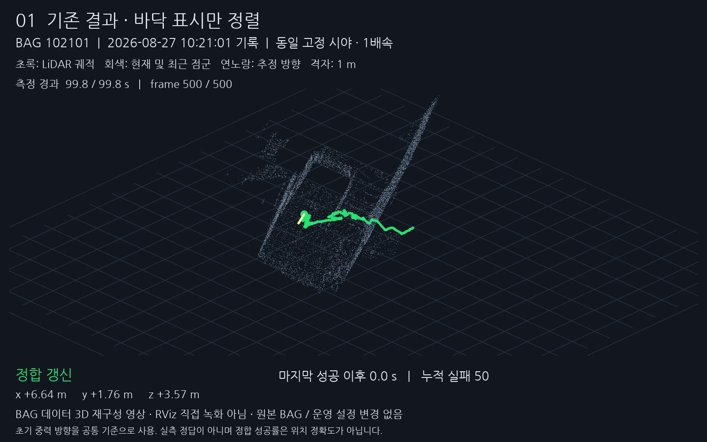
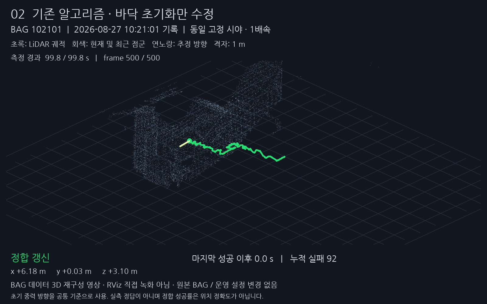
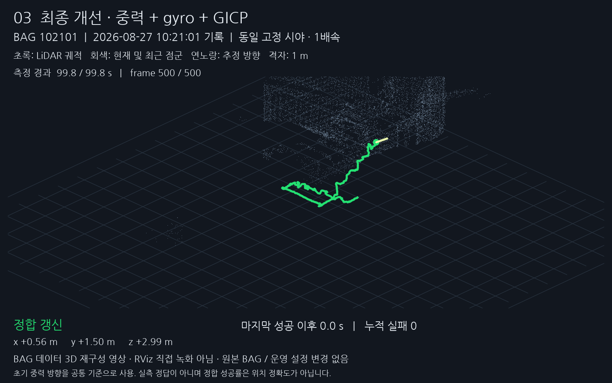

# LiDAR 비교 영상 3개

> 보관일: 2026-09-22. 원본 HTML을 당시 내용 그대로 옮긴 기록입니다. 현재 적용 상태는 [최신 적용 안내](../../APPLICATION_GUIDE.md)를 확인합니다.

원본: [lidar-before-after-video-20260921/report.html](/home/m3tron/.codex/.chatgpt-projects/g-p-6aa37f17097c81919ca6c59ce41e856c/lidar-before-after-video-20260921/report.html) · SHA-256: `9d8ccbd7ae86018d4697e923d54f786015dc9b1a4f0898dafa67ccc09b7f6660`

---

LiDAR 비교 영상 3개

# LiDAR 개선 전후 · 독립 영상 3개

세 영상을 각각 재생할 수 있습니다. 모두 **102101 → 105713** 순서이며 각 BAG에서 카메라·축척·측정 시간이 같습니다.

실제 BAG 점군과 계산 결과로 만든 3D 재구성 영상입니다. **RViz 화면 직접 녹화는 아닙니다.** 초록 선은 LiDAR 궤적이며, 세 영상은 다른 센서가 아니라 같은 데이터의 세 처리 조건입니다.

## 1\. 기존 결과 · 바닥 표시만 정렬

기존 궤적의 상대 이동은 그대로 두고 초기 기울기만 공통 중력 방향으로 맞췄습니다.

[영상 1 재생 / 원본 파일](../../assets/a1e0e6d4f23692ef0313.mp4)

첫 BAG (재생 위치 0초)두 번째 BAG (재생 위치 105.9초)[MP4 다운로드](../../assets/a1e0e6d4f23692ef0313.mp4)

## 2\. 바닥 초기화만 수정

기존 GICP를 다시 계산했습니다. 초기 중력 자세만 수정하고 gyro 예측은 넣지 않았습니다.

[영상 2 재생 / 원본 파일](../../assets/7c0187412fbcb17b486f.mp4)

첫 BAG (재생 위치 0초)두 번째 BAG (재생 위치 105.9초)[MP4 다운로드](../../assets/7c0187412fbcb17b486f.mp4)

## 3\. 최종 개선본

기존에 확인한 개선본을 그대로 재생합니다. 영상용 궤적 보정은 하지 않았습니다.

[영상 3 재생 / 원본 파일](../../assets/408bc6daa556de5395dc.mp4)

첫 BAG (재생 위치 0초)두 번째 BAG (재생 위치 105.9초)[MP4 다운로드](../../assets/408bc6daa556de5395dc.mp4)

실패 시 마지막 위치가 반복되는 현상을 주황색 상태로 표시했습니다. 정합 실패 0회가 실측 위치 오차 0이라는 뜻은 아닙니다.

[비교 조건·수치·한계](/home/m3tron/.codex/.chatgpt-projects/g-p-6aa37f17097c81919ca6c59ce41e856c/lidar-before-after-video-20260921/REPORT.md)
