# TRON1 · bag 근거

> 보관일: 2026-09-22. 원본 HTML을 당시 내용 그대로 옮긴 기록입니다. 현재 적용 상태는 [최신 적용 안내](../../APPLICATION_GUIDE.md)를 확인합니다.

원본: [sensor-recording-analysis-20260918/bag-index.html](/home/m3tron/.codex/.chatgpt-projects/g-p-6aa37f17097c81919ca6c59ce41e856c/sensor-recording-analysis-20260918/bag-index.html) · SHA-256: `38af9814f1156c0ad50842a3b82752a62a93b9d45c7ed69bdcd99c3cd7df0dc3`

---

# 21개 bag의 직접 분석 근거

표의 명령 없음은 녹화 토픽 부재를 뜻하며 실제 무명령의 증거가 아닙니다. READ는 전 메시지 숫자·구조 분석과 명시한 범위의 영상 검토를 뜻합니다.

| 원본명                                                                                                                                 | 메시지    | 기간(초)  | AMCL | 명령 근거   | 상태   |
| ----------------------------------------------------------------------------------------------------------------------------------- | ------ | ------ | ---- | ------- | ---- |
| [manual-5F-rooftop\_route\_1788917683773755895.bag](#manual-5F-rooftop_route_1788917683773755895.bag)                               | 21600  | 22.13  | 없음   | 없음      | READ |
| [manual-5F-rooftop\_route\_1788918199558502114.bag.active.invalid](#manual-5F-rooftop_route_1788918199558502114.bag.active.invalid) | 189050 | 193.04 | 없음   | 없음      | READ |
| [manual-5F-rooftop\_route\_1788918551828137154.bag](#manual-5F-rooftop_route_1788918551828137154.bag)                               | 34003  | 34.80  | 없음   | 없음      | READ |
| [manual-5F-rooftop\_route\_1788920816079496577.bag.active.invalid](#manual-5F-rooftop_route_1788920816079496577.bag.active.invalid) | 463540 | 508.44 | 없음   | 없음      | READ |
| [stair\_3F\_to\_4F\_FULL\_20260916\_210849.bag](#stair_3F_to_4F_FULL_20260916_210849.bag)                                           | 176752 | 279.57 | 있음   | 송신 로그   | READ |
| [stair\_3F\_to\_4F\_FULL\_20260916\_231643.bag](#stair_3F_to_4F_FULL_20260916_231643.bag)                                           | 26180  | 81.76  | 있음   | 없음      | READ |
| [stair\_3F\_to\_4F\_FULL\_20260916\_234018.bag](#stair_3F_to_4F_FULL_20260916_234018.bag)                                           | 165354 | 305.64 | 있음   | NAV 요청만 | READ |
| [stair\_3F\_to\_4F\_UP\_20260821\_155022.bag](#stair_3F_to_4F_UP_20260821_155022.bag)                                               | 67573  | 143.22 | 없음   | 없음      | READ |
| [stair\_3F\_to\_4F\_UP\_20260824\_152128.bag](#stair_3F_to_4F_UP_20260824_152128.bag)                                               | 11940  | 46.98  | 없음   | 없음      | READ |
| [stair\_3F\_to\_4F\_UP\_20260824\_152223.bag](#stair_3F_to_4F_UP_20260824_152223.bag)                                               | 3386   | 12.18  | 없음   | 없음      | READ |
| [stair\_3F\_to\_4F\_UP\_20260824\_152248.bag](#stair_3F_to_4F_UP_20260824_152248.bag)                                               | 48232  | 179.58 | 없음   | 없음      | READ |
| [stair\_3F\_to\_4F\_UP\_20260827\_102101.bag](#stair_3F_to_4F_UP_20260827_102101.bag)                                               | 107635 | 224.29 | 있음   | 없음      | READ |
| [stair\_3F\_to\_4F\_UP\_20260827\_103200.bag](#stair_3F_to_4F_UP_20260827_103200.bag)                                               | 33661  | 68.84  | 있음   | 없음      | READ |
| [stair\_3F\_to\_4F\_UP\_20260827\_103313.bag](#stair_3F_to_4F_UP_20260827_103313.bag)                                               | 130674 | 272.34 | 있음   | 없음      | READ |
| [stair\_3F\_to\_4F\_UP\_20260827\_105713.bag](#stair_3F_to_4F_UP_20260827_105713.bag)                                               | 96815  | 274.45 | 있음   | 없음      | READ |
| [stair\_3F\_to\_4F\_UP\_20260827\_150034.bag](#stair_3F_to_4F_UP_20260827_150034.bag)                                               | 108263 | 219.66 | 있음   | 없음      | READ |
| [stair\_3F\_to\_4F\_UP\_20260827\_154342.bag](#stair_3F_to_4F_UP_20260827_154342.bag)                                               | 110969 | 219.62 | 있음   | 없음      | READ |
| [stair\_3F\_to\_4F\_UP\_CLEAN\_REPEAT\_20260821\_160211.bag](#stair_3F_to_4F_UP_CLEAN_REPEAT_20260821_160211.bag)                   | 66526  | 141.04 | 없음   | 없음      | READ |
| [tag\_calibration\_20260827\_134853.bag](#tag_calibration_20260827_134853.bag)                                                      | 84836  | 182.90 | 있음   | 없음      | READ |
| [yaw\_calibration\_020\_030\_040\_20260821\_134549.bag](#yaw_calibration_020_030_040_20260821_134549.bag)                           | 26907  | 67.27  | 없음   | 없음      | READ |
| [yaw\_calibration\_20260821\_132716.bag](#yaw_calibration_20260821_132716.bag)                                                      | 386797 | 967.06 | 없음   | 없음      | READ |

manual-5F-rooftop\_route\_1788917683773755895.bag

[토픽·시각·callerid](/home/m3tron/.codex/.chatgpt-projects/g-p-6aa37f17097c81919ca6c59ce41e856c/sensor-recording-analysis-20260918/bags/manual-5F-rooftop_route_1788917683773755895.bag/summary.json) · [상태·검출·로그](/home/m3tron/.codex/.chatgpt-projects/g-p-6aa37f17097c81919ca6c59ce41e856c/sensor-recording-analysis-20260918/bags/manual-5F-rooftop_route_1788917683773755895.bag/events.json) · [수치 배열](/home/m3tron/.codex/.chatgpt-projects/g-p-6aa37f17097c81919ca6c59ce41e856c/sensor-recording-analysis-20260918/bags/manual-5F-rooftop_route_1788917683773755895.bag/numeric.npz)

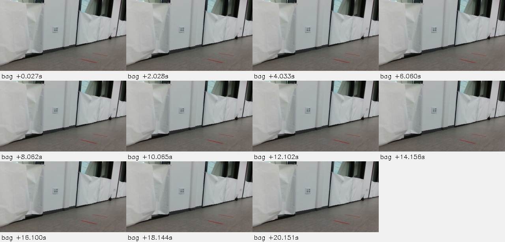

manual-5F-rooftop\_route\_1788918199558502114.bag.active.invalid

[토픽·시각·callerid](/home/m3tron/.codex/.chatgpt-projects/g-p-6aa37f17097c81919ca6c59ce41e856c/sensor-recording-analysis-20260918/bags/manual-5F-rooftop_route_1788918199558502114.bag.active.invalid/summary.json) · [상태·검출·로그](/home/m3tron/.codex/.chatgpt-projects/g-p-6aa37f17097c81919ca6c59ce41e856c/sensor-recording-analysis-20260918/bags/manual-5F-rooftop_route_1788918199558502114.bag.active.invalid/events.json) · [수치 배열](/home/m3tron/.codex/.chatgpt-projects/g-p-6aa37f17097c81919ca6c59ce41e856c/sensor-recording-analysis-20260918/bags/manual-5F-rooftop_route_1788918199558502114.bag.active.invalid/numeric.npz)

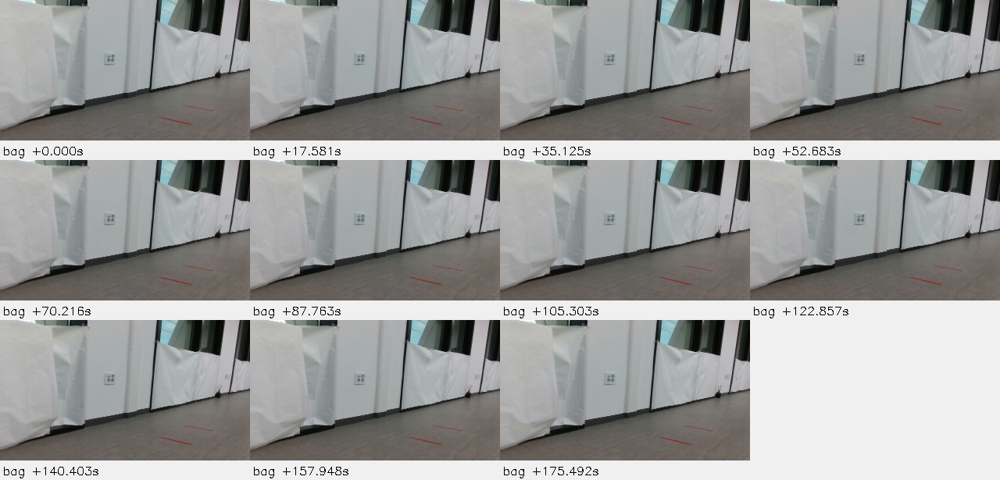

manual-5F-rooftop\_route\_1788918551828137154.bag

[토픽·시각·callerid](/home/m3tron/.codex/.chatgpt-projects/g-p-6aa37f17097c81919ca6c59ce41e856c/sensor-recording-analysis-20260918/bags/manual-5F-rooftop_route_1788918551828137154.bag/summary.json) · [상태·검출·로그](/home/m3tron/.codex/.chatgpt-projects/g-p-6aa37f17097c81919ca6c59ce41e856c/sensor-recording-analysis-20260918/bags/manual-5F-rooftop_route_1788918551828137154.bag/events.json) · [수치 배열](/home/m3tron/.codex/.chatgpt-projects/g-p-6aa37f17097c81919ca6c59ce41e856c/sensor-recording-analysis-20260918/bags/manual-5F-rooftop_route_1788918551828137154.bag/numeric.npz)

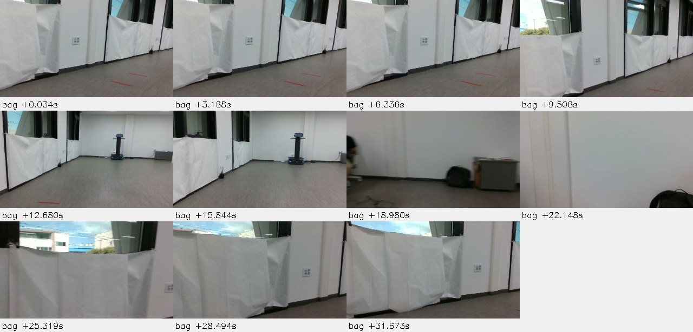

manual-5F-rooftop\_route\_1788920816079496577.bag.active.invalid

[토픽·시각·callerid](/home/m3tron/.codex/.chatgpt-projects/g-p-6aa37f17097c81919ca6c59ce41e856c/sensor-recording-analysis-20260918/bags/manual-5F-rooftop_route_1788920816079496577.bag.active.invalid/summary.json) · [상태·검출·로그](/home/m3tron/.codex/.chatgpt-projects/g-p-6aa37f17097c81919ca6c59ce41e856c/sensor-recording-analysis-20260918/bags/manual-5F-rooftop_route_1788920816079496577.bag.active.invalid/events.json) · [수치 배열](/home/m3tron/.codex/.chatgpt-projects/g-p-6aa37f17097c81919ca6c59ce41e856c/sensor-recording-analysis-20260918/bags/manual-5F-rooftop_route_1788920816079496577.bag.active.invalid/numeric.npz)

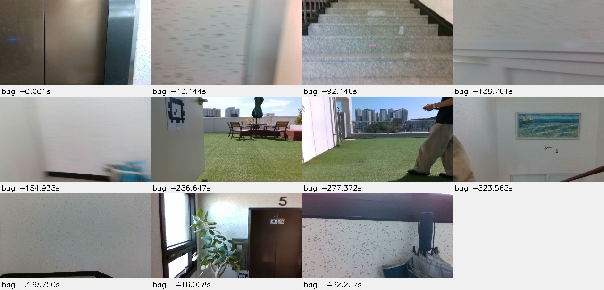

stair\_3F\_to\_4F\_FULL\_20260916\_210849.bag

[토픽·시각·callerid](/home/m3tron/.codex/.chatgpt-projects/g-p-6aa37f17097c81919ca6c59ce41e856c/sensor-recording-analysis-20260918/bags/stair_3F_to_4F_FULL_20260916_210849.bag/summary.json) · [상태·검출·로그](/home/m3tron/.codex/.chatgpt-projects/g-p-6aa37f17097c81919ca6c59ce41e856c/sensor-recording-analysis-20260918/bags/stair_3F_to_4F_FULL_20260916_210849.bag/events.json) · [수치 배열](/home/m3tron/.codex/.chatgpt-projects/g-p-6aa37f17097c81919ca6c59ce41e856c/sensor-recording-analysis-20260918/bags/stair_3F_to_4F_FULL_20260916_210849.bag/numeric.npz)

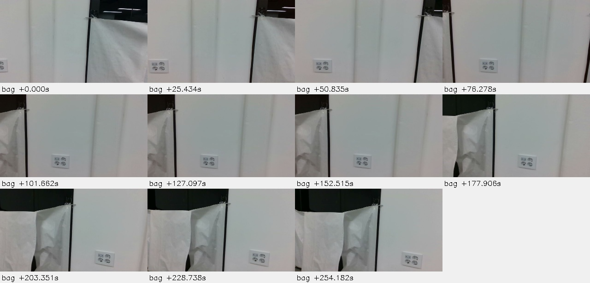

stair\_3F\_to\_4F\_FULL\_20260916\_231643.bag

[토픽·시각·callerid](/home/m3tron/.codex/.chatgpt-projects/g-p-6aa37f17097c81919ca6c59ce41e856c/sensor-recording-analysis-20260918/bags/stair_3F_to_4F_FULL_20260916_231643.bag/summary.json) · [상태·검출·로그](/home/m3tron/.codex/.chatgpt-projects/g-p-6aa37f17097c81919ca6c59ce41e856c/sensor-recording-analysis-20260918/bags/stair_3F_to_4F_FULL_20260916_231643.bag/events.json) · [수치 배열](/home/m3tron/.codex/.chatgpt-projects/g-p-6aa37f17097c81919ca6c59ce41e856c/sensor-recording-analysis-20260918/bags/stair_3F_to_4F_FULL_20260916_231643.bag/numeric.npz)

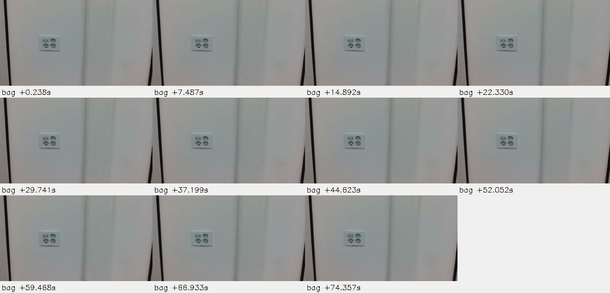

stair\_3F\_to\_4F\_FULL\_20260916\_234018.bag

[토픽·시각·callerid](/home/m3tron/.codex/.chatgpt-projects/g-p-6aa37f17097c81919ca6c59ce41e856c/sensor-recording-analysis-20260918/bags/stair_3F_to_4F_FULL_20260916_234018.bag/summary.json) · [상태·검출·로그](/home/m3tron/.codex/.chatgpt-projects/g-p-6aa37f17097c81919ca6c59ce41e856c/sensor-recording-analysis-20260918/bags/stair_3F_to_4F_FULL_20260916_234018.bag/events.json) · [수치 배열](/home/m3tron/.codex/.chatgpt-projects/g-p-6aa37f17097c81919ca6c59ce41e856c/sensor-recording-analysis-20260918/bags/stair_3F_to_4F_FULL_20260916_234018.bag/numeric.npz)

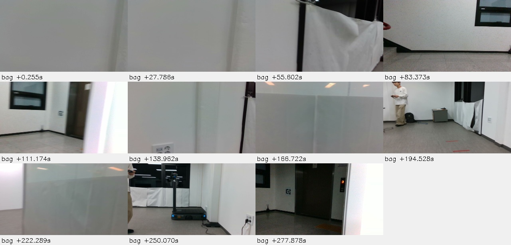

stair\_3F\_to\_4F\_UP\_20260821\_155022.bag

[토픽·시각·callerid](/home/m3tron/.codex/.chatgpt-projects/g-p-6aa37f17097c81919ca6c59ce41e856c/sensor-recording-analysis-20260918/bags/stair_3F_to_4F_UP_20260821_155022.bag/summary.json) · [상태·검출·로그](/home/m3tron/.codex/.chatgpt-projects/g-p-6aa37f17097c81919ca6c59ce41e856c/sensor-recording-analysis-20260918/bags/stair_3F_to_4F_UP_20260821_155022.bag/events.json) · [수치 배열](/home/m3tron/.codex/.chatgpt-projects/g-p-6aa37f17097c81919ca6c59ce41e856c/sensor-recording-analysis-20260918/bags/stair_3F_to_4F_UP_20260821_155022.bag/numeric.npz)

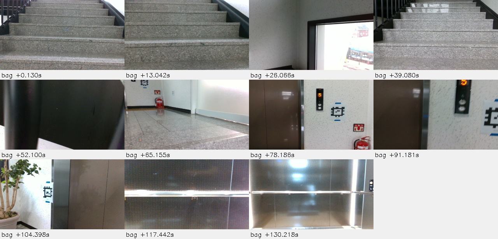

stair\_3F\_to\_4F\_UP\_20260824\_152128.bag

[토픽·시각·callerid](/home/m3tron/.codex/.chatgpt-projects/g-p-6aa37f17097c81919ca6c59ce41e856c/sensor-recording-analysis-20260918/bags/stair_3F_to_4F_UP_20260824_152128.bag/summary.json) · [상태·검출·로그](/home/m3tron/.codex/.chatgpt-projects/g-p-6aa37f17097c81919ca6c59ce41e856c/sensor-recording-analysis-20260918/bags/stair_3F_to_4F_UP_20260824_152128.bag/events.json) · [수치 배열](/home/m3tron/.codex/.chatgpt-projects/g-p-6aa37f17097c81919ca6c59ce41e856c/sensor-recording-analysis-20260918/bags/stair_3F_to_4F_UP_20260824_152128.bag/numeric.npz)

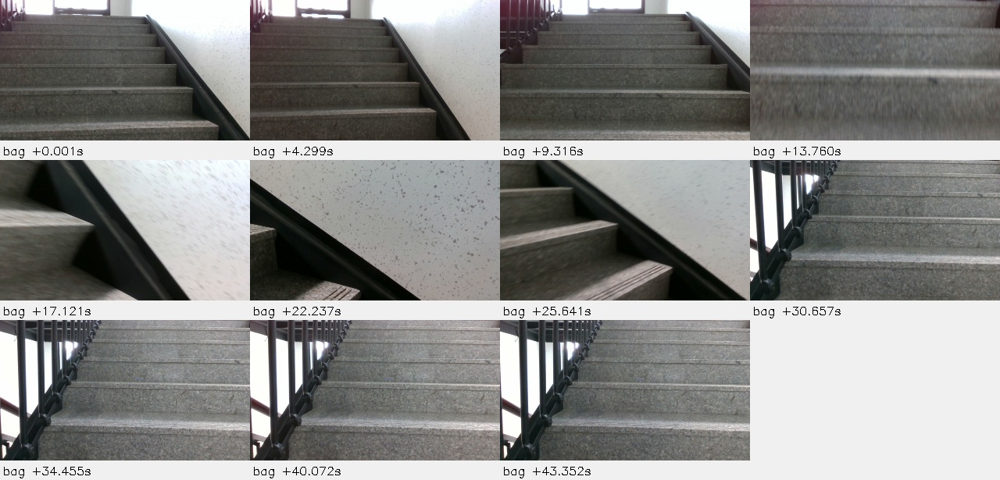

stair\_3F\_to\_4F\_UP\_20260824\_152223.bag

[토픽·시각·callerid](/home/m3tron/.codex/.chatgpt-projects/g-p-6aa37f17097c81919ca6c59ce41e856c/sensor-recording-analysis-20260918/bags/stair_3F_to_4F_UP_20260824_152223.bag/summary.json) · [상태·검출·로그](/home/m3tron/.codex/.chatgpt-projects/g-p-6aa37f17097c81919ca6c59ce41e856c/sensor-recording-analysis-20260918/bags/stair_3F_to_4F_UP_20260824_152223.bag/events.json) · [수치 배열](/home/m3tron/.codex/.chatgpt-projects/g-p-6aa37f17097c81919ca6c59ce41e856c/sensor-recording-analysis-20260918/bags/stair_3F_to_4F_UP_20260824_152223.bag/numeric.npz)

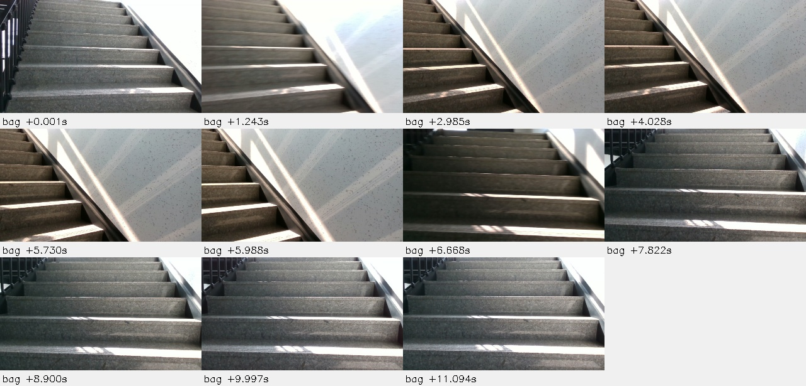

stair\_3F\_to\_4F\_UP\_20260824\_152248.bag

[토픽·시각·callerid](/home/m3tron/.codex/.chatgpt-projects/g-p-6aa37f17097c81919ca6c59ce41e856c/sensor-recording-analysis-20260918/bags/stair_3F_to_4F_UP_20260824_152248.bag/summary.json) · [상태·검출·로그](/home/m3tron/.codex/.chatgpt-projects/g-p-6aa37f17097c81919ca6c59ce41e856c/sensor-recording-analysis-20260918/bags/stair_3F_to_4F_UP_20260824_152248.bag/events.json) · [수치 배열](/home/m3tron/.codex/.chatgpt-projects/g-p-6aa37f17097c81919ca6c59ce41e856c/sensor-recording-analysis-20260918/bags/stair_3F_to_4F_UP_20260824_152248.bag/numeric.npz)

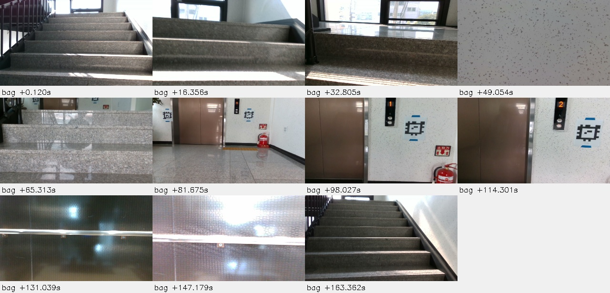

stair\_3F\_to\_4F\_UP\_20260827\_102101.bag

[토픽·시각·callerid](/home/m3tron/.codex/.chatgpt-projects/g-p-6aa37f17097c81919ca6c59ce41e856c/sensor-recording-analysis-20260918/bags/stair_3F_to_4F_UP_20260827_102101.bag/summary.json) · [상태·검출·로그](/home/m3tron/.codex/.chatgpt-projects/g-p-6aa37f17097c81919ca6c59ce41e856c/sensor-recording-analysis-20260918/bags/stair_3F_to_4F_UP_20260827_102101.bag/events.json) · [수치 배열](/home/m3tron/.codex/.chatgpt-projects/g-p-6aa37f17097c81919ca6c59ce41e856c/sensor-recording-analysis-20260918/bags/stair_3F_to_4F_UP_20260827_102101.bag/numeric.npz)

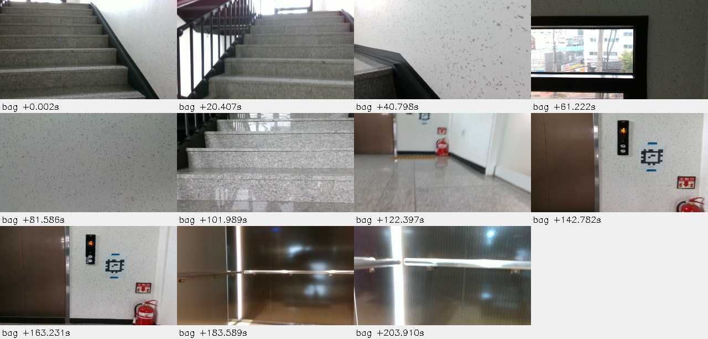

stair\_3F\_to\_4F\_UP\_20260827\_103200.bag

[토픽·시각·callerid](/home/m3tron/.codex/.chatgpt-projects/g-p-6aa37f17097c81919ca6c59ce41e856c/sensor-recording-analysis-20260918/bags/stair_3F_to_4F_UP_20260827_103200.bag/summary.json) · [상태·검출·로그](/home/m3tron/.codex/.chatgpt-projects/g-p-6aa37f17097c81919ca6c59ce41e856c/sensor-recording-analysis-20260918/bags/stair_3F_to_4F_UP_20260827_103200.bag/events.json) · [수치 배열](/home/m3tron/.codex/.chatgpt-projects/g-p-6aa37f17097c81919ca6c59ce41e856c/sensor-recording-analysis-20260918/bags/stair_3F_to_4F_UP_20260827_103200.bag/numeric.npz)

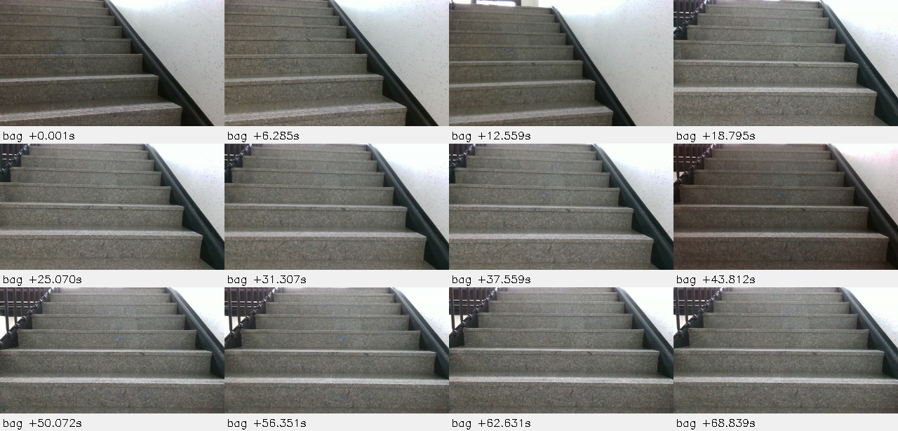

stair\_3F\_to\_4F\_UP\_20260827\_103313.bag

[토픽·시각·callerid](/home/m3tron/.codex/.chatgpt-projects/g-p-6aa37f17097c81919ca6c59ce41e856c/sensor-recording-analysis-20260918/bags/stair_3F_to_4F_UP_20260827_103313.bag/summary.json) · [상태·검출·로그](/home/m3tron/.codex/.chatgpt-projects/g-p-6aa37f17097c81919ca6c59ce41e856c/sensor-recording-analysis-20260918/bags/stair_3F_to_4F_UP_20260827_103313.bag/events.json) · [수치 배열](/home/m3tron/.codex/.chatgpt-projects/g-p-6aa37f17097c81919ca6c59ce41e856c/sensor-recording-analysis-20260918/bags/stair_3F_to_4F_UP_20260827_103313.bag/numeric.npz)

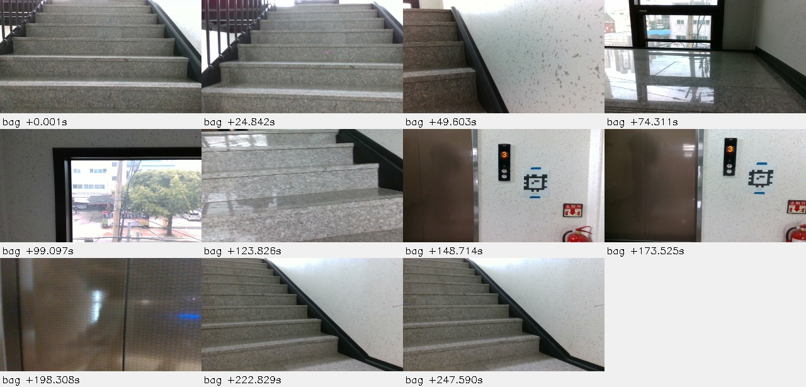

stair\_3F\_to\_4F\_UP\_20260827\_105713.bag

[토픽·시각·callerid](/home/m3tron/.codex/.chatgpt-projects/g-p-6aa37f17097c81919ca6c59ce41e856c/sensor-recording-analysis-20260918/bags/stair_3F_to_4F_UP_20260827_105713.bag/summary.json) · [상태·검출·로그](/home/m3tron/.codex/.chatgpt-projects/g-p-6aa37f17097c81919ca6c59ce41e856c/sensor-recording-analysis-20260918/bags/stair_3F_to_4F_UP_20260827_105713.bag/events.json) · [수치 배열](/home/m3tron/.codex/.chatgpt-projects/g-p-6aa37f17097c81919ca6c59ce41e856c/sensor-recording-analysis-20260918/bags/stair_3F_to_4F_UP_20260827_105713.bag/numeric.npz)

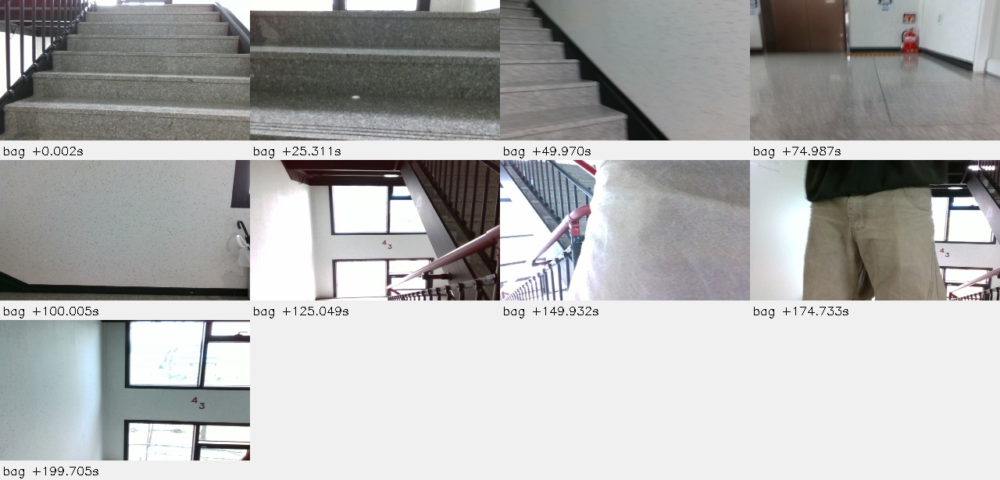

stair\_3F\_to\_4F\_UP\_20260827\_150034.bag

[토픽·시각·callerid](/home/m3tron/.codex/.chatgpt-projects/g-p-6aa37f17097c81919ca6c59ce41e856c/sensor-recording-analysis-20260918/bags/stair_3F_to_4F_UP_20260827_150034.bag/summary.json) · [상태·검출·로그](/home/m3tron/.codex/.chatgpt-projects/g-p-6aa37f17097c81919ca6c59ce41e856c/sensor-recording-analysis-20260918/bags/stair_3F_to_4F_UP_20260827_150034.bag/events.json) · [수치 배열](/home/m3tron/.codex/.chatgpt-projects/g-p-6aa37f17097c81919ca6c59ce41e856c/sensor-recording-analysis-20260918/bags/stair_3F_to_4F_UP_20260827_150034.bag/numeric.npz)

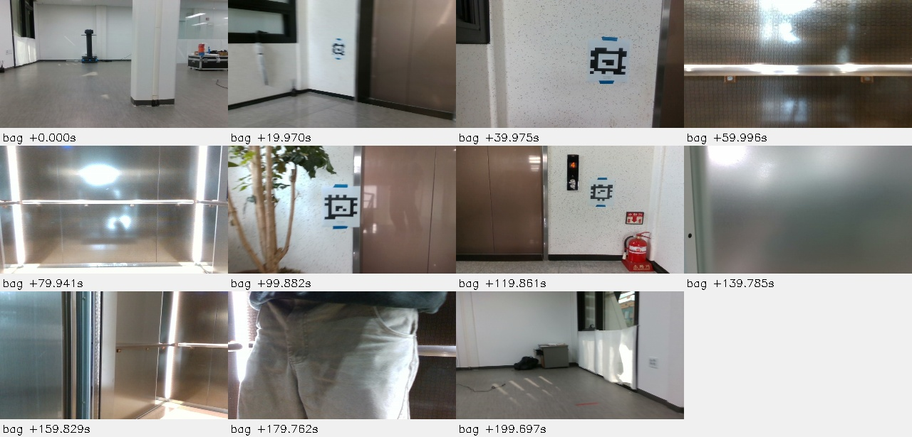

stair\_3F\_to\_4F\_UP\_20260827\_154342.bag

[토픽·시각·callerid](/home/m3tron/.codex/.chatgpt-projects/g-p-6aa37f17097c81919ca6c59ce41e856c/sensor-recording-analysis-20260918/bags/stair_3F_to_4F_UP_20260827_154342.bag/summary.json) · [상태·검출·로그](/home/m3tron/.codex/.chatgpt-projects/g-p-6aa37f17097c81919ca6c59ce41e856c/sensor-recording-analysis-20260918/bags/stair_3F_to_4F_UP_20260827_154342.bag/events.json) · [수치 배열](/home/m3tron/.codex/.chatgpt-projects/g-p-6aa37f17097c81919ca6c59ce41e856c/sensor-recording-analysis-20260918/bags/stair_3F_to_4F_UP_20260827_154342.bag/numeric.npz)

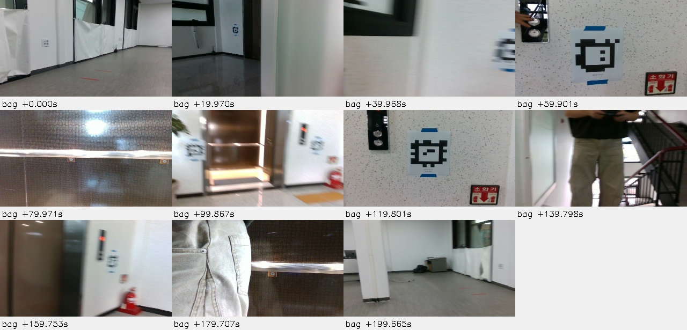

stair\_3F\_to\_4F\_UP\_CLEAN\_REPEAT\_20260821\_160211.bag

[토픽·시각·callerid](/home/m3tron/.codex/.chatgpt-projects/g-p-6aa37f17097c81919ca6c59ce41e856c/sensor-recording-analysis-20260918/bags/stair_3F_to_4F_UP_CLEAN_REPEAT_20260821_160211.bag/summary.json) · [상태·검출·로그](/home/m3tron/.codex/.chatgpt-projects/g-p-6aa37f17097c81919ca6c59ce41e856c/sensor-recording-analysis-20260918/bags/stair_3F_to_4F_UP_CLEAN_REPEAT_20260821_160211.bag/events.json) · [수치 배열](/home/m3tron/.codex/.chatgpt-projects/g-p-6aa37f17097c81919ca6c59ce41e856c/sensor-recording-analysis-20260918/bags/stair_3F_to_4F_UP_CLEAN_REPEAT_20260821_160211.bag/numeric.npz)

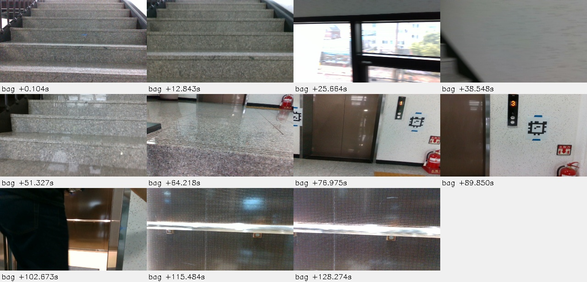

tag\_calibration\_20260827\_134853.bag

[토픽·시각·callerid](/home/m3tron/.codex/.chatgpt-projects/g-p-6aa37f17097c81919ca6c59ce41e856c/sensor-recording-analysis-20260918/bags/tag_calibration_20260827_134853.bag/summary.json) · [상태·검출·로그](/home/m3tron/.codex/.chatgpt-projects/g-p-6aa37f17097c81919ca6c59ce41e856c/sensor-recording-analysis-20260918/bags/tag_calibration_20260827_134853.bag/events.json) · [수치 배열](/home/m3tron/.codex/.chatgpt-projects/g-p-6aa37f17097c81919ca6c59ce41e856c/sensor-recording-analysis-20260918/bags/tag_calibration_20260827_134853.bag/numeric.npz)

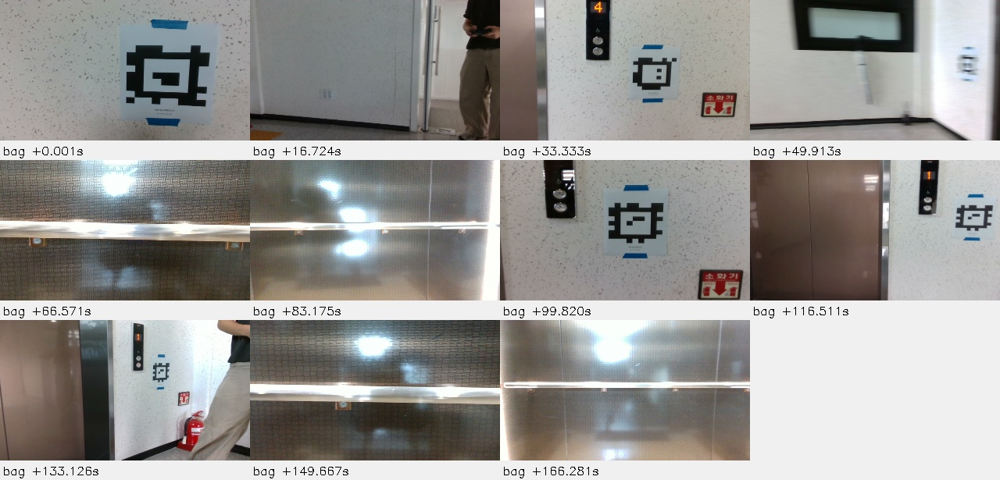

yaw\_calibration\_020\_030\_040\_20260821\_134549.bag

[토픽·시각·callerid](/home/m3tron/.codex/.chatgpt-projects/g-p-6aa37f17097c81919ca6c59ce41e856c/sensor-recording-analysis-20260918/bags/yaw_calibration_020_030_040_20260821_134549.bag/summary.json) · [상태·검출·로그](/home/m3tron/.codex/.chatgpt-projects/g-p-6aa37f17097c81919ca6c59ce41e856c/sensor-recording-analysis-20260918/bags/yaw_calibration_020_030_040_20260821_134549.bag/events.json) · [수치 배열](/home/m3tron/.codex/.chatgpt-projects/g-p-6aa37f17097c81919ca6c59ce41e856c/sensor-recording-analysis-20260918/bags/yaw_calibration_020_030_040_20260821_134549.bag/numeric.npz)

이 bag에는 RGB 영상이 없습니다.

yaw\_calibration\_20260821\_132716.bag

[토픽·시각·callerid](/home/m3tron/.codex/.chatgpt-projects/g-p-6aa37f17097c81919ca6c59ce41e856c/sensor-recording-analysis-20260918/bags/yaw_calibration_20260821_132716.bag/summary.json) · [상태·검출·로그](/home/m3tron/.codex/.chatgpt-projects/g-p-6aa37f17097c81919ca6c59ce41e856c/sensor-recording-analysis-20260918/bags/yaw_calibration_20260821_132716.bag/events.json) · [수치 배열](/home/m3tron/.codex/.chatgpt-projects/g-p-6aa37f17097c81919ca6c59ce41e856c/sensor-recording-analysis-20260918/bags/yaw_calibration_20260821_132716.bag/numeric.npz)

이 bag에는 RGB 영상이 없습니다.

TRON1 · 2026-09-18 · 원본 읽기 전용 분석 · 새 ROS 노드 및 로봇 동작 없음
