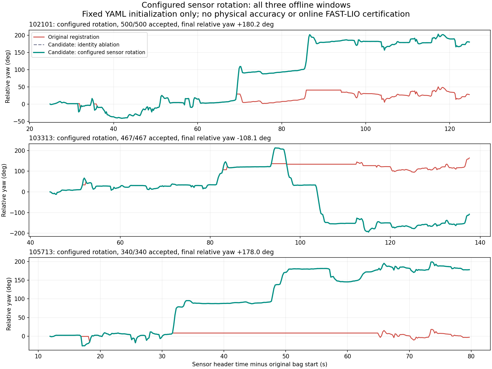

# TRON1 계단 회전 추적 수정 검증

> 보관일: 2026-09-22. 원본 HTML을 당시 내용 그대로 옮긴 기록입니다. 현재 적용 상태는 [최신 적용 안내](../../APPLICATION_GUIDE.md)를 확인합니다.

원본: [stair-tracking-repair-20260921/report.html](/home/m3tron/.codex/.chatgpt-projects/g-p-6aa37f17097c81919ca6c59ce41e856c/stair-tracking-repair-20260921/report.html) · SHA-256: `bea3092ee22b438d74a133f7872fa39be2e6ca67c83bafc477a9d182da4c5b2f`

---

# 계단 회전 추적 수정과 동일 bag 재검증

2026-09-21 · 오프라인 후보 구현 완료 · **Stair Supervisor 정상 동작 판정: 아직 불가**

**설정 이력: 사용자 확인 완료.** 사용자는 “기록 당시와 현재 설정이 같음”이라고 확인했다. 현재 설정 파일의 IMU–LiDAR 초기 회전 보정값을 세 기록의 후보 평가에 적용했다. 설정의 동일성은 사용자 확인에 근거하며, 보정값의 물리적 정확도나 실행 중 추정값을 측정해 확인한 것은 아니다.

사용자의 지적이 맞다. 측위가 계단참 회전을 놓치는 상태에서는 방향 보정·다음 계단 진입·도착 판정을 신뢰할 수 없다. 기존 비교 도구의 구체적인 오류를 확인하고, 운용 코드를 바꾸지 않은 별도 후보를 만들어 동일한 원본 프레임으로 검증했다. 이번 결과는 회전 추적 개선의 근거이며, 실제 위치 정확도·중심 유지·전체 임무 성공을 입증하지 않는다.

## 실제로 달라진 결과

**OBSERVED:** 원래 비교 도구의 CSV에 기록된 센서 시각에 대응하는 동일한 원본 LiDAR 프레임 1,307개를 비교했다. 최초 좌표 초기화 3개를 포함한 수치다. 실제 정합 갱신은 후보에서 각각 499·466·339회, 합계 1,304/1,304회 수락됐다. 기존 수락 임계값을 완화하지 않았다.

| 기록     | 기존 수락 프레임 |     수정 후보 | 기존 최장 연속 거절 구간 | 후보 거절 구간 | 기존 → 후보의 마지막 상대 회전각 |
| ------ | --------: | --------: | -------------: | -------: | ------------------: |
| 102101 | 450 / 500 | 500 / 500 |           8.0초 |       없음 |   \+27.5° → +180.2° |
| 103313 | 353 / 467 | 467 / 467 |          15.2초 |       없음 |  \+164.0° → −108.1° |
| 105713 | 168 / 340 | 340 / 340 |          33.0초 |       없음 |     −2.6° → +178.0° |

거절 구간은 첫 거절 프레임부터 마지막 거절 프레임까지의 시각 차이다. **수락률은 정확도가 아니다. 수치 임계값은 유지했지만, 보정량의 기준을 바꿨으므로 판정 규칙 전체가 동일한 비교는 아니다.** 후보 기준에서 갱신 중단이 없어졌다는 결과다.

회전각은 `R(첫 센서 시각)ᵀ × R(현재 센서 시각)`에서 구한 누적 yaw다. 이 계산은 초기 세계 좌표계의 고정 회전을 상쇄하므로, 약 89° 기울어진 그림을 바로 세운 것만으로 회전각이 180°가 된 것은 아니다. 센서의 초기 축 기준 상대 회전이며, 건물 좌표계의 절대 방위는 아니다. 기존·후보의 시작과 끝을 포함해 모든 LiDAR header 시각이 일치하며 wheel odom도 각 동일 header 시각에 보간하고 같은 시작 시각의 자세를 기준으로 계산했다. 별도 비교 함수의 수정 여부와 무관하게 [수치 평가 코드](/home/m3tron/.codex/.chatgpt-projects/g-p-6aa37f17097c81919ca6c59ce41e856c/stair-tracking-repair-20260921/evaluate_results.py)에 이 처리가 들어 있다.

`103313`에는 양의 회전 후 반대 방향 회전도 기록되어 있다. 마지막 각도를 무조건 180°에 맞추는 평가를 하지 않았다. 같은 시각의 wheel odom 마지막 각도는 각각 +166.1°, −106.1°, +170.6°다. **wheel odom도 정답 위치가 아니다.**

기존 추적·축 일치 가정·현재 보정값 적용 비교

**OBSERVED, 원인 분리:** 이전의 두 센서 축 일치 가정 실험에서, `105713`의 수평 초기화만 바꾸면 수락 165/340, 최장 거절 33.6초, 마지막 회전 −0.8°로 문제가 남았다. 여기에 gyro로 다음 회전을 예측하고 기하 정합으로 보정하자 340/340, +178.3°가 됐다. 두 변경이 함께 작용하므로 gyro 추가만의 일반적인 개선율을 주장하지 않는다. 해당 실험에서 gyro만 적분한 최종 각도는 +151.4°여서, 후보는 gyro 적분값을 그대로 복사한 결과도 아니다.

**OBSERVED, 보정값 적용 결과:** 사용자 확인 후 `102101`, `103313`을 현재 YAML의 회전 보정값으로 새로 계산했고 `105713`은 앞서 동일한 보정값으로 계산한 결과를 재사용했다. `105713`에서 사용한 행렬과 현재 파일 값은 수치가 완전히 같고, 정합·gyro 예측 계산·임계값·입력 프레임·수치 라이브러리도 유지했다. 후보 코드는 동일한 행렬을 코드 상수 대신 설정 파일에서 읽도록 바꿨다. 세 기록 모두 갱신 중단이 없었다.

두 센서 축이 같다고 가정한 후보와 최종 상대 회전 차이는 각각 +0.11°, +0.23°, −0.28°다. 각 추정 경로의 최초 LiDAR 원점을 빼고 최초 LiDAR 축으로 회전해 맞춘 두 경로 사이의 프레임별 최대 거리 차이는 각각 약 8.7cm, 6.6cm, 8.1cm다. **이 거리는 두 추정치의 차이이며 실제 위치 오차가 아니다.**

현재 결과의 기준 수치는 [configured-metrics.json](/home/m3tron/.codex/.chatgpt-projects/g-p-6aa37f17097c81919ca6c59ce41e856c/stair-tracking-repair-20260921/configured-metrics.json), 프레임별 출력은 [results](/home/m3tron/.codex/.chatgpt-projects/g-p-6aa37f17097c81919ca6c59ce41e856c/stair-tracking-repair-20260921/results)에 있다. [metrics.json](/home/m3tron/.codex/.chatgpt-projects/g-p-6aa37f17097c81919ca6c59ce41e856c/stair-tracking-repair-20260921/metrics.json)과 [이전 비교 그림](../../assets/af26a7c9d9ee411e8448.png)은 사용자 확인 전 축 일치 가정 실험의 기록으로 보존했다.

## 확인한 원인과 남은 영향

아래 Safety/Mobility 점수는 원인별 잠재 영향이다. 실제 충돌·추락을 관찰했다는 뜻은 아니다. S0 확인된 영향 없음, S1 간접 영향, S2 안전 여유 부족, S3 fault 중 위험 명령, S4 충돌·추락·명령 소유 상실 가능성. M0 확인된 영향 없음, M1 간접 영향, M2 특정 경로/기능 차단, M3 복구 고착, M4 핵심 임무 불가능.

| Finding                                   | 근거와 판정                                                                                                                                                              | 이 작업에서의 처리                                                                                                                    | Safety / Mobility |
| ----------------------------------------- | ------------------------------------------------------------------------------------------------------------------------------------------------------------------- | ----------------------------------------------------------------------------------------------------------------------------- | ----------------- |
| F1. 가장 큰 평면을 바닥으로 취급                      | **OBSERVED:** 원래 초기화는 전체 점군에서 우세 평면을 하나 뽑아 수직 방향으로 사용한다. 세 출력의 초기 센서 Z축 기울기는 약 89°다. **INFERRED:** 주변 IMU 가속도 방향과 거의 직각이므로 벽을 선택한 것으로 해석된다.                         | 후보는 설정된 센서 회전 보정과 초기 ±0.5초 가속도 중앙값으로 위쪽 방향을 정한다. 정지 상태와 보정의 물리적 정확도는 실기에서 확인해야 한다.                                            | S1 / M2           |
| F2. 회전 정합 실패 후 오래된 위치를 새 측위처럼 출력          | **OBSERVED:** 정합 초기값은 마지막 수락 자세다. 실패하면 자세와 지도는 고정되지만 원래 도구는 최신 시각의 odom/cloud를 계속 작성한다. `105713`은 166프레임 연속 거절됐다.                                                   | gyro 예측 자세 주변에서 같은 정합 임계값을 적용한다. 거절된 프레임은 측정 pose를 NaN으로 두고 PREDICTED/LOST로 분리한다. 이 후보는 ROS odom을 발행하지 않는다.                   | S2 / M3           |
| F3. 비교 경로의 시각·원점이 일치하지 않음                 | **OBSERVED:** 원래 비교 함수는 bag 기록 시각을 사용하고, 경로마다 첫 pose를 별도로 맞춘다.                                                                                                      | header 시각 필터와 공통 기준 시각 보간을 구현·시험했다. 센서→몸체 변환을 호출자가 명시하도록 변경했다. 이번 후보는 센서 원점 간 이동 성분을 적용하지 않았으며 실제 위치 정답이 없어 오차 정확도를 주장하지 않는다. | S1 / M2           |
| F4. FAST-LIO 발산은 별도로 남음                   | **OBSERVED:** 저장된 `102101` FAST-LIO CSV의 전체 구간에서 최초 위치 대비 최대 변위는 12,726.6m다. 설치 소스는 유효 정합점이 없으면 해당 관측 갱신을 무효화한다. **UNVERIFIED:** 최초 발산 원인과 당시 필터 내부 상태·실행 중 추정 보정값. | 기록/현재 설정 동일성은 사용자 확인으로 정리됐다. 이번 후보는 비교용 기하 추적의 수정이며 FAST-LIO 자체를 수정·재실행한 결과는 아니다.                                             | S2 / M3           |
| F5. 현재 Supervisor의 판단·명령과 검증된 측위가 연결되지 않음 | **OBSERVED:** 기본 입력은 wheel odom이고, 회전 완료는 누적 yaw·허용오차, 직진 구간은 고정 선속도·각속도 0으로 처리한다. **INFERRED:** 옆으로 밀림이나 다음 계단 정렬을 이번 개선만으로 보장할 수 없다.                              | 운용 코드는 그대로다. 회전 추적·다음 계단 관측·횡방향 오차를 실제 phase 판단 및 보정 명령까지 연결하는 검증이 남았다.                                                       | S4 / M4           |

코드 근거: 비교 도구의 [평면 초기화](/home/m3tron/.codex/.chatgpt-projects/g-p-6aa37f17097c81919ca6c59ce41e856c/stair-tracking-repair-20260921/original/registration_core.py#L103), [정합](/home/m3tron/.codex/.chatgpt-projects/g-p-6aa37f17097c81919ca6c59ce41e856c/stair-tracking-repair-20260921/original/registration_core.py#L148), [출력 루프](/home/m3tron/.codex/.chatgpt-projects/g-p-6aa37f17097c81919ca6c59ce41e856c/stair-tracking-repair-20260921/original/process_bag.py#L181), [경로 시각/원점](/home/m3tron/.codex/.chatgpt-projects/g-p-6aa37f17097c81919ca6c59ce41e856c/stair-tracking-repair-20260921/original/comparison_trajectory.py#L43). 원본 위치와 파일 해시는 [state.json](/home/m3tron/.codex/.chatgpt-projects/g-p-6aa37f17097c81919ca6c59ce41e856c/stair-tracking-repair-20260921/state.json)에 보존했다. Supervisor 근거는 `/home/m3tron/Desktop/TRON1_Control/TRON1_RViz_Navigation/src/stair_supervisor/src/stair_supervisor/`의 `stair_evidence.py:158–204`, `supervisor.py:207–225`, `ros_entrypoint.py:75–82`다. 설치 FAST-LIO 근거는 `/home/m3tron/catkin_ws/src/FAST_LIO/src/laserMapping.cpp:711`이다. 이는 repository/설치 source 및 오프라인 출력에서 확인한 사실이며, 현재 로봇 runtime 관찰이 아니다.

## 최소 수정 후보의 정확한 범위

[replay\_candidate.py](/home/m3tron/.codex/.chatgpt-projects/g-p-6aa37f17097c81919ca6c59ce41e856c/stair-tracking-repair-20260921/replay_candidate.py)는 기존 GICP 정합 함수를 재사용한다. 입력은 원본 LiDAR와 기존에 추출해 둔 IMU 수치다. wheel odom은 추적 입력에 쓰지 않았다. voxel 0.20m, 대응 거리 0.80m, 30회 반복, fitness 0.35, 위치 보정 0.50m, 회전 보정 0.35rad는 원래 설정을 유지했다. **바뀐 것은 회전 보정량을 측정하는 기준 자세**다. 마지막 수락 자세 대신 gyro로 예측한 현재 자세를 쓴다. 정합 목적함수·지도 길이 15스캔·LiDAR 프레임 집합은 그대로다.

LiDAR 각 점의 촬영 시각에 따른 deskew, 가속도 기반 이동 적분, gyro bias 교정, 외부 보정의 이동 성분은 구현하지 않았다. 후보의 위치는 LiDAR 센서 원점의 상대 위치다. 초기화는 시작 시각 이후 0.5초 자료도 쓰므로 실제 운용에서는 초기 수집 시간이 필요하다. 정지 상태의 가속도임을 보증하는 초기화도 아직 없다. 주 실험은 현재 YAML의 LiDAR→IMU 회전을 읽어 역변환으로 IMU 벡터를 LiDAR 축에 맞춘다. 설정 파일의 해시와 적용 행렬도 결과에 보존한다. 두 축 일치 가정 결과는 비교 실험으로만 남긴다.

**OBSERVED, 설정 적용 범위:** `/home/m3tron/Desktop/TRON1_Control/tron1-control-center/sensor_integration/launch/fast_lio.launch:21–24`는 온라인 보정 추정과 초기 중력 정렬을 켜고 세계 중력 고정을 끄도록 정의한다. 따라서 YAML의 초기 회전값을 고정 적용한 이번 후보는 FAST-LIO 내부의 시간에 따라 변하는 보정 추정 상태를 재현한 것이 아니다. “기록 당시와 현재 설정이 같음”을 “실행 중 추정 상태도 같음”으로 확대 해석하지 않는다.

[comparison\_trajectory.py](/home/m3tron/.codex/.chatgpt-projects/g-p-6aa37f17097c81919ca6c59ce41e856c/stair-tracking-repair-20260921/comparison_trajectory.py)와 [시각 변경 diff](/home/m3tron/.codex/.chatgpt-projects/g-p-6aa37f17097c81919ca6c59ce41e856c/stair-tracking-repair-20260921/comparison-time.patch)는 격리된 후보다. `align` 호출에는 공통 기준 시각·허용 보간 간격·센서→몸체 변환이 새로 필요하다. 기존 builder를 그대로 덮어쓰는 호환 패치가 아니다. 이번에 RViz용 comparison bag을 새로 만들거나 기존 파일을 교체하지 않았다.

검증용 [test\_repair.py](/home/m3tron/.codex/.chatgpt-projects/g-p-6aa37f17097c81919ca6c59ce41e856c/stair-tracking-repair-20260921/test_repair.py)의 6개 시험을 통과했다. 알려진 180° 회전의 gyro 적분, 부정확한 회전 예측의 기하 보정, 위쪽 방향 초기화, 기록 지연과 측정 시각 분리, 공통 원점 시각 보간, 설정 파일의 센서 회전 방향 적용을 확인했다. 실제 거절이 발생한 수평 초기화 단독 실험에서 거절 pose 전체가 NaN이고 상태가 PREDICTED/LOST인지도 검사했다.

## 주행을 불필요하게 막지 않는 적용 경계

이번에 새 운용 안전 gate를 추가하지 않았다. 아래 실험 조건에도 최소 제약이 실증되지 않았으므로 **KEEP 판정을 부여하지 않는다.**

| 조건                              | 판정         | 제한할 대상과 복구 방향                                                                                                                                        |
| ------------------------------- | ---------- | ---------------------------------------------------------------------------------------------------------------------------------------------------- |
| 정합 fitness·위치/회전 보정 임계값         | TUNE       | 이번에는 수치를 고정하여 비교했다. 예측 기준으로 평가해야 정상 회전을 오래된 자세의 과대 이동으로 거절하지 않는다. 향후 실제 거절 사유와 관측 재획득을 함께 검증한다.                                                      |
| IMU 지지 구간의 30ms 초과 공백           | UNVERIFIED | 공백 검사는 구현·합성 시험했으며 30ms라는 수치의 운용 타당성이 미확정이다. 후보는 공백을 포함하는 gyro 예측과 해당 정합 갱신을 거절한다. 마지막 수락 시각이 고정되므로 이후 자동 재초기화는 되지 않는다. 이 제한을 로봇 전체 정지 조건으로 옮기지 않는다. |
| 거절 후 0.5초 이내 PREDICTED, 이후 LOST | TUNE       | 진단 상태 구분이다. 예측 위치를 측정 위치나 phase 완료 근거로 승격시키지 않는다. 관측 정합이 재수락되면 TRACKED로 복귀한다. 수락될 수 없는 장기 유실 복구는 실기 설계가 남았다.                                         |
| gyro·기하·몸체 축과 공통 시각 확인          | UNVERIFIED | 방향/위치 비교와 계단 판단에 필요한 변환만 확정한다. 이메일·촬영·다른 층의 설정 같은 무관한 조건을 평지 NAV에 추가하지 않는다.                                                                          |

## 정상 동작 판정까지 남은 것

1.  **측위 원인 확정:** 사용자 확인으로 설정 변경 여부는 정리됐다. 이제 동일한 설정에서 FAST-LIO 발산 시점의 입력·보정 추정·중력 및 bias 상태를 별도로 조사하고 재현·수정한다. GICP 후보의 추가 오프라인 검증은 병행할 수 있다. 실제 사용할 측위 경로의 건전성 확인이 운용 연결의 선행조건이다.
2.  **다음 계단 판단:** 회전 각도뿐 아니라 회전 후 실제 다음 계단 방향·입구·횡방향 위치가 다시 관측되는지 확인한다. 기존 supervisor phase 구조를 유지하면서 이 증거가 실제 완료 판정에 사용되는지 검증한다. 노드 추가나 속도 명령 소유권 변경은 이번 작업에 없다.
3.  **실제 보정 확인:** 한쪽으로 밀림·회전 오차를 주었을 때 올바른 방향으로 보정되는지, 도착 후 위치를 유지하는지 실물 기준으로 시험한다. 좌표가 안정적이라는 것과 로봇 중심이 안정적이라는 것은 별도 검증 항목이다.
4.  **실행 경로 확인:** 계단 진입→첫 구간→계단참→회전→다음 구간→도착 상태 유지·UI 알림이 실제 상태와 일치하는지 확인한다. 운용 변경 범위가 기존 모듈 내부 수정으로 수렴하는지 먼저 보고한다.

**Safety verdict: UNVERIFIED.** 실물 위치·균형·계단 진입/도착의 올바름은 확인하지 못했다. **Mobility verdict: OBSERVED한 오프라인 회전 추적의 갱신 중단은 이 세 구간에서 해소, 실제 주행·복구는 UNVERIFIED.** 기존의 전체 감사 결과를 이번 세 구간 시험으로 갱신하지 않는다. 시스템 정상 동작 검증은 미완료다.

## 검증의 독립성과 원본 보존

이번 세 구간은 이미 문제를 본 회귀 자료이며 독립 holdout이 아니다. gyro는 후보 입력이므로 gyro와의 일치를 정확도 증거로 쓰지 않는다. 정합 fitness와 수락률도 후보 내부 기준이므로 실제 cm 오차나 성공 확률로 바꾸지 않는다. 알려진 변환의 합성 시험은 알고리즘 동작만 검증한다. 이 제한은 mandela 검토에서 확인했다.

기존 보고서와의 관계는 읽기 전용으로 확인했다. 이전 [옆면 중심 추정 분석](/home/m3tron/.codex/.chatgpt-projects/g-p-6aa37f17097c81919ca6c59ce41e856c/stair-centering-analysis-20260921/REPORT.md)은 별도 실험이며, 그 출력 가능 비율을 이번 회전 추적 정확도로 합치지 않는다. 문서 통합이나 기존 결과의 덮어쓰기는 하지 않았다.

최종 입력 보존 확인·프로세스 종료·임시 파일 정리·산출물 목록은 [state.json](/home/m3tron/.codex/.chatgpt-projects/g-p-6aa37f17097c81919ca6c59ce41e856c/stair-tracking-repair-20260921/state.json)과 [ARTIFACTS.json](/home/m3tron/.codex/.chatgpt-projects/g-p-6aa37f17097c81919ca6c59ce41e856c/stair-tracking-repair-20260921/ARTIFACTS.json)에 기록했다. **운용 repository는 감사 전후 Git 상태가 모두 clean이고 HEAD도 `eb24e08c9220f454080bd672bd8ce3ec0aeb7159`로 동일하다.** 세 원본 bag은 크기/수정 시각이 같고, 비교 도구의 기존 파일은 해시가 같다. 비교 도구가 있는 별도 프로젝트는 비어 있는 `.git` 폴더여서 Git 상태 비교 대신 파일 해시를 확인했다. 원본 bag 전체를 새로 SHA-256 검증한 것은 아니다.

분석 프로세스는 모두 종료했고 임시 cache와 합성 테스트 bag도 제거했다. 선택 점군과 CSV·그림·후보 코드는 재현 가능한 산출물로 보존했다. HTML의 로컬 링크·표·그림 경로를 검사하고 비교 그림을 직접 확인했다. HTML 브라우저 화면 검사는 브라우저 자동화 도구 연결이 없어 수행하지 못했다.
